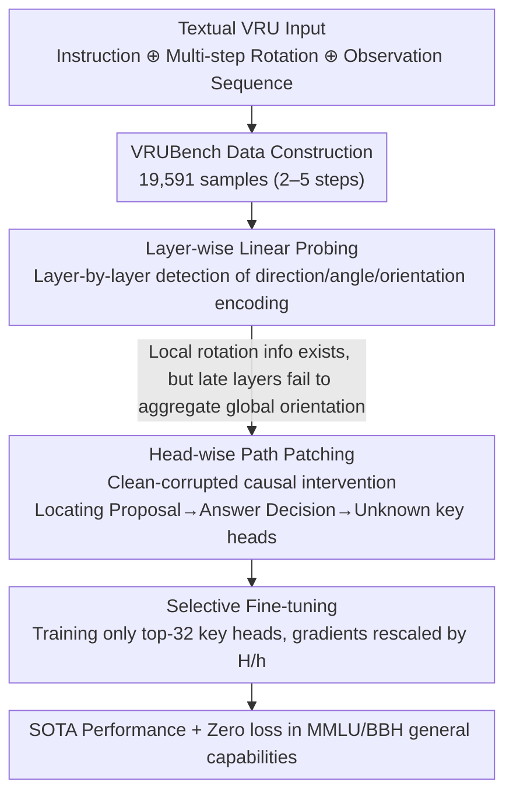

# How Do LLMs and VLMs Understand Viewpoint Rotation Without Vision? An Interpretability Study

**Conference**: ACL 2026  
**arXiv**: [2604.15294](https://arxiv.org/abs/2604.15294)  
**Code**: https://github.com/Young-Zhen/VRU_Interpret (Available)  
**Area**: Multimodal VLM / Interpretability / Spatial Intelligence  
**Keywords**: Viewpoint Rotation Understanding, Path Patching, Probing, Attention Heads, Selective Fine-tuning

## TL;DR
This paper introduces VRUBench, a textual viewpoint rotation understanding (VRU) benchmark. Using layer-wise probing and head-wise path patching, it reveals that the near-random performance of LLMs/VLMs on this task stems from the failure of critical heads in mid-to-late layers to bind "perceived orientation" with "corresponding observations." By fine-tuning only 32 key heads, the authors achieve performance comparable to full fine-tuning in 50% of the GPU time without degrading general capabilities.

## Background & Motivation

**Background**: Spatial intelligence has recently become a focal point, yet most existing research treats it as visual-spatial intelligence—assuming models must "see" to understand space. Purely textual forms of fundamental abilities like VRU (predicting final observations after multi-step rotations) have lacked systematic evaluation.

**Limitations of Prior Work**: VRUBench demonstrates that nearly all public LLMs/VLMs score below 60%, while humans easily reach 100%. Even Qwen3-VL-32B-thinking only reaches 70%. Literature has failed to answer whether models "understand" orientation in their intermediate representations and why final outputs remain incorrect.

**Key Challenge**: Probing shows that early-to-mid layers can already encode directions, angles, and even absolute orientations. However, the orientation probing accuracy drops in layers 21-28, with final answers approaching random guesses—indicating that "information exists but is discarded."

**Goal**: (1) Quantify the textual spatial capabilities of LLMs/VLMs using the VRUBench benchmark; (2) Identify specific computational paths leading to poor performance via layer-wise probing and head-wise path patching; (3) Translate interpretability findings into model improvement methods.

**Key Insight**: Drawing from Gardner's Theory of Multiple Intelligences—"the blind can also perceive space"—it is posited that LLMs should possess partial spatial intelligence without vision. By serializing multi-step rotations and observations into text, models are forced to maintain a "mental map" in the residual stream, which is then analyzed via mechanistic interpretability.

**Core Idea**: An "interpret-then-improve" paradigm is employed—using path patching to locate sparse key heads for VRU, then fine-tuning only these heads to achieve SOTA performance while preserving general capabilities.

## Method

### Overall Architecture
The approach consists of three levels: (1) **Task Definition & Data**: Prompting is formalized as $P = I \oplus O_0 \oplus A_1 \oplus O_1 \oplus \cdots \oplus A_n$, with rotation angles $\theta \in \{0°, 90°, 180°, 270°, 360°\}$, totaling 19,591 samples of 2-5 steps; (2) **Interpretability Analysis**: Layer-wise probing examines direction/angle/orientation encoding, while head-wise path patching identifies attention heads with significant causal effects; (3) **Selective SFT**: Only the $W_{K/Q/V/O}^{i,j}$ of the top-32 key heads are set as trainable, while others remain frozen. These levels form a closed loop of "dissection followed by targeted treatment."

### Key Designs

**1. Layer-wise Linear Probing: Detecting layer-by-layer where the model "understands" and where it "discards" information**

To determine if the model understands orientation in intermediate representations, the authors extract hidden states $\boldsymbol{h}_{i\ell}$ from the last token of each action $A_i$ and train a linear classifier $\mathcal{F}_\ell$ to map them to three labels: direction (binary), angle (5-way), and absolute orientation (4-way). Linear probes are essential; non-linear probes might learn the knowledge themselves, blurring the line between "intrinsic signal" and "probe-computed signal." A control experiment with random embeddings confirms that the detected signals are real. This design reveals a core paradox: direction/angle probing accuracy is >99% across almost all layers, indicating local rotation info is present. However, absolute orientation accuracy rises slowly in layers 1-20 and declines in layers 21-28—local information is sufficient, but it fails to be aggregated into a global orientation in later layers.

**2. Head-wise Path Patching: Using causal intervention to localize "information loss" to specific attention heads**

Probing identifies that late layers are problematic but cannot pinpoint specific computational units; path patching localizes this to heads. The authors construct clean-corrupted data pairs by flipping only the final rotation direction—ensuring equal token length and avoiding logical contradictions—and define the causal effect as $\phi_i = (logit_{pt} - logit_{cl}) / (logit_{cor} - logit_{cl})$. Each head acts as a Sender, with its corrupted activation replaced to observe the impact on the final logit difference $\mathcal{M}(t_{cl}|\cdot) - \mathcal{M}(t_{cor}|\cdot)$. This identifies a sparse critical path: **Proposal head (22.1)** distributes attention to all candidate answers → **Answer Decision heads (26.14, 23.11)** converge attention to the selected answer → **Unknown head (27.14)** finally shows a preference for the "unknown" token (reflecting caution from alignment training).

**3. Selective Fine-tuning: Targeted fine-tuning of key heads to save computation and preserve general capabilities**

Since path patching proves that 32 heads are the "answer-deciding" units, full SFT is unnecessary and potentially harmful to general capabilities. The authors partition $W_{K/Q/V/O}^i$ for each layer into $H$ head blocks, making only the top-32 key heads' $W_{K/Q/V/O}^{i,j}$ trainable. Gradients are rescaled by $H/h$ to compensate for the update bias of training only a few heads. On Qwen2.5-VL-3B, this involves only 0.03B parameters (vs. 3B full parameters), increasing training throughput from 10 to 18 sam/sec. Since heads responsible for general capabilities remain untouched, VRU performance increases significantly while MMLU/BBH scores remain stable.

### Loss & Training
Standard Cross-Entropy SFT with Adam, lr $2 \times 10^{-5}$, batch size 32, warmup 0.02, weight decay 0.1, 1 epoch. The training set of 19,641 sequences is strictly separated from the VRUBench test set.

## Key Experimental Results

### Main Results

| Model | 2-step | 3-step | 4-step | 5-step | Avg |
|---|---|---|---|---|---|
| Human | 100 | 100 | 100 | 100 | **100** |
| LLaMA2-7B-chat | 5.44 | 17.22 | 26.24 | 25.64 | 18.90 |
| Qwen2.5-32B | 88.56 | 74.20 | 67.54 | 62.28 | 72.84 |
| Qwen3-VL-32B-thinking | 97.90 | 96.44 | 96.16 | 95.82 | **96.55** |
| Gemini3-Flash-thinking | 93.15 | 90.32 | 85.71 | 76.65 | 86.32 |

| Configuration (Qwen2.5-VL-7B) | Train Speed | Tuned Param | VRUBench Acc | SpinBench (OOD) | MMLU | BBH |
|---|---|---|---|---|---|---|
| baseline | - | - | 48.7 | 44.8 | 60.3 | 49.2 |
| Full SFT | 5 sam/sec | 7.0B | **96.3 (+47.6)** | 47.3 (+2.5) | 55.6 (**-4.7**) | 35.8 (**-13.4**) |
| Selective SFT (Ours) | 11 sam/sec | 0.06B | 78.7 (+30.0) | **48.4 (+3.6)** | 60.3 (+0.0) | 48.4 (-0.8) |

### Ablation Study

| Configuration | Key Observation | Explanation |
|---|---|---|
| All heads | VRU baseline | Qwen2.5-VL-7B |
| Remove top-K causal heads | Performance drops sharply | Proves identified key heads execute VRU computation |
| Remove random K heads | Nearly unchanged | Control experiment to rule out general sensitivity |
| Remove Unknown head 27.14 | "Unknown" output ratio 65.78% → 40.73% | Proves the head manages "caution regarding the unknown" |
| LLM vs VLM (same size) | Qwen2.5-VL-7B > Qwen2.5-7B | Visual training reinforces spatial representation even without images |
| think vs no-think | Qwen3-VL-8B-think 85.57 vs no-think 64.33 (2-step) | Explicit reasoning is effective for textual spatial tasks |

### Key Findings
- **Selective SFT outperforms full SFT on OOD visual-spatial datasets (SpinBench) by 1.1 points**, with almost zero loss in MMLU/BBH. Full SFT drops 13.4 points on BBH, a sign of catastrophic forgetting.
- **The 3B model exceeds the 7B model after selective SFT (80.1 vs 78.7)** because 32 heads represent 5.6% of the 3B model vs 4.1% of the 7B model, leading to higher relative training capacity for the smaller model.
- **Reasoning vs Non-reasoning is "effective" for textual spatial tasks but "ineffective" for visual-spatial tasks**—mirroring Yang et al. 2025, suggesting fundamental differences between textual and visual spatial intelligence.
- **Path patterns are consistent across models**: LLaMA2-7B, Qwen2.5-7B, and Qwen2.5-VL-3B all exhibit sparse key heads in mid-to-late layers.

## Highlights & Insights
- **The "interpret-then-improve" paradigm is practical**: Using path patching to find heads and selective SFT to update them provides a complete cycle applicable to any task where models "know but fail to say," such as mathematical reasoning or factual QA.
- **The discovery of the Unknown head is intriguing**: Alignment training embeds a specific "I don't know" attention head. Ablating it makes the model more confident (and potentially more prone to hallucination).
- **VLM superiority without images**: Suggests visual training embeds "spatial-language" coupling into Transformer parameters, supporting dual-coding theory.

## Limitations & Future Work
- **Limited to models $\le$ 7B**: Computational costs for path patching prevented scaling to 70B/100B models, leaving the evolution of key heads at scale unknown.
- **Prompt sensitivity**: Results might shift with different phrasing, a risk not fully validated for selective SFT stability.
- **Limited spatial tasks**: It is unclear if navigation, relative distance, or 3D mental rotation reuse the same head mechanisms.
- **Exclusion of CoT interpretability**: The study focuses on implicit reasoning; the absence of mechanistic analysis for think-then-answer modes limits engineering guidance for the highest-performing settings.

## Related Work & Insights
- **vs Yang et al. 2025 (VSI-Bench)**: They found CoT useless for visual tasks; this paper finds it useful for textual tasks, implying reasoning gains are modality-dependent.
- **vs Guo et al. 2026 (Beyond Flatlands)**: Guo observed VLM > LLM across 17 textualized visual-spatial tasks, reinforcing Takeaway I.
- **vs ITI (Li et al. 2023)**: ITI uses steering vectors; this paper fine-tunes head parameters. This method is more thorough but more resource-intensive; they could be combined.

## Rating
- Novelty: ⭐⭐⭐⭐ First systematic study of the internal mechanisms of textual spatial intelligence.
- Experimental Thoroughness: ⭐⭐⭐⭐ 27 models, dual-level probing, OOD and general capability evaluation.
- Writing Quality: ⭐⭐⭐⭐ Clear "interpret-then-improve" narrative with well-explained visualizations.
- Value: ⭐⭐⭐⭐ The "find-and-tune heads" paradigm is highly relevant for resource-constrained scenarios and alignment research.

<!-- RELATED:START -->

## Related Papers

- [\[ICLR 2026\] How Do Medical MLLMs Fail? A Study on Visual Grounding in Medical Images](../../ICLR2026/multimodal_vlm/how_do_medical_mllms_fail_a_study_on_visual_grounding_in_medical_images.md)
- [\[CVPR 2025\] Vision-Language Models Do Not Understand Negation](../../CVPR2025/multimodal_vlm/vision-language_models_do_not_understand_negation.md)
- [\[ACL 2026\] Do MLLMs Capture How Interfaces Guide User Behavior? A Benchmark for Multimodal UI/UX Design Understanding](do_mllms_capture_how_interfaces_guide_user_behavior_a_benchmark_for_multimodal_u.md)
- [\[ICML 2025\] Do Vision-Language Models Really Understand Visual Language?](../../ICML2025/multimodal_vlm/do_vision-language_models_really_understand_visual_language.md)
- [\[ACL 2026\] "I See What You Did There": Can Large Vision-Language Models Understand Multimodal Puns?](i_see_what_you_did_there_can_large_vision-language_models_understand_multimodal_.md)

<!-- RELATED:END -->
