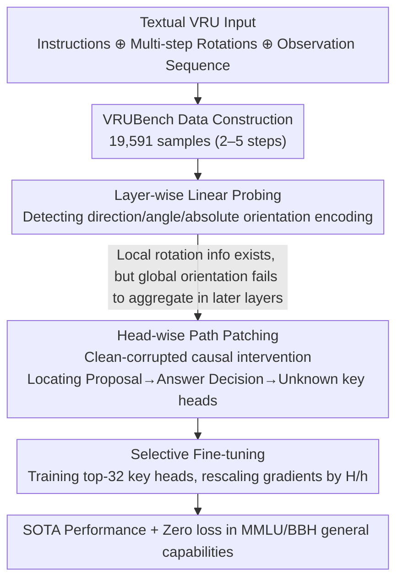

# How Do LLMs and VLMs Understand Viewpoint Rotation Without Vision? An Interpretability Study

**Conference**: ACL 2026  
**arXiv**: [2604.15294](https://arxiv.org/abs/2604.15294)  
**Code**: https://github.com/Young-Zhen/VRU_Interpret (Available)  
**Area**: Multimodal VLM / Interpretability / Spatial Intelligence  
**Keywords**: Viewpoint rotation understanding, path patching, probing, attention heads, selective fine-tuning  

## TL;DR
This paper introduces VRUBench, a textual viewpoint rotation understanding (VRU) benchmark. Through layer-wise probing and head-wise path patching, it reveals that LLMs/VLMs perform near-randomly because key heads in middle-to-late layers fail to bind "perceived orientation" with "corresponding observations." By fine-tuning only 32 key heads, the authors achieve full fine-tuning performance in 50% of the GPU time without degrading general capabilities.

## Background & Motivation

**Background**: Spatial intelligence has recently become a research hotspot, yet most work treats it as visual-spatial intelligence—assuming models must "see" to understand space. Purely textual forms of fundamental abilities like VRU (predicting final observations after multi-step rotations) have lacked systematic evaluation.

**Limitations of Prior Work**: VRUBench results show that nearly all public LLMs/VLMs score below 60%, while humans easily achieve 100%. Even Qwen3-VL-32B-thinking only reaches 70%. Literature has not addressed whether models "understand" orientation in intermediate representations or why final outputs remain incorrect.

**Key Challenge**: Probing indicates that mid-early layers can already encode directions, angles, and even absolute orientations. However, absolute orientation probing accuracy declines specifically in layers 21-28, leading to final answers that resemble random guessing—suggesting that "information exists but is discarded."

**Goal**: (1) Quantify the textual spatial capabilities of LLMs/VLMs via a textual benchmark; (2) Identify specific computational paths causing poor performance using layer-wise probing and head-wise path patching; (3) Translate interpretability findings into model improvement methods.

**Key Insight**: Drawing from Gardner's Theory of Multiple Intelligences—where "the blind can also perceive space"—the authors argue that LLMs should possess some spatial intelligence without vision. By serializing multi-step rotations and observations into text, the model is forced to maintain a "mental map" in the residual stream, which is then analyzed via mechanistic interpretability.

**Core Idea**: Adopting an "interpret-then-improve" paradigm—using path patching to locate sparse key heads for VRU and fine-tuning only these heads to achieve SOTA performance while preserving general capabilities.

## Method

### Overall Architecture
The method consists of three levels: (1) **Task Definition and Data**: Prompt formalized as $P = I \oplus O_0 \oplus A_1 \oplus O_1 \oplus \cdots \oplus A_n$, with rotation angles $\theta \in \{0°, 90°, 180°, 270°, 360°\}$, resulting in 19,591 samples (2-5 steps); (2) **Interpretability Analysis**: Layer-wise probing for direction/angle/orientation encoding and head-wise path patching to find attention heads with high causal effects; (3) **Selective Fine-tuning (SFT)**: Setting $W_{K/Q/V/O}^{i,j}$ of the top-32 key heads as trainable while freezing others.

### Key Designs

**1. Layer-wise Linear Probing: Detecting which layer "understands" and which layer "discards" information**

To determine if intermediate representations encode orientation, the authors extract hidden states $\boldsymbol{h}_{i\ell}$ at the last token of each action $A_i$. They train linear classifiers $\mathcal{F}_\ell$ for three labels: direction (binary), angle (5-way), and absolute orientation (4-way). Linear probes are used to ensure the signals reflect representation quality rather than the probe's learning capacity. A control experiment with random embeddings confirms the signals are genuine. Findings show direction/angle probing accuracy >99% across layers, but absolute orientation accuracy drops in layers 21-28. Local info is present but fails to aggregate into global orientation.

**2. Head-wise Path Patching: Direct causal intervention to localize information loss**

To pinpoint computational units, the authors use "clean-corrupted" data pairs where only the last rotation direction is flipped. They define the causal effect as $\phi_i = (logit_{pt} - logit_{cl}) / (logit_{cor} - logit_{cl})$. By iteratively replacing corrupted activations with clean ones for specific heads, they observe the impact on final logits. The study identifies a sparse path: **Proposal head (22.1)** attends to candidate answers → **Answer Decision heads (26.14, 23.11)** converge attention on the chosen answer → **Unknown head (27.14)** shows a preference for "unknown" tokens (reflecting cautious alignment behavior).

**3. Selective Fine-tuning: Targeted tuning of key heads for efficiency and capability retention**

Since path patching identifies 32 heads as decisive, the authors avoid full SFT to prevent catastrophic forgetting. They only train $W_{K/Q/V/O}^{i,j}$ for the top-32 heads and rescale gradients by $H/h$ to compensate for the sparse update. In Qwen2.5-VL-3B, this tunes only 0.03B parameters. Training throughput increases from 10 to 18 samples/sec. This method achieves significant VRU gains with almost zero loss in MMLU/BBH scores.

### Loss & Training
Standard cross-entropy loss with Adam optimizer. Learning rate $2 \times 10^{-5}$, batch size 32, warmup 0.02, weight decay 0.1, trained for 1 epoch. The training set (19,641 samples) is strictly separated from the VRUBench test set.

## Key Experimental Results

### Main Results

| Model | 2-step | 3-step | 4-step | 5-step | Avg |
|---|---|---|---|---|---|
| Human | 100 | 100 | 100 | 100 | **100** |
| LLaMA2-7B-chat | 5.44 | 17.22 | 26.24 | 25.64 | 18.90 |
| Qwen2.5-32B | 88.56 | 74.20 | 67.54 | 62.28 | 72.84 |
| Qwen3-VL-32B-thinking | 97.90 | 96.44 | 96.16 | 95.82 | **96.55** |
| Gemini3-Flash-thinking | 93.15 | 90.32 | 85.71 | 76.65 | 86.32 |

| Configuration (Qwen2.5-VL-7B) | Train Speed | Tuned Param | VRUBench Acc | SpinBench (OOD) | MMLU | BBH |
|---|---|---|---|---|---|---|
| Baseline | - | - | 48.7 | 44.8 | 60.3 | 49.2 |
| Full SFT | 5 sam/sec | 7.0B | **96.3 (+47.6)** | 47.3 (+2.5) | 55.6 (**-4.7**) | 35.8 (**-13.4**) |
| Selective SFT (Ours) | 11 sam/sec | 0.06B | 78.7 (+30.0) | **48.4 (+3.6)** | 60.3 (+0.0) | 48.4 (-0.8) |

### Ablation Study

| Configuration | Key Observation |
|---|---|
| Remove top-K causal heads | Performance drops sharply; validates the identified heads' necessity. |
| Remove random K heads | Performance remains stable; confirms the specificity of key heads. |
| Remove Unknown head (27.14) | "Unknown" output ratio drops from 65.78% to 40.73%; proves its function in cautious reasoning. |
| LLM vs VLM (same size) | Qwen2.5-VL-7B > Qwen2.5-7B; vision training strengthens spatial representation even without images. |
| Think vs No-think | Thinking models outperform non-thinking ones on text spatial tasks; contradicts visual-spatial task findings. |

### Key Findings
- **Selective SFT outperforms Full SFT on OOD visual-spatial datasets (SpinBench)** by 1.1 points with zero loss in MMLU/BBH. Full SFT shows catastrophic forgetting (e.g., -13.4 on BBH).
- **A 3B model after Selective SFT can outperform a 7B model** (80.1 vs 78.7) because 32 heads represent a higher relative capacity in smaller models.
- **Reasoning vs Non-reasoning**: CoT is effective for textual spatial tasks but ineffective for visual ones, suggesting fundamental differences between the two modalities.
- **Consistent Path Patterns**: LLaMA2-7B, Qwen2.5-7B, and Qwen2.5-VL-3B all exhibit sparse key heads in mid-to-late layers, indicating a universal phenomenon in Transformer architectures.

## Highlights & Insights
- **Viability of "Interpret-then-improve"**: This paradigm creates a closed loop for tasks where the "model knows but answers incorrectly," applicable to mathematical reasoning or fact retrieval.
- **The "Unknown" Head**: Alignment training implants specialized heads for "I don't know" responses. Ablating these makes the model more assertive, offering insights into honesty calibration and RLHF side effects.
- **VLM Superiority without Images**: Suggests that vision training embeds "space-language" coupling into Transformer parameters, providing empirical support for Dual-Coding Theory.

## Limitations & Future Work
- **Model Scale**: Path patching is computationally expensive, limiting the study to models $\le 7B$. Head behavior at 70B+ scales remains unknown.
- **Prompt Sensitivity**: The robustness of Selective SFT to phrasing changes has not been fully explored.
- **Feature Coverage**: Only VRU was tested. It is unclear if navigation or 3D mental rotation share the same head mechanisms.
- **CoT Interpretability**: The study focuses on implicit reasoning. Interpreting the "thought" process in reasoning models remains future work.

## Related Work & Insights
- **Comparison with Yang et al. (VSI-Bench)**: While they found CoT useless for visual-spatial tasks, this study finds it effective for textual ones, showing reasoning gains are modality-dependent.
- **Comparison with Guo et al. (Beyond Flatlands)**: Confirms that VLMs outperform LLMs on textualized spatial tasks.
- **Comparison with ITI (Li et al. 2023)**: While ITI uses steering vectors, this work tunes head parameters directly. These methods could be combined for further optimization.

## Rating
- Novelty: ⭐⭐⭐⭐ First systematic study of internal mechanisms in textual spatial intelligence.
- Experimental Thoroughness: ⭐⭐⭐⭐ 27 models evaluated, double-layer probing, and cross-model validation.
- Writing Quality: ⭐⭐⭐⭐ Clear "interpret-then-improve" narrative with intuitive visualizations.
- Value: ⭐⭐⭐⭐ High practical value for resource-constrained fine-tuning and alignment research.

<!-- RELATED:START -->

## Related Papers

- [\[ACL 2026\] Do MLLMs Understand Pointing? Benchmarking and Enhancing Referential Reasoning in Egocentric Vision](do_mllms_understand_pointing_benchmarking_and_enhancing_referential_reasoning_in.md)
- [\[ICLR 2026\] How Do Medical MLLMs Fail? A Study on Visual Grounding in Medical Images](../../ICLR2026/multimodal_vlm/how_do_medical_mllms_fail_a_study_on_visual_grounding_in_medical_images.md)
- [\[ICLR 2026\] SpinBench: Perspective and Rotation as a Lens on Spatial Reasoning in VLMs](../../ICLR2026/multimodal_vlm/spinbench_perspective_and_rotation_as_a_lens_on_spatial_reasoning_in_vlms.md)
- [\[CVPR 2025\] Vision-Language Models Do Not Understand Negation](../../CVPR2025/multimodal_vlm/vision-language_models_do_not_understand_negation.md)
- [\[ICML 2025\] Do Vision-Language Models Really Understand Visual Language?](../../ICML2025/multimodal_vlm/do_vision-language_models_really_understand_visual_language.md)

<!-- RELATED:END -->
