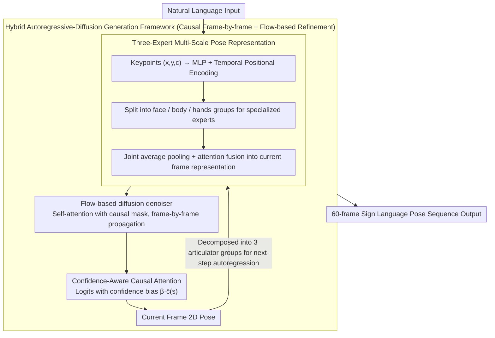

# Hybrid Autoregressive-Diffusion Model for Real-Time Sign Language Production

**Conference**: ACL2026  
**arXiv**: [2507.09105](https://arxiv.org/abs/2507.09105)  
**Code**: Not found in cache  
**Area**: Human Understanding / Sign Language Production / Motion Generation  
**Keywords**: Sign Language Production, autoregressive diffusion, HybridSign, confidence-aware attention, low latency  

## TL;DR
This paper proposes HybridSign, which combines autoregressive frame-by-frame generation with flow-based diffusion refinement, incorporating a three-expert multi-scale pose representation and confidence-aware causal attention to achieve a superior quality-latency trade-off on PHOENIX14T and How2Sign.

## Background & Motivation
**Background**: Sign Language Production (SLP) aims to generate continuous sign language poses from linguistic input, necessitating the simultaneous modeling of the body, hands, face, and temporal dynamics. Traditional autoregressive models excel at preserving temporal causality, while diffusion models are proficient in generating high-quality poses.

**Limitations of Prior Work**: Autoregressive methods offer fast inference, but each step depends on the previous prediction, leading to exposure bias and error accumulation. Diffusion methods improve quality through iterative denoising but suffer from slow sampling, making it difficult for interactive sign language systems to wait for the entire sequence to be generated.

**Key Challenge**: Practical applications require low-latency output of the first frame with continuous generation, while simultaneously maintaining the local pose quality characteristic of diffusion models. Neither pure autoregressive nor pure diffusion methods can satisfy quality, temporal consistency, and response speed concurrently.

**Goal**: Construct a low-latency SLP model that significantly reduces time-to-first-frame under a 60-frame protocol while maintaining or improving quality metrics such as BLEU/ROUGE, WER, DTW, and FID.

**Key Insight**: Instead of using the diffusion model as a global offline generator, flow-based diffusion is integrated into an autoregressive causal framework, enabling each frame to be generated and refined sequentially.

**Core Idea**: An autoregressive path handles causal frame generation, while flow-based diffusion manages quality refinement. Additionally, three-expert multi-scale pose representations (face/body/hands) and confidence-aware attention address the issues of fine-grained articulators and noisy 2D poses in sign language.

## Method
The HybridSign method can be summarized as "frame-by-frame causal generation + local diffusion refinement + multi-scale pose experts." It emphasizes low latency: "real-time" refers to the rapid output of the first frame followed by continuous generation, rather than instantaneous completion of the entire video synthesis.

### Overall Architecture

The input is a natural language sentence, and the output is a sequence of approximately 60 2D sign language poses. The model first generates face, body, and hand articulators through a Multi-Scale Pose Representation module, which are then fused into a complete pose frame. The generated frames are decomposed back into three articulator groups to serve as autoregressive conditions for the next time step.

Inside each time step, the three experts can run in parallel; causal dependencies are maintained between time steps. A self-forcing strategy is adopted: during both training and inference, the model’s own previous frame prediction is used as input for the next step, rather than feeding ground truth during training, thereby mitigating training/inference distribution mismatch.

### Key Designs

**1. Hybrid Autoregressive-Diffusion Framework: Rapid first-frame output with frame-by-frame refinement**

Pure diffusion provides high quality but slow first-frame output, while pure autoregression is fast but suffers in quality. HybridSign integrates both into a single causal path. Specifically, it applies a causal mask to the self-attention of the diffusion denoiser, ensuring that position $i$ only attends to current or historical tokens $j \le i$. Consequently, the denoising process becomes causal and can proceed frame-by-frame. Simultaneously, flow-based diffusion learns continuous transformations from noise to target poses, replacing multi-step sampling like DDPM to minimize per-frame refinement costs.

**2. Three-Expert Multi-Scale Pose Representation: Scale-specific modeling for face/body/hands**

Sign language lacks uniform body motion: facial non-manual signals, body posture, and hand trajectories operate at different scales. Forcing them into a single network leads to interference. The model processes each keypoint's $(x,y,c)$ through MLPs and temporal positional encodings, then groups them into face, body, and hands for specialized experts. The outputs are fused using attention-based fusion after joint average pooling.

The choice of "three" experts instead of four (splitting left and right hands) is due to the strong coupling of hands in sign language—relative distance, symmetry, and synchronization are critical. Splitting them would place the burden of rebuilding these relationships entirely on the fusion stage, as evidenced by the ablation study where 4 experts underperformed compared to 3.

**3. Confidence-Aware Causal Attention: Explicit perception of keypoint reliability**

Input 2D poses often contain occlusions and low-confidence points. Erroneous keypoints, if trusted, propagate errors through subsequent frames. This design adds a confidence bias to the causal attention logits, effectively modifying the attention score to be the raw score plus $\beta \cdot \bar{c}(s)$, where $\bar{c}(s)$ is the mean confidence of keypoints in frame $s$ and $\beta$ is a learnable scalar.

High-confidence frames naturally receive higher attention weights. This cost-free design—since confidence comes from the upstream estimator—suppresses the propagation of noise, improving DTW from 5.50 to 3.89 in ablation studies.

### Loss & Training

The training objective consists of three parts: Joint loss (L1) for predicted joint positions; Bone loss for skeletal direction and kinematic consistency; and Soft-DTW loss to align predicted and ground truth sequences, mitigating long-term error accumulation. Total loss uses inverse EMA dynamic weighting: weighting is proportional to the inverse of the exponentially moving average of each loss plus a small constant.

Experiments use PHOENIX14T (8,257 sentences) and How2Sign (>80 hours of ASL). Evaluation involves back-translating generated poses to text via pre-trained SLT models to calculate BLEU/ROUGE/WER, alongside DTW/FID for motion quality.

## Key Experimental Results

### Main Results

| Method | PHOENIX14T TEST B1 | B4 | ROUGE | WER | DTW | FID |
|------|--------------------|----|-------|-----|-----|-----|
| PT | 13.35 | 4.31 | 13.17 | 96.50 | NR | NR |
| G2P-DDM | 16.11 | 7.50 | NR | 77.26 | NR | NR |
| GCDM | 22.03 | 7.91 | 23.20 | 81.94 | 11.10 | 49.22 |
| GEN-OBT | 23.08 | 8.01 | 23.49 | 81.78 | NR | NR |
| Sign-IDD | 24.80 | 9.08 | 26.58 | 76.66 | 6.20 | 47.19 |
| HybridSign | 25.77 | 10.03 | 27.97 | 75.02 | 4.96 | 45.50 |
| Ground Truth | 29.76 | 11.93 | 28.98 | 71.94 | 0.00 | 0.00 |

| Method | How2Sign TEST B1 | B4 | ROUGE | WER | DTW | FID |
|------|-------------------|----|-------|-----|-----|-----|
| PT | 14.05 | 4.12 | 8.42 | 96.47 | 10.18 | 54.57 |
| G2P-DDM | 19.48 | 5.12 | 12.21 | 89.58 | 7.97 | 49.83 |
| GCDM | 25.91 | 5.57 | 15.21 | 91.43 | 6.13 | 45.71 |
| GEN-OBT | 27.82 | 5.92 | 15.88 | 90.63 | 6.87 | 47.28 |
| Sign-IDD | 28.90 | 6.06 | 16.21 | 89.98 | 4.86 | 39.02 |
| HybridSign | 30.12 | 6.48 | 18.02 | 88.30 | 3.89 | 37.10 |
| Ground Truth | 34.01 | 8.03 | 21.87 | 81.94 | 0.00 | 0.00 |

HybridSign provides the strongest overall quality-efficiency trade-off. On the How2Sign test split, HybridSign achieves 30.12/6.48 for B1/B4, 3.89 for DTW, and 37.10 for FID.

### Ablation Study

| Method | Latency (s) | Throughput (FPS) | Note |
|------|-------------|------------------|------|
| GCDM | 52.18 | 1.15 | Diffusion baseline, slow first frame |
| Sign-IDD | 40.31 | 1.49 | Diffusion baseline |
| G2P-DDM | 25.78 | 2.33 | Diffusion baseline |
| HybridSign | 5.90 | 10.17 | Lowest latency, highest throughput |

| Generation Mode | B1 | B4 | DTW | Latency | Throughput | Conclusion |
|------|----|----|-----|---------|------------|------|
| Diffusion Mode | 30.25 | 6.55 | 8.06 | 32.89 | 1.83 | High quality but slow, poor DTW |
| Autoregressive Mode | 26.15 | 5.40 | 4.49 | 5.53 | 10.85 | Fast but quality drops |
| Hybrid Mode | 30.12 | 6.48 | 3.89 | 5.90 | 10.17 | Balance of quality, alignment, latency |

### Key Findings

- **Latency Advantage**: Under a 60-frame protocol, time-to-first-frame is 5.90s for HybridSign, compared to 52.18s for GCDM and 40.31s for Sign-IDD.
- **Soft-DTW**: Critical for temporal alignment, reducing DTW scores by approximately 20% and stabilizing long-term autoregressive generation.
- **Three vs. Four Experts**: 3 experts (face/body/hands) outperformed 4 (splitting hands), indicating that unified hand modeling better captures relative distance and symmetry.

## Highlights & Insights
- **Interaction-Centric Latency**: The paper prioritizes time-to-first-frame over total generation time, which is more relevant for interactive systems.
- **Complementarity of AR and Diffusion**: Autoregressive paths provide causal continuity, while flow-based diffusion adds quality refinement, avoiding the pitfalls of either approach in isolation.
- **Insightful Expert Design**: Recognizing that hands are a coupled system rather than independent components prevents over-complicating the fusion stage.
- **Robustness through Confidence**: Injecting upstream keypoint confidence into causal attention is a practical, low-cost trick to suppress noise propagation.

## Limitations & Future Work

- **Data Dependency**: Limited scale and diversity of sign language datasets may hinder generalization to low-resource signs or diverse signer styles.
- **2D Ambiguity**: 2D poses lack depth information, causing issues with hands near the face or self-occlusions which represent different 3D states.
- **Non-Manual Signals**: Fine-grained signs such as eye gaze and subtle mouth movements are not yet fully captured.
- **Edge Deployment**: While 5.90s is an improvement, further compression is needed for true real-time avatar systems on resource-constrained devices.

## Related Work & Insights
- **vs. Autoregressive SLP**: Unlike methods prone to error accumulation, HybridSign uses self-forcing and Soft-DTW to stabilize long sequences.
- **vs. Diffusion SLP**: HybridSign maintains diffusion refinement while adopting a causal structure to drastically reduce first-frame latency.
- **Applications**: The multi-scale expert + confidence attention approach is applicable to broader human motion tasks (dance, gesture) where upstream estimators provide confidence scores.

## Rating
- Novelty: ⭐⭐⭐⭐ Targeted application of hybrid AR-diffusion for low-latency SLP.
- Experimental Thoroughness: ⭐⭐⭐⭐⭐ Comprehensive coverage across datasets, quality metrics, and latency.
- Writing Quality: ⭐⭐⭐⭐ Clear methodological flow, though some loss descriptions are standard.
- Value: ⭐⭐⭐⭐⭐ High practical value for interactive systems via focus on delivery metrics.

<!-- RELATED:START -->

## Related Papers

- [\[ACL 2026\] CNSL-bench: Benchmarking the Sign Language Understanding Capabilities of MLLMs on Chinese National Sign Language](cnsl-bench_benchmarking_the_sign_language_understanding_capabilities_of_mllms_on.md)
- [\[CVPR 2026\] Diffusion Guided Chain-of-Vision for Large Autoregressive Vision Models](../../CVPR2026/multimodal_vlm/diffusion_guided_chain-of-vision_for_large_autoregressive_vision_models.md)
- [\[CVPR 2026\] AutoTraces: Autoregressive Trajectory Forecasting via Multimodal Large Language Models](../../CVPR2026/multimodal_vlm/autotraces_autoregressive_trajectory_forecasting_via_multimodal_large_language_m.md)
- [\[ICML 2026\] Conditional Diffusion Sampling](../../ICML2026/multimodal_vlm/conditional_diffusion_sampling.md)
- [\[CVPR 2026\] UVU: Improving Multimodal Understanding via Vision-Language Unified Autoregressive Paradigm](../../CVPR2026/multimodal_vlm/uvu_improving_multimodal_understanding_via_vision-language_unified_autoregressiv.md)

<!-- RELATED:END -->
