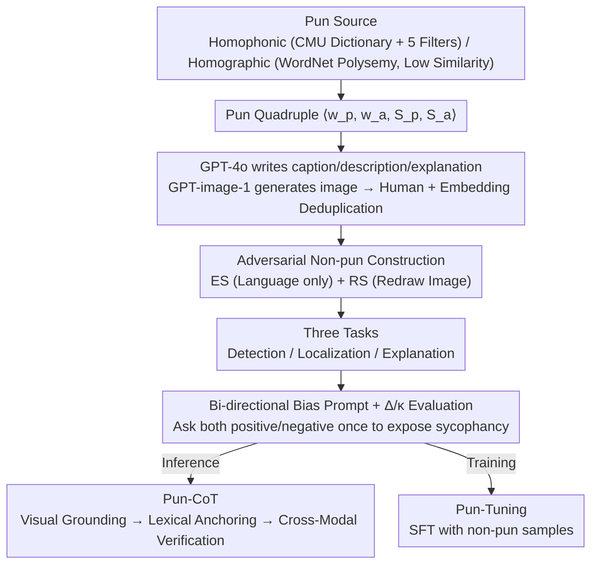

# "I See What You Did There": Can Large Vision-Language Models Understand Multimodal Puns?

**Conference**: ACL 2026  
**arXiv**: [2604.05930](https://arxiv.org/abs/2604.05930)  
**Code**: TBD (Not explicitly provided in the paper)  
**Area**: Multimodal VLM Evaluation / Humor Understanding / Puns  
**Keywords**: Multimodal Puns, Homophonic/Homographic Puns, VLM Evaluation, MultiPun Benchmark, Pun-CoT

## TL;DR
This paper introduces MultiPun—the first multimodal pun benchmark featuring "adversarial non-pun distractors" (445 puns + 890 non-puns, covering both homophonic and homographic types). It systematically evaluates 11 VLMs across three tasks: detection, localization, and explanation. The study finds that **all models tend to misidentify non-puns as puns** (TNR generally < 0.4). The authors propose Pun-CoT prompting and Pun-Tuning strategies, achieving an average F1 gain of 16.5%.

## Background & Motivation

**Background**: Puns are rhetorical devices that create humor by exploiting polysemy (homographic) or homophony (homophonic), serving as classic subjects in linguistics and computational humor. Textual pun detection, localization, and generation have matured since SemEval-2017 Task 7. While multimodal research has evaluated memes, sarcasm, and cartoons, studies on multimodal puns—where image and text simultaneously carry literal and figurative meanings—remain a gap.

**Limitations of Prior Work**: The authors identify three critical deficiencies:
- **Unimodal confinement**: Previous pun research is almost exclusively text-based, ignoring the core role of the visual modality in creating ambiguity.
- **Deficiencies in benchmarks**: The few existing multimodal pun datasets lack negative non-pun samples, making it impossible to verify if models truly understand puns or simply "call anything funny a pun."
- **Conflation of preference and comprehension**: Existing evaluations only ask "Is this a pun?", failing to ask "Is this not a pun?", which prevents distinguishing genuine reasoning from the model's affirmative language bias.

**Key Challenge**: Puns require **cross-modal reasoning** (alignment of a quadruple $\mathcal{P} = \langle w_p, w_a, S_p, S_a \rangle$ consisting of visual object $S_p$, textual literal $w_p$, hidden semantic $w_a$, and figurative action $S_a$). However, superficial patterns like "image + text = humor" are common in VLM training data, causing models to overfit to surface cues and label any "anthropomorphic fruit" image as a pun.

**Goal**: (1) Construct a multimodal pun benchmark with negative samples; (2) Design evaluation protocols to distinguish "comprehension" from "refusal capability"; (3) Provide effective improvement solutions.

**Key Insight**: Formalize puns as $\mathcal{P} = \langle w_p, w_a, S_p, S_a \rangle$ quadruples and construct two types of adversarial negative samples (ES replaces text with direct descriptions; RS randomly replaces entities), forcing models to make fine-grained distinctions between "cross-modal synergy" and "lack of synergy."

**Core Idea**: Expose the over-interpretation tendency of VLMs using adversarial negative samples, then address it via Pun-CoT (visual grounding + lexical anchoring + cross-modal verification) and Pun-Tuning (SFT with data containing non-puns).

## Method

### Overall Architecture
MultiPun establishes a closed loop of benchmark + evaluation protocol + enhancement methods. A four-step pipeline generates data with adversarial negative samples, followed by a bi-directional prompt protocol to separate "true understanding" from "sycophancy." Finally, two enhancement routes are provided: inference-time (Pun-CoT) and training-time (Pun-Tuning).

The pipeline generates pun quadruples $\mathcal{P}=\langle w_p, w_a, S_p, S_a\rangle$. For homophonic puns, it uses the CMU dictionary to find homophone pairs, filtered by Zipf frequency, WordNet senses, visualizability, and morphology. For homographic puns, it uses WordNet for polysemy, requiring senses to fall into different lexical files with path similarity < 0.1 to avoid metonymy. GPT-4o then writes the (caption, image description, pun explanation), and GPT-image-1 generates the image, followed by manual and embedding-based deduplication. Each positive sample is paired with two adversarial non-puns for evaluation across three tasks: Detection (binary), Localization (identifying $w_p, w_a$), and Explanation (providing the quadruple + explanation).

### Key Designs

**1. Adversarial Non-pun Construction (ES + RS Strategies): Creating traps that look like puns but lack the mechanism**

MultiPun pairs each pun with two adversarial negative samples to break surface pattern recognition. ES (Explicative Substitution) replaces $w_p$ in the caption with a direct description of $S_a$ (e.g., "We make a great pear" → "We make a great couple") while keeping the image the same, removing the phonetic bridge. RS (Random Substitution) replaces $w_p$ with an irrelevant entity and redraws the image (e.g., replacing pears with apples), causing the quadruple to fail. These strategies maintain scene coherence, preventing models from using "image-text irrelevance" as a shortcut.

**2. Bi-directional Biased Prompt + $\Delta$ / $\kappa$ Evaluation: Separating "true reasoning" from "sycophancy"**

To distinguish genuine understanding from affirmative bias, MultiPun asks about the same sample twice: once with a pun-inducing prompt ("Is this a pun?") and once with a non-pun-inducing prompt ("Is this not a pun?"). It calculates $\Delta$ (the difference in TPR/TNR) and Cohen’s Kappa $\kappa$ to measure consistency. A larger $|\Delta|$ indicates that the decision relies on the prompt phrasing rather than the content.

**3. Pun-CoT: Visual Grounding → Lexical Anchoring → Cross-Modal Verification**

Error analysis (§4.1) categorizes VLM failures into four types of hallucinations: Pun word, Phonetic, Semantic, and Visual object. Pun-CoT addresses these via three targeted steps: Step 1 (Visual Grounding) requires describing objects to fix visual hallucinations; Step 2 (Lexical Anchoring) forces extracting $w_p$ from the caption to fix pun word hallucinations; Step 3 (Cross-Modal Verification) checks for valid phonetic or semantic bridges and explicitly rejects forced associations.

### Loss & Training
- **Benchmark Construction**: Unsupervised generation with human-in-the-loop quality control (Appendix D).
- **Pun-Tuning** (model-level): SFT with MultiPun data based on three principles: (i) including non-puns to suppress hallucinations; (ii) high-quality explanation samples to enhance recall and depth; (iii) including both pun-biased and non-pun-biased prompt pairs to mitigate sycophancy.
- **Evaluation**: 11 VLMs; LLM-as-judge for explanation quality (win/tie/loss).

## Key Experimental Results

### Main Results (F1 in Explanation Task, biased-to-pun prompt)

| Type | Model | Homophonic F1 | Homographic F1 | Homophonic TNR | Homographic TNR |
|------|------|---------------|----------------|----------------|-----------------|
| Closed | GPT-5.1 | **0.804** | 0.757 | 0.910 | 0.878 |
| Closed | GPT-4o | 0.741 | 0.683 | 0.786 | 0.659 |
| Closed | Gemini-3-Pro | 0.746 | 0.718 | 0.686 | 0.625 |
| Closed | Claude-Sonnet-4.5 | 0.594 | 0.560 | 0.353 | 0.235 |
| Open | Qwen3-VL-30B-Instruct | 0.535 | 0.511 | 0.209 | 0.125 |
| Open | LLaVA-V1.6-Vicuna-13B | 0.057 | 0.051 | 0.972 | 0.966 |
| Open-Reason | Qwen3-VL-30B-Thinking | 0.618 | 0.631 | 0.399 | 0.414 |

GPT-5.1 is the strongest, yet its F1 is only 0.80, indicating **multimodal puns are challenging for all VLMs**. Claude-Sonnet-4.5 shows typical over-interpretation (TPR 0.969, TNR 0.353).

### Ablation Study (Pun-CoT Improvements, Explanation Task)

| Model | Vanilla F1 (Homo) | Pun-CoT F1 (Homo) | $\Delta$F1 | Vanilla TNR | Pun-CoT TNR |
|------|-------------------|-------------------|------------|-------------|-------------|
| GPT-5.1 | 0.804 | 0.836 | +3.2% | 0.910 | 0.915 |
| GPT-4o | 0.741 | 0.794 | +5.3% | 0.786 | 0.835 |
| Claude-Sonnet-4.5 | 0.594 | 0.641 | +4.7% | 0.353 | **0.495** |
| Qwen3-VL-8B-Instruct | 0.505 | 0.569 | +6.4% | 0.881 | 0.495 |
| **LLaVA-V1.6-Vicuna-13B** | 0.057 | **0.501** | **+44.4%** | 0.972 | 0.036 |
| Qwen3-VL-8B-Thinking | 0.595 | **0.807** | **+21.2%** | 0.387 | **0.776** |

### Key Findings
- **VLMs universally over-interpret puns**: Most models show TPR $\approx$ 0.95+ but TNR $\approx$ 0.1-0.4, indicating they label images as puns without true understanding.
- **Closed-source >> Open-source**: Prompt robustness differs significantly. LLaVA-13B's $\Delta$TPR reaches -0.923, revealing severe sycophancy in smaller open-source models.
- **Explanation tasks provide implicit grounding**: TNR improves significantly when models are required to explain the pun, as failing to find a logical alternative exposes the absence of a pun.
- **Homophonic puns are harder than homographic**: $w_a$ does not appear in the text, requiring phonetic reasoning.
- **Reasoning models are not necessarily better**: Small thinking models may show worse TNR, possibly because thinking amplifies existing over-interpretation tendencies.

## Highlights & Insights
- **Dual-direction biased prompt protocol** is a significant contribution, revealing sycophancy as a hidden confounder in VLM evaluation.
- **Adversarial non-puns (ES + RS)** force models beyond surface patterns, a methodology applicable to other figurative language tasks like sarcasm or metaphors.
- **Pun-CoT** demonstrates a methodology for "pattern-specific CoT"—designing steps based on categorized error patterns (hallucinations).

## Limitations & Future Work
- The dataset is relatively small (445 puns) and limited to English; homophonic puns are highly language-dependent.
- Potential **LLM bias circularity**: Using GPT-4o to generate data used to evaluate GPT models might favor their distribution.
- Pun-CoT is manually designed; automated reflective error analysis for CoT generation is a potential direction.
- Small models (like LLaVA-13B) show F1 improvements that might reflect a shift in decision bias rather than a genuine increase in comprehension.

## Related Work & Insights
- **vs SemEval-2017 Task 7**: MultiPun extends textual pun formalization to multimodal contexts with adversarial samples.
- **vs Xu et al. 2024b**: Adopts the $\langle w_p, w_a, S_p, S_a \rangle$ quadruple formalization for multimodal pun generation.
- **vs MM-Vet / MMMU**: While these focus on knowledge and logic, MultiPun addresses the gap in figurative language and humor evaluation.

## Rating
- **Novelty**: ⭐⭐⭐⭐ MultiPun is the first multimodal pun benchmark with adversarial non-puns.
- **Experimental Thoroughness**: ⭐⭐⭐⭐⭐ Comprehensive cross-model, cross-task, and cross-metric validation.
- **Writing Quality**: ⭐⭐⭐⭐ Clear framework and progression, though details are dense.
- **Value**: ⭐⭐⭐⭐ Highlights fundamental VLM weaknesses in figurative language and provides transferable evaluation methodologies.

<!-- RELATED:START -->

## Related Papers

- [\[ACL 2026\] Revisit What You See: Revealing Visual Semantics in Vision Tokens to Guide LVLM Decoding](revisit_what_you_see_revealing_visual_semantics_in_vision_tokens_to_guide_lvlm_d.md)
- [\[ACL 2025\] Can Multimodal Large Language Models Understand Spatial Relations?](../../ACL2025/multimodal_vlm/spatialmqa_mllm_spatial_relations.md)
- [\[ACL 2025\] Can Vision Language Models Understand Mimed Actions?](../../ACL2025/multimodal_vlm/can_vision_language_models_understand_mimed_actions.md)
- [\[ICCV 2025\] Vision-Language Models Can't See the Obvious](../../ICCV2025/multimodal_vlm/vision-language_models_cant_see_the_obvious.md)
- [\[CVPR 2026\] Aligning What Vision-Language Models See and Perceive with Adaptive Information Flow](../../CVPR2026/multimodal_vlm/aif_adaptive_information_flow_vlm.md)

<!-- RELATED:END -->
