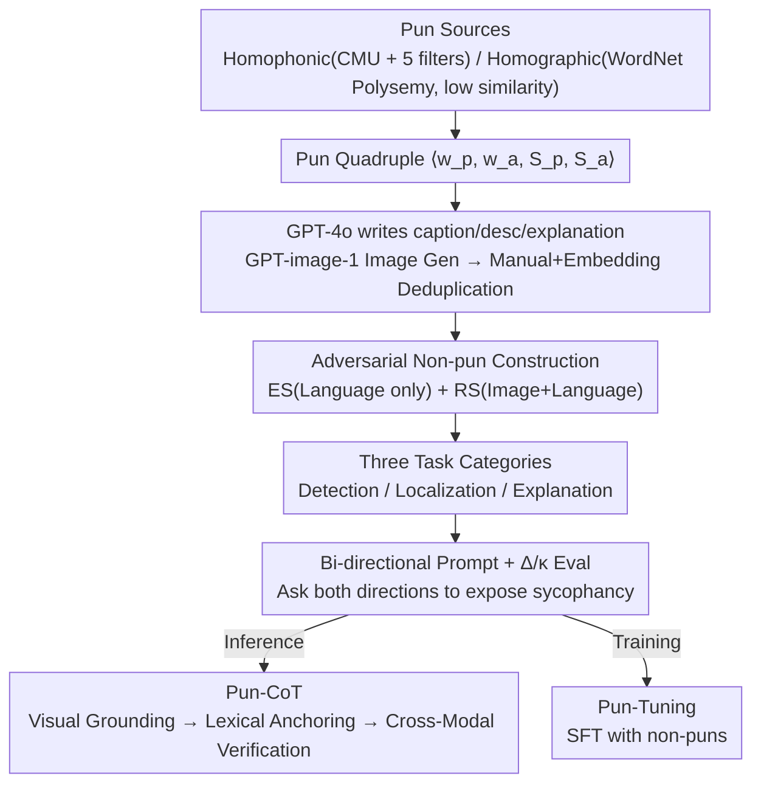

# "I See What You Did There": Can Large Vision-Language Models Understand Multimodal Puns?

**Conference**: ACL 2026  
**arXiv**: [2604.05930](https://arxiv.org/abs/2604.05930)  
**Code**: TBD (not explicitly provided in the paper)  
**Area**: Multimodal VLM Evaluation / Humor Understanding / Pun  
**Keywords**: Multimodal Puns, Homophonic/Homographic Puns, VLM Evaluation, MultiPun benchmark, Pun-CoT

## TL;DR
Ours proposes MultiPun—the first multimodal pun benchmark with "adversarial non-pun distractors" (445 puns + 890 non-puns, covering homophonic and homographic types). Systematic evaluation of 11 VLMs across detection, localization, and explanation tasks reveals that **all models tend to treat non-puns as puns** (TNR generally < 0.4). Ours introduces the Pun-CoT prompting strategy and Pun-Tuning fine-tuning strategy, achieving an average F1 improvement of 16.5%.

## Background & Motivation

**Background**: Puns are rhetorical devices that create humor through polysemy (homographic) or homophones (homophonic), serving as classic subjects in linguistics and computational humor. Textual pun detection, localization, and generation have been well-studied since SemEval-2017 Task 7. Recently, multimodal evaluations for memes, irony, cartoons, and Chinese pun rebuses have emerged, but multimodal puns (where image + text simultaneously carry literal + figurative meanings) remain unexplored.

**Limitations of Prior Work**: The authors identify three critical flaws:
- **Unimodal confinement**: Previous pun research is almost exclusively text-based, ignoring the pivot role of visual modality in creating ambiguity.
- **Deficiencies in benchmarks**: Existing sparse multimodal pun datasets lack negative non-pun samples, failing to verify whether models truly understand the pun mechanism or simply label "funny scenes" as puns.
- **Conflation of preference and comprehension**: Current evaluations only ask "Is this a pun?", failing to ask the reverse "Is this not a pun?", which prevents distinguishing genuine reasoning from the model's affirmative language bias.

**Key Challenge**: Puns require **cross-modal reasoning** (aligning the quadruple: visual object $S_p$ + textual literal $w_p$ + hidden semantics $w_a$ + figurative action $S_a$). Superficial patterns like "image + text = humor" are common in VLM training data, leading models to overfit surface cues and categorize any "anthropomorphic fruit" image as a pun.

**Goal**: (1) Construct a multimodal pun benchmark with negative samples; (2) Design an evaluation protocol to distinguish comprehension from sycophancy; (3) Provide effective enhancement solutions.

**Key Insight**: Formalize the pun as a quadruple $\mathcal{P} = \langle w_p, w_a, S_p, S_a \rangle$ and construct two types of adversarial negative samples (ES replaces the pun with a direct description; RS replaces entities randomly) to force models to differentiate between "cross-modal synergy" and "lack of synergy."

**Core Idea**: Expose the over-interpretation tendency of VLMs using adversarial negatives, then address it via both Pun-CoT (visual grounding + lexical anchoring + cross-modal verification) and Pun-Tuning (SFT with data containing non-puns).

## Method

### Overall Architecture
MultiPun establishes a closed loop of benchmark + evaluation protocol + enhancement methods. A 4-step pipeline generates data with adversarial negatives, followed by a bi-directional prompt protocol to decouple genuine understanding from "sycophancy." Finally, improvement paths are provided for both inference (Pun-CoT) and training (Pun-Tuning).

The data pipeline first generates pun quadruples $\mathcal{P}=\langle w_p, w_a, S_p, S_a\rangle$: homophonic puns use the CMU dictionary to find homophone pairs, filtered through Zipf frequency, WordNet senses, visual depictability, and morphology; homographic puns use WordNet to find polysemous words requiring senses to fall in different lexical files with path similarity < 0.1 to avoid metonymy. GPT-4o then generates (caption, image description, pun explanation), and GPT-image-1 generates images, followed by manual and embedding-based deduplication. Each positive sample is paired with two adversarial non-puns. Evaluation spans three tasks: Detection, Localization, and Explanation.

### Key Designs

**1. Adversarial non-pun construction (ES + RS strategies): Creating traps where mechanisms are broken but surfaces look similar.**

Existing multimodal pun datasets lack negative samples; models often shout "pun" whenever they see "anthropomorphic fruit + funny scene." MultiPun pairs each pun with two adversarial negatives. ES (Explicative Substitution) replaces $w_p$ in the caption with a direct description of $S_a$ (e.g., "We make a great pear" $\rightarrow$ "We make a great couple"), keeping the image constant but removing the phonetic bridge. RS (Random Substitution) replaces $w_p$ with an irrelevant entity and redraws the image (e.g., pears $\rightarrow$ apples), breaking the entire quadruple. 

Both strategies retain scene coherence, so the shortcut of "text-image mismatch = non-pun" fails. Models must truly judge if the "phonetic or semantic bridge" holds. Comparing ES and RS allows localizing model failures to either the "linguistic" or "visual" level.

**2. Bi-directional biased prompt + $\Delta$ / $\kappa$ evaluation: Separating reasoning from sycophancy.**

Asking only "Is this a pun?" cannot distinguish comprehension from affirmative bias. MultiPun asks about the same sample twice: one inducing a pun answer ("Is this a pun?") and one inducing a non-pun answer ("Is this not a pun?"). The difference in TPR/TNR ($\Delta$) and Cohen’s Kappa ($\kappa$) are calculated. A larger $|\Delta|$ indicates that the decision relies more on prompt wording than content. This protocol exposes sycophancy in models like LLaVA-V1.6-Vicuna-13B, which has a $\Delta$TPR $\approx -0.923$, effectively interpreting "is not a pun" as a command to answer "no."

**3. Pun-CoT: Visual Grounding $\rightarrow$ Lexical Anchoring $\rightarrow$ Cross-Modal Verification.**

Error analysis (§4.1) categorizes VLM failures into 4 hallucinations: Pun word, Phonetic, Semantic, and Visual object. Pun-CoT uses a target-driven three-step check: Step 1 Visual Grounding forces the model to describe specific objects (fixing visual object hallucinations); Step 2 Lexical Anchoring extracts the literal $w_p$ from the caption (fixing pun word hallucinations); Step 3 Cross-Modal Verification checks for a valid phonetic or semantic bridge and explicitly rejects "forced association" (fixing phonetic/semantic hallucinations).

### Loss & Training
- **Benchmark Construction**: Unsupervised generation + manual in-the-loop QC.
- **Pun-Tuning** (model-level): SFT using MultiPun data with three principles: (i) include non-puns to suppress hallucinations; (ii) high-quality pun explanations to enhance recall; (iii) include both biased-to-pun and biased-to-non-pun prompt pairs to mitigate sycophancy.
- **Evaluation**: 11 VLMs including GPT-5.1, GPT-4o, Gemini-3-Pro, Qwen3-VL Thinking, etc. LLM-as-judge is used for explanation quality.

## Key Experimental Results

### Main Results (F1 for Explanation task, biased-to-pun prompt)

| Type | Model | Homophonic F1 | Homographic F1 | Homophonic TNR | Homographic TNR |
|------|------|---------------|----------------|----------------|-----------------|
| Closed | GPT-5.1 | **0.804** | 0.757 | 0.910 | 0.878 |
| Closed | GPT-4o | 0.741 | 0.683 | 0.786 | 0.659 |
| Closed | Gemini-3-Pro | 0.746 | 0.718 | 0.686 | 0.625 |
| Closed | Claude-Sonnet-4.5 | 0.594 | 0.560 | 0.353 | 0.235 |
| Open | Qwen3-VL-30B-Instruct | 0.535 | 0.511 | 0.209 | 0.125 |
| Open | LLaVA-V1.6-Vicuna-13B | 0.057 | 0.051 | 0.972 | 0.966 |
| Open-Reason | Qwen3-VL-30B-Thinking | 0.618 | 0.631 | 0.399 | 0.414 |

GPT-5.1 is the strongest, but an F1 of 0.80 indicates that **multimodal puns remain challenging for all VLMs**. LLaVA-13B fails the explanation task (answering non-pun for almost everything), while Claude-Sonnet-4.5 shows extreme over-interpretation (TPR 0.969 but TNR 0.353).

### Ablation Study (Pun-CoT Gains, Explanation Task)

| Model | Vanilla F1 (Homo) | Pun-CoT F1 (Homo) | $\Delta$F1 | Vanilla TNR | Pun-CoT TNR |
|------|-------------------|-------------------|------------|-------------|-------------|
| GPT-5.1 | 0.804 | 0.836 | +3.2% | 0.910 | 0.915 |
| GPT-4o | 0.741 | 0.794 | +5.3% | 0.786 | 0.835 |
| Claude-Sonnet-4.5 | 0.594 | 0.641 | +4.7% | 0.353 | **0.495** |
| Qwen3-VL-8B-Instruct | 0.505 | 0.569 | +6.4% | 0.881 | 0.495 |
| **LLaVA-V1.6-Vicuna-13B** | 0.057 | **0.501** | **+44.4%** | 0.972 | 0.036 |
| Qwen3-VL-8B-Thinking | 0.595 | **0.807** | **+21.2%** | 0.387 | **0.776** |

### Key Findings
- **VLMs universally over-interpret puns**: Most models show TPR $\approx$ 0.95+ but TNR $\approx$ 0.1-0.4 and $\kappa$ < 0.4—they are "labeling every image as a pun" rather than understanding them.
- **Closed-source >> Open-source**: Prompt robustness differs significantly; LLaVA-13B’s sycophancy is severe, with $\Delta$TPR reaching -0.923.
- **Explanation task has internal grounding effects**: Requiring an explanation significantly improves TNR (GPT-5.1 TNR: detection 0.379 $\rightarrow$ explanation 0.910), as forcing the model to state $w_a$ exposes the lack of a valid alternative sense.
- **Homophonic puns are harder than homographic**: $w_a$ is not in the text and requires phonetic reasoning. Qwen3-VL-8B mention ratio for $w_a$ is 40.7% (homophonic) vs 96.2% (homographic).
- **Reasoning models are not necessarily better**: Thinking features in small models like Qwen3-VL-8B can worsen TNR (0.193 $\rightarrow$ 0.054), potentially amplifying over-interpretation.

## Highlights & Insights
- The **bi-directional biased prompt protocol** is a major contribution, exposing sycophancy as a hidden confounder in VLM evaluations.
- **Adversarial non-puns (ES + RS)** force models beyond surface patterns; this approach is generalizable to irony, metaphors, and idioms.
- **Pun-CoT** demonstrates a methodology of "target-driven error analysis followed by customized CoT," which is more effective than generic "think step by step" prompts for specialized tasks.
- The identified **4 types of hallucinations** provide a clear taxonomy for future architecture or data-level fixes.

## Limitations & Future Work
- The dataset (445 puns) is relatively small and English-centric; phonetic puns are highly language-dependent.
- **LLM bias circularity**: Using GPT-4o to generate both data and evaluations might favor closed-source models.
- Pun-CoT is manually designed; automated reflective error analysis for CoT generation is a future direction.
- Small model "improvements" under CoT sometimes represent a shift in decision bias rather than a genuine increase in comprehension.

## Related Work & Insights
- **SemEval-2017 Task 7**: Provides the foundation for textual pun detection; MultiPun extends this to the multimodal domain with adversarial samples.
- **Xu et al. 2024b**: Ours adopts their quadruple formalization $\langle w_p, w_a, S_p, S_a \rangle$ and generalizes it.
- **General VLM Benchmarks**: Unlike MM-Vet or MMMU which focus on knowledge/logic, MultiPun addresses the gap in figurative language and humor.

## Rating
- Novelty: ⭐⭐⭐⭐ First multimodal pun benchmark with adversarial negatives.
- Experimental Thoroughness: ⭐⭐⭐⭐⭐ Comprehensive evaluation across 11 models and multiple tasks.
- Writing Quality: ⭐⭐⭐⭐ Clear framework with intuitive examples.
- Value: ⭐⭐⭐⭐ Highlighted fundamental weaknesses in VLM figurative reasoning.

<!-- RELATED:START -->

- **SemEval-2017 Task 7**: Homographic and Homophonic Pun Detection.
- **PunMeme**: A Dataset for Multimodal Pun Understanding in Memes.
- **Visual Pun Rebus**: Chinese Multimodal Pun Understanding.

<!-- RELATED:END -->

## Related Papers

- [\[ACL 2026\] Revisit What You See: Revealing Visual Semantics in Vision Tokens to Guide LVLM Decoding](revisit_what_you_see_revealing_visual_semantics_in_vision_tokens_to_guide_lvlm_d.md)
- [\[ICML 2026\] What You Think is What You See: Driving Exploration in VLM Agents via Visual-Linguistic Curiosity (GLANCE)](../../ICML2026/multimodal_vlm/what_you_think_is_what_you_see_driving_exploration_in_vlm_agents_via_visual-ling.md)
- [\[ACL 2025\] Can Multimodal Large Language Models Understand Spatial Relations?](../../ACL2025/multimodal_vlm/spatialmqa_mllm_spatial_relations.md)
- [\[ACL 2025\] Can Vision Language Models Understand Mimed Actions?](../../ACL2025/multimodal_vlm/can_vision_language_models_understand_mimed_actions.md)
- [\[ICCV 2025\] Vision-Language Models Can't See the Obvious](../../ICCV2025/multimodal_vlm/vision-language_models_cant_see_the_obvious.md)

<!-- RELATED:END -->
