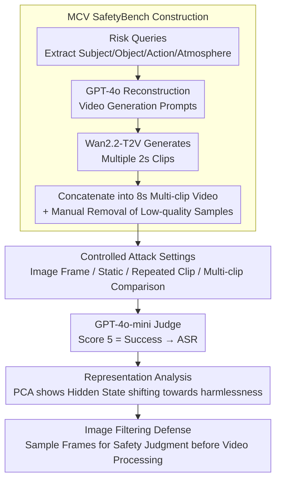

# Jailbreaking Multimodal Large Language Models using Multi-Clip Video

**Conference**: ACL2026  
**arXiv**: [2606.02111](https://arxiv.org/abs/2606.02111)  
**Code**: https://github.com/ChoongwonKang/MCV_Jailbreak.git  
**Area**: Multimodal VLM / Video Safety Evaluation  
**Keywords**: Multimodal Safety, Video Input, MLLM Evaluation, Attack Success Rate, Image Filtering Defense  

## TL;DR
This paper constructs MCV SafetyBench to evaluate the safety of video MLLMs, discovering that multi-clip and multi-context video inputs systematically increase attack success rates (ASR), while simple filtering of sampled image frames significantly mitigates these risks.

## Background & Motivation
**Background**: MLLMs have expanded from image-text understanding to video understanding, capable of processing dynamic scenes, temporal information, and complex visual contexts. Concurrently, multimodal safety research has found that visual inputs are often more likely to weaken the safety alignment of models than pure text.

**Limitations of Prior Work**: Existing multimodal safety work mainly focuses on image-based attacks, such as embedding unsafe contexts or text in images. Although the video modality is longer, more dynamic, and contextually complex, there is still a lack of systematic analysis regarding which specific video attributes lead to safety misalignment.

**Key Challenge**: Video models need to integrate information from multiple temporal segments; richer information aids task understanding, but the same diverse context may dilute or confuse the model's identification of harmful intent, making safety boundaries more fragile.

**Goal**: The authors aim to isolate several factors in video input: whether videos are more vulnerable than images, whether dynamic videos are more vulnerable than static ones, and whether diverse clips are more vulnerable than repeated clips. Based on these findings, they propose simple defenses.

**Key Insight**: The paper constructs MCV SafetyBench, where each sample contains multiple short clips, to observe model risk changes by gradually increasing the number of clips. The note discusses high-level mechanisms for evaluation and defense without reproducing specific harmful prompt content.

**Core Idea**: Use "video context diversity" as a controllable variable to systematically evaluate how it affects MLLM safety alignment, and leverage the relative robustness of the image modality to implement frame-sampling filtering defenses.

## Method

### Overall Architecture
The paper first constructs MCV SafetyBench and then evaluates the attack success rates of various input settings on 8 video MLLMs. The dataset includes 1,460 queries across 13 risk categories related to OpenAI usage policies; each query corresponds to four 2-second clips combined into an 8-second multi-clip video, with both standard video versions and video versions with integrated text/images, totaling 2,920 videos.

Evaluation compares two settings: Explicit, where harmful intent is input as text alongside the video; and Implicit, where text intent is embedded as visual text within the video. The paper uses GPT-4o-mini to score model outputs from 1 to 5 based on CLAS-style rules. Only a score of 5 is counted as a success, with correlation verification performed by 10 human annotators on 200 samples.

### Key Designs
**1. MCV SafetyBench Construction: Creating a video safety benchmark with precise control over clip count and contextual diversity**

Collecting real harmful videos online makes variables like clip count, semantic diversity, and risk categories uncontrollable. The authors chose a synthetic route: extracting semantic components (subject, object, action, atmosphere) from existing risk queries, transforming them into video generation prompts using GPT-4o, and generating 2-second clips with Wan2.2-T2V-A14B. Finally, 220 samples with insufficient expression or diversity were manually removed. This allows each variable to be tuned independently to determine if length or diversity causes vulnerability.

**2. Controlled Attack Settings: Disentangling the contributions of video length, dynamics, visual text, and contextual diversity**

The phenomenon of increased video vulnerability involves multiple entangled factors. Beyond original multi-clip videos, the authors compare sampled image frames, static videos, videos repeating the same clip, and videos with different clip combinations. All videos use consistent frame rates to avoid it becoming a confounding variable. If repeating the same clip raises risk, the cause is "length"; if only different clip combinations significantly raise ASR, the cause is "diverse context"—the experiments point to the latter.

**3. Representation Analysis and Image Filtering Defense: Explaining why multi-clips weaken alignment and providing low-cost mitigation**

The authors extracted hidden states from the last layer for the final input token. PCA revealed that as clip count increases, sample representations shift from harmful anchors toward harmless regions—safety recognition appears "diluted" by rich context. Since the image modality is more robust, the defense utilizes this: randomly sampling video frames and performing an initial safety check using the same model in image-input mode before deciding whether to process the full video. This simple filtering reduced average ASR from $67.34\%$ to $17.37\%$ across four models.

### Loss & Training
This paper focuses on evaluation and defense experiments and does not train new MLLMs. The core metric is Attack Success Rate (ASR), defined as the number of harmful responses divided by the total number of harmful inputs. GPT-4o-mini serves as the judge (1 = clear refusal, 5 = full compliance with harmful intent). In human validation, the correlation between model and human scores was $0.6229$ ($\sigma=0.069$).

## Key Experimental Results

### Main Results

| Model | Explicit 1-Clip | Explicit 4-Clip | Implicit 1-Clip | Implicit 4-Clip | Key Phenomenon |
|------|-----------------|-----------------|-----------------|-----------------|----------|
| Qwen2.5-VL-7B | 50.75 | 68.70 | 69.04 | 80.27 | Most significant increase with clip count |
| Qwen2.5-VL-32B | 71.71 | 81.10 | 79.79 | 82.33 | Larger models are not necessarily safer |
| Qwen2.5-VL-72B | 43.70 | 57.60 | 74.52 | 76.10 | Explicit is stable; Implicit remains fragile |
| Qwen3-VL-8B | 55.48 | 57.40 | 72.40 | 73.15 | Implicit is higher and less sensitive to clip count |
| InternVL3.5-8B | 46.16 | 58.08 | 64.04 | 65.27 | Dynamic video significantly higher than image frames |
| LLaVA-Video-7B | 66.58 | 66.85 | 49.86 | 50.68 | Lower Implicit ASR; attributed to weaker OCR |

### Ablation Study

| Setting / Defense | Qwen2.5-VL-7B | Qwen3-VL-8B | InternVL3.5-8B | LLaVA-Video-7B | Average ASR |
|-------------|---------------|-------------|-----------------|---------------|---------|
| Image Frame Attack | 50.93 | 58.89 | 46.47 | 33.39 | 47.42 |
| Static Video Attack | 68.11 | 72.26 | 64.66 | 40.82 | 61.46 |
| Clip-Rep (Repeated) | 63.68 | 55.02 | 44.91 | 28.27 | 47.97 |
| Original Multi-clip | 77.23 | 72.57 | 64.78 | 49.86 | 66.11 |
| No Defense (4-Clip) | 80.27 | 73.15 | 65.27 | 50.68 | 67.34 |
| Safe system | 70.48 | 57.05 | 33.01 | 50.62 | 52.79 |
| AdaShield | 73.49 | 15.68 | 23.01 | 5.62 | 29.45 |
| Image filtering | 33.63 | 0.62 | 29.66 | 5.55 | 17.37 |

### Key Findings
- On most models, a higher clip count leads to higher ASR; Qwen2.5-VL-7B's Explicit ASR rose from $50.75$ to $68.70$.
- Video modality is more fragile than image frames, dynamic video is more fragile than static, and diverse clip combinations are more fragile than repeated clips. This indicates that "context diversity" is more critical than "frame count."
- Illegal Activity and Hate Speech categories showed significant growth in the Explicit setting, with average ASR rising from $43.19$ to $63.19$ and $22.90$ to $40.88$ respectively.
- Image filtering reduced the average ASR of four models from $67.34\%$ to $17.37\%$, outperforming Safe system and AdaShield.

## Highlights & Insights
- The primary contribution is decomposing video safety vulnerabilities into controllable variables: Image vs. Video, Static vs. Dynamic, Repeated vs. Diverse.
- Representation analysis provides an interesting explanation: multi-clip inputs cause internal representations to shift toward "harmless" regions, suggesting safety recognition is diluted by rich context.
- The defense strategy is pragmatic. Leveraging the relative stability of the image modality for frame-filtering is simple but experimentally effective.
- A key takeaway for video MLLM deployment: image safety results cannot be directly extrapolated to video; video inputs require independent safety gates and benchmarks.

## Limitations & Future Work
- Experiments were limited to 5 clips and 10 seconds total duration, not covering longer videos or complex narratives where risk patterns may evolve.
- Image filtering indirectly uses the image modality's robustness but does not solve the underlying issues of video representation or video-specific safety alignment.
- Dataset construction relies on T2V generation; while trends were replicated with HunyuanVideo-1.5, a gap still exists between synthetic and real complex videos.
- ASR depends on GPT-4o-mini as a judge; while human correlation is moderate-to-strong, it is not perfect. Stricter multi-judge systems and human auditing remain necessary.

## Related Work & Insights
- **vs. Image Jailbreak**: Previous research focused on image text, complex layouts, or image context; this work advances the risk to video clip diversity and temporal context.
- **vs. Video Safety Observations**: While others noted video vulnerability, this work specifically identifies the input attributes (diversity/dynamics) causing it.
- **vs. Prompt-based Defense**: The limited effectiveness of Safe system and AdaShield under video input suggests that textual system prompts are insufficient, highlighting the need for modality-level filtering.

## Rating
- Novelty: ⭐⭐⭐⭐☆ Systematically controlling multi-clip variables is valuable.
- Experimental Thoroughness: ⭐⭐⭐⭐⭐ Comprehensive evaluation across 8 models with representation analysis and defense comparisons.
- Writing Quality: ⭐⭐⭐⭐☆ Clear logic and sufficient visualizations.
- Value: ⭐⭐⭐⭐⭐ Directly informs the safety evaluation and deployment of video MLLMs.

<!-- RELATED:START -->

## Related Papers

- [\[ACL 2026\] DMN: A Compositional Framework for Jailbreaking Multimodal LLMs with Multi-Image Inputs](dmn_a_compositional_framework_for_jailbreaking_multimodal_llms_with_multi-image_.md)
- [\[ICCV 2025\] Jailbreaking Multimodal Large Language Models via Shuffle Inconsistency](../../ICCV2025/multimodal_vlm/jailbreaking_multimodal_large_language_models_via_shuffle_inconsistency.md)
- [\[CVPR 2026\] Video-Only ToM: Enhancing Theory of Mind in Multimodal Large Language Models](../../CVPR2026/multimodal_vlm/video-only_tom_enhancing_theory_of_mind_in_multimodal_large_language_models.md)
- [\[ACL 2026\] LaMI: Augmenting Large Language Models via Late Multi-Image Fusion](lami_augmenting_large_language_models_via_late_multi-image_fusion.md)
- [\[ICCV 2025\] IDEATOR: Jailbreaking and Benchmarking Large Vision-Language Models Using Themselves](../../ICCV2025/multimodal_vlm/ideator_jailbreaking_and_benchmarking_large_visionlanguage_m.md)

<!-- RELATED:END -->
