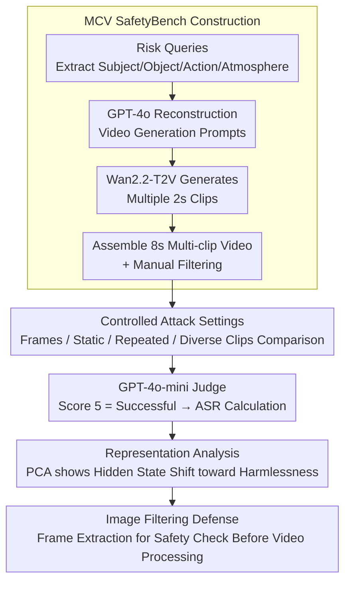

# Jailbreaking Multimodal Large Language Models using Multi-Clip Video

**Conference**: ACL2026  
**arXiv**: [2606.02111](https://arxiv.org/abs/2606.02111)  
**Code**: https://github.com/ChoongwonKang/MCV_Jailbreak.git  
**Area**: Multimodal VLM / Video Safety Evaluation  
**Keywords**: Multimodal safety, video input, MLLM evaluation, attack success rate, image filtering defense  

## TL;DR
This paper constructs the MCV SafetyBench to evaluate the safety of video MLLMs, finding that multi-clip, multi-context video inputs systematically increase attack success rates (ASR), while simple frame-based image filtering can significantly mitigate these risks.

## Background & Motivation
**Background**: MLLMs have expanded from image-text understanding to video understanding, capable of processing dynamic scenes, temporal information, and complex visual contexts. Simultaneously, multimodal safety research has found that visual inputs are often more likely to weaken a model's safety alignment compared to pure text.

**Limitations of Prior Work**: Existing multimodal safety work mainly focuses on image-based attacks, such as embedding unsafe contexts or text within images. Although the video modality is longer, more dynamic, and contains more complex contexts, a systematic analysis of which specific video attributes lead to safety misalignment is still lacking.

**Key Challenge**: Video models need to integrate information from multiple temporal segments; while richer information aids task understanding, the same diverse context may dilute or confuse the model's identification of harmful intent, making safety boundaries more fragile.

**Goal**: The authors aim to isolate several factors in video input: whether videos are more vulnerable than images, whether dynamic videos are more vulnerable than static ones, and whether diverse clips are more vulnerable than repeated clips. Based on these findings, they propose a simple defense.

**Key Insight**: The paper constructs the MCV SafetyBench, where each sample contains multiple short clips, observing risk changes by gradually increasing the number of clips. This note discusses the high-level mechanisms of evaluation and defense without reproducing specific harmful prompts.

**Core Idea**: Treat "video context diversity" as a controllable variable to systematically evaluate how it affects MLLM safety alignment, and leverage the relative robustness of the image modality to implement a frame-based filtering defense.

## Method

### Overall Architecture
The paper first constructs MCV SafetyBench and then evaluates attack success rates across eight video MLLMs under different input settings. The dataset covers 13 risk categories related to OpenAI usage policies, totaling 1,460 queries. Each query corresponds to four 2-second clips combined into an 8-second multi-clip video, with both plain and text-integrated versions, totaling 2,920 videos.

Evaluation compares two settings: the Explicit setting provides harmful intent as text alongside the video, while the Implicit setting embeds text intent as visual characters within the video. The paper uses GPT-4o-mini to score model outputs from 1 to 5 following CLAS-style rules, where a score of 5 is counted as a success. Correlation validation was performed by 10 human annotators on 200 samples.

### Key Designs
**1. MCV SafetyBench Construction: Creating a video safety benchmark with precise control over clip count and contextual diversity.**

Directly collecting real harmful videos from the web makes it impossible to control clip counts, semantic diversity, and risk categories for controlled experiments. The authors adopted a synthetic route: extracting semantic components (subject, object, action, atmosphere) from existing risk queries, using GPT-4o to reconstruct video generation prompts, and employing Wan2.2-T2V-A14B to generate 2-second clips. Finally, 220 low-quality or insufficiently diverse samples were manually removed. This ensures that every variable (number of clips, clip diversity, risk type) can be adjusted independently to identify whether vulnerability stems from length or diversity.

**2. Controlled Attack Settings: Disentangling the contributions of video length, dynamics, visual text, and contextual diversity.**

The phenomenon of increased vulnerability in videos involves several entangled factors. To guide defense strategies, the authors compared frame-extracted images, static videos (repeated frames), videos repeating a single clip, and videos with diverse clip combinations. All videos were set to a uniform frame rate to avoid frame count becoming a confounding variable. The experiments ultimately showed that ASR increases significantly only when contexts become more diverse, rather than just longer.

**3. Representation Analysis and Image Filtering Defense: Explaining why multi-clip inputs weaken alignment and proposing low-cost mitigation.**

The authors extracted hidden states from the final layer and final input token. PCA revealed that as clip counts increased, sample representations shifted from harmful anchors toward harmless regions—suggesting safety identification is "diluted" by rich contexts. Since the image modality is relatively more robust, the defense extracts random frames and mandates the target model to first judge safety in image mode before proceeding with video processing. This simple gate suppressed the average ASR across four models from 67.34 to 17.37.

### Loss & Training
This work primarily focuses on evaluation and defense experiments and does not train new MLLMs. The core metric is the Attack Success Rate (ASR), defined as the number of harmful responses divided by the total number of harmful inputs. The judge model is GPT-4o-mini, where 1 signifies a clear refusal and 5 signifies full compliance with harmful intent; only a score of 5 is counted as a success. In human validation, the correlation between model scores and human ratings was $0.6229$ ($\sigma=0.069$).

## Key Experimental Results

### Main Results

| Model | Explicit 1-Clip | Explicit 4-Clip | Implicit 1-Clip | Implicit 4-Clip | Key Observation |
|------|-----------------|-----------------|-----------------|-----------------|----------|
| Qwen2.5-VL-7B | 50.75 | 68.70 | 69.04 | 80.27 | Most significant rise with clip increase |
| Qwen2.5-VL-32B | 71.71 | 81.10 | 79.79 | 82.33 | Larger models are not necessarily safer |
| Qwen2.5-VL-72B | 43.70 | 57.60 | 74.52 | 76.10 | Stable under Explicit, still fragile under Implicit |
| Qwen3-VL-8B | 55.48 | 57.40 | 72.40 | 73.15 | Implicit is generally higher and less sensitive to clip count |
| InternVL3.5-8B | 46.16 | 58.08 | 64.04 | 65.27 | Dynamic video results are significantly higher than frames |
| LLaVA-Video-7B | 66.58 | 66.85 | 49.86 | 50.68 | Lower Implicit ASR; likely due to weaker OCR |

### Ablation Study

| Setting / Defense | Qwen2.5-VL-7B | Qwen3-VL-8B | InternVL3.5-8B | LLaVA-Video-7B | Avg ASR |
|-------------|---------------|-------------|-----------------|---------------|---------|
| Image Frame Attack | 50.93 | 58.89 | 46.47 | 33.39 | 47.42 |
| Static Video Attack | 68.11 | 72.26 | 64.66 | 40.82 | 61.46 |
| Clip-Rep (Repeated) | 63.68 | 55.02 | 44.91 | 28.27 | 47.97 |
| Original Multi-Clip | 77.23 | 72.57 | 64.78 | 49.86 | 66.11 |
| No Defense (4-Clip) | 80.27 | 73.15 | 65.27 | 50.68 | 67.34 |
| Safe system | 70.48 | 57.05 | 33.01 | 50.62 | 52.79 |
| AdaShield | 73.49 | 15.68 | 23.01 | 5.62 | 29.45 |
| Image filtering | 33.63 | 0.62 | 29.66 | 5.55 | 17.37 |

### Key Findings
- On most models, a higher number of clips leads to a higher ASR. For Qwen2.5-VL-7B, Explicit ASR rose from 50.75 to 68.70, and Implicit ASR rose from 69.04 to 80.27.
- The video modality is more vulnerable than frame-based images, dynamic videos are more vulnerable than static ones, and diverse clip combinations are more vulnerable than repeated clips. This indicates that the key factor is "contextual diversity" rather than "frame count."
- Categories like Illegal Activity and Hate Speech saw significant growth under Explicit settings, with average ASR rising from 43.19 to 63.19 and 22.90 to 40.88, respectively.
- Image filtering reduced the average ASR of four models from 67.34 to 17.37, outperforming Safe system and AdaShield.

## Highlights & Insights
- The most significant contribution is not proposing a stronger attack, but disentangling video safety weaknesses into controllable variables: Image vs. Video, Static vs. Dynamic, Repetition vs. Diversity.
- Representation analysis offers an intuitive explanation: multi-clip inputs cause internal representations to shift toward "harmless" regions, suggesting safety alignment is diluted by rich context.
- The defense strategy is pragmatic. Leveraging the relative stability of the image modality for frame-based filtering is simple yet highly effective in experiments.
- For video MLLM deployment, the insight is clear: image safety evaluations cannot be directly extrapolated to videos; video inputs require independent safety gating and benchmarks.

## Limitations & Future Work
- The experiments covered up to 5 clips (10 seconds total), without exploring longer videos or complex temporal narratives where risk patterns might evolve.
- Image filtering is an indirect solution leveraging image modality robustness; it does not solve the underlying issues of video representation and video-specific safety alignment.
- The dataset relies on text-to-video generation. Although trends remained consistent when re-evaluated with HunyuanVideo-1.5, a gap between synthetic and real-world complex videos remains.
- ASR depends on GPT-4o-mini as a judge; while human correlation is moderate-to-strong, it is not perfect. Stricter multi-judge systems and severity gradings are still necessary.

## Related Work & Insights
- **vs Image Jailbreak**: Prior research focused on visual text and complex layouts; this work extends the risk to video clip diversity and temporal context.
- **vs Video Safety Observations (Hu et al. / Liu et al.)**: While prior works noted video vulnerability, this paper decomposes the specific input attributes causing it.
- **vs Prompt-based Defense**: The failure of Safe system and AdaShield under video inputs suggests that text system prompts are insufficient, necessitating modality-level filtering.

## Rating
- Novelty: ⭐⭐⭐⭐☆ Systematic control of multi-clip variables is valuable.
- Experimental Thoroughness: ⭐⭐⭐⭐⭐ Comprehensive coverage of 8 open-source/closed-source models, representation analysis, and defense comparisons.
- Writing Quality: ⭐⭐⭐⭐☆ Clear narrative and detailed tables.
- Value: ⭐⭐⭐⭐⭐ Directly applicable to video MLLM safety evaluation and deployment defenses.

<!-- RELATED:START -->

## Related Papers

- [\[ACL 2026\] DMN: A Compositional Framework for Jailbreaking Multimodal LLMs with Multi-Image Inputs](dmn_a_compositional_framework_for_jailbreaking_multimodal_llms_with_multi-image_.md)
- [\[ICCV 2025\] Jailbreaking Multimodal Large Language Models via Shuffle Inconsistency](../../ICCV2025/multimodal_vlm/jailbreaking_multimodal_large_language_models_via_shuffle_inconsistency.md)
- [\[ACL 2026\] LaMI: Augmenting Large Language Models via Late Multi-Image Fusion](lami_augmenting_large_language_models_via_late_multi-image_fusion.md)
- [\[CVPR 2026\] Video-Only ToM: Enhancing Theory of Mind in Multimodal Large Language Models](../../CVPR2026/multimodal_vlm/video-only_tom_enhancing_theory_of_mind_in_multimodal_large_language_models.md)
- [\[ICML 2026\] Jailbreaking Vision-Language Models Through the Visual Modality](../../ICML2026/multimodal_vlm/jailbreaking_vision-language_models_through_the_visual_modality.md)

<!-- RELATED:END -->
