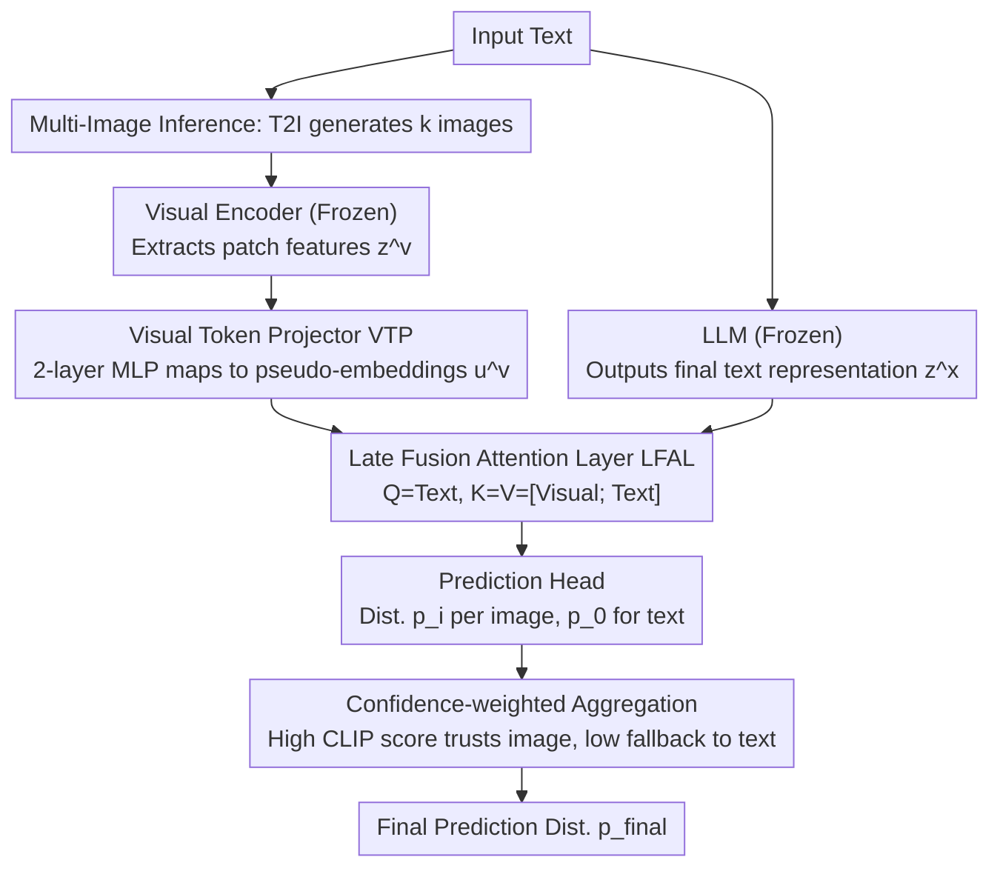

# LaMI: Augmenting Large Language Models via Late Multi-Image Fusion

**Conference**: ACL 2026  
**arXiv**: [2406.13621](https://arxiv.org/abs/2406.13621)  
**Code**: [Project Homepage](https://guyyariv.github.io/LaMI/)  
**Area**: Multimodal VLM  
**Keywords**: Late Fusion, Multi-image Generation, Visual Common Sense Reasoning, Vision-Augmented LLM, Inference-time Visual Injection

## TL;DR

LaMI is proposed, which utilizes a late fusion architecture to integrate visual features with LLM outputs at the final stage of prediction. During inference, multiple images are generated from text and aggregated based on confidence. This significantly enhances the visual common sense reasoning capabilities of LLMs without compromising their text reasoning performance.

## Background & Motivation

**Background**: LLMs exhibit excellent performance on text-only tasks but lack visual common sense (e.g., "What color is an emperor penguin's belly?"). While Vision-Language Models (VLMs) can handle visual tasks, they often sacrifice text reasoning performance, and multimodal training is costly.

**Limitations of Prior Work**: Existing Vision-augmented Language Model (VaLM) solutions face two core issues: (1) Most utilize **early fusion**, where visual signals injected too early into the LLM interfere with its linguistic behavior; (2) They rely solely on a **single image**, which is prone to introducing noise and bias.

**Key Challenge**: How to efficiently append visual knowledge to text-only LLMs without affecting their text reasoning capabilities and without requiring expensive multimodal retraining.

**Goal**: Design a lightweight, plug-and-play vision augmentation scheme that balances visual common sense improvement with the maintenance of text performance.

**Key Insight**: Postpone the fusion of visual features to the final stage of prediction (late fusion) to avoid interfering with the LLM's intermediate representations; generate multiple images during inference to provide diverse visual evidence.

**Core Idea**: Late Fusion + Multi-Image = Visual augmentation without loss of linguistic capability. The LLM remains frozen, and only lightweight projection and fusion layers are trained.

## Method

### Overall Architecture

LaMI consists of four components: a frozen pre-trained LLM, a frozen pre-trained visual encoder, a trainable Visual Token Projector (VTP), and a trainable Late Fusion Attention Layer (LFAL). The data flow is as follows: input text is simultaneously sent to the frozen LLM for standard language processing and to a text-to-image model to generate $k$ images. The images are transformed into pseudo-text tokens via the visual encoder and VTP. These are fused by the LFAL only after the LLM outputs the final representation. Each image provides a predicted distribution, and finally, CLIP alignment scores are used to weight and aggregate the distributions from multiple images and the text-only distribution into the final answer. During training, only image-text pairs are used to tune the VTP and LFAL; during inference, multiple images are generated on-the-fly from the input text.

### Key Designs

1. **Visual Token Projector (VTP)**: The patch features $z^v \in \mathbb{R}^{n_v \times d_v}$ output by the visual encoder exist in visual space, whereas the LLM only recognizes text embeddings. The VTP uses a two-layer MLP to map these into pseudo-text embeddings $u^v = W_1 \sigma(W_2 z^v) \in \mathbb{R}^{n_v \times d_x}$, essentially "translating" images into pseudo-tokens readable by the LLM, allowing subsequent fusion layers to integrate cross-modal information in a unified space.

2. **Late Fusion Attention Layer (LFAL)**: Early or intermediate fusion injects visual signals into the LLM too early, interfering with its linguistic behavior and degrading text reasoning. LaMI does the opposite by delaying fusion until the final step after the LLM has output its final representation and before the prediction head: an attention layer is inserted such that $Q=z^x_{(<t)}$ and $K=V=[u^v; z^x_{(<t)}]$, where text tokens attend to visual tokens at once. Thus, the entire forward process of the LLM focuses on language, only "touching" vision at the final moment, minimizing interference with linguistic capabilities.

3. **Multi-Image Inference and Confidence Weighting**: A single generated image may contain noise or semantic bias; relying on one image is risky. During inference, $k$ images are generated, each yielding a distribution $p_i$. These are weighted alongside the text-only distribution $p_0$ based on CLIP alignment scores: $p_{\text{final}} = \sum_i f(\bar{x}_i, v_i)\, p_i + (1 - f(\bar{x}_i, v_i))\, p_0$. Multiple images serve as redundant evidence. Images with high alignment receive higher weights, while low alignment weights approach zero, automatically falling back to the text-only LLM to ensure unreliable images do not degrade predictions.

### Loss & Training

Training is conducted using the standard language modeling objective $\max_\theta \log P_\theta(x_{(t)} | x_{(<t)}, v)$. Training data includes real image-text pairs and text + synthetic generated image pairs. Only the parameters of the VTP and LFAL are trainable, while the LLM and visual encoder remain frozen. During inference, a distilled text-to-image generator is used for batch parallel sampling to minimize overhead.

## Key Experimental Results

### Main Results

| Model | Base | Visual Common Sense (VC) | Common Sense Reasoning (CR) | Reading Comprehension (RC) | Average |
|------|------|--------------|-------------|-------------|------|
| Llama3-8B | - | 52.0 | 72.0 | 57.9 | 60.6 |
| LaMI (Llama3-8B) | Llama3-8B | **55.0** | **72.9** | **58.0** | **62.0** |
| Llama3-8B-Instruct | - | 53.0 | 71.6 | 59.2 | 61.2 |
| Llava-Next (Llama3-8B-Inst.) | Llama3-8B-Inst. | 56.5 | 70.8 | 54.8 | 60.7 |
| LaMI (Llama3-8B-Inst.) | Llama3-8B-Inst. | **55.6** | **71.7** | **60.9** | **62.7** |

### Ablation Study

| Method | Memory Color | Color Terms | Object Shape | Relative Size |
|------|-------------|-------------|-------------|--------------|
| GPT-2 (Base) | 32.4 | 34.6 | 44.5 | 43.1 |
| Early Fusion | 49.1 | 45.3 | 40.3 | 70.1 |
| Early Fusion + Multi | 55.5 | 52.1 | 41.2 | 75.5 |
| Intermediate Fusion + Multi | 69.7 | 67.8 | 63.0 | 81.1 |
| **Late Fusion + Multi (Ours)** | **72.5** | **69.2** | **66.8** | **85.5** |

### Key Findings

- **Late fusion consistently outperforms early and intermediate fusion**: Late Fusion shows the best performance across all tasks, particularly in shape-related tasks where the advantage is distinct.
- **Multi-image generation brings gains across all fusion strategies**: Improvements are especially significant for reasoning regarding color and relative size.
- **LaMI enhances visual common sense without damaging or even while improving text tasks**: This stands in stark contrast to VLMs (e.g., InstructBLIP, Llava-Next).
- Inference computation control experiment: While Best-of-N sampling improves common sense reasoning, it cannot bridge the visual common sense gap (VC: 47.8 vs LaMI 50.1), confirming that LaMI's improvements stem from visual evidence rather than extra computation.
- Performance saturates at an image count of $k \approx 6$, with $k=3$ already providing significant benefits.

## Highlights & Insights

- The design philosophy of **late fusion protecting linguistic capability** is highly practical—the LLM remains frozen and vision only "touches" it at the final stage, representing a minimally invasive multimodal augmentation paradigm for LLMs.
- The **automatic degradation mechanism of CLIP confidence weighting** is cleverly designed: it automatically retreats to the text-only path when images are unreliable, preventing visual noise from damaging predictions.
- The method is plug-and-play and can be applied to any newly released LLM without the need for expensive multimodal retraining.

## Limitations & Future Work

- Dependency on the quality of the text-to-image generator; generated images may introduce out-of-distribution noise.
- Inference requires generating multiple images, increasing latency and computational overhead (though parallelizable).
- Performance on visual common sense is still slightly lower than fully trained VLMs (e.g., Llava-Next VC: 56.5 vs LaMI 55.6), though leading in overall average.
- Validated only on discriminative tasks (multiple choice); the effect on open-ended generative tasks is unknown.
- Future work could explore more efficient ways to obtain visual evidence (e.g., retrieval instead of generation).

## Related Work & Insights

- **VaLM Series** (VaLM, Z-LaVI, LiVE): LaMI's late fusion strategy uniformly addresses the decline in linguistic capability found in early fusion solutions.
- **CLIP as a Cross-modal Bridge**: CLIP scores are used to automatically evaluate image-text alignment and weight them without additional training.
- Insight: Multimodal augmentation does not necessarily require deep fusion; shallow late fusion has natural advantages in maintaining unimodal capabilities.

## Rating

- **Novelty**: ⭐⭐⭐⭐ While the combination of late fusion and multi-image reasoning is not an entirely new concept, its advantages are systematically verified, and the CLIP-weighted fallback mechanism is creative.
- **Experimental Thoroughness**: ⭐⭐⭐⭐ Comprehensive evaluation from small to large models and from BERT to LLaMA3, with complete ablation studies, though verification on even larger scale models is missing.
- **Writing Quality**: ⭐⭐⭐⭐ Structure is clear and the motivation is well-explained, though some notation usage is not fully consistent.
- **Value**: ⭐⭐⭐⭐ Provides a practical, lightweight solution for quickly adapting new LLMs to multimodal scenarios.

<!-- RELATED:START -->

## Related Papers

- [\[CVPR 2026\] Multi-Modal Image Fusion via Intervention-Stable Feature Learning](../../CVPR2026/multimodal_vlm/multi-modal_image_fusion_via_intervention-stable_feature_learning.md)
- [\[ACL 2026\] TEMA: Anchor the Image, Follow the Text for Multi-Modification Composed Image Retrieval](tema_anchor_the_image_follow_the_text_for_multi-modification_composed_image_retr.md)
- [\[ACL 2026\] Jailbreaking Multimodal Large Language Models using Multi-Clip Video](jailbreaking_multimodal_large_language_models_using_multi-clip_video.md)
- [\[ACL 2026\] Leave My Images Alone: Preventing Multi-Modal Large Language Models from Analyzing Unauthorized Images](leave_my_images_alone_preventing_multi-modal_large_language_models_from_analyzin.md)
- [\[CVPR 2026\] ReCoFuse: Ultra-Robust Image Fusion via Restorative Multi-Modal Diffusion Reciprocal Coupling](../../CVPR2026/multimodal_vlm/recofuse_ultra-robust_image_fusion_via_restorative_multi-modal_diffusion_recipro.md)

<!-- RELATED:END -->
