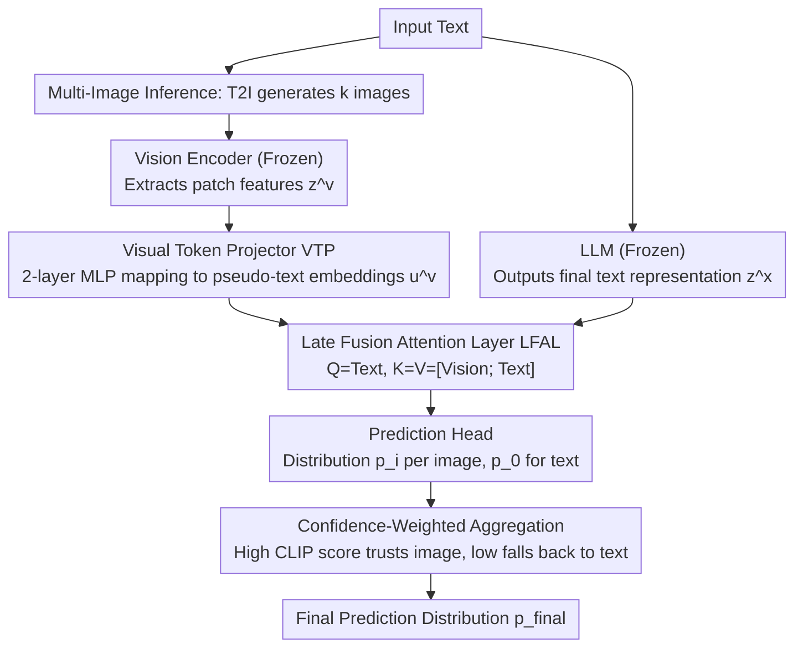

# LaMI: Augmenting Large Language Models via Late Multi-Image Fusion

**Conference**: ACL 2026  
**arXiv**: [2406.13621](https://arxiv.org/abs/2406.13621)  
**Code**: [Project Page](https://guyyariv.github.io/LaMI/)  
**Area**: Multimodal VLM  
**Keywords**: Late fusion, multi-image generation, visual commonsense reasoning, vision-augmented LLM, inference-time vision injection

## TL;DR

LaMI is proposed to fuse visual features with LLM outputs in the final stage of prediction via a late fusion architecture. During inference, multiple images are generated from text for confidence-based aggregation, significantly improving the visual commonsense reasoning of LLMs without compromising their text reasoning capabilities.

## Background & Motivation

**Background**: LLMs perform excellently on text-only tasks but lack visual commonsense (e.g., "What color is an emperor penguin's belly?"). While Vision-Language Models (VLMs) can handle visual tasks, they often sacrifice text reasoning performance, and multimodal training is costly.

**Limitations of Prior Work**: Existing Vision-augmented Language Model (VaLM) solutions face two core issues: (1) most adopt **early fusion**, where visual signals injected too early into the LLM interfere with its linguistic behavior; (2) they rely on for a **single image**, which is prone to noise and bias.

**Key Challenge**: How to efficiently add visual knowledge to text-only LLMs while maintaining their text reasoning performance and avoiding expensive multimodal retraining.

**Goal**: Design a lightweight, plug-and-play vision augmentation scheme that balances visual commonsense enhancement and text performance preservation.

**Key Insight**: Postpone the fusion of visual features to the final stage of prediction (late fusion) to avoid interfering with the intermediate representations of the LLM; generate multiple images during inference to provide diverse visual evidence.

**Core Idea**: Late Fusion + Multi-Image = Visual enhancement without losing language capabilities. The LLM remains frozen, and only lightweight projection and fusion layers are trained.

## Method

### Overall Architecture

LaMI consists of four components: a frozen pre-trained LLM, a frozen pre-trained vision encoder, a trainable Visual Token Projector (VTP), and a trainable Late Fusion Attention Layer (LFAL). The data flow is as follows: input text is simultaneously sent to the frozen LLM for normal language processing and to a text-to-image model to generate $k$ images. The images are converted into pseudo-text tokens via the vision encoder and VTP, then fused by the LFAL only after the LLM outputs final representations. Each image provides a predicted distribution, and finally, CLIP alignment scores are used to weight and aggregate the multi-image distributions with the text-only distribution for the final answer. During training, only image-text pairs are used to tune the VTP and LFAL; during inference, multiple images are generated on-the-fly from the input text.

### Key Designs

1.  **Visual Token Projector (VTP)**: Visual patch features $z^v \in \mathbb{R}^{n_v \times d_v}$ from the vision encoder reside in visual space, whereas the LLM only recognizes text embeddings. The VTP uses a two-layer MLP to map them into pseudo-text embeddings $u^v = W_1 \sigma(W_2 z^v) \in \mathbb{R}^{n_v \times d_x}$, effectively translating the image into "pseudo-tokens" readable by the LLM, allowing the subsequent fusion layer to integrate cross-modal information in a unified space.

2.  **Late Fusion Attention Layer (LFAL)**: Early or intermediate fusion injects visual signals into the LLM too early, interfering with its linguistic behavior and degrading text reasoning. LaMI reverses this by postponing fusion until after the LLM has outputted its final representation, just before the prediction head: an attention layer is inserted such that $Q=z^x_{(<t)}$ and $K=V=[u^v; z^x_{(<t)}]$, where text tokens attend to visual tokens in a single pass. This ensures the LLM's forward process remains focused on language, only "touching" vision at the final step, minimizing interference with language capabilities.

3.  **Multi-Image Reasoning and Confidence Weighting**: Relying on a single generated image is risky due to potential noise or semantic bias. During inference, $k$ images are generated to obtain distributions $p_i$, which are then weighted alongside the text-only distribution $p_0$ using CLIP alignment scores: $p_{\text{final}} = \sum_i f(\bar{x}_i, v_i)\, p_i + (1 - f(\bar{x}_i, v_i))\, p_0$. Multiple images provide redundant evidence; images with high alignment receive higher weights, while weights for low-alignment images tend toward zero, automatically falling back to the text-only LLM to prevent unreliable images from degrading the prediction.

### Loss & Training

The model is trained using a standard language modeling objective: $\max_\theta \log P_\theta(x_{(t)} | x_{(<t)}, v)$. Training data includes both real image-text pairs and text + synthetic image pairs. Only the parameters of the VTP and LFAL are trainable, while the LLM and vision encoder remain frozen. During inference, a distilled text-to-image generator is used for batch parallel sampling to minimize overhead.

## Key Experimental Results

### Main Results

| Model | Base | Visual Commonsense (VC) | Commonsense Reasoning (CR) | Reading Comprehension (RC) | Average |
| :--- | :--- | :--- | :--- | :--- | :--- |
| Llama3-8B | - | 52.0 | 72.0 | 57.9 | 60.6 |
| LaMI (Llama3-8B) | Llama3-8B | **55.0** | **72.9** | **58.0** | **62.0** |
| Llama3-8B-Instruct | - | 53.0 | 71.6 | 59.2 | 61.2 |
| Llava-Next (Llama3-8B-Inst.) | Llama3-8B-Inst. | 56.5 | 70.8 | 54.8 | 60.7 |
| LaMI (Llama3-8B-Inst.) | Llama3-8B-Inst. | 55.6 | **71.7** | **60.9** | **62.7** |

### Ablation Study

| Method | Memory Color | Color Terms | Object Shape | Relative Size |
| :--- | :--- | :--- | :--- | :--- |
| GPT-2 (Base) | 32.4 | 34.6 | 44.5 | 43.1 |
| Early Fusion | 49.1 | 45.3 | 40.3 | 70.1 |
| Early Fusion + Multi | 55.5 | 52.1 | 41.2 | 75.5 |
| Intermediate Fusion + Multi | 69.7 | 67.8 | 63.0 | 81.1 |
| **Late Fusion + Multi (Ours)** | **72.5** | **69.2** | **66.8** | **85.5** |

### Key Findings

*   **Late fusion consistently outperforms early and intermediate fusion**: Late Fusion achieved the best performance across all tasks, with a significant advantage in shape-related tasks.
*   **Multi-image generation yields gains across all fusion strategies**: Improvement is particularly noticeable in reasoning about color and relative size.
*   **LaMI enhances visual commonsense without harming—or even improving—text tasks**: This stands in contrast to VLMs like InstructBLIP and Llava-Next.
*   Inference-time computation control: While Best-of-N sampling improves commonsense reasoning, it cannot close the visual commonsense gap (VC: 47.8 vs. LaMI 50.1), confirming that LaMI's improvements stem from visual evidence rather than extra compute.
*   Performance saturates around $k \approx 6$, with significant gains achieved at $k=3$.

## Highlights & Insights

*   The design philosophy of **late fusion protecting language capabilities** is highly practical—the LLM remains frozen, and vision only "touches" it at the final stage. This is a minimally invasive multimodal augmentation paradigm for LLMs.
*   The **automatic degradation mechanism via CLIP confidence weighting** is elegantly designed: it automatically retreats to the text-only path when images are unreliable, preventing visual noise from damaging predictions.
*   The method is plug-and-play for any newly released LLM without requiring expensive multimodal retraining.

## Limitations & Future Work

*   Dependency on the quality of text-to-image generators; generated images may introduce out-of-distribution noise.
*   Generating multiple images at inference time adds latency and computational overhead (though it can be parallelized).
*   Visual commonsense performance is still slightly lower than fully trained VLMs (e.g., Llava-Next VC: 56.5 vs. LaMI 55.6), though leading in overall average performance.
*   Validation is limited to discriminative tasks (multiple choice); the effect on open-ended generation tasks remains unknown.
*   Future work could explore more efficient ways to acquire visual evidence, such as retrieval instead of generation.

## Related Work & Insights

*   **VaLM series** (VaLM, Z-LaVI, LiVE): LaMI's late fusion strategy uniformly addresses the language capability degradation found in early fusion schemes.
*   **CLIP as a cross-modal bridge**: CLIP scores are used to automatically evaluate image-text alignment for weighting without additional training.
*   Insight: Multimodal augmentation does not necessarily require deep fusion; shallow late fusion has a natural advantage in preserving unimodal performance.

## Rating

*   **Novelty**: ⭐⭐⭐⭐ While the combination of late fusion and multi-image reasoning is not a brand-new concept, the systematic verification of its advantages and the CLIP-weighted fallback mechanism are creative.
*   **Experimental Thoroughness**: ⭐⭐⭐⭐ Includes comprehensive evaluations from small to large models (BERT to Llama3). Ablations are complete, though validation on even larger-scale models is missing.
*   **Writing Quality**: ⭐⭐⭐⭐ The structure is clear and the motivation is well-articulated, though some notation usage is inconsistent.
*   **Value**: ⭐⭐⭐⭐ Provides a practical, lightweight solution for quickly adapting new LLMs to multimodal scenarios.

<!-- RELATED:START -->

## Related Papers

- [\[ACL 2026\] OMIBench: Benchmarking Olympiad-Level Multi-Image Reasoning in Large Vision-Language Models](omibench_benchmarking_olympiad-level_multi-image_reasoning_in_large_vision-langu.md)
- [\[CVPR 2026\] Multi-Modal Image Fusion via Intervention-Stable Feature Learning](../../CVPR2026/multimodal_vlm/multi-modal_image_fusion_via_intervention-stable_feature_learning.md)
- [\[ACL 2026\] TEMA: Anchor the Image, Follow the Text for Multi-Modification Composed Image Retrieval](tema_anchor_the_image_follow_the_text_for_multi-modification_composed_image_retr.md)
- [\[ACL 2026\] Jailbreaking Multimodal Large Language Models using Multi-Clip Video](jailbreaking_multimodal_large_language_models_using_multi-clip_video.md)
- [\[ACL 2026\] Leave My Images Alone: Preventing Multi-Modal Large Language Models from Analyzing Unauthorized Images](leave_my_images_alone_preventing_multi-modal_large_language_models_from_analyzin.md)

<!-- RELATED:END -->
