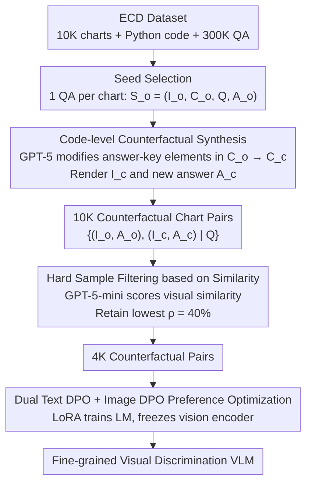

# Learning More from Less: Exploiting Counterfactuals for Data-Efficient Chart Understanding

**Conference**: ACL 2026  
**arXiv**: [2605.10855](https://arxiv.org/abs/2605.10855)  
**Code**: https://github.com/jianzhubao/ChartCF  
**Area**: Multimodal / Chart Understanding / Counterfactual Learning / VLM Preference Optimization  
**Keywords**: chart QA, counterfactual data, DPO, multimodal preference, data-efficient training

## TL;DR
Addressing the unique attribute of charts as "programmatically generated visual artifacts," this paper proposes ChartCF. It utilizes GPT-5 to generate "counterfactual chart pairs"—visually similar but with different answers—by making minimal modifications to plotting code. Through joint preference optimization using Text DPO and Image DPO, the VLM learns fine-grained visual discrimination. Using only 4K preference pairs, it matches or exceeds the performance of ECD trained on 300K SFT data across multiple chart QA benchmarks.

## Background & Motivation

**Background**: Chart understanding (chart QA / chart-to-code / chart description) is a core capability of VLMs. Previling methods for improvement involve large-scale synthetic data using Matplotlib and advanced LLMs combined with SFT (e.g., ECD 300K, ChartGemma 123K, Chart-R1 228K SFT + 30K RL). Open-source chart-specific VLMs still lag behind GPT-4o / Claude-3.5 on benchmarks such as ChartQA, CharXiv, and ChartBench, particularly in subtle visual discrimination.

**Limitations of Prior Work**: (1) Existing research focuses on scaling SFT data while ignoring the specific characteristics of charts; (2) standard SFT treats each (image, question, answer) as an independent sample and **lacks explicit supervision for the VLM to learn the discriminative ability of "subtle visual difference → answer change"**; (3) when a bar height in a chart is slightly adjusted, the answer should change, yet VLMs often overlook this or generate hallucinations.

**Key Challenge**: Charts are **code-controlled visual products**—a slight adjustment of a data value can **completely change the correct answer** while remaining visually almost identical. This "counterfactual sensitivity" requires contrastive supervision, which SFT cannot provide. Scaling independent samples fails to capture this "discriminative" signal.

**Goal**: (1) Construct counterfactual chart pairs that are visually similar but have different answers as contrastive signals; (2) filter out "overly difficult" samples to prevent DPO collapse on hard cases; (3) perform joint preference optimization on both text and vision sides to allow the VLM to **anchor answers to precise visual evidence**.

**Key Insight**: The dual representation of charts (image + code) provides a tool for "counterfactual creation"—by having an LLM modify only answer-related elements at the code level (a numerical value, a label, a subplot title), high visual similarity can be maintained while changing the correct answer. This is a "cheap, precise, and controllable" counterfactual generation path unique to the chart domain.

**Core Idea**: Use GPT-5 to modify Matplotlib code to create counterfactual chart pairs $(I_o, I_c)$ with corresponding answers $(A_o, A_c)$; filter out "overly difficult" samples where visual differences are too small using chart similarity; and use Text DPO + Image DPO dual preference optimization to train the VLM to "see clearly which image corresponds to which answer."

## Method

### Overall Architecture

ChartCF is a lightweight three-stage post-training framework that does not modify architecture or rely on RL:

1.  **Counterfactual Data Synthesis**: Starting from the ECD dataset (containing 10K charts + Python plotting code + 300K QA), one QA is selected for each chart as a seed $S_o = (I_o, C_o, Q, A_o)$. GPT-5 is used to locate "answer-critical elements" at the code level and perform minimal modifications to obtain $C_c$. Executing $C_c$ renders $I_c$ and its corresponding correct answer $A_c$, forming the counterfactual pair $\mathcal{D}_{\text{pair}} = \{(I_o, A_o), (I_c, A_c) \mid Q\}$.
2.  **Similarity-based Data Selection**: GPT-5-mini is utilized to assign a "visual similarity" score to each pair $(I_o, I_c)$. **The $\rho\%$ of samples with the lowest similarity** (i.e., pairs with relatively distinct visual differences) are retained to filter out "overly difficult" samples. 4K pairs are selected from the initial 10K.
3.  **Multimodal Preference Optimization**: Joint optimization of $\mathcal{L}_{\text{text-dpo}} + \mathcal{L}_{\text{img-dpo}}$ is performed on the 4K counterfactual pairs. LoRA is used to update only the LM component (freezing the vision encoder) with lr=1e-4, rank=64, 2 epochs, on 8×A100.

### Key Designs

**1. Code-level Counterfactual Synthesis: Low-cost generation of chart pairs with near-identical visuals but different answers using "code-controllable visual products"**

Standard SFT treats each (image, question, answer) as an independent sample, never forcing the model to answer "why these two nearly identical images have different answers." Consequently, when the height of a bar is slightly adjusted, the model often overlooks it and provides the old answer. ChartCF leverages the uniqueness of charts—being rendered from Matplotlib code—to push counterfactual generation down to the code level: GPT-5 first isolates the elements in the original code $C_o$ that the answer $A_o$ directly depends on (a specific bar's `height`, a subplot `title`, a category label). **Only this specific element is modified**, while all other data points, color schemes, and random seeds remain strictly unchanged to obtain $C_c$. Executing $C_c$ renders $I_c$ and the new correct answer $A_c$, forming the counterfactual pair $\mathcal{D}_{\text{pair}} = \{(I_o, A_o), (I_c, A_c) \mid Q\}$. Finally, a multi-stage pipeline (Appendix B) filters out low-quality generated pairs.

Specifically: for a bar chart of "GDP by Country," the original image asks "Which country is the highest?" and answers "Germany." GPT-5 modifies only the height of the bar for France from 2.1 to 3.8 while keeping everything else constant. The rendered new image is visually almost indistinguishable to the naked eye, but the correct answer has changed to "France"—this is a clean hard negative. Performing this at the code level is crucial because counterfactuals for natural images (image editing, diffusion rewriting) often introduce irrelevant changes that drown the DPO supervision signal in noise. Code-level modification naturally decouples "answer-related signals" from "irrelevant variations." Smaller modifications leading to more subtle visual differences provide purer supervision, serving as the technical lever for effective multimodal counterfactual learning.

**2. Visual Similarity-based "Hard Sample" Filtering: Removing pairs with nearly imperceptible visual differences to prevent DPO from learning incorrectly**

Counterfactual pairs are not better simply by being harder. When the visual difference between $I_o$ and $I_c$ is nearly indistinguishable, the boundary between chosen and rejected becomes blurred, leading to unstable DPO gradient directions that can mislead the model. ChartCF uses GPT-5-mini to score the visual similarity of each pair $(I_o, I_c)$—higher similarity indicates more subtle visual differences and higher difficulty. Samples are sorted from lowest to highest similarity, and only the top $\rho\%$ (default $\rho=40\%$, i.e., 4K out of 10K) are retained. Ablations show that $\rho=40\%$ is optimal for CharXiv average scores, while $\rho=100\%$ (no filtering) leads to performance degradation.

This step aligns with findings by Gou & Nguyen (2025) / Gao et al. (2025) regarding "DPO sensitivity to sample difficulty": it is the flip side of the "filtering overly simple samples" in LearnAlign. Both principles aim to keep supervision within the "Zone of Proximal Development" near the model's capability boundary; samples that are too hard or too easy provide little learning value.

**3. Text DPO + Image DPO Dual Preference Optimization: Simultaneously learning "which answer is correct given an image" and "which image is correct given an answer" to anchor answers to visual evidence**

Counterfactual pairs alone are insufficient; the model must be pushed through dual directions to clear evidence. **Text DPO** fixes the original image $I_o$ and question $Q$, guiding the model to prefer $A_o$ and degrade $A_c$:

$$\mathcal{L}_{\text{text-dpo}} = -\log\sigma\Big(\beta\log\frac{\pi_\theta(A_o|I_o,Q)}{\pi_{\text{ref}}(A_o|I_o,Q)} - \beta\log\frac{\pi_\theta(A_c|I_o,Q)}{\pi_{\text{ref}}(A_c|I_o,Q)}\Big)$$

Here, $A_c$ serves as a natural hard negative—it is correct for $I_c$ but incorrect for $I_o$, forcing the model to learn to "select the answer based on the image." **Image DPO** conversely fixes the question $Q$ and answer $A_o$, guiding the model to prefer $I_o$ and degrade $I_c$:

$$\mathcal{L}_{\text{img-dpo}} = -\log\sigma\Big(\beta\log\frac{\pi_\theta(A_o|I_o,Q)}{\pi_{\text{ref}}(A_o|I_o,Q)} - \beta\log\frac{\pi_\theta(A_o|I_c,Q)}{\pi_{\text{ref}}(A_o|I_c,Q)}\Big)$$

This forces the model to learn to "pick the correct image given an answer." The total loss is the sum of both: $\mathcal{L}_{\text{total}} = \mathcal{L}_{\text{text-dpo}} + \mathcal{L}_{\text{img-dpo}}$. These dual directions form a reciprocal constraint: the text side prevents the model from "looking at the image but ignoring subtle differences," while the image side prevents "listening to the question but ignoring the image." Together, they anchor the answer tightly to precise visual evidence—the exact anti-hallucination signal the chart domain lacks. Section 4.8 further demonstrates that this data works well with other multimodal preference objectives like mDPO and S-VCO, indicating that the gain stems from the counterfactual data itself, not just the DPO formula.

### Loss & Training

The total objective is $\mathcal{L}_{\text{total}}$ as defined above. $\beta$ is the DPO temperature (default values in the original paper). LoRA (rank=64, alpha=64) is applied only to the LM part, while the vision encoder and projection are frozen. Training is completed on 8×A100 80GB with batch 64, lr 1e-4, for 2 epochs in approximately 40 minutes—a **two-order-of-magnitude reduction** in training cost compared to Chart-R1's 30+ hours (24×H800).

## Key Experimental Results

### Main Results

Comparison of ChartCF vs. various SFT baselines across 5 benchmarks (CharXiv / ChartQA real-world + ChartBench / ChartX / ECDBench synthetic):

**Real-world charts (Excerpt)**:

| Method | Model | Training Data | CharXiv Avg | ChartQA |
| :--- | :--- | :--- | :--- | :--- |
| GPT-4o | – | – | 76.98 | 85.70 |
| Claude-3.5-Sonnet | – | – | 79.48 | 90.80 |
| TinyChart | 3B | 1.36M SFT | – | 83.60 |
| Chart-R1 | 7B | 228K SFT + 30K RL | 58.84 | **91.04** |
| Qwen2.5-VL + ECD | 7B | 300K SFT | 67.40 | 85.32 |
| **Qwen2.5-VL + ChartCF** | 7B | **4K DPO** | **68.94** | 87.00 |
| InternVL3.5 + ECD | 8B | 300K SFT | 69.68 | 86.52 |
| **InternVL3.5 + ChartCF** | 8B | **4K DPO** | **72.84** | 87.16 |
| Qwen3-VL + ECD | 8B | 300K SFT | 73.98 | 85.12 |
| **Qwen3-VL + ChartCF** | 8B | **4K DPO** | **75.36** | 85.24 |

Using only 4K counterfactual pairs (1.3% of ECD data), the method outperforms the 300K SFT ECD across three base models, with CharXiv average gains of +1.4 ~ +3.2 points.

**Synthetic charts**: Maintains advantages over or ties with ECD on ChartBench / ChartX / ECDBench; for instance, ChartBench Avg on Qwen2.5-VL increases from 78.41 (ECD) to 81.34.

### Ablation Study

**SFT + DPO Enhancement vs. SFT only** (verifying ChartCF can be stacked on SFT for additional gain):

| Method | CharXiv Des | CharXiv Rea | CharXiv Avg | ChartQA |
| :--- | :--- | :--- | :--- | :--- |
| Qwen2.5-VL + ChartCF only (4K DPO) | 75.08 | 44.40 | 68.94 | 87.00 |
| Qwen2.5-VL + ECD (300K SFT) | 74.20 | 40.20 | 67.40 | 85.32 |
| Qwen2.5-VL + ECD + ChartCF (300K SFT + 4K DPO) | **81.20** | **46.10** | **74.18** | 85.48 |

Applying ChartCF on top of ECD SFT yields an additional gain of 6.78 points (CharXiv Avg), indicating that counterfactual preference optimization and traditional SFT are **complementary and orthogonal**.

### Key Findings
- **Few counterfactual DPO samples ≈ Massive SFT data**: 4K pairs DPO outperforms 300K SFT on CharXiv, proving the bottleneck in chart tasks is not data scale, but whether supervision provides visual discriminative signals.
- **Filtering overly difficult samples is vital**: $\rho=40\%$ outperforms $\rho=100\%$, confirming DPO susceptibility to hard sample collapse—echoing the ZPD principle in LearnAlign that preference learning requires "moderate difficulty."
- **Dual Text-Image DPO provides true anchoring**: Ablations show performance drops without either side; Image DPO prevents the model from "listening to the question while ignoring the image," and Text DPO prevents "looking at the image without distinguishing subtle differences."
- **Stackable on SFT**: 300K SFT + 4K DPO is 6.78 points higher (CharXiv Avg) than 300K SFT alone, suggesting SFT learns knowledge while DPO learns discrimination—a complementary division of labor.
- **Robustness across VLM backbones**: Consistent gains across InternVL3.5, Qwen2.5-VL, and Qwen3-VL.
- **Training cost reduction by two orders of magnitude**: 4K DPO takes 40 minutes (8×A100) vs. Chart-R1's ~33h (24×H800).

## Highlights & Insights
- The observation that **"chart = programmatic visual artifact"** is fully exploited—treating code as an "interface for counterfactual operations" to create pairs with extremely high visual similarity and distinct semantics is an **elegant domain-specific technical lever**. This approach of "creating contrastive data via in-domain controllable generative models" is transferable to: (a) Table understanding (modifying CSV cells); (b) Code understanding (modifying one line of code); (c) Physics simulation QA (modifying physical parameters), etc.
- The consistency of **"filtering hard samples + DPO" vs. "Zone of Proximal Development"** across tasks is striking: this study (preference learning) and LearnAlign (RLVR) independently conclude that "moderate difficulty is preferred and extreme difficulty is harmful." This suggests a universal principle for alignment training where data selection should follow this framework.
- **Dual Text and Image DPO** provides an excellent template for multimodal alignment: reciprocal constraints force the model to bind "answers" to "visual evidence," providing a strong anti-hallucination signal. This design can be directly applied to VQA, video QA, document understanding, and any task requiring precise visual anchoring.
- **"4K DPO > 300K SFT" strongly challenges the data-scaling SFT route** in the chart domain: future chart-specific VLM research may shift focus from "recreating a 500K dataset" to "creating 5K high-quality contrastive pairs."

## Limitations & Future Work
- **Dependency on GPT-5 for code counterfactual generation**: Synthesis costs are non-negligible (10K calls required), and the method relies on the capabilities of advanced underlying VLMs; the effectiveness of open-source alternatives (like Qwen2.5-VL-72B) remains to be verified.
- **Not directly applicable beyond charts**: The core assumption is that the visual target is code-controllable. Counterfactual generation for natural images (medical / autonomous driving / real photos) remains difficult.
- **GPT-5-mini for similarity filtering**: Similarity scores are inevitably subject to LLM bias; $\rho=40\%$ is an empirical value, and future work could explore dynamic or learned thresholds.
- **Limited to Chart QA**: Subtasks such as chart-to-code, chart captioning, and chart retrieval were not addressed, though the potential for extending counterfactual data to these tasks is significant.
- **Lack of RL comparison**: Compared to the SFT+RL strategy of Chart-R1, this paper only uses DPO; theoretically, reward-shaped RL could further unlock the potential of counterfactual data.

## Related Work & Insights
- **vs. ECD (Yang et al., 2025) / ChartGemma / Chart-R1**: These follow the "scaling SFT (+RL)" route, while ChartCF follows "precise synthesis + DPO," matching their performance with 1.3% of the data. These routes are **stackable** (300K SFT + 4K DPO is stronger).
- **vs. mDPO (Wang et al., 2024) / S-VCO (Wu et al., 2025)**: These are algorithmic frameworks for multimodal preference optimization; **ChartCF's core contribution is the data**. Section 4.8 proves that the data works across these objectives, showing counterfactual data is the key.
- **vs. Natural Image Counterfactuals (e.g., CounterCurate, CounterCLIP)**: Natural image counterfactual generation (editing/diffusion) faces visual inconsistency risks; ChartCF uses code-level operations to achieve "pixel-perfect" control, serving as a precise implementation of multimodal counterfactuals for synthetic visual objects.
- **vs. LearnAlign / LIMR**: All focus on "small amounts of high-value data," but LearnAlign focuses on RLVR data selection and LIMR on RL experience filtering; ChartCF uses **data synthesis + preference optimization**, making them complementary in the theme of "data-efficient post-training."

## Rating
- Novelty: ⭐⭐⭐⭐⭐ Transforming the "chart = code" domain characteristic into a code-level counterfactual generation paradigm, with a solid combination of dual DPO and difficulty filtering.
- Experimental Thoroughness: ⭐⭐⭐⭐⭐ Evaluated across 5 benchmarks × 3 base VLMs × multiple alternative DPO objectives × complete ablation + SFT stacking + data scaling curves.
- Writing Quality: ⭐⭐⭐⭐ Clear narrative ("Chart characteristics → What SFT lacks → How counterfactuals fix it"); well-organized figures and tables.
- Value: ⭐⭐⭐⭐⭐ Directly challenges the data-scaling route for chart-VLMs, proving "4K DPO > 300K SFT," providing immediate gains in both cost and performance for industrial deployment; paradigm is generalizable to other "code-controlled visual object" domains.

<!-- RELATED:START -->

## Related Papers

- [\[CVPR 2026\] SketchVL: Policy Optimization via Fine-Grained Credit Assignment for Chart Understanding and More](../../CVPR2026/multimodal_vlm/sketchvl_policy_optimization_via_fine-grained_credit_assignment_for_chart_unders.md)
- [\[CVPR 2026\] Select Less, Reason More: Prioritizing Evidence Purity for Video Reasoning](../../CVPR2026/multimodal_vlm/select_less_reason_more_prioritizing_evidence_purity_for_video_reasoning.md)
- [\[ICCV 2025\] Effective Training Data Synthesis for Improving MLLM Chart Understanding](../../ICCV2025/multimodal_vlm/effective_training_data_synthesis_for_improving_mllm_chart_understanding.md)
- [\[ACL 2026\] HierVA: Hierarchical Visual Agent — Managing Contexts in Joint Image-Text Space for Advanced Chart Reasoning](hierarchical_visual_agent_managing_contexts_in_joint_image-text_space_for_advanc.md)
- [\[ICML 2026\] Less Precise Can Be More Reliable: A Systematic Evaluation of Quantization's Impact on VLMs Beyond Accuracy](../../ICML2026/multimodal_vlm/less_precise_can_be_more_reliable_a_systematic_evaluation_of_quantizations_impac.md)

<!-- RELATED:END -->
