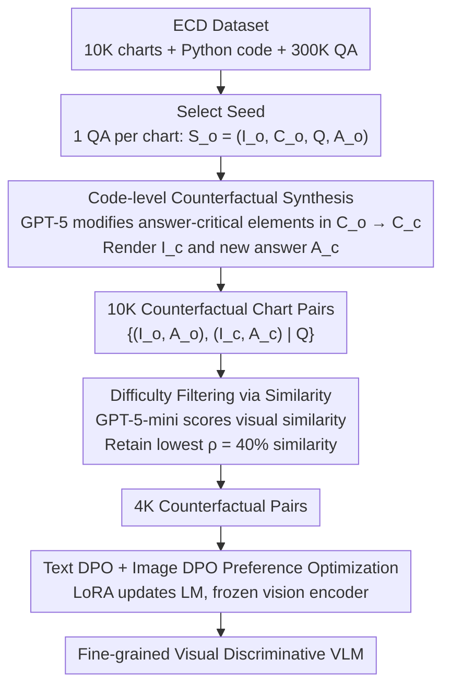

# Learning More from Less: Exploiting Counterfactuals for Data-Efficient Chart Understanding

**Conference**: ACL 2026  
**arXiv**: [2605.10855](https://arxiv.org/abs/2605.10855)  
**Code**: https://github.com/jianzhubao/ChartCF  
**Area**: Multimodal / Chart Understanding / Counterfactual Learning / VLM Preference Optimization  
**Keywords**: chart QA, counterfactual data, DPO, multimodal preference, data-efficient training

## TL;DR
Targeting the unique attribute of charts as "programmatically generated visual artifacts," this paper proposes ChartCF. By using GPT-5 to make minimal modifications to plotting code, it generates "counterfactual chart pairs" that are visually similar but have different answers. Through joint preference optimization using Text DPO + Image DPO, the VLM learns fine-grained visual discrimination. Using only 4K preference pairs, it matches or exceeds the performance of ECD trained on 300K SFT data across multiple chart QA benchmarks.

## Background & Motivation

**Background**: Chart understanding (chart QA / chart-to-code / chart description) is a core capability of VLMs. The mainstream improvement method involves large-scale data synthesis using Matplotlib + advanced LLMs followed by SFT (e.g., ECD 300K, ChartGemma 123K, Chart-R1 228K SFT + 30K RL). Open-source chart-specific VLMs still lag significantly behind GPT-4o / Claude-3.5 on benchmarks like ChartQA / CharXiv / ChartBench, especially in fine-grained visual discrimination.

**Limitations of Prior Work**: (1) Existing research focuses on stacking SFT data while ignoring the specific characteristics of charts; (2) standard SFT treats each (image, question, answer) as an independent sample, **offering no explicit supervision for the VLM to learn the discriminative ability of "subtle visual difference → change in answer"**; (3) when a bar height on a chart is slightly adjusted, the answer should change, but VLMs often ignore this and produce hallucinations.

**Key Challenge**: Charts are **code-controlled visual products**—a minor adjustment in a data value can **fundamentally change the correct answer** while leaving the visual appearance nearly identical. This "counterfactual sensitivity" requires contrastive supervision, which SFT cannot provide. Stacking more independent samples fails to capture this "differentiated" signal.

**Goal**: (1) Construct counterfactual chart pairs that are visually similar but have different answers as contrastive signals; (2) filter "overly difficult" samples to prevent DPO from collapsing; (3) conduct preference optimization on both text and vision sides to **anchor the VLM's answers to precise visual evidence**.

**Key Insight**: The dual representation of charts (image + code) provides a tool for "counterfactual creation." By allowing an LLM to modify only answer-related elements at the code level (a single numerical value, a label, a subplot title), one can change the correct answer while maintaining extremely high visual similarity. This is a "cheap, precise, and controllable" counterfactual generation path unique to the chart domain.

**Core Idea**: Use GPT-5 to modify Matplotlib code to create counterfactual chart pairs $(I_o, I_c)$ paired with $(A_o, A_c)$; filter "overly difficult" samples where visual differences are too small using chart similarity; use dual-sided preference optimization (Text DPO + Image DPO) to train the VLM to "look clearly at which image corresponds to which answer."

## Method

### Overall Architecture

ChartCF is a lightweight three-stage post-training framework that does not change architecture or rely on RL:

1.  **Counterfactual Data Synthesis**: Starting from the ECD dataset (containing 10K charts + Python plotting code + 300K QA), one QA is selected as a seed $S_o = (I_o, C_o, Q, A_o)$ for each chart. GPT-5 is used at the code level to locate "answer-critical elements" and apply minimal changes to obtain $C_c$. This yields a rendered $I_c$ and corresponding correct answer $A_c$, forming a counterfactual pair $\mathcal{D}_{\text{pair}} = \{(I_o, A_o), (I_c, A_c) \mid Q\}$.
2.  **Similarity-based Data Selection**: GPT-5-mini is used to assign a "visual similarity" score to each pair $(I_o, I_c)$. **The $\rho\%$ samples with the lowest similarity** (i.e., pairs with relatively more distinct visual differences) are retained to filter "overly difficult" samples. 4K pairs are retained from the initial 10K.
3.  **Multimodal Preference Optimization**: Joint optimization of $\mathcal{L}_{\text{text-dpo}} + \mathcal{L}_{\text{img-dpo}}$ is performed on the 4K counterfactual pairs. LoRA is used to update only the LM component (frozen vision encoder) with lr=1e-4, rank=64, for 2 epochs on 8×A100.

### Key Designs

**1. Code-level Counterfactual Synthesis: Low-cost generation of chart pairs with nearly identical visuals but different answers using "code-controllable artifacts."**

Standard SFT feeds each (image, question, answer) as an independent sample, never forcing the model to answer "why these nearly identical images have different answers." Consequently, when a bar height is slightly adjusted, the model often ignores it and provides the old answer. ChartCF leverages the uniqueness of charts—they are rendered from Matplotlib code—to push counterfactual generation to the code level. GPT-5 first isolates the elements in the original code $C_o$ that the answer $A_o$ directly depends on (e.g., a specific bar `height`, a subplot `title`, or a category label). **Only this one part is modified** while keeping other data points, colors, and random seeds strictly unchanged to produce $C_c$. Executing $C_c$ renders $I_c$ and the new answer $A_c$, forming the counterfactual pair $\mathcal{D}_{\text{pair}} = \{(I_o, A_o), (I_c, A_c) \mid Q\}$. A multi-stage pipeline then filters low-quality pairs. 

Specifically, in a "GDP by Country" bar chart where the original question is "Which country is the highest?" and the answer is "Germany," GPT-5 only changes the height of France's bar from 2.1 to 3.8. The rendered new image looks almost identical to the naked eye, but the correct answer has changed to "France"—providing a clean hard negative. Doing this at the code level allows for the perfect decoupling of "answer-related signals" from "irrelevant changes," making the supervision far purer than natural image counterfactuals (e.g., via Diffusion), which often introduce noise.

**2. Visual Similarity-based "Overly Difficult Sample" Filtering: Removing pairs with nearly imperceptible visual differences to prevent DPO from degrading.**

Counterfactual pairs are not "the harder, the better." When the visual difference between $I_o$ and $I_c$ is too small to distinguish, the boundary between chosen and rejected becomes blurred, leading to unstable DPO gradients. ChartCF uses GPT-5-mini to score the visual similarity of each pair $(I_o, I_c)$. Higher similarity implies smaller visual differences and higher learning difficulty. Samples are sorted by similarity, and only the top $\rho\%$ (default $\rho=40\%$) are kept. Ablations show that $\rho=40\%$ is optimal for CharXiv average scores, while $\rho=100\%$ (no filtering) leads to performance drops. This aligns with findings from Gou & Nguyen (2025) regarding DPO's sensitivity to sample difficulty: learning should happen near the model's "Zone of Proximal Development."

**3. Text DPO + Image DPO Dual-sided Preference Optimization: Learning "which answer is correct for a given image" and "which image is correct for a given answer" simultaneously.**

To anchor answers to visual evidence, **Text DPO** keeps the original image $I_o$ and question $Q$ fixed, forcing the model to prefer $A_o$ and reject $A_c$:

$$\mathcal{L}_{\text{text-dpo}} = -\log\sigma\Big(\beta\log\frac{\pi_\theta(A_o|I_o,Q)}{\pi_{\text{ref}}(A_o|I_o,Q)} - \beta\log\frac{\pi_\theta(A_c|I_o,Q)}{\pi_{\text{ref}}(A_c|I_o,Q)}\Big)$$

Here $A_c$ is a natural hard negative. Conversely, **Image DPO** keeps the question $Q$ and answer $A_o$ fixed, forcing the model to prefer $I_o$ over $I_c$:

$$\mathcal{L}_{\text{img-dpo}} = -\log\sigma\Big(\beta\log\frac{\pi_\theta(A_o|I_o,Q)}{\pi_{\text{ref}}(A_o|I_o,Q)} - \beta\log\frac{\pi_\theta(A_o|I_c,Q)}{\pi_{\text{ref}}(A_o|I_c,Q)}\Big)$$

The total loss is $\mathcal{L}_{\text{total}} = \mathcal{L}_{\text{text-dpo}} + \mathcal{L}_{\text{img-dpo}}$. This dual constraint prevents the model from ignoring visual details (text side) or ignoring the image entirely (image side), significantly reducing hallucinations.

### Loss & Training

The total objective is $\mathcal{L}_{\text{total}}$ as defined above. $\beta$ is the DPO temperature. LoRA (rank=64, alpha=64) is applied only to the LM, while the vision encoder and projection are frozen. Training on 8×A100 80GB with batch 64 and lr 1e-4 takes approximately 40 minutes for 2 epochs—a **two-order-of-magnitude reduction** in cost compared to Chart-R1 (24×H800).

## Key Experimental Results

### Main Results

Comparison of ChartCF vs. SFT baselines across 5 benchmarks (CharXiv / ChartQA real-world + ChartBench / ChartX / ECDBench synthetic):

**Real-world charts (subset)**:

| Method | Model | Training Data | CharXiv Avg | ChartQA |
| :--- | :--- | :--- | :--- | :--- |
| GPT-4o | – | – | 76.98 | 85.70 |
| Claude-3.5-Sonnet | – | – | 79.48 | 90.80 |
| TinyChart | 3B | 1.36M SFT | – | 83.60 |
| Chart-R1 | 7B | 228K SFT + 30K RL | 58.84 | **91.04** |
| Qwen2.5-VL + ECD | 7B | 300K SFT | 67.40 | 85.32 |
| **Qwen2.5-VL + ChartCF** | 7B | **4K DPO** | **68.94** | 87.00 |
| InternVL3.5 + ECD | 8B | 300K SFT | 69.68 | 86.52 |
| **InternVL3.5 + ChartCF** | 8B | **4K DPO** | **72.84** | 87.16 |
| Qwen3-VL + ECD | 8B | 300K SFT | 73.98 | 85.12 |
| **Qwen3-VL + ChartCF** | 8B | **4K DPO** | **75.36** | 85.24 |

Using only 4K counterfactual pairs (1.3% of ECD data), ChartCF exceeds the 300K SFT ECD across all three bases, with CharXiv gains of +1.4 to +3.2 points.

### Ablation Study

**SFT + DPO Enhancement vs. SFT Only**:

| Method | CharXiv Des | CharXiv Rea | CharXiv Avg | ChartQA |
| :--- | :--- | :--- | :--- | :--- |
| Qwen2.5-VL + ChartCF only (4K DPO) | 75.08 | 44.40 | 68.94 | 87.00 |
| Qwen2.5-VL + ECD (300K SFT) | 74.20 | 40.20 | 67.40 | 85.32 |
| Qwen2.5-VL + ECD + ChartCF (300K SFT + 4K DPO) | **81.20** | **46.10** | **74.18** | 85.48 |

Applying ChartCF on top of ECD SFT yields an additional 6.78-point gain (CharXiv Avg), proving that counterfactual preference optimization is **orthogonal and complementary** to traditional SFT.

### Key Findings
-   **Small-scale counterfactual DPO ≈ Large-scale SFT**: 4K pairs outperformed 300K SFT on CharXiv, proving the bottleneck is the visual discriminative signal, not the data volume.
-   **Filtering "overly difficult" samples is vital**: $\rho=40\%$ outperformed $\rho=100\%$, confirming that DPO collapses on samples with imperceptible differences.
-   **Text DPO + Image DPO provide dual-sided anchoring**: Removing either side causes a performance drop; the image side prevents the model from ignoring the visual input.
-   **Complementary to SFT**: 300K SFT + 4K DPO is significantly better than 300K SFT alone, suggesting SFT provides knowledge while DPO provides discrimination.
-   **Robustness**: Improvements are consistent across InternVL3.5, Qwen2.5-VL, and Qwen3-VL.
-   **Training cost slashed**: 40 minutes on 8×A100 vs. dozens of hours for RL-based methods.

## Highlights & Insights
-   **"Chart = programmatic visual artifact"**: The authors leverage this by using code as an "interface for counterfactual operations," creating a **domain-specific elegant technical lever**. This "controlled generation for contrastive data" is transferable to table understanding (editing CSV cells) or code understanding.
-   **"Difficulty Filtering + DPO" aligns with "Zone of Proximal Development"**: The convergence of these findings across different alignment tasks suggests it is a universal principle for post-training.
-   **Dual-sided preference optimization is a strong template for multimodal alignment**: Forcing the model to tie the answer to the image and vice versa is an effective anti-hallucination signal.
-   **Challenge to the "Scaling SFT" trend**: The "4K DPO > 300K SFT" result suggests future chart-VLM research should pivot from massive dataset creation to high-quality contrastive pair synthesis.

## Limitations & Future Work
-   **Dependency on GPT-5**: Generating code-level counterfactuals requires an advanced LLM, and the synthesis cost is non-trivial.
-   **Domain specificity**: The method relies on the "code-controlled" nature of charts, making it difficult to apply to natural images (medical, street scenes).
-   **Similarity scoring bias**: Relying on GPT-5-mini for similarity may introduce model-specific biases.
-   **Task coverage**: Only focused on Chart QA; yet to be tested on chart-to-code or captioning.
-   **No RL baseline**: Future work could explore if reward-shaped RL further unlocks the potential of counterfactual data compared to DPO.

## Related Work & Insights
-   **vs ECD / ChartGemma / Chart-R1**: While those focus on large-scale SFT/RL, ChartCF focuses on "precision synthesis + DPO." The two approaches are **stackable**.
-   **vs mDPO / S-VCO**: ChartCF's primary contribution is the **data**. The authors show their data works across different preference objectives.
-   **vs Natural Image Counterfactuals (CounterCurate)**: Unlike diffusion-based editing which can be inconsistent, ChartCF's code-level editing achieves "pixel-perfect" control.
-   **The Paradigm Shift**: Alignment training is shifting from "the harder the better" to "precisely tuned difficulty."

## Rating
-   Novelty: ⭐⭐⭐⭐⭐ Leveraging code-level chart properties for a counterfactual training paradigm is highly original.
-   Experimental Thoroughness: ⭐⭐⭐⭐⭐ Comprehensive benchmarks, multiple base models, and detailed ablations.
-   Writing Quality: ⭐⭐⭐⭐ Clear narrative flow from chart characteristics to method.
-   Value: ⭐⭐⭐⭐⭐ Challenging the data-stacking status quo with a 100x reduction in training cost is highly impactful.

<!-- RELATED:START -->

## Related Papers

- [\[CVPR 2026\] SketchVL: Policy Optimization via Fine-Grained Credit Assignment for Chart Understanding and More](../../CVPR2026/multimodal_vlm/sketchvl_policy_optimization_via_fine-grained_credit_assignment_for_chart_unders.md)
- [\[ICCV 2025\] Effective Training Data Synthesis for Improving MLLM Chart Understanding](../../ICCV2025/multimodal_vlm/effective_training_data_synthesis_for_improving_mllm_chart_understanding.md)
- [\[ICCV 2025\] Is Less More? Exploring Token Condensation as Training-free Test-time Adaptation](../../ICCV2025/multimodal_vlm/is_less_more_exploring_token_condensation_as_training-free_test-time_adaptation.md)
- [\[ACL 2026\] CharTide: Data-Centric Chart-to-Code Generation via Tri-Perspective Tuning and Inquiry-Driven Evolution](chartide_data-centric_chart-to-code_generation_via_tri-perspective_tuning_and_in.md)
- [\[ICLR 2026\] ChartGalaxy: A Dataset for Infographic Chart Understanding and Generation](../../ICLR2026/multimodal_vlm/chartgalaxy_a_dataset_for_infographic_chart_understanding_and_generation.md)

<!-- RELATED:END -->
