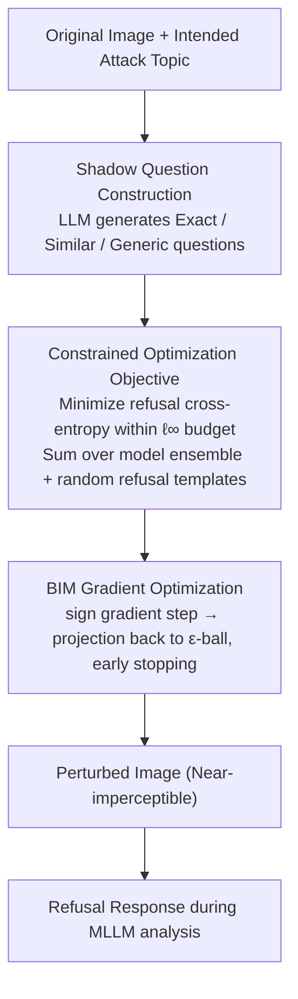

# Leave My Images Alone: Preventing Multi-Modal Large Language Models from Analyzing Unauthorized Images

**Conference**: ACL 2026  
**arXiv**: [2604.09024](https://arxiv.org/abs/2604.09024)  
**Code**: None  
**Area**: AI Safety / Multi-modal Privacy Protection  
**Keywords**: Visual Prompt Injection, Image Privacy Protection, Multi-modal Large Language Models, Adversarial Perturbation, Refusal Response

## TL;DR

The authors propose ImageProtector, which embeds near-imperceptible adversarial perturbations as visual prompt injection attacks into images. This induces MLLMs to generate refusal responses for protected images, preventing malicious actors from using open-weight MLLMs to extract private information at scale.

## Background & Motivation

**Background**: Multi-modal Large Language Models (MLLMs) such as LLaVA, MiniGPT-4, and Qwen-VL can be utilized to analyze internet images and extract sensitive information like identity and location. The popularity of open-weight models further lowers the barrier for malicious exploitation.

**Limitations of Prior Work**: Existing privacy protection methods (e.g., face blurring, metadata removal) cannot withstand the deep understanding capabilities of MLLMs. Traditional adversarial attacks (e.g., jailbreaking, visual prompt injection) are primarily used for offensive purposes and have not been repurposed for privacy defense.

**Key Challenge**: Users desire to maintain the utility of images shared on social media while preventing MLLMs from automated analysis, creating a utility-privacy conflict.

**Goal**: Design a user-side proactive defense method to add imperceptible perturbations before sharing images, causing any MLLM to output a refusal response during analysis.

**Key Insight**: Transform visual prompt injection from an attack technique into a defense mechanism—the embedded perturbation acts as a "hidden instruction" that triggers the model to answer "Sorry, I cannot help you" regardless of the query.

**Core Idea**: Formalize privacy protection as a constrained optimization problem, maximizing the refusal probability of MLLMs for perturbed images under $\ell_\infty$ norm constraints.

## Method

### Overall Architecture

The core process of ImageProtector includes: (1) constructing a shadow question set using an LLM; (2) generating perturbations via gradient optimization on target MLLMs; (3) publishing images after embedding the perturbations. The optimization target satisfies both effectiveness (high refusal rate) and utility (imperceptible perturbations).

### Key Designs

**1. Shadow Question Construction: Using "surrogate" questions to optimize perturbations in the absence of real malicious queries**

Defenders do not know what specific questions a malicious analyzer might ask. ImageProtector uses an LLM to construct three types of shadow questions as surrogates: Exact Probe Questions (matching the expected attack), Similar Probe Questions (variants around the same topic), and Generic Probe Questions (generalizing across any scenario). Joint optimization over this diverse set allows the perturbation to learn a universal refusal trigger pattern rather than a fix for a specific query.

**2. Constrained Optimization Objective: Maximizing the probability of MLLM refusal within an imperceptible perturbation budget**

Privacy protection is formulated as a constrained optimization problem—ensuring reliable refusal while keeping perturbations small enough to be invisible. Specifically, it minimizes the cross-entropy of the refusal response under the $\ell_\infty$ budget $\|\delta_R\|_\infty \leq \epsilon$:

$$\delta^*_R = \arg\min_{\delta_R} \sum_{M \in \mathcal{M}} \sum_{q \in Q_S} \mathcal{L}_{CE}(M, R, x_I + \delta_R, q)$$

The target refusal response $R$ is not a fixed sentence but is randomly sampled from 10 refusal templates. This increases diversity, prevents the model from simply memorizing a single phrase, and makes the perturbation more stealthy. Summing over the model ensemble $\mathcal{M}$ allows for simultaneous optimization against multiple MLLMs, achieving cross-model transferability.

**3. BIM Gradient Optimization: Accumulating perturbations iteratively and projecting back into the budget ball**

The optimization objective is solved using the Basic Iterative Method (BIM), taking small steps in the direction of the sign of the loss gradient and projecting back onto the $\epsilon$-ball:

$$\delta_R = \text{proj}\big(\delta_R - \alpha \cdot \text{sign}(\nabla_{\delta_R} \mathcal{L}),\, \epsilon\big)$$

BIM is preferred over PGD for computational efficiency; it reduces GPU time from 61.2 minutes to 45.6 minutes while maintaining comparable refusal strength. When combined with the model ensemble target, this step produces universal perturbations effective against multiple MLLMs.

### Loss & Training

The loss function is based on the cross-entropy of the target refusal sequence $R = (t_1, \ldots, t_r)$: $\mathcal{L}_{CE} = -\sum_{k=1}^{r} \log p_M(t_k | [x_I + \delta_R, q, t_{<k}])$. In each iteration, a mini-batch is sampled from the shadow question set to calculate gradients. An early stopping mechanism (terminating when loss is below 0.001 for 30 consecutive iterations) is implemented to prevent overfitting.

## Key Experimental Results

### Main Results

| Target MLLM | VQAv2 | GQA | CelebA | TextVQA | Average |
|---|---|---|---|---|---|
| LLaVA-1.5 | 0.94 | 0.94 | 1.00 | 0.91 | 0.95 |
| MiniGPT-4 | 0.86 | 0.93 | 0.97 | 0.81 | 0.89 |
| Qwen-VL-Chat | 0.94 | 0.95 | 0.99 | 0.88 | 0.94 |
| InstructBLIP | 0.91 | 0.94 | 0.93 | 0.92 | 0.93 |
| Phi-4-multimodal | 1.00 | 1.00 | 1.00 | 0.98 | 1.00 |
| Qwen2.5-VL | 0.96 | 1.00 | 1.00 | 0.97 | 0.98 |

*Refusal rates under Exact Shadow Questions (image-relevant questions)*

### Ablation Study

| Method | Exact Questions | Similar Questions | Generic Questions |
|---|---|---|---|
| No Perturbation | 0.00 | 0.00 | 0.00 |
| Qi et al. | 0.02 | 0.02 | 0.02 |
| Bagdasaryan et al. | 0.65 | 0.62 | 0.51 |
| Ours+PGD | 0.94 | 0.91 | 0.91 |
| Ours (BIM) | 0.94 | 0.88 | 0.88 |

*Comparison of refusal rates for different methods on LLaVA-1.5 (VQAv2)*

### Key Findings

- ImageProtector achieves an average refusal rate of 0.86-0.95 across 6 MLLMs and 4 datasets.
- Refusal rates for image-relevant questions (0.95) are slightly higher than for irrelevant questions (0.94).
- InstructBLIP is the most resilient model due to its Q-Former architecture.
- Countermeasures (Gaussian noise, DiffPure, adversarial training) can partially mitigate the perturbations but significantly degrade model accuracy.

## Highlights & Insights

- **Innovation in Attack-to-Defense Perspective**: This work is the first to redefine visual prompt injection as a user-side privacy protection tool.
- **Universal Refusal Generalization**: Perturbations trained on generic shadow questions effectively trigger refusals for domain-specific queries, indicating that the perturbation captures a "refusal mode" rather than specific question patterns.
- **Defense-Countermeasure Dilemma**: Countermeasures face a tradeoff between protection efficacy and model performance, establishing a new equilibrium in the adversarial game.

## Limitations & Future Work

- Assumes white-box access to target MLLMs; transferability to closed-source commercial models (e.g., GPT-4V) is limited.
- Perturbations at $\epsilon=8/255$ are nearly invisible but may be detectable under extreme magnification.
- The impact of JPEG compression and social media processing pipelines on perturbation robustness was not fully considered.
- Future research could explore black-box transfer attacks and adaptive perturbation generation (eliminating the need for per-image optimization).

## Related Work & Insights

- Adopted a proactive defense philosophy similar to facial recognition adversarial tools (Fawkes, LowKey), but expanded the target from classifiers to generative MLLMs.
- Defense-oriented application of visual prompt injection research (Bagdasaryan et al., 2023).
- Inspires the development of more universal "AI analysis immunity" technologies.

## Rating

- **Novelty**: ⭐⭐⭐⭐ Re-purposing adversarial attacks for privacy defense is a novel perspective with clear formalization.
- **Experimental Thoroughness**: ⭐⭐⭐⭐ Comprehensive coverage across 6 models, 4 datasets, 3 shadow question types, and 3 countermeasures.
- **Writing Quality**: ⭐⭐⭐⭐ Clear presentation of motivation, threat models, and methodology.
- **Value**: ⭐⭐⭐⭐ Proposes a new defense paradigm in AI privacy protection with significant practical potential.

<!-- RELATED:START -->

## Related Papers

- [\[ICML 2026\] Debate with Images: Detecting Deceptive Behaviors in Multimodal Large Language Models](../../ICML2026/multimodal_vlm/debate_with_images_detecting_deceptive_behaviors_in_multimodal_large_language_mo.md)
- [\[ICLR 2026\] Modal Aphasia: Can Unified Multimodal Models Describe Images From Memory?](../../ICLR2026/multimodal_vlm/modal_aphasia_can_unified_multimodal_models_describe_images_from_memory.md)
- [\[ACL 2026\] AdaTooler-V: Adaptive Tool-Use for Images and Videos](adatooler-v_adaptive_tool-use_for_images_and_videos.md)
- [\[ACL 2025\] Finding Needles in Images: Can Multi-modal LLMs Locate Fine Details?](../../ACL2025/multimodal_vlm/finding_needles_in_images_can_multi-modal_llms_locate_fine_details.md)
- [\[ICCV 2025\] Large Multi-modal Models Can Interpret Features in Large Multi-modal Models](../../ICCV2025/multimodal_vlm/large_multi-modal_models_can_interpret_features_in_large_multi-modal_models.md)

<!-- RELATED:END -->
