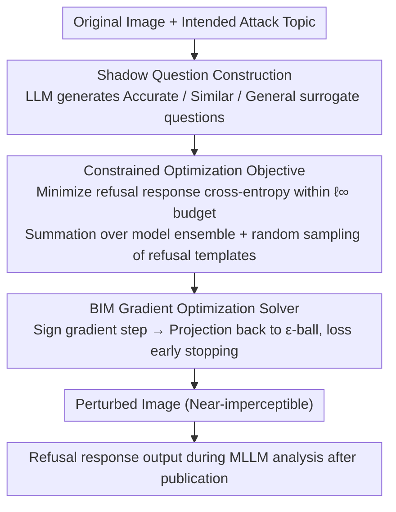

# Leave My Images Alone: Preventing Multi-Modal Large Language Models from Analyzing Unauthorized Images

**Conference**: ACL 2026  
**arXiv**: [2604.09024](https://arxiv.org/abs/2604.09024)  
**Code**: None  
**Area**: AI Security / Multi-modal Privacy Protection  
**Keywords**: Visual Prompt Injection, Image Privacy Protection, Multi-modal Large Language Models, Adversarial Perturbation, Refusal Response

## TL;DR

Proposes ImageProtector, which embeds near-imperceptible adversarial perturbations into images as visual prompt injection attacks. This forces MLLMs to generate refusal responses for protected images, thereby preventing malicious analysts from using open-weight MLLMs to extract private information at scale.

## Background & Motivation

**Background**: Multi-modal Large Language Models (MLLMs) such as LLaVA, MiniGPT-4, and Qwen-VL can be utilized to analyze internet images at scale, extracting sensitive information such as identity and location. The popularity of open-weight models further lowers the barrier to malicious exploitation.

**Limitations of Prior Work**: Existing privacy protection methods (e.g., facial blurring, metadata removal) cannot counter the deep understanding capabilities of MLLMs. Traditional adversarial attacks (e.g., jailbreaking, visual prompt injection) are primarily used for offensive purposes and have not been repurposed for privacy defense.

**Key Challenge**: Users wish to maintain image usability while sharing on social media, while simultaneously needing to prevent MLLM-based automated analysis and privacy extraction, leading to a utility-privacy conflict.

**Goal**: Design a user-side active defense method that adds imperceptible perturbations before image sharing, causing any MLLM to output a refusal response during analysis.

**Key Insight**: Transform visual prompt injection from an attack technique into a defense mechanism—the embedded perturbation acts as an "invisible instruction," forcing the model to answer "Sorry, I cannot help you" regardless of the query.

**Core Idea**: Formalize privacy protection as a constrained optimization problem, maximizing the MLLM's refusal probability for perturbed images under $\ell_\infty$ norm constraints.

## Method

### Overall Architecture

The core workflow of ImageProtector: (1) Construct a shadow question set using an LLM; (2) Generate perturbations via gradient optimization on target MLLMs; (3) Publish images after embedding perturbations. The optimization objective simultaneously satisfies effectiveness (high refusal rate) and utility (imperceptible perturbations).

### Key Designs

**1. Shadow Question Construction: Using a set of "surrogate" questions to substitute for unavailable real malicious queries**

Defenders do not know in advance what specific questions a malicious analyst might ask, making it impossible to directly optimize perturbations for real queries. ImageProtector uses an LLM to construct three types of shadow questions as surrogates: accurate probe questions (directly matching the expected attack topic), similar probe questions (LLM-generated variants around the same topic), and general probe questions (generic sentences covering arbitrary scenarios). By jointly optimizing across such a diverse set of shadow questions, the learned perturbation is no longer "tuned for a specific question" but becomes a universal refusal trigger pattern that generalizes to unseen malicious queries.

**2. Constrained Optimization Objective: Maximizing the probability of MLLM refusal within an imperceptible perturbation budget**

Privacy protection is formalized as a constrained optimization problem—ensuring the model reliably refuses while keeping the perturbation small enough to be invisible. Specifically, the cross-entropy of the refusal response is minimized under the $\ell_\infty$ budget $\|\delta_R\|_\infty \leq \epsilon$:

$$\delta^*_R = \arg\min_{\delta_R} \sum_{M \in \mathcal{M}} \sum_{q \in Q_S} \mathcal{L}_{CE}(M, R, x_I + \delta_R, q)$$

The target refusal response $R$ is not a fixed sentence but is randomly sampled from 10 refusal templates. This increases the diversity of refusal expressions, prevents the model from simply memorizing a single sentence structure, and makes the perturbation more covert. The outer summation over the model ensemble $\mathcal{M}$ allows a single perturbation to be optimized for multiple MLLMs simultaneously, achieving cross-model universal protection.

**3. BIM Gradient Optimization Solver: Iteratively accumulating perturbations and projecting back into the budget ball**

The optimization objective above is solved using the Basic Iterative Method (BIM), where each step moves a small increment along the sign of the negative loss gradient and then projects back into the $\epsilon$-ball:

$$\delta_R = \text{proj}\big(\delta_R - \alpha \cdot \text{sign}(\nabla_{\delta_R} \mathcal{L}),\, \epsilon\big)$$

BIM is preferred over PGD because it is more computationally efficient while maintaining comparable defense performance—reducing GPU time from 61.2 minutes (PGD) to 45.6 minutes for the same refusal strength. Combined with the ensemble optimization objective, this step yields a universal perturbation effective against multiple MLLMs.

### Loss & Training

The loss function is based on the cross-entropy of the target refusal sequence $R = (t_1, \ldots, t_r)$: $\mathcal{L}_{CE} = -\sum_{k=1}^{r} \log p_M(t_k | [x_I + \delta_R, q, t_{<k}])$. In each iteration, a mini-batch is sampled from the shadow question set to calculate gradients. An early stopping mechanism (terminating when loss is below 0.001 for 30 consecutive iterations) is implemented to prevent overfitting.

## Key Experimental Results

### Main Results

| Target MLLM | VQAv2 | GQA | CelebA | TextVQA | Average |
|---|---|---|---|---|---|
| LLaVA-1.5 | 0.94 | 0.94 | 1.00 | 0.91 | 0.95 |
| MiniGPT-4 | 0.86 | 0.93 | 0.97 | 0.81 | 0.89 |
| Qwen-VL-Chat | 0.94 | 0.95 | 0.99 | 0.88 | 0.94 |
| InstructBLIP | 0.91 | 0.94 | 0.93 | 0.92 | 0.93 |
| Phi-4-multimodal | 1.00 | 1.00 | 1.00 | 0.98 | 1.00 |
| Qwen2.5-VL | 0.96 | 1.00 | 1.00 | 0.97 | 0.98 |

*Refusal rate under accurate shadow questions (image-relevant questions)*

### Ablation Study

| Method | Accurate Questions | Similar Questions | General Questions |
|---|---|---|---|
| No Perturbation | 0.00 | 0.00 | 0.00 |
| Qi et al. | 0.02 | 0.02 | 0.02 |
| Bagdasaryan et al. | 0.65 | 0.62 | 0.51 |
| ImageProtector+PGD | 0.94 | 0.91 | 0.91 |
| ImageProtector (BIM) | 0.94 | 0.88 | 0.88 |

*Comparison of refusal rates for different methods on LLaVA-1.5 (VQAv2)*

### Key Findings

- ImageProtector achieves average refusal rates between 0.86 and 0.95 across 6 MLLMs and 4 datasets.
- Refusal rates for image-relevant questions (0.95) are slightly higher than for irrelevant questions (0.94).
- InstructBLIP is the most difficult model to compromise due to its Q-Former architecture.
- Three counter-measures (Gaussian noise, DiffPure, adversarial training) can partially mitigate perturbations but significantly degrade model accuracy.

## Highlights & Insights

- **Innovation in Attack-to-Defense Perspective**: Re-purposes visual prompt injection from an attack technique into a user-side privacy protection tool for the first time.
- **Universal Refusal Generalization**: Perturbations trained on general shadow questions effectively trigger refusals for domain-specific questions, indicating that the perturbation learns a "refusal pattern" rather than a specific question pattern.
- **Defense-Countermeasure Dilemma**: Counter-measures must trade off protection effectiveness and model performance, creating a new equilibrium in the adversarial game.

## Limitations & Future Work

- Assumes white-box access to target MLLMs; transferability to closed-source commercial models (e.g., GPT-4V) remains limited.
- While perturbations are nearly invisible at $\epsilon=8/255$, they may still be detectable under extreme magnification.
- Does not consider the impact of JPEG compression or social media image processing pipelines on the perturbations.
- Future work could explore black-box transfer attacks and adaptive perturbation generation (eliminating the need for per-image optimization).

## Related Work & Insights

- Shares an active defense philosophy with facial recognition countermeasures (Fawkes, LowKey) but expands the target from classifiers to generative MLLMs.
- Defense-oriented application of visual prompt injection (Bagdasaryan et al., 2023).
- Inspires the development of more universal "AI analysis immunity" technologies.

## Rating

- **Novelty**: ⭐⭐⭐⭐ Novel perspective of using adversarial attacks for privacy defense, clear problem formalization.
- **Experimental Thoroughness**: ⭐⭐⭐⭐ Comprehensive coverage with 6 models × 4 datasets × 3 shadow question types × 3 countermeasures.
- **Writing Quality**: ⭐⭐⭐⭐ Clear presentation of motivation, threat model, and methodological formalization.
- **Value**: ⭐⭐⭐⭐ Proposes a new defense paradigm in the field of AI privacy protection with practical application potential.

<!-- RELATED:START -->

## Related Papers

- [\[ACL 2026\] Structured and Abstractive Reasoning on Multi-modal Relational Knowledge Images](structured_and_abstractive_reasoning_on_multi-modal_relational_knowledge_images.md)
- [\[ACL 2026\] Decoding Scientific Experimental Images: The SPUR Benchmark for Perception, Understanding, and Reasoning](decoding_scientific_experimental_images_the_spur_benchmark_for_perception_unders.md)
- [\[ICML 2026\] Debate with Images: Detecting Deceptive Behaviors in Multimodal Large Language Models](../../ICML2026/multimodal_vlm/debate_with_images_detecting_deceptive_behaviors_in_multimodal_large_language_mo.md)
- [\[ICLR 2026\] Modal Aphasia: Can Unified Multimodal Models Describe Images From Memory?](../../ICLR2026/multimodal_vlm/modal_aphasia_can_unified_multimodal_models_describe_images_from_memory.md)
- [\[ACL 2026\] AdaTooler-V: Adaptive Tool-Use for Images and Videos](adatooler-v_adaptive_tool-use_for_images_and_videos.md)

<!-- RELATED:END -->
