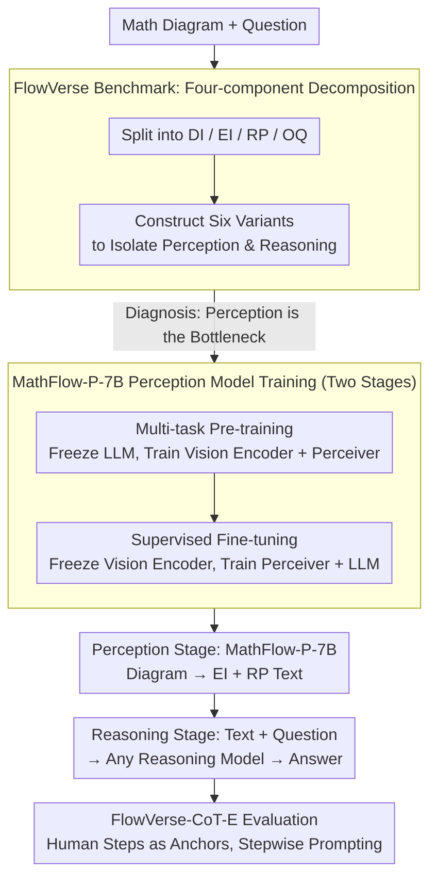

markdown

# MathFlow: Enhancing the Perceptual Flow of MLLMs for Visual Mathematical Problems

**Conference**: ACL 2026  
**arXiv**: [2503.16549](https://arxiv.org/abs/2503.16549)  
**Code**: [GitHub](https://github.com/MathFlow-zju/MathFlow)  
**Area**: Multimodal VLM  
**Keywords**: Visual Mathematical Reasoning, Multimodal Large Language Models, Perception-Reasoning Decoupling, Mathematical Diagram Understanding, Benchmarking

## TL;DR

The authors propose the FlowVerse benchmark (decomposing mathematical problem information into DI/EI/RP/OQ components across six variants) and the MathFlow modular pipeline (decoupling perception and reasoning into independent stages). By training a specialized perception model, MathFlow-P-7B, to extract key information from mathematical diagrams, the approach significantly enhances the visual mathematical problem-solving capabilities of various reasoning models.

## Background & Motivation

**Background**: Multimodal Large Language Models (MLLMs) demonstrate excellent performance in tasks like image captioning and visual question answering. However, they struggle with visual mathematical problems, particularly in accurately perceiving and interpreting key information such as geometric elements and numerical relationships in mathematical diagrams.

**Limitations of Prior Work**: Existing methods predominantly focus on improving the reasoning process (e.g., CoT strategies, tool-assisted reasoning, reinforcement learning), overlooking a critical prerequisite: the quality of information extraction during the perception stage directly limits the reasoning upper bound. Even powerful models like GPT-4V exhibit significant flaws when extracting key information from charts. Current benchmarks (e.g., MathVista, MathVerse) fail to meticulously distinguish the individual contributions of perception and reasoning.

**Key Challenge**: The coupling of perception and reasoning during training and evaluation prevents independent optimization. Percolation of errors from the perception stage to the reasoning stage occurs, and current frameworks cannot diagnose which stage constitutes the bottleneck.

**Goal**: (1) Construct a fine-grained benchmark to independently evaluate perception and reasoning capabilities; (2) Design a modular pipeline to decouple perception and reasoning; (3) Train a specialized perception model to improve the quality of key information extraction.

**Key Insight**: Inspired by human problem-solving, which involves extracting key information (perception) before performing mathematical inference (reasoning). The authors decompose problem information into four independent components and construct six variants to precisely locate model deficiencies.

**Core Idea**: Decompose the information flow of visual mathematical problems into Descriptive Information (DI), Essential Information (EI), Reasoning Properties (RP), and Original Question (OQ). Through controlled experiments, the authors prove perception is the bottleneck, then address it with a pipeline combining a specialized perception model and a general reasoning model.

## Method

### Overall Architecture

The study follows two main tracks. First, the **FlowVerse** benchmark decomposes visual math problem information into controllable components to diagnose that "perception (not reasoning) is the bottleneck." Based on this, **MathFlow** is designed as a two-stage modular pipeline decoupling perception and reasoning: (1) Perception Stage: A specialized MathFlow-P-7B extracts EI (essential information like angles and side lengths) and RP (reasoning properties like inferred geometric relationships) from diagrams, converting them into textual representations; (2) Reasoning Stage: The extracted textual information is concatenated with the original question and fed into any reasoning model (e.g., GPT-5, Claude) to generate a solution. Finally, **FlowVerse-CoT-E** uses human-annotated steps as anchors to evaluate model performance at various reasoning depths.

### Key Designs

**1. Four-component Information Decomposition in FlowVerse: Isolating Perception and Reasoning to Pinpoint Bottlenecks**

Existing benchmarks (MathVista, MathVerse) evaluate perception and reasoning together, making it impossible to tell if a wrong answer results from visual misinterpretation or logical failure. FlowVerse splits each problem into four components: DI (Descriptive Information, e.g., "Triangle ABC"), EI (Essential Information, e.g., "$\angle A=45^\circ$"), RP (Reasoning Properties, intermediate relationships inferred from the diagram), and OQ (Original Question). By adding/removng or converting these components, six variants are constructed: Text Centric (Full Text), Text Limited (No DI), Text Plus (No Image), Vision Dense (No RP), Vision Centric (EI as Image), and Vision Primary (EI+RP as Image). Comparing Vision Dense and Vision Primary isolates the model's ability to infer intermediate properties, while comparing Text Centric and Vision Centric isolates the pure perception gap between reading text and viewing images.

**2. MathFlow-P-7B Perception Model Training: Two-stage Modular Freezing to Separate "Seeing" and "Inferring"**

Given perception is the bottleneck, a dedicated model is trained to convert diagrams into reliable text. MathFlow-P-7B, based on Qwen2-VL-7B, undergoes two-stage training. The Multi-task Pre-training stage learns two tasks: EI description (650k image-text pairs teaching the model to "see" basic elements) and visual reasoning (130k samples teaching the model to "infer" hidden geometric relationships via sequence prediction), at a 3:1 ratio. In this stage, the LLM is frozen while the vision encoder and perceiver are trained. The Supervised Fine-tuning stage reverses this—freezing the vision encoder and training the perceiver and LLM using the meticulously annotated MathFlow-SFT dataset. This ensures that the distinct abilities of perceiving basic elements and inferring relationships are optimized without interference.

**3. FlowVerse-CoT-E Evaluation Strategy: Human-annotated Steps as Anchors for Reasoning Depth Analysis**

Current evaluation methods use GPT to decompose model responses into steps before scoring, introducing a second point of potential error. FlowVerse-CoT-E utilizes expert-written authoritative solution steps as anchors. These steps are fed into the prompt incrementally to observe model performance at different reasoning depths, followed by weighted aggregation:

$$\text{Score}_{\text{final}} = 0.8 \cdot \frac{1}{N}\sum_{i=1}^N \text{Score}_i + 0.2 \cdot \text{Score}_0$$

Here, $\text{Score}_0$ is the score without any step prompts, and $\text{Score}_i$ is the score after incremental "information feeding." Since anchors are human-annotated, the scoring process is more stable and less noisy.

### Loss & Training

The multi-task pre-training stage uses a learning rate of 1e-5, and the supervised fine-tuning stage uses 5e-6 with DeepSpeed Zero2. Rotating the frozen modules across stages ensures the perception components and language reasoning components are optimized independently.

## Key Experimental Results

### Main Results

On the FlowVerse benchmark (CoT-E metric):

| Model | All | Text Centric | Vision Dense | Vision Primary |
|------|-----|-------------|-------------|---------------|
| Qwen2.5-VL-7B | 53.8 | 60.1 | 45.0 | 48.1 |
| MathFlow*_Qwen2.5-VL-7B | **57.0** | **62.0** | **49.0** | **52.0** |
| GPT-5 | 65.8 | 74.3 | 53.8 | 60.3 |
| MathFlow*_GPT-5 | **66.5** | **74.6** | **58.2** | **69.4** |

Structured description quality evaluation (F1):

| Model | EI (F1) | RP (F1) |
|------|---------|---------|
| GPT-4o | 87.7% | 70.1% |
| Claude-sonnet | 89.1% | 72.8% |
| MathFlow-P-7B | **97.2%** | **85.6%** |

### Ablation Study

| Configuration | FlowVerse† Accuracy | Description |
|------|-------------------|------|
| Direct Reasoning | Baseline | No perception enhancement |
| + MathFlow-P-7B (EI only) | +2-4% | Effective key info extraction |
| + MathFlow-P-7B (EI+RP) | +4-8% | RP inference grants extra gain |
| Various Reasoning Models | Consistent | Pipeline is universally effective |

### Key Findings

- Removing images actually improves model accuracy (Qwen2-VL-72B +4.3%), suggesting images often act as a source of interference rather than information—confirming perception is the true bottleneck.
- The Vision Primary version (EI+RP in image) drops by an average of 10+ percentage points compared to the Text Centric version, proving models are significantly "better at reading text than seeing charts."
- MathFlow-P-7B achieves an EI F1 of 97.2%, far exceeding GPT-4o (87.7%), demonstrating the value of specialized perception training.
- The pipeline benefits both open-source and closed-source models, indicating the generalizability of perception enhancement.

## Highlights & Insights

- **Evaluation design via Information Decomposition + Controlled Variables**: The combination of DI/EI/RP/OQ allows for precise quantification of the contribution of each piece of information and modality. This methodology is transferable to evaluation designs for other multimodal tasks.
- **Counter-intuitive yet data-backed "Perception Bottleneck"**: The consistent observation across various models that removing images improves accuracy provides a strong experimental foundation for the "perception first, reasoning second" separation strategy.
- **7B Perception Model outperforming GPT-4o**: This suggests that specialized training on specific sub-tasks can significantly outperform general large models, a strategy applicable to scientific chart understanding and medical image analysis.

## Limitations & Future Work

- The high cost of manual RP annotation limits data scale and domain expansion.
- The evaluation set primarily consists of Chinese and English exams, with limited coverage of post-undergraduate or applied mathematics.
- The two-stage pipeline introduces additional inference overhead (requiring two model calls), which needs efficiency considerations for real-time scenarios.
- Determining whether larger base models for perception would provide further gains remains an open question.

## Related Work & Insights

- **vs MathVerse**: MathVerse focuses on removing textual redundancy to force the model to look at the image but lacks fine-grained perception-reasoning decoupling. FlowVerse achieves more detailed diagnosis through its four-component, six-variant design.
- **vs End-to-End Visual Math Models (e.g., VLM-R1)**: End-to-end methods are simpler but suffer from coupled perception and reasoning, making independent optimization difficult. MathFlow's modular design allows for independent iterative upgrades.
- **vs Tool-assisted Reasoning**: Tool-assisted methods (e.g., AlphaGeometry) often assume the input has been correctly parsed; this paper highlights that the parsing itself is the bottleneck.

## Rating

- Novelty: ⭐⭐⭐⭐ Clear decomposition and modular logic, though the concept of perception-reasoning separation is not entirely new.
- Experimental Thoroughness: ⭐⭐⭐⭐⭐ Well-designed benchmark, extensive model coverage, and thorough ablation studies.
- Writing Quality: ⭐⭐⭐⭐ Structurally sound, though the high number of tables can increase cognitive load.
- Value: ⭐⭐⭐⭐⭐ Both the FlowVerse benchmark and MathFlow pipeline provide practical advancement for the field of visual mathematical reasoning.

<!-- RELATED:START -->

<!-- RELATED:END -->

## Related Papers

- [\[CVPR 2026\] ViRC: Enhancing Visual Interleaved Mathematical CoT with Reason Chunking](../../CVPR2026/multimodal_vlm/virc_enhancing_visual_interleaved_mathematical_cot_with_reason_chunking.md)
- [\[ACL 2026\] Do MLLMs Understand Pointing? Benchmarking and Enhancing Referential Reasoning in Egocentric Vision](do_mllms_understand_pointing_benchmarking_and_enhancing_referential_reasoning_in.md)
- [\[ACL 2026\] A Survey of Multimodal Mathematical Reasoning: From Perception, Alignment to Reasoning](a_survey_of_multimodal_mathematical_reasoning_from_perception_alignment_to_reaso.md)
- [\[ACL 2026\] ReGATE: Learning Faster and Better with Fewer Tokens in MLLMs](regate_learning_faster_and_better_with_fewer_tokens_in_mllms.md)
- [\[ACL 2026\] Enhancing Multimodal Large Language Models for Ancient Chinese Character Evolution Analysis via Glyph-Driven Fine-Tuning](enhancing_multimodal_large_language_models_for_ancient_chinese_character_evoluti.md)

<!-- RELATED:END -->
