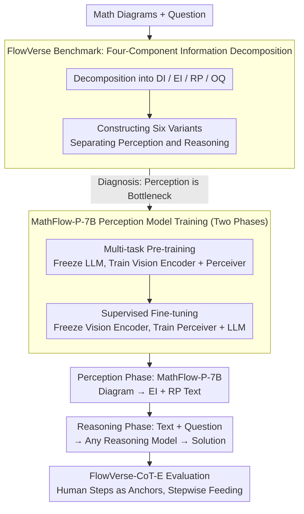

# MathFlow: Enhancing the Perceptual Flow of MLLMs for Visual Mathematical Problems

**Conference**: ACL 2026  
**arXiv**: [2503.16549](https://arxiv.org/abs/2503.16549)  
**Code**: [GitHub](https://github.com/MathFlow-zju/MathFlow)  
**Area**: Multimodal VLM  
**Keywords**: Visual Mathematical Reasoning, Multimodal Large Language Models, Decoupling Perception and Reasoning, Mathematical Diagram Understanding, Benchmarking

## TL;DR

This work introduces the FlowVerse benchmark (decomposing mathematical problem information into four components: DI/EI/RP/OQ to construct six variants) and the MathFlow modular pipeline (decoupling perception and reasoning into independent stages). By training a specialized perception model, MathFlow-P-7B, to extract key information from mathematical diagrams, the approach significantly enhances the visual mathematical problem-solving capabilities of various reasoning models.

## Background & Motivation

**Background**: Multimodal Large Language Models (MLLMs) excel in tasks like image captioning and visual question answering but remain significantly deficient in solving visual mathematical problems, particularly in accurately perceiving and interpreting geometric elements and numerical relationships within mathematical diagrams.

**Limitations of Prior Work**: Existing methods predominantly focus on improving the reasoning process (e.g., CoT strategies, tool-assisted reasoning, reinforcement learning), neglecting a critical prerequisite—the quality of information extraction in the perception stage directly limits the upper bound of reasoning. Even powerful models like GPT-4V exhibit significant flaws in extracting key information from diagrams. Furthermore, current benchmarks (e.g., MathVista, MathVerse) fail to meticulously distinguish between the respective contributions of perceptual and reasoning abilities.

**Key Challenge**: The perception and reasoning capabilities of models are coupled during training and evaluation, making independent optimization impossible. Errors in the perception phase propagate to the reasoning phase, and existing frameworks cannot diagnose which stage constitutes the bottleneck.

**Goal**: (1) Build a fine-grained benchmark to independently evaluate perception and reasoning; (2) Design a modular pipeline to decouple perception and reasoning; (3) Train a specialized perception model to improve the quality of key information extraction.

**Key Insight**: Inspired by human problem-solving, where one first extracts key information from a diagram (perception) before performing mathematical inference (reasoning). The authors decompose problem information into four independent components and construct six variants to precisely locate model deficiencies.

**Core Idea**: The information flow of visual mathematical problems is decomposed into Descriptive Information (DI), Essential Information (EI), Reasoning Properties (RP), and Original Question (OQ). Controlled experiments demonstrate that perception is the bottleneck, which is addressed using a pipeline consisting of a specialized perception model and a general reasoning model.

## Method

### Overall Architecture

The paper follows two main threads. First, the **FlowVerse** benchmark decomposes visual mathematical problem information into controllable components to diagnose that perception (rather than reasoning) is the bottleneck. Consequently, **MathFlow** is designed as a two-stage modular pipeline: (1) Perception Stage: A specialized MathFlow-P-7B model extracts EI (e.g., angle values, side length relationships) and RP (e.g., inferred geometric relationships) from diagrams and converts them into text; (2) Reasoning Stage: The extracted text is concatenated with the original question and fed into any reasoning model (e.g., GPT-5, Claude). Finally, **FlowVerse-CoT-E** utilizes human-annotated steps as anchors to evaluate model performance at various reasoning depths.

### Key Designs

**1. Information Decomposition in FlowVerse: Separating "Perception" and "Reasoning" into Controllable Variables**

Existing benchmarks (MathVista, MathVerse) evaluate perception and reasoning together, making it impossible to determine if a wrong answer stems from visual misinterpretation or logical failure. FlowVerse decomposes each problem into four components: DI (Descriptive Information, e.g., "Triangle ABC"), EI (Essential Information, e.g., "$\angle A=45^\circ$"), RP (Reasoning Properties, intermediate relationships inferred from the diagram), and OQ (The Question). By adding/removing or converting these components from visual to textual formats, six variants are constructed: Text Centric, Text Limited, Text Plus, Vision Dense, Vision Centric, and Vision Primary.

The key is treating RP as a control variable—comparing accuracy between Vision Dense (RP provided) and Vision Primary (RP must be inferred) isolates the ability to derive intermediate properties. Comparing Text Centric and Vision Centric isolates the "text reading vs. image viewing" gap.

**2. MathFlow-P-7B Perception Model Training: Decoupling "Vision Recognition" and "Relationship Inference"**

MathFlow-P-7B, based on Qwen2-VL-7B, is trained in two stages. The multi-task pre-training stage focuses on EI description (650k image-text pairs) and visual reasoning (130k samples, treating steps as sequence predictions); here, the LLM is frozen. The supervised fine-tuning (SFT) stage freezes the vision encoder and trains the perceiver and LLM using the curated MathFlow-SFT dataset. This modular freezing ensures that basic element recognition and relationship inference are optimized without interference.

**3. FlowVerse-CoT-E Evaluation Strategy: Using Human Steps as Anchors**

Unlike MathVerse-CoT-E, which uses GPT to decompose model answers (introducing noise), FlowVerse-CoT-E uses expert-annotated steps. These steps are fed into the prompt incrementally to observe performance at different reasoning depths, followed by weighted aggregation:

$$\text{Score}_{\text{final}} = 0.8 \cdot \frac{1}{N}\sum_{i=1}^N \text{Score}_i + 0.2 \cdot \text{Score}_0$$

where $\text{Score}_0$ is the score without step hints, and $\text{Score}_i$ is the score with cumulative hints.

### Loss & Training

The pre-training phase uses a learning rate of 1e-5, and SFT uses 5e-6, utilizing DeepSpeed Zero2. Independent modules are frozen in each phase to ensure the separation of perception and reasoning components.

## Key Experimental Results

### Main Results

On the FlowVerse benchmark (CoT-E metric):

| Model | All | Text Centric | Vision Dense | Vision Primary |
|-------|-----|--------------|--------------|----------------|
| Qwen2.5-VL-7B | 53.8 | 60.1 | 45.0 | 48.1 |
| MathFlow*_Qwen2.5-VL-7B | **57.0** | **62.0** | **49.0** | **52.0** |
| GPT-5 (Simulated/Proxy) | 65.8 | 74.3 | 53.8 | 60.3 |
| MathFlow*_GPT-5 | **66.5** | **74.6** | **58.2** | **69.4** |

Structured Description Quality Assessment (F1 Score):

| Model | EI (F1) | RP (F1) |
|-------|---------|---------|
| GPT-4o | 87.7% | 70.1% |
| Claude-sonnet | 89.1% | 72.8% |
| MathFlow-P-7B | **97.2%** | **85.6%** |

### Ablation Study

| Configuration | FlowVerse† Accuracy | Description |
|---------------|-------------------|-------------|
| Reasoning Model Direct | Baseline | No perception enhancement |
| + MathFlow-P-7B (EI only) | +2-4% | Benefit from essential info extraction |
| + MathFlow-P-7B (EI+RP) | +4-8% | Extra gain from RP inference |

### Key Findings

- Accuracy often increases when images are removed (Qwen2-VL-72B +4.3%), suggesting images act as noise rather than information sources—confirming perception is the bottleneck.
- The Vision Primary version (EI+RP in diagram) drops 10+ points compared to Text Centric, proving models are "better at reading text than seeing diagrams."
- MathFlow-P-7B achieves 97.2% F1 in EI, significantly surpassing GPT-4o (87.7%).

## Highlights & Insights

- **Methodological Precision**: The information decomposition (DI/EI/RP/OQ) allows for precise quantification of modal contributions, a methodology transferable to other multimodal evaluation tasks.
- **Counter-intuitive bottleneck**: The consistent observation across models that removing diagrams improves accuracy provides a strong foundation for the "perception-first, reasoning-second" strategy.
- **Specialization vs. Generalization**: A 7B specialized model exceeding GPT-4o demonstrates that task-specific perception training can outperform massive general models.

## Limitations & Future Work

- High cost of human annotation for RP limits data scale.
- Benchmarks are focused on K-12 math; higher-level or applied mathematics coverage is limited.
- The two-stage pipeline introduces additional inference latency.
- Scaling laws for perception-only models require further exploration.

## Related Work & Insights

- **vs. MathVerse**: MathVerse removes text redundancy to force visual reliance but lacks fine-grained decoupling; FlowVerse achieves this via its six variants.
- **vs. End-to-end Models**: While end-to-end models like VLM-R1 are simpler, they couple perception and reasoning. MathFlow’s modularity allows for independent iteration.
- **vs. Tool-assisted Reasoning**: Tools (e.g., AlphaGeometry) often assume the input is already correctly parsed; this paper addresses the parsing bottleneck.

## Rating

- Novelty: ⭐⭐⭐⭐ Clear methodology for decomposition, though the idea of "perception separation" is not entirely new.
- Experimental Thoroughness: ⭐⭐⭐⭐⭐ Well-designed benchmark, extensive model coverage, and solid ablation.
- Writing Quality: ⭐⭐⭐⭐ Clear structure, though complex tables may be dense for some readers.
- Value: ⭐⭐⭐⭐⭐ Provides both a diagnostic tool (FlowVerse) and a solution (MathFlow) for the community.

<!-- RELATED:START -->

## Related Papers

- [\[CVPR 2026\] P-Flow: Prompting Visual Effects Generation](../../CVPR2026/multimodal_vlm/p-flow_prompting_visual_effects_generation.md)
- [\[CVPR 2026\] IF-Bench: Benchmarking and Enhancing MLLMs for Infrared Images with Generative Visual Prompting](../../CVPR2026/multimodal_vlm/if-bench_benchmarking_and_enhancing_mllms_for_infrared_images_with_generative_vi.md)
- [\[ICML 2026\] Mitigating Perceptual Judgment Bias in Multimodal LLM-as-a-Judge via Perceptual Perturbation and Reward Modeling](../../ICML2026/multimodal_vlm/mitigating_perceptual_judgment_bias_in_multimodal_llm-as-a-judge_via_perceptual_.md)
- [\[ICML 2026\] VEENA: Interpreting and Enhancing Emotional Circuits in Large Vision-Language Models via Cross-Modal Information Flow](../../ICML2026/multimodal_vlm/interpreting_and_enhancing_emotional_circuits_in_large_vision-language_models_vi.md)
- [\[ACL 2026\] Enhancing Multimodal Large Language Models for Ancient Chinese Character Evolution Analysis via Glyph-Driven Fine-Tuning](enhancing_multimodal_large_language_models_for_ancient_chinese_character_evoluti.md)

<!-- RELATED:END -->
