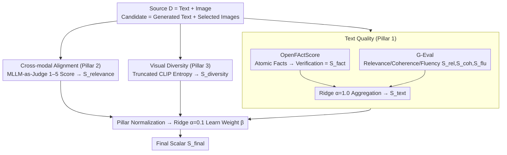

# Measuring What Matters Beyond Text: Evaluating Multimodal Summaries by Quality, Alignment, and Diversity (MM-Eval)

**Conference**: ACL 2026 Findings  
**arXiv**: [2605.11693](https://arxiv.org/abs/2605.11693)  
**Code**: https://github.com/abidmeeraj/MM-Eval  
**Area**: Multimodal Evaluation / Summarization / Interpretable Evaluation  
**Keywords**: Multimodal Summarization, Evaluation Framework, OpenFActScore, MLLM-as-Judge, Truncated CLIP Entropy

## TL;DR
Addressing the "Multimodal Summarization with Multimodal Output (MSMO)" task, this work proposes the MM-Eval framework. It aggregates three sub-scores—text quality (OpenFActScore + G-Eval), cross-modal alignment (MLLM-as-Judge), and visual diversity (Truncated CLIP Entropy)—into a single score using weights learned via Ridge regression. On the mLLM-EVAL news benchmark, the Kendall $\tau$ correlation with human preferences improved from the equal-weight baseline's 0.041 to 0.374.

## Background & Motivation
**Background**: MSMO (Multimodal Summarization with Multimodal Output) requires systems to output both a text summary and a set of accompanying images. While MLLMs (GPT-4V / LLaVA / Qwen-VL) have significantly advanced generation capabilities, evaluation remains stuck in "Modality Silos" (e.g., ROUGE for text + Image Precision for images + cosine similarity). These unimodal metrics fail to address whether the combined text and images form a faithful and useful summary.

**Limitations of Prior Work**: (1) ROUGE relies on n-grams and fails to detect semantic equivalence or factual errors, allowing hallucinated summaries to achieve high scores; (2) Image Precision assumes a "correct image set," assigning zero points if a model selects semantically equivalent but different images; (3) Overall scoring either uses simple linear regression like MMAE (still hindered by ROUGE) or uses mLLM-Eval to let GPT-4V provide a holistic score (expensive, black-box, and unable to pinpoint weaknesses).

**Key Challenge**: (a) **Interpretability vs. Accuracy** — LLM-as-judge is accurate but opaque, while sub-metrics are interpretable but correlate poorly with human judgment; (b) **Reference Dependence vs. Generality** — Most metrics require a reference summary, which is inconsistent across domains.

**Goal**: Construct a framework that is (1) modular with three-dimensional sub-scores and one-dimensional aggregation; (2) entirely reference-weak (relying only on source + output) to facilitate cross-domain transfer; (3) empowered by aggregation weights learned from human preferences to reflect the relative importance of each dimension.

**Key Insight**: The authors observe that human judgment of summary quality is essentially hierarchical—factual errors often lead to immediate rejection (the gatekeeper effect), while other dimensions only matter if the facts are correct. This **nonlinear, threshold-based human judgment** cannot be captured by equal-weight averaging and requires learned weighting.

**Core Idea**: Use "decompose-then-verify" atomic fact extraction for factual consistency, G-Eval for soft quality, MLLM-as-Judge for cross-modal alignment, and Truncated CLIP Entropy for visual diversity. Finally, learn aggregation weights using Ridge regression on mLLM-EVAL.

## Method

### Overall Architecture
MM-Eval receives a source document $D = \{T_{source}, V_{source}\}$ and a candidate summary $S_{cand} = \{T_{gen}, V_{sel}\}$, and outputs a scalar $S_{final}$. The pipeline consists of three parallel pillars followed by two-stage Ridge regression: (1) Text Quality $S_{text}$ — sub-components $S_{fact}, S_{rel}, S_{coh}, S_{flu}$ are aggregated internally via Ridge ($\alpha=1.0$); (2) Cross-modal Alignment $S_{relevance}$ — MLLM provides a 1–5 score; (3) Visual Diversity $S_{diversity}$ — TCE outputs log-entropy. The three pillars are normalized to $[0,1]$ before using Ridge ($\alpha=0.1$) to learn the final coefficient $\beta$, aimed at minimizing MSE against human overall scores. The entire process uses open-source models (Mistral-7B-Instruct, LLaVA-Mistral, ViT-B/32) with temperature = 0 for reproducibility.

### Key Designs

**1. Pillar 1: Text Quality = OpenFActScore (Hard Facts) + G-Eval (Soft Quality), measuring facts and style separately before merging.**

ROUGE only considers n-grams; a summary with completely incorrect facts can still score high if it is fluent. The first pillar of MM-Eval splits "factual correctness" and "linguistic quality" into two heterogeneous metrics. The factual side follows a decompose-then-verify approach: an instruction-tuned LLM breaks the generated summary $T_{gen}$ into a set of atomic facts $A=\{a_1,\dots,a_m\}$, and a second LLM performs binary verification for each $a_i$ against the source, resulting in $S_{fact} = \frac{1}{|A|}\sum_i v_i$. The style side uses G-Eval with CoT + probability-weighted scoring to provide relevance $S_{rel}$, coherence $S_{coh}$, and fluency $S_{flu}$.

The four sub-components are aggregated via Ridge ($\alpha=1.0$) into $S_{text} = w_1 S_{fact} + w_2 S_{rel} + w_3 S_{coh} + w_4 S_{flu}$. The learned weights are: Fact (0.55), Coherence (0.29), Fluency (0.15), and Relevance (0.02). Atomization makes the score immune to paraphrasing and length—elevating factual evaluation from "n-gram recall" to "fact-level precision"—while G-Eval's probability weighting suppresses the variance of LLMs fluctuating between adjacent scores.

**2. Pillar 2: MLLM-as-a-Judge for Cross-modal Alignment, bypassing Image Precision's requirement to "select the reference image."**

Image Precision assumes a restricted set of gold images; a model scores zero if it selects a semantically equivalent image not in the set. The second pillar uses LLaVA-v1.6-mistral-7b as a judge. For each (text snippet, candidate image) pair, it performs CoT reasoning before outputting a Likert score (1–5), normalized to $[0,1]$. It evaluates whether images semantically complement or supplement the text—adding details not explicitly stated in the words—rather than just checking visual-textual similarity.

This pragmatic reasoning is only possible with strong MLLMs, and CoT reasoning stabilizes scoring variance. This pillar intentionally avoids further sub-metric decomposition to allow for easy judge replacement as MLLMs evolve without altering the framework structure.

**3. Pillar 3: Truncated CLIP Entropy for Visual Diversity, using spectral entropy to penalize "semantic redundancy" instead of "visual difference."**

News reports often include multiple photos of the same scene from different angles. Pixel-level or pairwise distance metrics might judge these as "very different," but they are informationally redundant. TCE takes a different approach: it extracts CLIP embeddings $F$ for $k$ selected images, calculates the eigenvalues $\lambda_i$ of the empirical covariance $C$, takes the top 20 eigenvalues normalized as probabilities $p_i$, and calculates Von Neumann entropy:

$$S_{diversity} = -\sum_{i=1}^k p_i \log(p_i)$$

This measures the "volume occupied by the image set in CLIP semantic space." Entropy collapses only when images overlap semantically, penalizing information redundancy rather than visual similarity. This metric is naturally reference-free and does not require massive samples for distribution estimation like FID, making it ideal for the small sets (3–5 images) typical of MSMO summaries.

### Loss & Training
A two-stage Ridge regression is employed. Stage 1: Learn the 4 internal weights for $S_{text}$ ($\alpha=1.0$) using 5-fold CV on ~1,500 human-annotated samples from mLLM-EVAL. Stage 2: Learn the final coefficients $\beta$ for the three pillars ($\alpha=0.1$), targeting $\hat\beta = \arg\min_\beta \sum_i (\beta^T X_i - y_{human}^{(i)})^2$, with an 80/20 split stratified by summarization systems. Learned signature coefficients: $\beta_{text} = 2.7721$ (large positive), $\beta_{relevance} = 0.2256$ (small positive), $\beta_{diversity} = -0.4991$ (**negative**, because in this dataset, redundant image sets often co-occur with weak text, acting as a confounder).

## Key Experimental Results

### Main Results: Comparison of MM-Eval with Baselines (mLLM-EVAL News, 1562 Annotations)

| Evaluator | Kendall $\tau$ | Spearman $\rho$ | Pearson $r$ | $R^2$ | RMSE |
|---|---|---|---|---|---|
| Equal weights baseline | 0.041 | 0.058 | — | — | — |
| Text pillar only | 0.369 | 0.506 | — | — | — |
| Cross-modal pillar only (MLLM judge) | −0.085 | −0.110 | — | — | — |
| Diversity pillar only (TCE) | −0.089 | −0.124 | — | — | — |
| **MM-Eval (full, learned weights)** | **0.374** (CI [0.300, 0.444]) | **0.514** (CI [0.417, 0.597]) | **0.611** | **0.372** | **0.828** |

Stability of learned pillar weights (50 resamples): $w_{text} = 0.7572 \pm 0.043$ (dominant), $w_{relevance} = 0.070 \pm 0.022$, $w_{diversity} = 0.173 \pm 0.022$. Internal text weights: Fact 0.551, Coherence 0.287, Fluency 0.145, Relevance 0.017.

### Ablation Study: Impact of Removing Individual Pillars on Kendall $\tau$

| Configuration | Kendall $\tau$ | Relative Change |
|---|---|---|
| Full MM-Eval | 0.3744 | — |
| w/o $S_{text}$ | −0.0835 | **−122%** (Becomes negative) |
| w/o $S_{relevance}$ | 0.1716 | −54% |
| w/o $S_{diversity}$ | 0.1123 | −70% |

### Key Findings
- **Factual Consistency as a "Gatekeeper":** It is not a standard linear contributor. Human overall score analysis shows that if consistency is in bin 1 (n=225), P(Overall≥4) = 0.000 and P(Overall≤2) = 0.933. In bin 5 (n=937), P(Overall≥4) transitions to 0.819. The high $w_{fact}$ in Ridge regression effectively simulates this "one-strike-out" factual threshold.
- **Marginal vs. Joint Contribution:** Individual visual pillars show negative marginal correlations (−0.085 / −0.089), yet ablating them drops $\tau$ by more than half. Visual signals are conditional/interaction-based; they supplement information only after the text passes quality checks. This is a significant methodological finding: **marginal correlation $\neq$ joint contribution**.
- **Domain Context:** News is text-dominant, but this may not generalize to all domains. Supplementary experiments show annotators still score image relevance (4.04) and diversity (3.89) highly, suggesting the $w_{text}$ of 0.79 describes the "marginal contribution" structure rather than a lack of human interest in visuals.
- **Interpretability + Portability:** Since all pillars are reference-weak, adapting to a new domain only requires re-fitting the three $\beta$ values (with a few hundred human ratings) without retraining the underlying scorers.

## Highlights & Insights
- **Paradigm Shift in Evaluation:** Moving to "Gatekeeper Functions + Learned Aggregation" quantifies the intuition that facts are "deal-breakers" through Ridge coefficients rather than hard-coded rules, maintaining both interpretability and data-driven adaptability.
- **Interpreting Negative Coefficients:** A $\beta_{diversity} = -0.4991$ does not mean "diversity is harmful," but rather that diversity is spuriously negatively correlated with quality in this specific dataset distribution. Reporting negative coefficients while using ablation to prove that "removing it makes the metric worse" demonstrates high academic rigor.
- **TCE for Semantic Diversity:** Using spectral entropy instead of pairwise distance or FID allows the metric to reflect semantic volume while remaining robust to single-image perturbations. It is an undervalued reference-free diversity measure.
- **Methodological Insight:** Evaluation research does not always require new models. Aggregating existing scorers via "simple yet effective" methods like Ridge regression, combined with rigorous statistical analysis (CI, bootstrap, 50x resample, stratified CV), can produce powerful baselines.

## Limitations & Future Work
- The authors acknowledge: (1) Verification is limited to the text-dominant news domain; image-dominant domains (e.g., product reviews) might show reversed results; (2) A Kendall $\tau = 0.374$ is moderate, meaning human judgment is still needed for closely ranked systems; (3) Negative marginal correlations in visual pillars may partially stem from proxy noise in TCE or the LLaVA judge.
- Potential improvements: (1) Ridge is linear, but since the paper identifies a "gatekeeper" effect, using monotonic neural networks or piecewise-linear models with thresholds may better model this; (2) The sign discrepancy between `wdiversity` and `βdiversity` (contribution vs. regression coefficient) could be clarified to avoid reader confusion; (3) Aggregation coefficients might overfit the "style" of the 9 systems used despite the 1500-sample size.
- Future Directions: Upgrade OpenFActScore to multimodal fact verification (using $V_{source}$); introduce image-grounded factuality; extend to dialogue summarization and report generation.

## Related Work & Insights
- **vs. MMAE (Zhu et al. 2018)**: MMAE also aggregates ROUGE+IP+cos via regression, but its sub-metrics are reference-based and semantically shallow. MM-Eval uses a similar aggregation logic but upgrades all pillars to LLM/MLLM-based reference-weak metrics.
- **vs. mLLM-Eval (Zhuang et al. 2024)**: mLLM-Eval lets GPT-4V score holistically. MM-Eval is more interpretable and modular, allowing independent pillar replacement and even using open-source models.
- **vs. FActScore / OpenFActScore**: The contribution lies in solving the "obscured problem" of how to merge factual sub-scores with other quality dimensions end-to-end.
- **vs. FID / Inception Score**: TCE is far better suited for the small-set scenarios (3–5 images per summary) typical of MSMO, as it doesn't require massive samples to estimate distributions.

## Rating
- Novelty: ⭐⭐⭐☆☆ The framework combines existing scorers, but "learned aggregation + gatekeeper analysis + marginal/joint contribution insights" provide substantial methodological value.
- Experimental Thoroughness: ⭐⭐⭐⭐☆ Excellent statistical analysis (bootstrap CI, resampling, CV, multiple ablations), though limited to a single dataset category.
- Writing Quality: ⭐⭐⭐⭐☆ Clear notation, logical flow, and dedicated explanations for counter-intuitive results like negative coefficients.
- Value: ⭐⭐⭐⭐☆ Highly applicable for researchers in MSMO and multimodal evaluation; the "learned aggregation" paradigm is transferable to other multi-dimensional tasks.

<!-- RELATED:START -->

## Related Papers

- [\[ACL 2026\] Beyond Screenshots: Evaluating VLMs' Understanding of UI Animations](beyond_screenshots_evaluating_vlms_understanding_of_ui_animations.md)
- [\[ACL 2025\] VF-Eval: Evaluating Multimodal LLMs for Generating Feedback on AIGC Videos](../../ACL2025/multimodal_vlm/vf_eval_aigc_video_feedback.md)
- [\[CVPR 2026\] Learning What Matters: Prioritized Concept Learning via Relative Error-driven Sample Selection](../../CVPR2026/multimodal_vlm/learning_what_matters_prioritized_concept_learning_via_relative_error-driven_sam.md)
- [\[ACL 2026\] What's Missing in Screen-to-Action? Towards a UI-in-the-Loop Paradigm for Multimodal GUI Reasoning](what39s_missing_in_screen-to-action_towards_a_ui-in-the-loop_paradigm_for_multim.md)
- [\[CVPR 2026\] Multimodal RewardBench 2: Evaluating Omni Reward Models for Interleaved Text and Image](../../CVPR2026/multimodal_vlm/multimodal_rewardbench_2_evaluating_omni_reward_models_for_interleaved_text_and_.md)

<!-- RELATED:END -->
