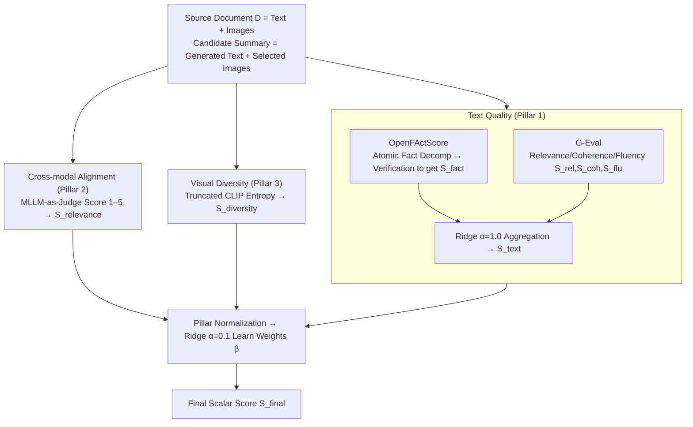

# Measuring What Matters Beyond Text: Evaluating Multimodal Summaries by Quality, Alignment, and Diversity (MM-Eval)

**Conference**: ACL 2026 Findings  
**arXiv**: [2605.11693](https://arxiv.org/abs/2605.11693)  
**Code**: https://github.com/abidmeeraj/MM-Eval  
**Area**: Multimodal Evaluation / Summarization / Explainable Evaluation  
**Keywords**: Multimodal Summarization, Evaluation Framework, OpenFActScore, MLLM-as-Judge, Truncated CLIP Entropy

## TL;DR
Proposed the MM-Eval evaluation framework for the "Multimodal Summarization with Multimodal Output (MSMO)" task. It aggregates three sub-scores—text quality (OpenFActScore + G-Eval), cross-modal alignment (MLLM-as-Judge), and visual diversity (Truncated CLIP Entropy)—into a single score using weights learned via Ridge regression. On the mLLM-EVAL news benchmark, it improves the Kendall $\tau$ relative to human preferences from the 0.041 of an equal-weight baseline to 0.374.

## Background & Motivation
**Background**: MSMO requires systems to simultaneously output a text summary and a set of accompanying images. While MLLMs (GPT-4V / LLaVA / Qwen-VL) have pushed generation capabilities forward, evaluation still relies on "Modality Silos" (Silo Effect) such as ROUGE (text) + Image Precision (images) + their cosine similarity. Each component is calculated using unimodal metrics, failing to answer whether the combined text and images form a faithful and useful summary.

**Limitations of Prior Work**: (1) ROUGE only considers n-grams, failing to capture semantic equivalence or factual errors; hallucinated summaries can still receive high scores. (2) Image Precision assumes a "correct image set," awarding zero points if the model selects a semantically equivalent but different image. (3) Overall scoring either uses simple linear regression like MMAE (still hindered by ROUGE) or uses mLLM-Eval to let GPT-4V provide a holistic score (expensive, black-box, and unable to pinpoint weaknesses).

**Key Challenge**: (a) **Explainability vs. Accuracy** — LLM-as-judge is accurate but opaque, while sub-metrics are explainable but poorly correlated with human judgment. (b) **Reference-dependence vs. Generality** — Most metrics require a reference summary, but reference standards are inconsistent across domains.

**Goal**: Construct a modular framework that is (1) multidimensional (three sub-pillars + one aggregated score); (2) reference-weak (depending only on the source + system output) for cross-domain transfer; and (3) uses aggregation weights learned from human preferences to reflect the relative importance of each dimension.

**Key Insight**: The authors observe that human judgment of summary quality is inherently hierarchical—factual errors lead to immediate rejection (gatekeeper effect), and other dimensions only take effect if the facts are correct. This **non-linear, threshold-based human judgment** cannot be captured by equal-weight averaging; weights must be learned.

**Core Idea**: Use "decompose-then-verify" atomic fact extraction for factual consistency, G-Eval for soft quality, MLLM-as-Judge for cross-modal alignment, and Truncated CLIP Entropy for visual diversity. Finally, learn aggregation weights via Ridge regression on mLLM-EVAL.

## Method

### Overall Architecture
MM-Eval takes the source document $D = \{T_{source}, V_{source}\}$ and the candidate summary $S_{cand} = \{T_{gen}, V_{sel}\}$ as input and outputs a scalar $S_{final}$. The pipeline consists of three parallel pillars followed by two-stage Ridge regression: (1) Text Quality $S_{text}$ — sub-components $S_{fact}, S_{rel}, S_{coh}, S_{flu}$ aggregated internally via Ridge ($\alpha=1.0$); (2) Cross-modal Alignment $S_{relevance}$ — MLLM provides a 1–5 score; (3) Visual Diversity $S_{diversity}$ — TCE outputs log-entropy. The three pillars are normalized to $[0,1]$ before using Ridge ($\alpha=0.1$) to learn the final coefficients $\beta$, aiming to minimize MSE with the human overall score. The entire process uses open-source models (Mistral-7B-Instruct, LLaVA-Mistral, ViT-B/32) with temperature = 0 to ensure reproducibility.

### Key Designs

**1. Pillar 1: Text Quality = OpenFActScore (Hard Facts) + G-Eval (Soft Quality), measuring facts and style separately then merging**

ROUGE only looks at n-grams; a summary with entirely incorrect facts but fluent language can still score high. The first pillar of MM-Eval separates "factual correctness" and "linguistic quality" into two heterogeneous metrics. The factual side follows a decompose-then-verify approach: first, an instruction-tuned LLM decomposes the generated summary $T_{gen}$ into a set of atomic facts $A=\{a_1,\dots,a_m\}$, and then a second LLM performs binary classification for each $a_i$ to see if it is supported by the source, yielding $S_{fact} = \frac{1}{|A|}\sum_i v_i$. The style side uses G-Eval with CoT + probability-weighted scoring to provide scores for relevance $S_{rel}$, coherence $S_{coh}$, and fluency $S_{flu}$.

The four sub-components are aggregated via Ridge ($\alpha=1.0$): $S_{text} = w_1 S_{fact} + w_2 S_{rel} + w_3 S_{coh} + w_4 S_{flu}$. The learned weights are: Facts 0.55, Coherence 0.29, Fluency 0.15, and Relevance 0.02. Atomization makes the score immune to paraphrasing and length—shifting fact evaluation from "n-gram recall" to "fact-level precision"; G-Eval’s probability weighting suppresses the variance of LLMs oscillating between adjacent scores.

**2. Pillar 2: MLLM-as-a-Judge for Cross-modal Alignment, bypassing the "must select reference image" constraint of Image Precision**

Image Precision assumes a standard image set; if the model selects a semantically equivalent image not in that set, it receives 0. The second pillar uses LLaVA-v1.6-mistral-7b as a judge. For each (text snippet, candidate image) pair, it first performs CoT reasoning and then outputs a Likert score of 1–5, normalized to $[0,1]$. It does not judge "similarity" but rather whether the image semantically complements/supplements the text—adding details not explicitly mentioned in the words.

This pragmatic reasoning is only possible with strong MLLMs, and CoT reasoning stabilizes the scoring variance. This pillar intentionally avoids further sub-metrics to remain modular; if MLLMs improve, only the judge needs to be replaced without altering the framework.

**3. Pillar 3: Truncated CLIP Entropy for Visual Diversity, using spectral entropy to penalize "semantic redundancy" rather than "visual difference"**

News regarding protests often features multiple photos of the same scene from different angles; pixel-level or pairwise distances would judge them as "very different," yet they are informationally redundant. TCE takes a different perspective: it takes CLIP embeddings $F$ for the selected $k$ images, calculates eigenvalues $\lambda_i$ of the empirical covariance $C$, takes the top 20 eigenvalues normalized as probabilities $p_i$, and calculates the Von Neumann entropy:

$$S_{diversity} = -\sum_{i=1}^k p_i \log(p_i)$$

It measures "how much volume the image set occupies in the CLIP semantic space"—entropy only collapses when images are semantically overlapping, thus penalizing informational redundancy rather than visual similarity. This metric is naturally reference-free and does not require massive samples to estimate distributions like FID, making it ideal for the small sets (3–5 images) in MSMO.

### Loss & Training
Two-stage Ridge regression. Stage 1: Learn the 4 internal weights of $S_{text}$ ($\alpha=1.0$) using 5-fold CV on ~1500 human-annotated samples from mLLM-EVAL. Stage 2: Learn the final coefficients $\beta$ for the three pillars ($\alpha=0.1$), with the objective $\hat\beta = \arg\min_\beta \sum_i (\beta^T X_i - y_{human}^{(i)})^2$. Data is split 80/20 stratified by summarization systems. Learned signature coefficients: $\beta_{text} = 2.7721$ (positive and large), $\beta_{relevance} = 0.2256$ (small positive), $\beta_{diversity} = -0.4991$ (**negative**, because in this dataset, redundant image sets often co-occur with weak text, acting as a confounder).

## Key Experimental Results

### Main Results: Comparison of MM-Eval with Baselines (mLLM-EVAL News Benchmark, 1562 Annotations)

| Evaluator | Kendall $\tau$ | Spearman $\rho$ | Pearson $r$ | $R^2$ | RMSE |
|---|---|---|---|---|---|
| Equal weights baseline | 0.041 | 0.058 | — | — | — |
| Text pillar only | 0.369 | 0.506 | — | — | — |
| Cross-modal pillar only (MLLM judge) | −0.085 | −0.110 | — | — | — |
| Diversity pillar only (TCE) | −0.089 | −0.124 | — | — | — |
| **MM-Eval (full, learned weights)** | **0.374** (CI [0.300, 0.444]) | **0.514** (CI [0.417, 0.597]) | **0.611** | **0.372** | **0.828** |

Stability of learned pillar weights (50 resamples): $w_{text} = 0.7572 \pm 0.043$ (absolute dominant), $w_{relevance} = 0.070 \pm 0.022$, $w_{diversity} = 0.173 \pm 0.022$. Internal text weights: Facts 0.551, Coherence 0.287, Fluency 0.145, Relevance 0.017.

### Ablation Study: Impact of Removing Individual Pillars on Kendall $\tau$

| Configuration | Kendall $\tau$ | Relative Change |
|---|---|---|
| Full MM-Eval | 0.3744 | — |
| w/o $S_{text}$ | −0.0835 | **−122%** (Becomes negative) |
| w/o $S_{relevance}$ | 0.1716 | −54% |
| w/o $S_{diversity}$ | 0.1123 | −70% |

### Key Findings
- **Factual consistency is a "gatekeeper function," not a simple linear contributor**: In the human consistency bin 1 (n=225), P(Overall≥4) = 0.000 and P(Overall≤2) = 0.933; in bin 5 (n=937), it flips to P(Overall≥4) = 0.819. The high $w_{fact}$ in Ridge regression simulates this "one-vote veto" for low factual scores.
- **Marginal correlations of individual visual pillars (−0.085 / −0.089) seem like negative contributions, but ablation shows $\tau$ drops by more than half without them**—visual signals are conditional/interactional in nature: they supplement information only after the text passes a certain quality threshold. This is the most significant methodological finding: **marginal correlation $\neq$ joint contribution**.
- **The news domain is text-dominant, but this cannot be generalized to all domains**: Supplemental experiments with 200 human annotations showed that annotators still gave high scores to image relevance (4.04) and diversity (3.89), indicating that $w_{text}=0.79$ reflects the "marginal contribution" structure rather than a lack of human interest in visuals.
- **Explainability + Transferability**: All pillars are reference-weak. Transferring to a new domain only requires re-fitting the three $\beta$ values (with tens to hundreds of human samples); the underlying scorers do not need retraining.

## Highlights & Insights
- **"Gatekeeper function + Joint weight learning" is a paradigm upgrade for evaluation frameworks**: Quantifying the intuition that "facts are a deal-breaker" into Ridge coefficients rather than hardcoding if-then rules preserves explainability while allowing for data-driven adjustments.
- **Negative coefficients are a reasonable result**: $\beta_{diversity} = -0.4991$ does not mean "diversity is harmful," but rather that diversity is spuriously negatively correlated with quality in this dataset distribution. Candidly reporting negative coefficients and using ablation to prove "removing it makes things worse" is a level of rigor rare in evaluation papers.
- **TCE for semantic diversity via spectral entropy**: Compared to pairwise distance or FID, spectral entropy only looks at the eigenvalue distribution of the covariance. It reflects the "semantic volume" of the image set and is robust to single-image perturbations, making it an underrated reference-free diversity metric.
- **Methodological Takeaway**: Evaluation papers do not necessarily need to create new models. Aggregating existing scorers in a "simple but effective" way like Ridge, combined with rigorous statistical analysis (CI / bootstrap / 50 resamples / stratified CV), can yield a powerful baseline.

## Limitations & Future Work
- The authors acknowledge: (1) Validation was only done in the text-dominant news domain; image-dominant domains (product reviews / technical docs) might flip results entirely. (2) Kendall $\tau = 0.374$ is moderate; ranking similar systems still requires human judgment. (3) The negative marginal correlation of visual pillars might be partially caused by proxy noise from TCE or the LLaVA judge.
- Potential limitations: (1) Ridge regression is a linear aggregation, yet the paper reveals "non-linear gatekeeper" behavior; switching to monotonic neural networks or piecewise-linear models with thresholds could better model gatekeeping. (2) The contradiction between `wdiversity=0.173` and `βdiversity=−0.499` stems from the difference between "normalized contribution" and "regression coefficients"; the paper could clarify this further. (3) ~1500 training samples are enough for 7 weights, but there are only 9 systems; the aggregation might overfit the "styles" of these 9 systems.
- Future directions: Upgrade OpenFActScore to multimodal fact verification (using $V_{source}$), introducing image-grounded factuality; expand to dialogue summarization, report generation, and other MSMO subtasks.

## Related Work & Insights
- **vs MMAE (Zhu et al. 2018)**: MMAE also uses regression to aggregate ROUGE+IP+cos but uses reference-based, semantically shallow metrics. MM-Eval follows a similar aggregation logic but upgrades each component to LLM/MLLM-based reference-weak metrics.
- **vs mLLM-Eval (Zhuang et al. 2024)**: mLLM-Eval lets GPT-4V provide an overall score, which is accurate but a black box. MM-Eval decomposes the task into independently replaceable pillars, offering better explainability and modularity with open-source models.
- **vs FActScore / OpenFActScore**: Ours reuses OpenFActScore for the factual sub-score; the contribution lies in solving the obscured problem of "how to merge fact sub-scores with other dimensions" end-to-end.
- **vs FID / Inception Score (Visual Diversity)**: TCE does not require large-scale samples for distribution estimation, making it more suitable for MSMO scenarios with small image sets.

## Rating
- Novelty: ⭐⭐⭐☆☆ The framework is an organic combination of existing scorers, but "learned aggregation + revealing the gatekeeper effect + marginal correlation $\neq$ joint contribution" provides substantial methodological value.
- Experimental Thoroughness: ⭐⭐⭐⭐☆ Statistical analysis is very solid (bootstrap CI / 50 resamples / 5-fold CV / 200 supplemental human annotations / multi-model ablation), though limited to a single news dataset.
- Writing Quality: ⭐⭐⭐⭐☆ Mathematical notation is clear, with dedicated paragraphs explaining potentially controversial results like negative coefficients. The logical chain is complete.
- Value: ⭐⭐⭐⭐☆ Directly applicable to researchers in MSMO and multimodal generation evaluation; the "learned aggregation + gatekeeper analysis" paradigm is transferable to any multi-dimensional evaluation task.

<!-- RELATED:START -->

## Related Papers

- [\[ACL 2026\] Beyond Screenshots: Evaluating VLMs' Understanding of UI Animations](beyond_screenshots_evaluating_vlms_understanding_of_ui_animations.md)
- [\[CVPR 2026\] Label What Matters: Modality-Balanced and Difficulty-Aware Multimodal Active Learning](../../CVPR2026/multimodal_vlm/label_what_matters_modality-balanced_and_difficulty-aware_multimodal_active_lear.md)
- [\[ACL 2025\] VF-Eval: Evaluating Multimodal LLMs for Generating Feedback on AIGC Videos](../../ACL2025/multimodal_vlm/vf_eval_aigc_video_feedback.md)
- [\[CVPR 2026\] Learning What Matters: Prioritized Concept Learning via Relative Error-driven Sample Selection](../../CVPR2026/multimodal_vlm/learning_what_matters_prioritized_concept_learning_via_relative_error-driven_sam.md)
- [\[CVPR 2026\] Multimodal RewardBench 2: Evaluating Omni Reward Models for Interleaved Text and Image](../../CVPR2026/multimodal_vlm/multimodal_rewardbench_2_evaluating_omni_reward_models_for_interleaved_text_and_.md)

<!-- RELATED:END -->
