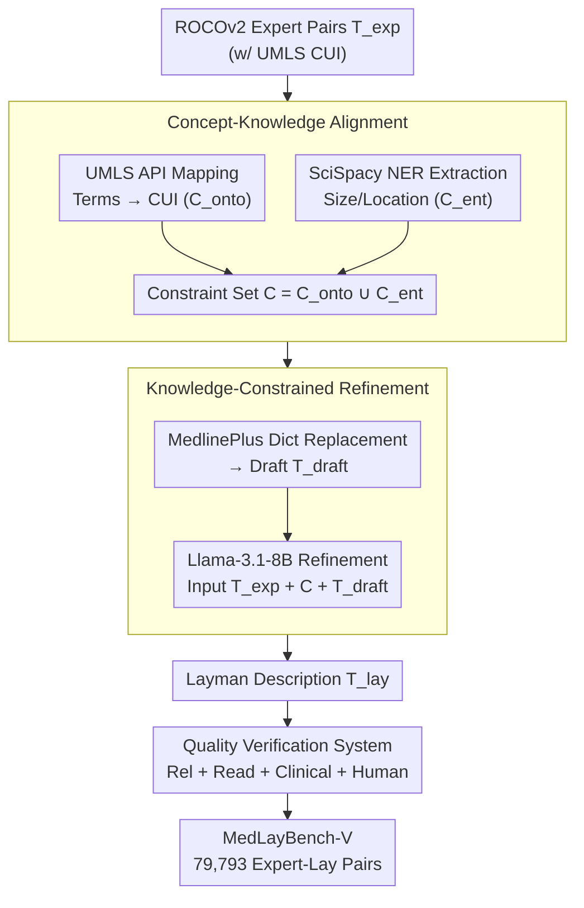

# MedLayBench-V: A Large-Scale Benchmark for Expert-Lay Semantic Alignment in Medical Vision Language Models

**Conference**: ACL 2026 Oral Findings  
**arXiv**: [2604.05738](https://arxiv.org/abs/2604.05738)  
**Code**: [GitHub](https://github.com/) (Provided via Project Page)  
**Area**: Multimodal VLM / Medical NLP  
**Keywords**: Medical Vision-Language Models, Expert-Lay Semantic Alignment, Medical Text Simplification, UMLS, Multimodal Benchmark

## TL;DR

This paper proposes MedLayBench-V, the first large-scale multimodal medical expert-lay semantic alignment benchmark (79,793 image-text pairs). Through a Structured Concept-Grounded Refinement (SCGR) pipeline, professional radiology reports are transformed into lay descriptions, ensuring clinical semantic fidelity while reducing reading difficulty from graduate to high school level. Zero-shot retrieval experiments demonstrate that lay descriptions incur less than 1% performance loss.

## Background & Motivation

**Background**: Medical Vision-Language Models (Med-VLMs) have reached expert-level performance in diagnostic image interpretation but are primarily trained on professional literature, resulting in technical clinical outputs. Medical Layman Language Generation (MLLG) in the text domain is relatively mature, driven by shared tasks like BioLaySumm.

**Limitations of Prior Work**: (1) Existing multimodal medical datasets (e.g., ROCOv2, PMC-OA) consist entirely of professional-grade reports without lay annotations; (2) Direct generation of lay descriptions using LLMs carries hallucination risks—approximately 6-7% of simplified reports contain factual errors or miss key information; (3) Traditional n-gram metrics (BLEU, ROUGE) naturally penalize vocabulary substitution and are unsuitable for evaluating expert-to-lay translation quality.

**Key Challenge**: Laymanization capabilities in the text domain have not permeated multimodal systems—VLMs can encode visual features into technical terms like "Pneumothorax" but lack training data to learn the corresponding lay expression "collapsed lung."

**Goal**: Construct the first multimodal medical dual-domain benchmark (Expert + Lay) to support the training and evaluation of Med-VLMs capable of bridging the communication gap between clinical experts and patients.

**Key Insight**: Drawing from text-domain practices that use structured medical knowledge to enhance summary relevance, this work extends the approach to the multimodal domain. Semantic fidelity is ensured through UMLS ontology mapping and NER entity constraints.

**Core Idea**: Explicitly decouple semantic extraction from stylistic rewriting—first extract semantic constraints using UMLS CUI mapping and NER, then perform lay rewriting using an LLM under these constraints to achieve controllable language simplification while preventing hallucinations.

## Method

### Overall Architecture

The SCGR pipeline decomposes data construction into "determining semantics first, then modifying style," followed by a quality validation stage. The input consists of expert-level image-text pairs ($T_{exp}$) from the ROCOv2 dataset (pre-annotated with UMLS CUIs), and the output is a semantically equivalent lay version ($T_{lay}$). The first step, **Concept-Knowledge Alignment**, extracts "what must be preserved" from the expert report to obtain a semantic constraint set $C$. The second step, **Knowledge-Constrained Refinement**, generates a lay draft using the MedlinePlus dictionary and then refines it into $T_{lay}$ using Llama-3.1-8B-Instruct under constraints. Finally, a **Multi-dimensional Quality Verification System** oversees the database across relevance, readability, and clinical correctness. The core mechanism is the explicit decoupling of semantic extraction and stylistic rewriting.

### Key Designs

**1. Concept-Knowledge Alignment: Bridging Expert and Lay Semantics via Ontology + NER**

Asking an LLM to rewrite "Pneumothorax" as "collapsed lung" often results in missing or hallucinating critical quantitative information like lesion size or location. The first step of SCGR explicitly extracts "what must be preserved" at macro and micro levels. The macro level uses the UMLS Metathesaurus API to map clinical terms to CUIs (e.g., C0040405 → "CTPA"), forming the ontology constraint set $C_{onto}$ to anchor core pathological concepts. The micro level uses SciSpacy's NER models to extract quantitative attributes and spatial descriptors, forming the entity constraint set $C_{ent}$. The union forms the final constraint set $C = C_{onto} \cup C_{ent}$.

**2. Knowledge-Constrained Refinement: Dictionary-Based Substitution Followed by LLM Smoothing**

With the constraint set ready, the goal is to reduce reading difficulty to high school levels without losing diagnostic accuracy. First, the MedlinePlus patient-friendly vocabulary from UMLS is used for deterministic dictionary substitution to generate $T_{draft}$. Then, Llama-3.1-8B-Instruct refines this draft using a structured prompt containing the original $T_{exp}$ (factual anchor), the constraint set $C$ (anti-hallucination), and $T_{draft}$ (lexical guidance).

**3. Multi-dimensional Quality Verification System: Balancing Relevance, Readability, and Correctness**

Expert-to-lay translation cannot be measured by a single metric. N-gram metrics like BLEU/ROUGE penalize the very vocabulary substitutions required for laymanization. Verification is thus split into three dimensions: Relevance (BLEU-4, ROUGE-L, METEOR); Readability (FKGL, CLI, and LENS); and Clinical Correctness (RaTEScore and GREEN for hallucination detection). Finally, human evaluation is conducted by radiologists and non-professional readers on a 5-point scale.

### Loss & Training

The SCGR pipeline is a data construction method and does not involve end-to-end training. Llama-3.1-8B-Instruct is used in inference mode without fine-tuning. Downstream tasks are evaluated using zero-shot retrieval protocols.

## Key Experimental Results

### Main Results

**Zero-shot Image-Text Retrieval (Recall@1, %)**

| Model | Image→Text (Expert / Layman) | Text→Image (Expert / Layman) |
|------|------|------|
| BiomedCLIP | 31.06 / 30.70 | 32.50 / 32.07 |
| PMC-CLIP | 28.98 / 28.38 | 30.90 / 30.24 |
| BMC-CLIP | 22.69 / 22.42 | 23.04 / 23.21 |
| PubMedCLIP | 4.61 / 4.26 | 4.85 / 4.71 |
| OpenCLIP-Huge | 3.33 / 3.44 | 5.17 / 5.15 |
| OpenAI-CLIP | 1.23 / 1.08 | 1.57 / 1.54 |

### Ablation Study

| SCGR Config | CUI | MedlinePlus | LLM | Avg R@1 |
|-----------|-----|-------------|-----|----------|
| LLM Only | ✗ | ✗ | ✓ | 1.96 |
| LLM + CUI | ✓ | ✗ | ✓ | 2.08 |
| SCGR (Full) | ✓ | ✓ | ✓ | 11.26 |
| Expert (Orig) | — | — | — | 11.44 |

### Key Findings

- Retrieval performance drop after laymanization is minimal (e.g., BiomedCLIP I2T R@1 dropped from 31.06% to 30.70%), proving SCGR preserves core diagnostic semantics.
- Removing structured constraints (LLM Only) leads to an 83% crash in R@1 (from 11.44 to 1.96), confirming constraint guidance is critical.
- Readability improves significantly: FKGL dropped from 13.10 to 10.35, and vocabulary size decreased by 46.1%.
- Human evaluation scores exceeded 4.5/5.0 across all dimensions, with factual correctness at 4.86.
- Medical-domain VLMs significantly outperform general VLMs (BiomedCLIP R@1 ~31% vs OpenAI-CLIP ~1%), highlighting the importance of domain adaptation.

## Highlights & Insights

- The explicit decoupling of semantic extraction and stylistic rewriting is the core innovation—ensuring "what to say" before determining "how to say it" fundamentally avoids hallucinations common in end-to-end generation.
- Using MedlinePlus as a bridge is both authoritative and practical; as an NLM-maintained consumer health vocabulary, it serves as a reliable "expert-to-lay" mapping dictionary.
- Ablation studies clearly show that CUI extraction is necessary but insufficient; the real performance recovery stems from knowledge-constrained refinement.

## Limitations & Future Work

- Reliance on synthetic data—lay descriptions are LLM-generated, potentially lacking the linguistic nuances of real patient interactions.
- English-only coverage—multilingual medical laymanization remains unaddressed.
- Inherited modal imbalance issues from ROCOv2.
- Future work could extend to complex downstream tasks like VQA and report generation to further expose expert-lay representation alignment gaps.

## Related Work & Insights

- **vs BioLaySumm**: While BioLaySumm focuses on text-only simplification, MedLayBench-V is the first multimodal version adding visual anchoring.
- **vs Layman's RRG**: Prior work was limited to chest X-rays with small datasets; MedLayBench-V covers 7 modalities with 80K samples.
- **vs End-to-end LLM Simplification**: Direct simplification suffers from a 6-7% factual error rate, which SCGR minimizes through structured constraints.

## Rating

- Novelty: ⭐⭐⭐⭐⭐ First multimodal medical expert-lay benchmark with an ingenious SCGR pipeline.
- Experimental Thoroughness: ⭐⭐⭐⭐ Extensive zero-shot retrieval and human evaluation, though lacks fine-tuning experiments.
- Writing Quality: ⭐⭐⭐⭐⭐ Rigorous structure, clear motivation, and convincing ablations.
- Value: ⭐⭐⭐⭐⭐ Fills a critical gap in patient-centered multimodal medical AI resources.

<!-- RELATED:START -->

## Related Papers

- [\[ACL 2026\] ChartDiff: A Large-Scale Benchmark for Comprehending Pairs of Charts](chartdiff_a_large-scale_benchmark_for_comprehending_pairs_of_charts.md)
- [\[CVPR 2025\] VILA-M3: Enhancing Vision-Language Models with Medical Expert Knowledge](../../CVPR2025/multimodal_vlm/vila-m3_enhancing_vision-language_models_with_medical_expert_knowledge.md)
- [\[ACL 2026\] Cross-Cultural Expert-Level Art Critique Evaluation with Vision-Language Models](cross-cultural_expert-level_art_critique_evaluation_with_vision-language_models.md)
- [\[CVPR 2026\] Proxy3D: Efficient 3D Representations for Vision-Language Models via Semantic Clustering and Alignment](../../CVPR2026/multimodal_vlm/proxy3d_efficient_3d_representations_for_vision-language_models_via_semantic_clu.md)
- [\[ACL 2026\] Doc-PP: Document Policy Preservation Benchmark for Large Vision-Language Models](doc-pp_document_policy_preservation_benchmark_for_large_vision-language_models.md)

<!-- RELATED:END -->
