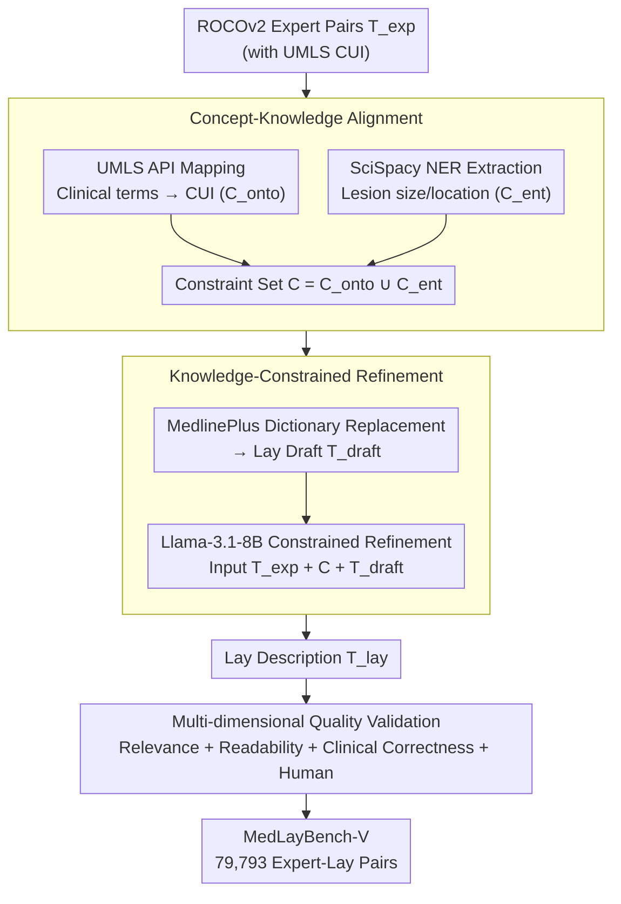

# MedLayBench-V: A Large-Scale Benchmark for Expert-Lay Semantic Alignment in Medical Vision Language Models

**Conference**: ACL 2026 Oral Findings  
**arXiv**: [2604.05738](https://arxiv.org/abs/2604.05738)  
**Code**: [GitHub](https://github.com/) (Provided via Project Page)  
**Area**: Multimodal VLM / Medical NLP  
**Keywords**: Medical Vision-Language Models, Expert-Lay Semantic Alignment, Medical Text Simplification, UMLS, Multimodal Benchmark

## TL;DR

This paper introduces MedLayBench-V, the first large-scale multimodal medical expert-lay semantic alignment benchmark (79,793 image-text pairs). Through the Structured Concept-Grounded Refinement (SCGR) pipeline, professional radiology reports are converted into lay descriptions. This ensures clinical semantic fidelity while reducing reading difficulty from graduate to high school level. Zero-shot retrieval experiments demonstrate that lay descriptions result in less than a 1% performance loss.

## Background & Motivation

**Background**: Medical Vision-Language Models (Med-VLMs) have reached expert-level proficiency in interpreting diagnostic imaging. However, they are primarily trained on professional literature, resulting in outputs dominated by clinical terminology. Research in Medical Lay Language Generation (MLLG) for text-only domains is relatively mature, driven by shared tasks like BioLaySumm.

**Limitations of Prior Work**: (1) Existing multimodal medical datasets (e.g., ROCOv2, PMC-OA) consist entirely of professional-grade reports without lay annotations; (2) Directly using LLMs for lay descriptions poses hallucination risks—approximately 6-7% of simplified reports contain factual errors or omit critical information; (3) Traditional n-gram metrics (BLEU, ROUGE) naturally penalize vocabulary substitution, making them unsuitable for evaluating expert-to-lay translation quality.

**Key Challenge**: The capacity for lay simplification in the text domain has not yet permeated multimodal systems. While VLMs can encode visual features into technical terms like "Pneumothorax," they lack the training data to learn the corresponding lay expression "collapsed lung."

**Goal**: To build the first multimodal medical dual-domain benchmark (Expert + Lay) to support the training and evaluation of Med-VLMs capable of bridging the communication gap between clinical experts and patients.

**Key Insight**: Drawing on text-domain practices that use structured medical knowledge to enhance summary relevance, this work extends the approach to the multimodal domain. Semantic fidelity is ensured through UMLS ontology mapping and NER entity constraints.

**Core Idea**: Explicitly decouple semantic extraction from stylistic rewriting. Semantic constraints are first extracted via UMLS CUI mapping and NER, followed by lay rewriting with an LLM under these constraints, achieving controllable language simplification while preventing hallucinations.

## Method

### Overall Architecture

The SCGR pipeline decomposes data construction into "determining semantics first, then modifying style," followed by a quality validation stage. The input consists of expert-level image-text pairs ($T_{exp}$) from the ROCOv2 dataset (pre-annotated with UMLS CUIs), and the output is a semantically equivalent lay version ($T_{lay}$). Step 1, **Concept-Knowledge Alignment**, extracts "what must be preserved" from expert reports to form the semantic constraint set $C$. Step 2, **Knowledge-Constrained Refinement**, generates a lay draft using the MedlinePlus dictionary, which is then refined by Llama-3.1-8B-Instruct under constraints to produce $T_{lay}$. Finally, a **Multi-dimensional Quality Validation System** assesses the repository across relevance, readability, and clinical correctness. The core mechanism is the explicit decoupling of semantic extraction and style rewriting—locking "what to say" before determining "how to say it"—to suppress end-to-end hallucinations.

### Key Designs

**1. Dual-layer Semantic Constraint Extraction: Using Ontology + NER to bridge the semantic gap between expert reports and lay descriptions.**

Simply asking an LLM to rewrite "Pneumothorax" as "collapsed lung" often leads to the omission or fabrication of critical quantitative information like lesion size or location. The first step of SCGR explicitly extracts "what must be preserved" at macro and micro levels. The macro level uses the UMLS Metathesaurus API to map clinical terms to CUIs (e.g., C0040405 → "CTPA"), forming the ontology constraint set $C_{onto}$ to anchor core pathological concepts. The micro level utilizes SciSpacy's NER models to extract quantitative attributes and spatial descriptors, forming the entity constraint set $C_{ent}$. Their union forms the final constraint set $C = C_{onto} \cup C_{ent}$.

**2. Knowledge-Constrained Refinement: Dictionary-based substitution followed by LLM-based sentence smoothing.**

With the constraint set ready, the second step aims to reduce reading difficulty from graduate to high school level without error. It involves a deterministic dictionary replacement using the MedlinePlus patient-friendly vocabulary library within UMLS to generate an initial lay draft $T_{draft}$. This draft is then refined using Llama-3.1-8B-Instruct under a structured prompt containing the original text $T_{exp}$ (for factual anchoring), the constraint set $C$ (to prevent hallucinations), and the draft $T_{draft}$ (for lexical guidance). An 8B model is sufficient here as semantic fidelity is already guaranteed by the structured constraints.

**3. Multi-dimensional Quality Validation System: Evaluating relevance, readability, and clinical correctness simultaneously.**

Translation quality from expert to lay language cannot be captured by a single metric. Since n-gram metrics (BLEU/ROUGE) penalize the vocabulary substitution inherent in simplification, validation is split into three dimensions: Relevance (BLEU-4 / ROUGE-L / METEOR for surface similarity); Readability (FKGL, CLI, and LENS—a learnable metric for simplification); and Clinical Correctness (RaTEScore and GREEN for detecting hallucinations and factual errors). Finally, human evaluation is conducted by two radiologists and one lay reader using a 5-point scale.

### Loss & Training

The SCGR pipeline is a data construction methodology and does not involve end-to-end training. Llama-3.1-8B-Instruct is used in inference mode without fine-tuning. Downstream experiments utilize a zero-shot retrieval protocol for evaluation.

## Key Experimental Results

### Main Results

**Zero-shot Image-Text Retrieval Performance (Recall@1, %)**

| Model | Image→Text (Expert / Layman) | Text→Image (Expert / Layman) |
|------|------|------|
| BiomedCLIP | 31.06 / 30.70 | 32.50 / 32.07 |
| PMC-CLIP | 28.98 / 28.38 | 30.90 / 30.24 |
| BMC-CLIP | 22.69 / 22.42 | 23.04 / 23.21 |
| PubMedCLIP | 4.61 / 4.26 | 4.85 / 4.71 |
| OpenCLIP-Huge | 3.33 / 3.44 | 5.17 / 5.15 |
| OpenAI-CLIP | 1.23 / 1.08 | 1.57 / 1.54 |

### Ablation Study

| SCGR Configuration | CUI | MedlinePlus | LLM | Avg R@1 |
|-----------|-----|-------------|-----|----------|
| LLM Only | ✗ | ✗ | ✓ | 1.96 |
| LLM + CUI | ✓ | ✗ | ✓ | 2.08 |
| SCGR (Ours) | ✓ | ✓ | ✓ | 11.26 |
| Expert (Original) | — | — | — | 11.44 |

### Key Findings

- The decrease in retrieval performance after lay simplification is minimal—BiomedCLIP's I2T R@1 dropped only from 31.06% to 30.70%, proving that SCGR preserves core diagnostic semantics.
- Removing structured constraints (LLM Only) caused R@1 to crash by 83% (from 11.44 to 1.96), confirming that constraint grounding is critical for preventing hallucinations.
- The readability metric FKGL improved from 13.10 to 10.35, with a 46.1% reduction in vocabulary complexity.
- Human evaluation scores exceeded 4.5/5.0 across four dimensions, with factual correctness and completeness reaching 4.86.
- Medical-domain VLMs significantly outperform general VLMs (BiomedCLIP ~31% vs. OpenAI-CLIP ~1%), highlighting the importance of domain adaptation.

## Highlights & Insights

- The explicit decoupling of semantic extraction and stylistic rewriting is a core innovation. By ensuring "what to say" before "how to say it," the common hallucination issues in end-to-end generation are fundamentally avoided. This approach is transferable to any task requiring semantic preservation across stylistic shifts.
- Utilizing MedlinePlus as a bridge for lay language is both authoritative and practical. The patient education vocabulary maintained by the NLM serves as a reliable "expert-to-lay" mapping dictionary.
- Ablation experiments clearly indicate that CUI extraction is a necessary but insufficient condition; the primary performance recovery stems from knowledge-constrained refinement using MedlinePlus.

## Limitations & Future Work

- **Dependency on Synthetic Data**: Lay descriptions are generated by LLMs rather than written by humans, potentially lacking the linguistic nuances of real patient communication.
- **English-Centric**: Multilingual medical lay language needs remain unaddressed.
- **Modality Imbalance**: The benchmark inherits balanced modality issues from ROCOv2.
- **Future Tasks**: Scaling to complex downstream tasks like VQA and report generation to further expose expert-lay representation alignment gaps.

## Related Work & Insights

- **vs. BioLaySumm**: While BioLaySumm is a text-only lay summarization task, MedLayBench-V is the first multimodal version incorporating visual anchoring.
- **vs. Layman's RRG**: Prior work was limited to chest X-rays with small datasets; MedLayBench-V covers 7 modalities with 80K samples.
- **vs. End-to-end LLM Simplification**: Direct LLM simplification results in a 6-7% factual error rate, whereas SCGR minimizes hallucinations through structured grounding.

## Rating

- **Novelty**: ⭐⭐⭐⭐⭐ First multimodal medical expert-lay alignment benchmark; SCGR pipeline is cleverly designed.
- **Experimental Thoroughness**: ⭐⭐⭐⭐ Includes zero-shot retrieval for 8 models plus ablation and human study, though fine-tuning experiments are absent.
- **Writing Quality**: ⭐⭐⭐⭐⭐ Rigorous structure, clear motivation, and convincing ablation.
- **Value**: ⭐⭐⭐⭐⭐ Fills a critical resource gap for patient-centered multimodal medical AI.

## Related Papers

- [\[ACL 2026\] ChartDiff: A Large-Scale Benchmark for Comprehending Pairs of Charts](chartdiff_a_large-scale_benchmark_for_comprehending_pairs_of_charts.md)
- [\[CVPR 2025\] VILA-M3: Enhancing Vision-Language Models with Medical Expert Knowledge](../../CVPR2025/multimodal_vlm/vila-m3_enhancing_vision-language_models_with_medical_expert_knowledge.md)
- [\[ACL 2026\] Cross-Cultural Expert-Level Art Critique Evaluation with Vision-Language Models](cross-cultural_expert-level_art_critique_evaluation_with_vision-language_models.md)
- [\[ACL 2026\] Doc-PP: Document Policy Preservation Benchmark for Large Vision-Language Models](doc-pp_document_policy_preservation_benchmark_for_large_vision-language_models.md)
- [\[CVPR 2026\] Proxy3D: Efficient 3D Representations for Vision-Language Models via Semantic Clustering and Alignment](../../CVPR2026/multimodal_vlm/proxy3d_efficient_3d_representations_for_vision-language_models_via_semantic_clu.md)

<!-- RELATED:END -->

<!-- RELATED:START -->

## Related Papers

- [\[ACL 2026\] Doc-PP: Document Policy Preservation Benchmark for Large Vision-Language Models](doc-pp_document_policy_preservation_benchmark_for_large_vision-language_models.md)
- [\[ACL 2026\] ChartDiff: A Large-Scale Benchmark for Comprehending Pairs of Charts](chartdiff_a_large-scale_benchmark_for_comprehending_pairs_of_charts.md)
- [\[ACL 2026\] From Charts to Code: A Hierarchical Benchmark for Multimodal Models](from_charts_to_code_a_hierarchical_benchmark_for_multimodal_models.md)
- [\[ACL 2026\] Jailbreaking Multimodal Large Language Models using Multi-Clip Video](jailbreaking_multimodal_large_language_models_using_multi-clip_video.md)
- [\[ACL 2026\] LaMI: Augmenting Large Language Models via Late Multi-Image Fusion](lami_augmenting_large_language_models_via_late_multi-image_fusion.md)

<!-- RELATED:END -->
