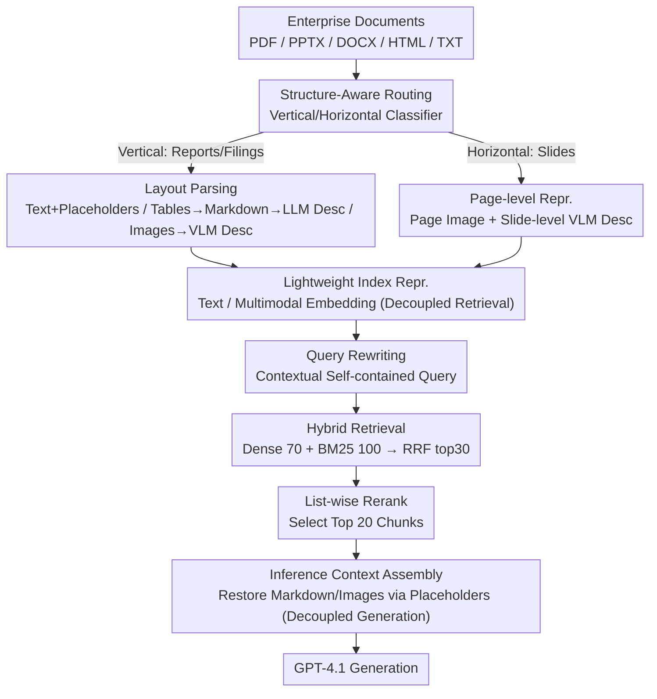

# MM-BizRAG: Rethinking Multimodal Retrieval-Augmented Generation for General Purpose Enterprise Q&A

**Conference**: ACL2026  
**arXiv**: [2606.04231](https://arxiv.org/abs/2606.04231)  
**Code**: None (cache repository not provided)  
**Area**: Multimodal Retrieval-Augmented Generation / Enterprise Q&A  
**Keywords**: MM-RAG, Enterprise Documents, Structure-aware Parsing, Multimodal Retrieval, FastRAGEval

## TL;DR
MM-BizRAG demonstrates that enterprise multimodal RAG should not rely solely on page screenshots and visual embeddings. Instead, it should first differentiate between reports and slides based on document structure, explicitly parse text, tables, and images, and then assemble multimodal contexts during inference. This approach significantly outperforms vision-centric baselines on SlideVQA, FinRAGBench-V, and internal enterprise data.

## Background & Motivation
**Background**: Enterprise knowledge bases commonly contain documents like PDF, DOCX, PPTX, HTML, and TXT, which mix text, tables, images, charts, and complex layouts. A recent popular simplified route for multimodal RAG treats pages as images, uses visual embeddings for retrieval, and passes page images to Vision Language Models (VLMs) to generate answers.

**Limitations of Prior Work**: While the page-as-image route skips parsing, it delegates the implicit understanding of reading order, table structures, and spatial relationships between text and images entirely to pretrained VLMs. Structured information in enterprise documents—such as financial reports, compliance materials, technical documents, and multi-page business reports—often falls outside the training distribution of general-purpose models.

**Key Challenge**: RAG retrieval requires lightweight, stable, and indexable representations, while answer generation requires rich, structure-preserving multimodal context. Using the same page screenshot for both retrieval and generation may lead to inaccurate retrieval or the loss of table data and reading order.

**Goal**: The authors aim to build an MM-RAG system that can be deployed for heterogeneous enterprise documents without model fine-tuning, explicitly handling structured artifacts and systematically comparing the impact of different ingestion representations and embedding strategies.

**Key Insight**: The paper first bifurcates documents into vertical documents (reports, PDFs, filings) and horizontal documents (slide decks) based on structure, then designs separate parsing and chunking strategies. It uses representations better suited for indexing during the retrieval phase and reassembles the original artifacts during the generation phase.

**Core Idea**: Decouple the "representation for retrieval" from the "context for generation." During retrieval, it indexes lightweight text, descriptions, or page representations. During generation, it restores table markdown, images, and page screenshots based on placeholders and metadata to construct multimodal evidence closer to the original structure.

## Method

### Overall Architecture
MM-BizRAG addresses heterogeneous documents in enterprise repositories: PDF financial reports, PPTX slides, and DOCX technical documents. Relying solely on page screenshots + visual embeddings loses table structures and reading sequences. The core mechanism is document structure-aware ingestion: first classifying whether a document has a vertical structure (reports/filings with natural reading order) or a horizontal structure (slides where each page is a complete semantic unit), and then following different parsing routes.

For vertical documents, tools like Docling extract text blocks, tables, images, and page images. Placeholders for tables/images are inserted into the text to maintain reading order; tables are converted to markdown with line-by-line descriptions generated by an LLM, and images are described by a VLM (filtering out non-informative content like logos). For horizontal documents, each page is preserved as a page image plus a slide-level description generated by a VLM. During retrieval, text or multimodal embeddings are established based on the variant. During inference, a query rewriter first modifies the query using conversation history, followed by dense + BM25 hybrid retrieval. RRF fusion selects the top 30 chunks for a list-wise reranker, and finally, the top 20 chunks are assembled into a multimodal context for GPT-4.1 to generate answers. Three variants are defined (TCTE, PCMHE, TCMIE), differing in chunk granularity, embedding models, and artifact injection timing.

### Key Designs

**1. Structure-Aware Routing: Reports and slides require different parsing**

Reports depend on the linear sequence of paragraphs and tables, whereas slides depend on the spatial layout of the entire page. Forcing both into a single chunking strategy inevitably results in sub-optimal performance. MM-BizRAG uses a vertical/horizontal classifier where vertical documents undergo layout-aware parsing to preserve reading order, while horizontal documents treat each page as an indivisibility semantic unit. In experiments, this classifier achieved 100% precision and 83.28% recall, making the subsequent structure-customized parsing reliable.

**2. Decoupling Retrieval Representation and Generation Context: Use descriptions for indexing, restore artifacts for generation**

Table markdown and base64 images are bulky; indexing them directly bloats the vector database and slows down retrieval. However, generation needs these original pieces of evidence. MM-BizRAG separates the "representation for retrieval" from the "context for generation." In the TCTE variant, the index only uses text chunks, table descriptions, and image descriptions for text embedding. When a table or image description is hit, the system uses its placeholder to find the parent text chunk and injects the actual table markdown or image artifact back into the placeholder's original position. This keeps indexing lean while providing generation with multimodal evidence close to the original structure.

**3. FastRAGEval (FRE): Fact-level recall via single LLM call**

Answers in enterprise QA are often long paragraphs; token overlap or exact match cannot measure if key facts were retrieved. Two-stage approaches like RAGChecker (claim decomposition + matching) have high latency. FastRAGEval (FRE) compresses this into a single LLM call that extracts atomic facts from both reference and prediction to calculate precision, recall, and F1. The paper primarily uses FRE recall, which shows a higher correlation with human judgment (Pearson 0.808 vs. RAGChecker's 0.748), proving that the single-call approach does not sacrifice consistency while significantly reducing judge costs.

### A Full Example: How a query retrieves table evidence
Consider a user asking about "Year-on-year change in Q3 overseas revenue" in a financial report. The query rewriter first completes the query using history. In hybrid retrieval, 70 chunks are taken from dense and 100 from BM25, fused via RRF, and the top 30 are sent to the list-wise reranker. Suppose a top hit is a table description: "This table shows quarterly revenue by region." Instead of feeding this dry description to the generator, the system follows the placeholder back to the parent text chunk and injects the corresponding table markdown (containing the actual numbers) and surrounding paragraphs. The final top 20 chunks contain the structured, readable original table, allowing GPT-4.1 to answer accurately rather than guessing cells from a screenshot.

### Loss & Training
This work does not train specific retrievers or generation models; the focus is entirely on the design of ingestion, retrieval, and assembly. Components used include Docling, EasyOCR, PyPdfium2, Tableformer, OpenAI text-embedding-3-large, nomic-multimodal-embed-3b, cohere-embed-v4, the GPT-4.1 series, ColPali, and VisRAG-Ret. The inference pipeline settings are: dense retrieval (70 chunks), BM25 (100 chunks), RRF top 30 for list-wise reranking, and final top 20 for generation.

## Key Experimental Results

### Main Results

| Pipeline | SlideVQA FRE | FinRAGBench-V FRE | Internal FRE | Main Conclusion |
|------|------|------|------|------|
| Text-Only | 67.8 | 60.3 | 83.7 | Strong on text-only questions, weak on tables/images |
| ColPali | 83.6 | 49.3 | - | Stronger than text-only for slides, weak for reports |
| VisRAG | 78.8 | 46.0 | - | Similarly limited by the page-image-centric approach |
| TCTE (OAI v3-large) | 87.3 | 80.2 | 88.1 | Recommended production config; lower latency for vertical docs |
| PCMHE (Nomic) | 89.9 | 79.6 | 87.6 | Strongest on SlideVQA |
| PCMHE (Cohere) | 89.06 | 82.4 | 87.8 | Strongest on FinRAGBench-V |
| TCMIE (Cohere) | 88.2 | 76.9 | 88.0 | Closest to TCTE on internal data |

### Ablation Study

| Analysis Item | Value / Phenomenon | Description |
|------|------|------|
| Vertical-horizontal classifier | Precision 100.00, Recall 83.28, F1 90.87 | Structural routing is reliable, though recall can improve |
| FRE vs RAGChecker Pearson | 0.808 vs 0.748 | FRE correlates better with human judgment |
| FRE vs RAGChecker Spearman | 0.808 vs 0.736 | Better ranking consistency |
| FRE vs RAGChecker Kendall | 0.808 vs 0.725 | Single-call metric does not sacrifice consistency |
| Human Labeling Consistency | Cohen's kappa 0.966 | High agreement across 200 double-labeled instances |
| TCTE Latency | FinRAGBench-V 11.9s, Internal 11.1s | For vertical docs, approx. half the latency of PCMHE Cohere |

### Key Findings
- On SlideVQA, MM-BizRAG achieves a peak FRE recall of 89.9, a 6.3 percentage point improvement over ColPali's 83.6; this indicates that even for slides, explicit text/vision fusion is beneficial.
- On FinRAGBench-V, PCMHE Cohere achieves an FRE recall of 82.4, whereas ColPali scores only 49.3 and VisRAG only 46.0; page-image-centric methods degrade significantly in report-style documents.
- Internal data includes 1,908 questions, 1,048 documents, and 20,429 pages; all MM-BizRAG variants outperform the text-only FRE recall of 83.7.
- TCTE is the recommended production configuration: its recall is usually only 1-3 percentage points behind the best performer on vertical docs, but its latency is roughly half that of PCMHE.
- All MM-BizRAG variants maintain a faithfulness score above 90%, implying that structured assembly does not result in more ungrounded generations despite the richer context.

## Highlights & Insights
- The paper refutes the intuition that "parsing is unnecessary once VLMs are strong enough." Tables, headers/footers, cross-page narratives, and image-text sequences in enterprise documents still require explicit modeling.
- The decoupling of retrieval representation and generation context is a critical engineering design. Many RAG systems tie the index schema to the prompt context schema, leading to either heavy indexing or poor evidence for generation.
- TCTE's performance is highly practical: the strongest configuration is not always the best for production; trade-offs between latency, cost, and recall must be viewed holistically.
- FastRAGEval is highly practical. For long-paragraph enterprise QA answers, token F1 or exact match is meaningless; single-call fact-level recall is much closer to business evaluation.

## Limitations & Future Work
- Public slide evaluations rely mainly on SlideVQA, which is relatively simple and may not fully represent complex enterprise-grade presentations.
- FinRAGBench-V only processed a subset of 213 English documents in PDF format, not covering the full 1,100+ documents or evaluating multi-lingual enterprise scenarios.
- Public baselines are limited to ColPali and VisRAG; comparisons with more recent or closed-source enterprise RAG systems are missing.
- Internal enterprise data cannot be released due to privacy, limiting reproducibility.
- The system relies on GPT-4.1 for descriptions, rewriting, reranking, and answering; costs, rate limits, and model version changes will affect deployment performance.

## Related Work & Insights
- **vs ColPali**: ColPali uses VLMs for page-level retrieval, suitable for visual matching; MM-BizRAG explicitly restores text, table, and image structures, showing clear advantages on report-style documents.
- **vs VisRAG**: VisRAG also emphasizes page images and multimodal retrieval; MM-BizRAG argues that generation context requires artifact-aware assembly rather than just passing page images.
- **vs Text-only RAG**: Text-only remains strong on text-heavy queries but drops in performance with tables and images; MM-BizRAG complements text strengths with multimodal evidence.
- **Insight**: Ingestion for enterprise RAG should not just ask "which embedding to use," but also "what is the document structure, which artifacts are for indexing, and which are restored during generation."

## Rating
- Novelty: ⭐⭐⭐⭐☆ Most components use existing technology, but the combination of structural routing, placeholder alignment, and inference-time assembly represents significant engineering innovation.
- Experimental Thoroughness: ⭐⭐⭐⭐☆ Supported by large-scale internal data and two public benchmarks, though public reproducibility and the range of baselines are limited.
- Writing Quality: ⭐⭐⭐⭐☆ System design is clear, and variant comparisons are useful; the enterprise system details require the reader to follow symbols and pipelines closely.
- Value: ⭐⭐⭐⭐⭐ Highly valuable for deploying enterprise-grade multimodal RAG, particularly as a reminder not to abandon explicit document parsing prematurely.

<!-- RELATED:START -->

## Related Papers

- [\[ACL 2026\] Utility-Oriented Visual Evidence Selection for Multimodal Retrieval-Augmented Generation](utility-oriented_visual_evidence_selection_for_multimodal_retrieval-augmented_ge.md)
- [\[NeurIPS 2025\] Windsock is Dancing: Adaptive Multimodal Retrieval-Augmented Generation](../../NeurIPS2025/information_retrieval/windsock_is_dancing_adaptive_multimodal_retrieval-augmented_generation.md)
- [\[NeurIPS 2025\] Benchmarking Retrieval-Augmented Multimodal Generation for Document Question Answering](../../NeurIPS2025/information_retrieval/benchmarking_retrievalaugmented_multimodal_generation_for_do.md)
- [\[ACL 2026\] Feedback Adaptation for Retrieval-Augmented Generation](feedback_adaptation_for_retrieval-augmented_generation.md)
- [\[ACL 2025\] REAL-MM-RAG: A Real-World Multi-Modal Retrieval Benchmark](../../ACL2025/information_retrieval/real-mm-rag_a_real-world_multi-modal_retrieval_benchmark.md)

<!-- RELATED:END -->
