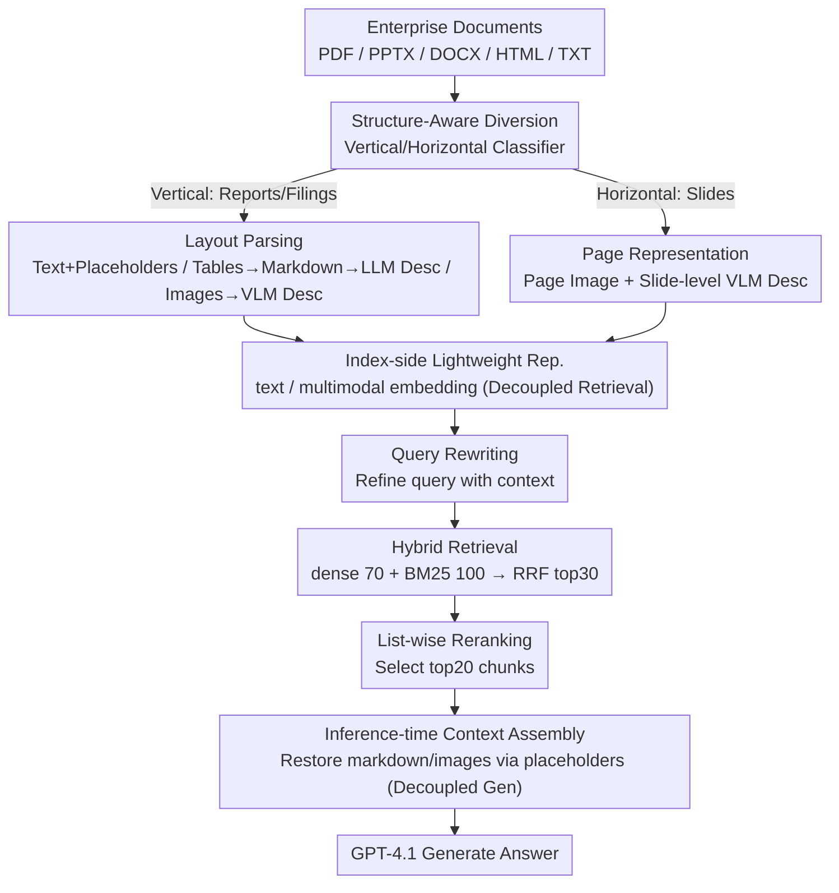

# MM-BizRAG: Rethinking Multimodal Retrieval-Augmented Generation for General Purpose Enterprise Q&A

**Conference**: ACL2026  
**arXiv**: [2606.04231](https://arxiv.org/abs/2606.04231)  
**Code**: None (open-source repository not provided in cache)  
**Area**: Multimodal Retrieval-Augmented Generation / Enterprise Q&A  
**Keywords**: MM-RAG, Enterprise Documents, Structure-Aware Parsing, Multimodal Retrieval, FastRAGEval

## TL;DR
MM-BizRAG demonstrates that enterprise multimodal RAG should not solely rely on page screenshots and vision embeddings. Instead, it should differentiate between reports and slides based on document structure, followed by explicit parsing of text, tables, and images. By assembling multimodal contexts during inference, it significantly outperforms vision-centric baselines on SlideVQA, FinRAGBench-V, and internal enterprise data.

## Background & Motivation
**Background**: Enterprise knowledge bases commonly contain documents such as PDF, DOCX, PPTX, HTML, and TXT, which mix text, tables, images, charts, and complex layouts. A recent simplified trend in multimodal RAG treats pages as images, using vision embeddings for retrieval and passing page images to VLMs for answer generation.

**Limitations of Prior Work**: The page-as-image approach bypasses parsing but leaves the reading order, table structures, and spatial relationships between text and images to be implicitly understood by pre-trained VLMs. Structured information in enterprise documents—especially financial reports, compliance materials, technical documents, and multi-page business reports—often falls outside the training distribution of general-purpose models.

**Key Challenge**: RAG retrieval requires lightweight, stable, and indexable representations, while answer generation requires rich, structure-preserving multimodal context. Using the same page screenshot for both retrieval and generation may lead to inaccurate retrieval and the loss of table data or reading sequence.

**Goal**: The authors aim to build an MM-RAG system that can be deployed for heterogeneous enterprise documents without model fine-tuning. The system explicitly processes structured artifacts and systematically compares the impact of different ingestion representations and embedding strategies.

**Key Insight**: The paper first classifies documents into vertical documents (reports, PDFs, filings) and horizontal documents (slide decks) based on structure, then designs separate parsing and chunking pipelines. Lightweight representations are used for retrieval, and original artifacts are reassembled during the generation phase.

**Core Idea**: Decouple the "representation for retrieval" from the "context for generation." During retrieval, it indexes lightweight text, descriptions, and page representations. During generation, it restores table markdown, images, and page screenshots based on placeholders and metadata, constructing multimodal evidence that closely mirrors the original document structure.

## Method

### Overall Architecture
MM-BizRAG addresses the heterogeneous documents found in enterprise knowledge bases: PDF financial reports, PPTX slides, and DOCX technical documents. Relying solely on page screenshots and vision embeddings loses table structures and reading orders. The main pipeline is document structure-aware ingestion—identifying whether a document is vertical (reports/filings with a natural reading order) or horizontal (slides where each page is a complete semantic unit) before routing them to different parsing paths.

For vertical documents, tools like Docling extract text blocks, tables, images, and page images. Table/image placeholders are inserted into the text to maintain reading order; tables are converted to markdown with line-by-line descriptions generated by an LLM, and images are described by a VLM (filtering out uninformative content like logos). For horizontal documents, each page is preserved as a page image accompanied by a VLM-generated slide-level description. During the retrieval phase, text or multimodal embeddings are built according to variants. At inference, a query rewriter refines the query using conversation history, followed by dense + BM25 hybrid retrieval. RRF merges the results to take the top 30 for a list-wise LLM reranker, finally selecting the top 20 chunks to assemble into a multimodal context for GPT-4.1 to generate the answer. The paper defines three variants (TCTE, PCMHE, TCMIE) based on chunk granularity, embedding models, and artifact injection timing.

### Key Designs

**1. Structure-Aware Document Diversion: Reports and Slides Require Different Parsing**

Reports rely on the linear sequence of paragraphs and tables, while slides depend on the spatial layout of each page. Forcing both into a single chunking strategy leads to suboptimal results. MM-BizRAG implements a vertical/horizontal classifier where vertical documents undergo layout-aware parsing (retaining text order, table markdown, image descriptions, and page images), and horizontal documents treat each page as an indivisible semantic unit using page images and VLM descriptions. In experiments, this classifier achieved 100% precision and 83.28% recall, providing a reliable foundation for structure-tailored parsing.

**2. Decoupling Retrieval Representation and Generation Context: Use Lightweight Descriptions for Indexing, Restore Original Artifacts for Generation**

Table markdown and image base64 data are bulky; indexing them directly causes vector database bloat and slows down retrieval. However, generation requires these original artifacts for accurate reporting. MM-BizRAG separates the "representation for retrieval" from the "context for generation." In the TCTE variant, the index side uses only text chunks, table descriptions, and image descriptions for text embedding. When a table or image description is hit during retrieval, the system follows its placeholder back to the parent text chunk and injects the table markdown, image artifact, and descriptions into their original positions. This keeps the index lean and retrieval efficient while providing the generator with multimodal evidence nearing the original structure—avoiding the common RAG pitfall of binding index and prompt schemas together.

**3. FastRAGEval Single-Call Evaluation: Calculating Fact-level Recall with One LLM Call**

Answers in enterprise QA are often long paragraphs; token overlap and exact match metrics fail to capture whether key facts were recalled. Two-stage approaches like RAGChecker (claim decomposition + matching) are expensive and high-latency for large-scale evaluation. FastRAGEval (FRE) compresses this into a single LLM call: it simultaneously extracts atomic facts from the reference and prediction to calculate precision, recall, and F1. The paper focuses on FRE recall, which shows a higher correlation with human judgment (Pearson 0.808) compared to RAGChecker (0.748), proving that single-call metrics do not sacrifice consistency while significantly reducing judgment costs.

### A Concrete Example: How a Query Retrieves Table Evidence
Suppose a user asks about "Year-over-year change in Q3 overseas revenue" in a financial report. The query rewriter first uses conversation history to form a self-contained query. Hybrid retrieval fetches 70 dense and 100 BM25 chunks, which are fused via RRF to pass the top 30 to the list-wise reranker. If a top hit is a table description stating "This table shows quarterly revenue by region," the system does not just feed this thin description to the generator. Instead, it uses the placeholder to retrieve the parent text chunk and injects the corresponding table markdown (containing the actual numbers) and context paragraphs. The final top 20 chunks contain the structured, readable original table, allowing GPT-4.1 to answer precisely rather than guessing from a cropped screenshot.

### Loss & Training
This paper does not train a specific retriever or generative model; the focus is entirely on the design of ingestion, retrieval, and assembly. Components used include Docling, EasyOCR, PyPdfium2, Tableformer, OpenAI text-embedding-3-large, nomic-multimodal-embed-3b, cohere-embed-v4, the GPT-4.1 series, ColPali, and VisRAG-Ret. The inference pipeline constants are: 70 chunks for dense retrieval, 100 for BM25, RRF top 30 into the list-wise reranker, and the final top 20 for answer generation.

## Key Experimental Results

### Main Results

| Pipeline | SlideVQA FRE | FinRAGBench-V FRE | Internal FRE | Key Conclusion |
|------|------|------|------|------|
| Text-Only | 67.8 | 60.3 | 83.7 | Strong on text-only questions, weak on tables/images |
| ColPali | 83.6 | 49.3 | - | Stronger than text-only for slides, weak for report-style docs |
| VisRAG | 78.8 | 46.0 | - | Similarly limited by page-image-centric approach |
| TCTE (OAI v3-large) | 87.3 | 80.2 | 88.1 | Recommended production config; lower latency for vertical docs |
| PCMHE (Nomic) | 89.9 | 79.6 | 87.6 | Best on SlideVQA |
| PCMHE (Cohere) | 89.06 | 82.4 | 87.8 | Best on FinRAGBench-V |
| TCMIE (Cohere) | 88.2 | 76.9 | 88.0 | Comparable to TCTE on internal data |

### Ablation Study

| Analysis Item | Value / Observation | Description |
|------|------|------|
| Vertical-horizontal classifier | Precision 100.00, Recall 83.28, F1 90.87 | Doc structure diversion is reliable, though recall can be improved |
| FRE vs RAGChecker Pearson | 0.808 vs 0.748 | FRE correlates better with human judgment |
| FRE vs RAGChecker Spearman | 0.808 vs 0.736 | Better ranking consistency |
| FRE vs RAGChecker Kendall | 0.808 vs 0.725 | Single-call metric does not sacrifice consistency |
| Human Annotation Agreement | Cohen's kappa 0.966 | High agreement across 200 double-annotated instances |
| TCTE Latency | FinRAGBench-V 11.9s, Internal 11.1s | For vertical docs, roughly half the latency of PCMHE Cohere |

### Key Findings
- On SlideVQA, MM-BizRAG achieves a peak FRE recall of 89.9, a 6.3 percentage point improvement over ColPali (83.6), indicating that explicit text/vision fusion is beneficial even for slides.
- On FinRAGBench-V, PCMHE Cohere achieves an FRE recall of 82.4, whereas ColPali scores only 49.3 and VisRAG 46.0; page-centric methods degrade significantly on report-style documents.
- Internal data (1,908 questions, 1,048 documents, 20,429 pages) showed all MM-BizRAG variants outperformed text-only (83.7).
- TCTE is the recommended production configuration: its recall is usually within 1-3 percentage points of the best model, but its latency is approximately half that of PCMHE.
- Faithfulness across all MM-BizRAG variants exceeds 90%, proving that structured assembly does not result in more hallucination despite the richer context.

## Highlights & Insights
- The paper refutes the intuition that "parsing is unnecessary once VLMs are strong enough." Table structures, headers/footers, cross-page narratives, and image-text sequences in enterprise docs still require explicit modeling.
- The decoupling of retrieval representation and generation context is a highly practical engineering design. Many RAG systems bind the index and prompt schemas, leading to either heavy retrieval or impoverished evidence.
- The performance of TCTE is significant: the strongest configuration is not always the best for production. Trade-offs between latency, cost, and recall must be evaluated together.
- FastRAGEval is highly practical. For long-paragraph answers in enterprise QA, token F1 or exact match is meaningless; single-call fact-level recall better reflects business requirements.

## Limitations & Future Work
- Evaluation for slides relies heavily on SlideVQA, which is relatively simple and may not represent complex enterprise-grade presentations.
- FinRAGBench-V only processed a subset of 213 English PDF documents out of the original 1,100+, and multi-language enterprise scenarios were not evaluated.
- Public baselines are limited to ColPali and VisRAG; comparisons with more recent or proprietary enterprise RAG systems are missing.
- Internal enterprise data cannot be released due to privacy and organizational constraints, limiting reproducibility; future synthesis or anonymized releases would be valuable.
- The system relies on GPT-4.1 for descriptions, query rewriting, reranking, and answering; cost, rate limits, and model version shifts affect deployment performance.

## Related Work & Insights
- **vs ColPali**: ColPali uses VLMs for document page retrieval, which is suitable for visual page matching; MM-BizRAG explicitly restores text, tables, and image structures, showing clear advantages on report-style documents.
- **vs VisRAG**: VisRAG also emphasizes page images and multimodal retrieval, while MM-BizRAG argues that generation context requires artifact-aware assembly rather than just delivering page images.
- **vs Text-only RAG**: Text-only remains strong for text-dense questions but fails on tables and images; MM-BizRAG complements text strengths with multimodal evidence.
- **Insight**: Ingestion for enterprise RAG should not just ask "which embedding to use," but also "what is the document structure, which artifacts are for indexing, and which are for assembly during generation."

## Rating
- Novelty: ⭐⭐⭐⭐☆ Components are mostly existing technologies, but the combination of structure diversion, placeholder alignment, and inference-time assembly is a strong engineering innovation.
- Experimental Thoroughness: ⭐⭐⭐⭐☆ Supported by large-scale internal data and two public benchmarks, though public reproducibility and baseline breadth are limited.
- Writing Quality: ⭐⭐⭐⭐☆ System design is clear, and variant comparisons are useful; readers must carefully follow symbols and pipelines due to system complexity.
- Value: ⭐⭐⭐⭐⭐ Highly valuable for implementing enterprise multimodal RAG, particularly as a reminder not to abandon explicit document parsing prematurely.

<!-- RELATED:START -->

## Related Papers

- [\[ACL 2026\] UniversalRAG: Retrieval-Augmented Generation for Multimodal Corpora](universalrag_retrieval-augmented_generation_over_corpora_of_diverse_modalities_a.md)
- [\[ACL 2026\] Utility-Oriented Visual Evidence Selection for Multimodal Retrieval-Augmented Generation](utility-oriented_visual_evidence_selection_for_multimodal_retrieval-augmented_ge.md)
- [\[ICLR 2026\] RAG4DMC: Retrieval-Augmented Generation for Data-Level Modality Completion](../../ICLR2026/multimodal_vlm/rag4dmc_retrieval-augmented_generation_for_data-level_modality_completion.md)
- [\[NeurIPS 2025\] Windsock is Dancing: Adaptive Multimodal Retrieval-Augmented Generation](../../NeurIPS2025/multimodal_vlm/windsock_is_dancing_adaptive_multimodal_retrieval-augmented_generation.md)
- [\[NeurIPS 2025\] Benchmarking Retrieval-Augmented Multimodal Generation for Document Question Answering](../../NeurIPS2025/multimodal_vlm/benchmarking_retrievalaugmented_multimodal_generation_for_do.md)

<!-- RELATED:END -->
