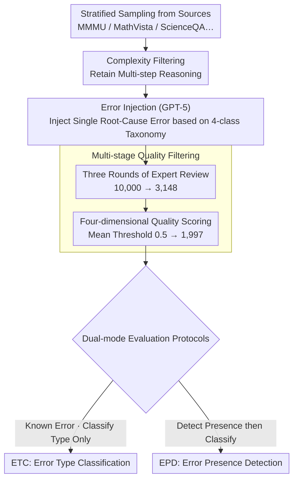

# MMErroR: A Benchmark for Erroneous Reasoning in Vision-Language Models

**Conference**: ACL 2026  
**arXiv**: [2601.03331](https://arxiv.org/abs/2601.03331)  
**Code**: [https://mmerror-benchmark.github.io](https://mmerror-benchmark.github.io)  
**Area**: Multimodal VLM  
**Keywords**: Error reasoning diagnosis, VLM evaluation, Process-level evaluation, Error classification, Multimodal reasoning  

## TL;DR

This paper proposes MMErroR, a multimodal erroneous reasoning benchmark containing 1,997 samples. Each sample embeds a single reasoning error across six major domains and four error categories. It requires VLMs not only to detect the presence of errors in the reasoning chain but also to classify the error type (Visual Perception Error / Knowledge Application Error / Question Comprehension Error / Reasoning Error). Evaluation of 12 representative VLMs shows that even the strongest model, Gemini-3-Pro-Preview, only achieves 66.65% accuracy.

## Background & Motivation

**Background**: Vision-Language Models (VLMs) have continuously set new records on benchmarks such as MMMU and MathVista, creating an impression that models are approaching human-level understanding. However, existing evaluations almost exclusively adopt a "result-oriented" paradigm—checking only whether the final answer is correct, without concern for whether the reasoning process used to reach that answer is sound.

**Limitations of Prior Work**: (1) Correct final answers do not imply correct reasoning processes—models may reach correct results through shortcuts or pattern matching, masking deficiencies in inherent reasoning abilities; (2) Existing error localization benchmarks (e.g., ProcessBench, ErrorRadar) focus only on "which step is wrong" without diagnosing the type or root cause of the error; (3) These benchmarks are either limited to a single modality (pure text) or lack domain diversity and an error classification system.

**Key Challenge**: There is a significant gap between the high scores of VLMs on various benchmarks and their diagnostic capabilities when faced with erroneous reasoning chains. While models can generate seemingly plausible reasoning chains, they fail to judge errors within them, indicating that "generation capability" and "introspection capability" are two distinct types of abilities.

**Goal**: To construct a multimodal, multi-domain, process-level reasoning evaluation benchmark with error type classification to systematically assess whether VLMs possess the ability to "recognize erroneous reasoning and diagnose error types."

**Key Insight**: Approaching the problem through "Error Classification" rather than just "Error Localization"—not only detecting which step is wrong but also diagnosing whether the root cause is visual perception failure, knowledge application failure, question comprehension deviation, or logical reasoning fallacy.

**Core Idea**: Designing a controlled benchmark where each sample contains only one clear root-cause error. Errors are injected via GPT-5, followed by three rounds of human verification and quality score filtering to ensure uniqueness and attributability of error type labels. The benchmark supports two evaluation modes: Error Type Classification (ETC) and Error Presence Detection (EPD).

## Method

### Overall Architecture

The construction process of MMErroR consists of four steps: (1) Problem Curation—stratified sampling from benchmarks like MMMU, MathVista, MathVerse, ScienceQA, and AI2D, with complexity filtering to retain multi-step reasoning instances; (2) Error Injection—using GPT-5 to inject a semantically coherent error into a correct reasoning chain, restricted to one of four predefined types; (3) Data Verification—20 experts (6 professors + 14 PhD students) performed three rounds of manual checks, filtering the initial 10,000 samples down to 3,148; (4) Quality Assurance—at least two linguistics experts scored samples across four dimensions: coherence, step clarity, error localizability, and semantic consistency, retaining 1,997 samples with a mean score $> 0.5$. The completed benchmark is used with two evaluation protocols (ETC / EPD). The following three key designs correspond to: how to classify errors, how to generate high-quality controlled chains, and how to evaluate them.

### Key Designs

**1. Four-category Error Taxonomy: Upgrading "Which Step" to "Why"**

Benchmarks that only locate error steps (e.g., ProcessBench, ErrorRadar) can identify which step in the reasoning chain failed but cannot specify which capability failed. MMErroR decomposes root causes into four mutually exclusive types corresponding to different stages of the VLM multimodal pipeline: Visual Perception Error (VPE: object misidentification, spatial misjudgment, symbol misreading), Knowledge Application Error (KDE: wrong formulas, misused physical laws; the largest portion at 44.07%), Question Comprehension Error (QCE: misunderstanding intent, ignoring key constraints), and Reasoning Error (RE: logical fallacies, missing premises, invalid steps). Since each reasoning chain contains only one injected error, each failure can be uniquely attributed to one category, making diagnostic results interpretable without being muddied by multiple errors.

**2. Single-Error Controlled Design + Multi-stage Quality Filtering: Ensuring Attributability and High Quality**

Real-world reasoning failures often involve cascading errors, but this leads to diagnostic confusion and ambiguous labels. MMErroR opts for the clarity of diagnostic labels over absolute realism by mandating that each chain contains only one root-cause error while keeping other steps locally coherent and logically valid. Quality is controlled via the "Multi-stage Quality Filtering" shown in the diagram: three rounds of expert review (requiring unanimous approval) plus four-dimensional quality scoring (Coherence / Step Clarity / Error Localizability / Semantic Consistency; threshold $> 0.5$). The final annotation consistency reached Cohen's Kappa $\kappa = 0.796$, with a third-round rejection rate of only 2.81% (97.19% observation agreement), filtering the initial 10,000 samples down to 1,997.

**3. Dual-mode Evaluation Protocols (ETC + EPD): Measuring Introspection at Two Difficulty Levels**

Simply asking a model to classify under the premise that "an error exists" does not test whether it can actively discover errors. MMErroR therefore sets two levels: ETC (Error Type Classification) directly informs the model that the chain is definitely erroneous, requiring it only to identify the type, testing diagnostic precision. EPD (Error Presence Detection) requires the model to first judge "whether an error exists" before classifying it—a more difficult controlled stress test. While EPD could theoretically be bypassed by always reporting an error, the scoring rules require the correct classification of the error type to receive points, forcing the model to actually judge the presence of the error. The combination of both modes quantifies both diagnostic precision and the ability to actively discover errors.

### Loss & Training

This paper is a benchmark study and does not involve model training. Evaluation utilizes a multiple-choice format where the model outputs the corresponding label. All model decoding temperatures are set to 0 to ensure determinism and reproducibility.

## Key Experimental Results

### Main Results

| Model | ML | PE | CM | BH | EE | DA | Total (ETC) |
|------|-----|-----|-----|-----|-----|-----|---------|
| Gemini-3-Pro-Preview | 66.37 | 66.88 | 69.81 | 64.43 | 65.39 | 69.26 | 66.65 |
| Doubao-Seed-2.0-pro | 65.47 | 67.32 | 61.01 | 59.94 | 66.16 | 66.22 | 64.80 |
| GPT-5.2 (xhigh) | 64.56 | 63.62 | 62.26 | 60.50 | 65.14 | 69.59 | 64.30 |
| Claude-Opus-4.5 | 62.76 | 61.00 | 61.64 | 57.70 | 56.74 | 68.58 | 61.04 |
| Kimi-K2.5 | 63.66 | 55.56 | 51.57 | 58.82 | 66.67 | 61.15 | 60.19 |
| Qwen3-VL-32B-Thinking | 59.46 | 54.90 | 52.20 | 65.83 | 60.81 | 59.80 | 59.29 |
| Human Expert (High) | 91.07 | 88.65 | 87.50 | 90.15 | 88.96 | 90.18 | 89.52 |
| Random Choice | 22.10 | 23.62 | 24.18 | 24.06 | 21.50 | 25.53 | 23.45 |

| Model | ETC Total | EPD Total | EPD Drop |
|------|---------|---------|------------|
| Gemini-3-Pro-Preview | 66.65 | 61.39 | -5.26 |
| GPT-5.2 (xhigh) | 64.30 | 58.54 | -5.76 |
| Claude-Opus-4.5 | 61.04 | 55.18 | -5.86 |
| Kimi-K2.5 | 60.19 | 51.63 | -8.56 |
| LLaMA-4-Maverick | 39.46 | 18.13 | -21.33 |

### Ablation Study

| Input Condition | Gemini-3-Pro | GPT-5.2 | Doubao-Seed | Qwen3-VL-32B |
|---------|-------------|---------|------------|-------------|
| VQA (Original Q&A) | 81.0 | 80.0 | 80.5 | 78.5 |
| VQA + Error Chain | 82.5 | 80.5 | 81.5 | 80.0 |
| VQA + Error Chain + Error Step | 84.0 | 82.0 | 83.0 | 82.5 |
| VQA + Error Chain + Error Type | 90.5 | 89.5 | 88.5 | 84.5 |

### Key Findings

- **Significant Gap from Human Experts**: The strongest VLM (66.65%) lags nearly 23 percentage points behind high-level human experts (89.52%), indicating that error reasoning diagnosis is a major weakness for VLMs.
- **EPD is Much Harder than ETC**: All models show a significant performance drop from ETC to EPD. LLaMA-4-Maverick plummeted from 39.46% to 18.13%, suggesting that "actively discovering errors" is much more difficult than "classifying errors when informed they exist."
- **Correlation Between Diagnostic and Q&A Capability**: Samples where models correctly diagnosed error types also had higher original VQA accuracy (Gemini: 85.5% vs 74.5%), showing that error diagnosis reflects genuine depth of understanding.
- **Error Type Information is More Useful than Error Step**: Providing the error type improved VQA accuracy by ~9.5 points, while providing only the error step yielded only ~2-3 points of gain. This proves that knowing "why it is wrong" has more corrective value than knowing "where it is wrong."
- **No Single Model Dominates All Domains**: Different models show strengths in different areas, indicating that error diagnosis relies on a variety of underlying capabilities, including domain knowledge, visual grounding, and procedural reasoning.

## Highlights & Insights

- **Paradigm Shift from "Answer Correctness" to "Process Diagnosis"**: MMErroR is the first to push multimodal reasoning evaluation from "is the result right" to "can it diagnose error types in the reasoning process," providing a new perspective on true VLM reasoning capabilities.
- **Error Types Hold More Corrective Value than Error Locations**: Ablation experiments clearly show that knowing "why it went wrong" (error type) is more effective for correction than knowing "where it went wrong" (error step), offering key insights for the design of future VLM self-correction mechanisms.
- **Logit Lens Visualization**: Through logit lens analysis of Qwen3-VL-32B-Instruct, the paper demonstrates precise semantic alignment between visual and textual tokens during correct diagnoses and the collapse of cross-modal alignment during incorrect ones.
- **Extremely Strict Quality Control**: Filtering from 10,000 initial samples through three rounds of expert review to 3,148, and then through quality scoring to 1,997 (approx. 20% retention) with a Cohen’s Kappa of 0.796 ensures the high reliability of the benchmark.

## Limitations & Future Work

- Each sample contains only a single error; real-world reasoning failures often involve cascading or multiple simultaneous errors.
- The current version only includes erroneous reasoning chains, so the EPD task cannot test the false positive rate (i.e., "over-reporting errors") on correct reasoning chains.
- The initial erroneous chains were generated by GPT-5, which may introduce biases specific to the generator model (error patterns or linguistic styles).
- Future work could expand to open-ended generation evaluation (instead of multiple-choice) and multi-error cascading scenarios.

## Related Work & Insights

- **vs ProcessBench/PRISM-Bench**: These benchmarks only locate error steps without classifying error types; MMErroR requires models to diagnose the root cause.
- **vs ErrorRadar**: ErrorRadar focuses on error localization but lacks multi-domain coverage and an error classification system.
- **vs POPE/HallusionBench**: These hallucination benchmarks mainly target visual perception errors; MMErroR covers higher-order failure modes such as knowledge application, question comprehension, and logical reasoning.
- **vs MMMU/MathVista**: These benchmarks use result-oriented evaluation; MMErroR shifts toward process-level diagnostic evaluation, serving as a complement.

## Rating

- Novelty: ⭐⭐⭐⭐ First systematic evaluation of VLM error reasoning diagnostic capabilities with a well-designed taxonomy.
- Experimental Thoroughness: ⭐⭐⭐⭐⭐ Evaluated 12 models across 6 domains with dual modes, supplemented by reasoning consistency, multimodal alignment, and error perception ablation.
- Writing Quality: ⭐⭐⭐⭐ Clear structure, rigorous experimental design, and transparent quality control.
- Value: ⭐⭐⭐⭐ Provides important benchmarks and insights for understanding and improving VLM introspection.

<!-- RELATED:START -->

## Related Papers

- [\[ICLR 2026\] OmniSpatial: Towards Comprehensive Spatial Reasoning Benchmark for Vision Language Models](../../ICLR2026/multimodal_vlm/omnispatial_towards_comprehensive_spatial_reasoning_benchmark_for_vision_languag.md)
- [\[ACL 2026\] Doc-PP: Document Policy Preservation Benchmark for Large Vision-Language Models](doc-pp_document_policy_preservation_benchmark_for_large_vision-language_models.md)
- [\[ACL 2026\] GeoRC: A Benchmark for Geolocation Reasoning Chains](georc_a_benchmark_for_geolocation_reasoning_chains.md)
- [\[CVPR 2026\] SpatiaLQA: A Benchmark for Evaluating Spatial Logical Reasoning in Vision-Language Models](../../CVPR2026/multimodal_vlm/spatialqa_a_benchmark_for_evaluating_spatial_logical_reasoning_in_vision-languag.md)
- [\[CVPR 2026\] QUANTIPHY: A Quantitative Benchmark Evaluating Physical Reasoning Abilities of Vision-Language Models](../../CVPR2026/multimodal_vlm/quantiphy_a_quantitative_benchmark_evaluating_physical_reasoning_abilities_of_vi.md)

<!-- RELATED:END -->
