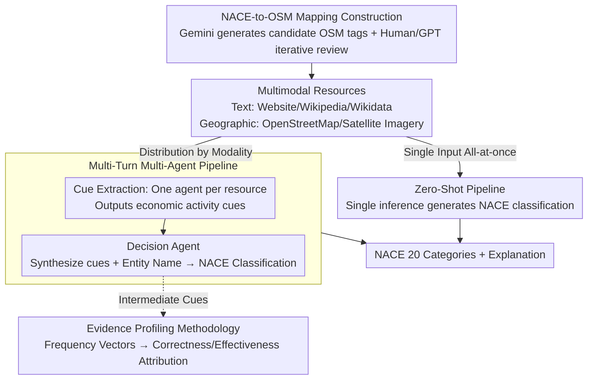

# MONETA: Multimodal Industry Classification through Geographic Information with Multi Agent Systems

**Conference**: ACL 2026  
**arXiv**: [2604.07956](https://arxiv.org/abs/2604.07956)  
**Code**: [GitHub](https://github.com/trusthlt/Moneta)  
**Area**: Remote Sensing / Multimodal Understanding  
**Keywords**: Industry Classification, Geographic Information, Multimodal LLM, Multi-Agent Systems, OpenStreetMap

## TL;DR

Ours proposes MONETA, the first multimodal industry classification benchmark combining text (websites, Wikipedia, Wikidata) and geospatial data (OpenStreetMap, satellite imagery). It designs training-free pipelines—Zero-Shot and Multi-Turn Multi-Agent—achieving 62.10%-74.10% accuracy across 20 NACE industry categories using open-source and closed-source MLLMs, with the multi-turn design improving performance by up to 22.80%.

## Background & Motivation

**Background**: Industry classification schemes (e.g., NACE, ISIC, GICS) are core components of public and corporate databases. Existing automated classification methods primarily rely on text (company descriptions, financial reports, websites) and typically require model fine-tuning.

**Limitations of Prior Work**: (1) Text-only methods are inapplicable to newly established or small enterprises that may lack public textual information; (2) Fine-tuned models require extensive data collection and cannot transfer across classification schemes; (3) Geospatial information (e.g., location and surroundings) contains strong industry cues but has never been systematically utilized.

**Key Challenge**: Corporate economic activities are highly correlated with spatial location (factories in industrial zones, banks in commercial streets), yet existing industry classification entirely ignores this spat-economic association.

**Goal**: To build the first multimodal industry classification benchmark and investigate whether MLLMs can leverage geospatial information for industry classification.

**Key Insight**: Maximize the potential of OpenStreetMap and satellite imagery as complementary information sources alongside text, utilizing a multi-agent architecture to extract cues from specialized modalities before final synthesis by a decision agent.

**Core Idea**: Multimodal resources + multi-agent + training-free—distinct agents extract economic activity cues from specific resources, while a decision agent synthesizes all cues for classification without requiring any parameter updates.

## Method

### Overall Architecture

The MONETA framework comprises two pipelines: (1) Zero-Shot—inputting all available resources into the MLLM at once to generate classification; (2) Multi-Turn—a two-stage process: in the cue extraction phase, each resource is assigned an independent MLLM agent to generate economic activity cues; in the decision phase, a decision agent synthesizes all cues and the entity name for the final classification. Both pipelines utilize geographic data linked via a "NACE-to-OSM mapping" and an "Evidence Profiling methodology" for agent attribution.

### Key Designs

**1. NACE-to-OSM Mapping Construction: Bridging industry classification and geographic data**

To enable models to utilize geospatial cues, a mapping between NACE industries and OpenStreetMap tags is required, which previously did not exist. MONETA constructs this semi-automatically: Gemini generates candidate OSM tags from NACE official RDF/XML guides, followed by manual review and iterative refinement with GPT/Gemini. This results in a verified OSM tag list for each NACE section. European OSM data is queried based on these tags, with quality filtering via names, addresses, and external links. Manual review ensures mapping accuracy, and this mapping serves as a reusable research output.

**2. Multi-Turn Multi-Agent Pipeline: Resource-specific cue extraction followed by decision agent synthesis**

Feeding OSM, satellite imagery, Wikidata, Wikipedia, and websites into a single inference session often leads to interference and "modal confusion." MONETA adopts a two-stage process: a cue extraction phase assigning specialized agents to each resource type to output free-text economic activity keywords; and a decision phase where a decision agent aggregates all intermediate cues, entity names, and NACE section descriptions for final classification. This mimics expert workflows—reviewing landmarks, imagery, and text separately before reaching a conclusion—making the multi-turn pipeline consistently superior to zero-shot with gains up to 22.80%.

**3. Evidence Profiling Methodology (Frequency Vectors): Quantifying agent contributions**

A challenge in multi-agent systems is identifying which resource contributed correct cues versus which misled the decision. MONETA uses frequency vectors for attribution: keywords extracted by each agent are grouped by NACE section and normalized into a frequency vector. Correctness and Effectiveness vectors are constructed using indices from ground-truth and predicted labels, respectively. Correctness measures cue relevance to Reality, while Effectiveness measures influence on the final Prediction. Analysis reveals that OSM and websites have the highest effectiveness, while satellite imagery has lower correctness but complements text.

### Loss & Training

A completely training-free framework. Evaluation includes open-source models (InternVL 2.5/3, Llava 1.6, QwenVL 2.5) and closed-source models (Gemini 2.5, GPT-5).

## Key Experimental Results

### Main Results

**Zero-Shot classification accuracy under different input configurations (selected models)**

| Model | No Extra Input | Satellite | Ext. Text | All Inputs |
|------|-----------|--------|---------|---------|
| InternVL 2.5-38B | 46.30 | 49.80 | 58.40 | 60.10 |
| InternVL 3-78B | 43.40 | 47.80 | 60.40 | 58.80 |
| QwenVL 2.5-72B | — | — | — | ~62% |

### Ablation Study

**Multi-Turn vs Zero-Shot Gain**

| Config | Description |
|------|------|
| Multi-turn + Rich context + Reason | Maximum Gain +22.80% |
| Expanded prompt (inc. NACE desc) | Significant improvement over simple prompt |
| Satellite imagery | Limited effect alone, but yields gains when combined with text |

### Key Findings

- External textual resources (websites/Wikipedia) contribute most to classification, while satellite imagery has limited effectiveness when used alone.
- Multi-turn multi-agent pipelines consistently outperform zero-shot pipelines, with improvements up to 22.80%.
- Classification with explanations (JSON output containing reasoning) achieves higher accuracy than pure label output.
- Closed-source models (GPT-5, Gemini 2.5) reach ~74%, significantly outperforming open-source counterparts.
- Evidence profiling reveals OSM and websites provide the most effective cues; satellite imagery correctness is lower but supplementary to text.

## Highlights & Insights

- First to introduce geospatial information into industry classification, establishing a new cross-domain research direction.
- The NACE-to-OSM mapping itself is a valuable research outcome that can be reused by subsequent work.
- The Evidence Profiling methodology provides a quantitative tool for evaluating intermediate steps in multi-agent systems.

## Limitations & Future Work

- The benchmark size of 1000 samples is relatively small, with only 50 samples per category.
- Resolution and coverage of geospatial resources vary significantly across regions.
- Finer-grained NACE classification (e.g., 88 divisions or 272 groups) has not yet been explored.
- Satellite imagery contribution is currently limited, possibly requiring higher resolution data or enhanced visual understanding.

## Related Work & Insights

- **vs. Text-only Industry Classification (Kühnemann et al.)**: The latter uses only website text, whereas Ours introduces geospatial modalities.
- **vs. Remote Sensing Classification (UC Merced, AID)**: The latter performs general land-use classification rather than specific enterprise-level industry classification.
- **vs. Fine-tuning Methods**: Fine-tuning requires large amounts of labeled data and is restricted to a single classification scheme; the training-free framework of Ours offers greater adaptability.

## Rating

- Novelty: ⭐⭐⭐⭐ First multimodal industry classification benchmark with geographic data.
- Experimental Thoroughness: ⭐⭐⭐⭐ Multi-model × multi-configuration × multi-pipeline + novel profiling method.
- Writing Quality: ⭐⭐⭐⭐ Clear problem statement and detailed dataset construction.
- Value: ⭐⭐⭐⭐ Open-source benchmark and mapping are highly beneficial for future research.

<!-- RELATED:START -->

- NACE: Statistical classification of economic activities in the European Community.
- OSM: OpenStreetMap contributors and data structures.
- Multimodal Small Business Classification using Geospatial Data.

<!-- RELATED:END -->

## Related Papers

- [\[ICLR 2026\] Why Keep Your Doubts to Yourself? Trading Visual Uncertainties in Multi-Agent Bandit Systems](../../ICLR2026/multimodal_vlm/why_keep_your_doubts_to_yourself_trading_visual_uncertainties_in_multi-agent_ban.md)
- [\[ACL 2026\] GeoArena: Evaluating Open-World Geographic Reasoning in Large Vision-Language Models](geoarena_evaluating_open-world_geographic_reasoning_in_large_vision-language_mod.md)
- [\[CVPR 2026\] Hierarchical Attacks for Multi-Modal Multi-Agent Reasoning](../../CVPR2026/multimodal_vlm/hierarchical_attacks_for_multi-modal_multi-agent_reasoning.md)
- [\[ACL 2026\] From Verbatim to Gist: Distilling Pyramidal Multimodal Memory via Semantic Information Bottleneck](from_verbatim_to_gist_distilling_pyramidal_multimodal_memory_via_semantic_inform.md)
- [\[ICLR 2026\] Multimodal Classification via Total Correlation Maximization](../../ICLR2026/multimodal_vlm/multimodal_classification_via_total_correlation_maximization.md)

<!-- RELATED:END -->
