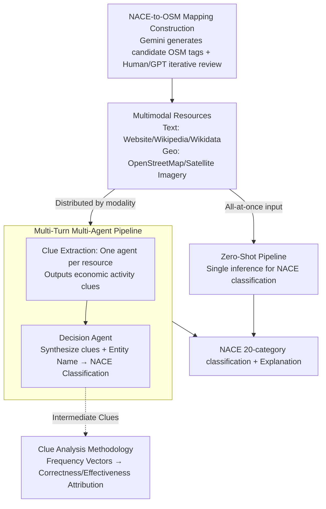

# MONETA: Multimodal Industry Classification through Geographic Information with Multi Agent Systems

**Conference**: ACL 2026  
**arXiv**: [2604.07956](https://arxiv.org/abs/2604.07956)  
**Code**: [GitHub](https://github.com/trusthlt/Moneta)  
**Area**: Remote Sensing / Multimodal Understanding  
**Keywords**: Industry Classification, Geographic Information, Multimodal LLM, Multi-Agent Systems, OpenStreetMap

## TL;DR

This paper proposes MONETA, the first multimodal industry classification benchmark combining text (websites, Wikipedia, Wikidata) and geospatial data (OpenStreetMap, satellite imagery). It designs two training-free pipelines—Zero-Shot and Multi-Turn Multi-Agent—achieving 62.10%-74.10% accuracy across 20 NACE categories using open and closed-source MLLMs, with the multi-turn design providing gains of up to 22.80%.

## Background & Motivation

**Background**: Industry classification schemes (such as NACE, ISIC, GICS) are core components of public and corporate databases. Existing automated classification methods primarily rely on text (company descriptions, financial reports, websites) and typically require fine-tuning models.

**Limitations of Prior Work**: (1) Pure text methods are inapplicable to newly established or small enterprises, as these entities may lack public textual information; (2) Fine-tuning models requires extensive data collection and cannot easily transfer across classification schemes; (3) Geospatial information (e.g., geographic location and surroundings) contains strong industrial clues but has never been systematically utilized.

**Key Challenge**: Corporate economic activities are highly correlated with their spatial locations (factories in industrial zones, banks in commercial streets), yet existing industry classification systems completely ignore this spatial-economic association.

**Goal**: To build the first multimodal industry classification benchmark and explore whether MLLMs can utilize geospatial information for industry classification.

**Key Insight**: Treat OpenStreetMap and satellite imagery as complementary information sources beyond text. Use a multi-agent architecture where clues from different modalities are extracted by specialized agents and then synthesized by a decision agent.

**Core Idea**: Multimodal resources + Multi-agent + Training-free—each resource type has economic activity clues extracted by specialized agents, which are then integrated by a decision agent for classification, requiring no training throughout the process.

## Method

### Overall Architecture

The MONETA framework includes two pipelines: (1) Zero-Shot—inputting all available resources into the MLLM at once to generate classification; (2) Multi-Turn—a two-stage process: in the clue extraction stage, each resource is handled by an independent MLLM agent to generate economic activity clues; in the decision stage, a decision agent synthesizes all clues and the entity name for the final classification. Both pipelines are built on geographic data enabled by "NACE-to-OSM mapping," and clues are attributed via the "Clue Analysis Methodology" after execution.

### Key Designs

**1. NACE-to-OSM Mapping Construction: Bridging classification systems and geographic data**

To enable models to use geospatial clues for industry classification, it is necessary to know which OpenStreetMap (OSM) tags correspond to specific NACE industries. This mapping did not exist previously. MONETA constructs it semi-automatically: first, Gemini generates candidate OSM tags from the NACE official guide's RDF/XML; then, through human review and multiple iterations with GPT/Gemini, a verified list of OSM tags for each NACE section is obtained. Subsequently, European OSM data is queried using these tags, with quality filtering based on names, addresses, and external links. The human review ensures that "factories" are not misidentified as "retail stores," making this mapping a reusable research output.

**2. Multi-Turn Multi-Agent Pipeline: Extracting clues individually before synthesis**

Placing OSM, satellite imagery, Wikidata, Wikipedia, and websites into a single inference often causes MLLMs to experience cross-modal interference. MONETA adopts a two-stage approach: in the clue extraction stage, each resource is assigned a specialized agent to output free-text economic activity keywords. In the decision stage, the decision agent aggregates all intermediate clues, entity names, and NACE section descriptions for the final classification. This mimics the audit process of human experts—examining surrounding landmarks, satellite images, and official website text separately before making a judgment. Consequently, the multi-turn pipeline consistently outperforms the zero-shot pipeline by up to 22.80%.

**3. Clue Analysis Methodology (Frequency Vectors): Quantifying agent contributions**

A challenge in multi-agent systems is determining which resource contributed correct clues and which misled the decision. MONETA uses frequency vectors for attribution: keywords extracted by each agent are grouped by NACE section and normalized into a frequency vector. By taking indices corresponding to the true and predicted labels, correctness and effectiveness vectors are formed. Correctness measures how relevant an agent's clues are to the ground truth, while effectiveness measures the influence exerted on the final prediction. Comparison reveals, for instance, that OSM and websites have the highest effectiveness, while satellite imagery has lower correctness and serves primarily as a supplement to text.

### Loss & Training

This is a completely training-free framework. Evaluations were performed on open-source models (InternVL 2.5/3, Llava 1.6, QwenVL 2.5) and closed-source models (Gemini 2.5, GPT-5).

## Key Experimental Results

### Main Results

**Zero-Shot classification accuracy under different input configurations (selected models)**

| Model | No Extra Info | Satellite Imagery | External Text | All Inputs |
|------|-----------|--------|---------|---------|
| InternVL 2.5-38B | 46.30 | 49.80 | 58.40 | 60.10 |
| InternVL 3-78B | 43.40 | 47.80 | 60.40 | 58.80 |
| QwenVL 2.5-72B | — | — | — | ~62% |

### Ablation Study

**Multi-Turn vs. Zero-Shot Improvement**

| Configuration | Description |
|------|------|
| Multi-Turn + Context Enrichment + Reasoning | Max improvement +22.80% |
| Expanded Prompt (with NACE descriptions) | Significant improvement over simple prompts |
| Satellite Imagery | Limited effect alone, but beneficial when combined with text |

### Key Findings

- External textual resources (websites/Wikipedia) contribute the most to classification; satellite imagery has limited effectiveness when used alone.
- The Multi-Turn multi-agent pipeline consistently outperforms the Zero-Shot pipeline, with gains up to 22.80%.
- Providing classification explanations (JSON output with reasoning) results in higher accuracy than simple label output.
- Closed-source models (GPT-5, Gemini 2.5) reach ~74%, significantly outperforming open-source models.
- Clue analysis reveals that OSM and websites have the highest effectiveness; satellite imagery has lower correctness but complements text.

## Highlights & Insights

- Introduces geospatial information to industry classification for the first time, opening a new cross-disciplinary research direction.
- The NACE-to-OSM mapping itself is a valuable research output reusable for future work.
- The frequency vector clue analysis provides a quantitative tool for evaluating intermediate steps in multi-agent systems.

## Limitations & Future Work

- The benchmark scale is relatively small (1000 samples), with only 50 samples per category.
- The resolution and coverage of geospatial resources vary by region.
- Finer-grained NACE classification (e.g., 88 divisions or 272 groups) has not been explored.
- The contribution of satellite imagery is limited, possibly requiring higher resolution or better visual reasoning capabilities.

## Related Work & Insights

- **vs. Text-only Industry Classification (Kühnemann et al.)**: The latter uses only website text, whereas this paper introduces geospatial modalities.
- **vs. Remote Sensing Classification (UC Merced, AID)**: The latter focuses on land-use classification rather than enterprise-level industry classification.
- **vs. Fine-tuning Methods**: Fine-tuning requires large amounts of labeled data and is restricted to a single classification scheme; this training-free framework offers better adaptability.

## Rating

- Novelty: ⭐⭐⭐⭐ First multimodal industry classification benchmark; novel combination of geospatial + text.
- Experimental Thoroughness: ⭐⭐⭐⭐ Multiple models × multiple configurations × multiple pipelines + novel clue analysis.
- Writing Quality: ⭐⭐⭐⭐ Clear research questions and detailed dataset construction process.
- Value: ⭐⭐⭐⭐ Open-source benchmark and mapping are highly beneficial for future research.

<!-- RELATED:START -->

## Related Papers

- [\[ICLR 2026\] Why Keep Your Doubts to Yourself? Trading Visual Uncertainties in Multi-Agent Bandit Systems](../../ICLR2026/multimodal_vlm/why_keep_your_doubts_to_yourself_trading_visual_uncertainties_in_multi-agent_ban.md)
- [\[CVPR 2026\] Tackling Model Bias via Game-theoretic Multi-agent Collaboration Framework for Hateful Meme Classification](../../CVPR2026/multimodal_vlm/tackling_model_bias_via_game-theoretic_multi-agent_collaboration_framework_for_h.md)
- [\[CVPR 2026\] Hierarchical Attacks for Multi-Modal Multi-Agent Reasoning](../../CVPR2026/multimodal_vlm/hierarchical_attacks_for_multi-modal_multi-agent_reasoning.md)
- [\[ACL 2026\] From Verbatim to Gist: Distilling Pyramidal Multimodal Memory via Semantic Information Bottleneck](from_verbatim_to_gist_distilling_pyramidal_multimodal_memory_via_semantic_inform.md)
- [\[ICLR 2026\] Multimodal Classification via Total Correlation Maximization](../../ICLR2026/multimodal_vlm/multimodal_classification_via_total_correlation_maximization.md)

<!-- RELATED:END -->
