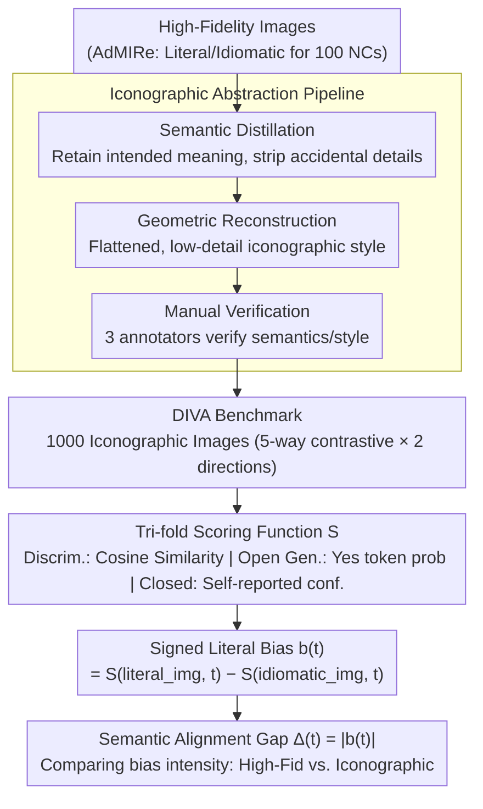

# More Than Meets the Eye: Measuring the Semiotic Gap in Vision-Language Models via Semantic Anchorage

**Conference**: ACL 2026  
**arXiv**: [2604.17354](https://arxiv.org/abs/2604.17354)  
**Code**: [GitHub](https://github.com/risehnhew/More-than-meets-the-eye)  
**Area**: Multimodal VLM / Semiotic Understanding  
**Keywords**: Vision-Language Models, Semiotic Gap, Literal Bias, Iconographic Abstraction, Noun Compounds

## TL;DR

This paper reveals the "literal superiority bias" of VLMs from a cognitive semiotic perspective—where models favor literal interpretations over metaphorical/idiomatic understanding in high-fidelity images. By introducing the DIVA benchmark (iconographically simplified images) and the Semantic Alignment Gap metric, the authors demonstrate that reducing visual fidelity significantly narrows the gap between literal and idiomatic interpretation.

## Background & Motivation

**Background**: Text-to-image models can generate highly realistic images, and VLMs excel at decoding literal image content. However, a fundamental cognitive gap remains in understanding abstract meanings such as idioms and metaphors.

**Limitations of Prior Work**: (1) Existing VL benchmarks primarily focus on literal visual-text alignment (object detection, attribute binding, etc.), with insufficient evaluation of figurative meaning. (2) Visual representation of noun compounds (e.g., "Eye Candy") requires a shift from literal iconicity to idiomatic symbolism, but models are often misled by high-fidelity visual details. (3) There is a lack of consistent evaluation metrics across architectures—discriminative models use cosine similarity, generative models use token probabilities, and closed-source models rely on behavioral probing.

**Key Challenge**: The pre-training objectives of VLMs over-optimize for physical reconstruction and visual simulation (Iconicity). Consequently, when faced with tasks requiring abstract/symbolic understanding, high-fidelity visual details act as "cognitive interference"—the model sees an "Eye" and only perceives the literal organ rather than the metaphorical meaning of "Eye Candy."

**Goal**: (1) Quantify the degree of literal bias in VLMs; (2) Validate the hypothesis that "reducing visual fidelity can enhance symbolic understanding"; (3) Provide a unified evaluation framework across heterogeneous architectures.

**Key Insight**: Grounded in semiotic theory—icons convey meaning through similarity, while symbols convey meaning through convention. Text is inherently symbolic, but images are typically iconic. When the iconicity (high-fidelity detail) of an image is too strong, the model remains locked in a literal interpretation.

**Core Idea**: Through "Iconographic Abstraction"—systematically reducing the visual fidelity of images (removing textures, lighting, and simplifying composition)—images are transformed from "realistic simulations" into "semantic symbols," thereby releasing the model's symbolic understanding potential.

## Method

### Overall Architecture

The construction pipeline for the DIVA benchmark: (1) Obtain literal and idiomatic high-fidelity images for 100 English noun compounds from the SemEval-2025 AdMIRe task. (2) Use Gemini to generate corresponding iconographic (low-fidelity, schematic) images, creating 5 contrastive images for each compound (High Idiomatic, High Literal, Weak Idiomatic, Weak Literal, Distractor). (3) Perform manual verification by 3 annotators. The evaluation pipeline follows "Library Construction → Scoring → Metric Calculation": high-fidelity images are abstracted into DIVA, then a tri-fold scoring function rates each image, and finally, the difference between literal and idiomatic scores is converted into a readable literal bias metric.

### Key Designs

**1. Iconographic Abstraction Pipeline: Pushing images from simulation to symbols via "fidelity reduction"**

The core hypothesis is that "high-fidelity details are cognitive interference." To test this, the authors developed a pipeline to systematically reduce visual fidelity without destroying semantics. Gemini is used for two-stage processing: first, semantic distillation to retain the intentional meaning of noun compounds while discarding incidental scene details; second, geometric reconstruction to constrain images to a flat, low-detail iconographic style. This yields the DIVA benchmark after manual verification.

This design is rooted in "Semantic Anchorage"—as visual signals become more "digital" (discrete, conventional) rather than "analog" (continuous, realistic), the model is no longer locked into literal readings by surface textures and becomes more willing to adopt a symbolic stance. The consistent decrease in $\Delta$ across all architectures (GPT-5 dropping from 0.065 to 0.021) directly supports this mechanism.

**2. Tri-fold Scoring: Enabling a unified $\Delta$ across Discriminative, Open-source Generative, and Closed-source models**

To score images across different architectures with varying "confidence signals," the scoring function $\mathcal{S}$ is implemented in three ways: Discriminative models (CLIP/SigLIP) use the cosine similarity of text-image embeddings; Open-source generative models (LLaVA/InternVL) use the "Yes" token probability (LID) when forced into Yes/No answers; Closed-source models (GPT-5/Claude) use self-reported confidence $\gamma \in [0,100]$, cross-validated with behavioral frequency from 10 repeated forced-choice trials.

These implementations compare trends within their own paradigms rather than absolute values across paradigms, ensuring consistency in the downstream $\Delta$ definition while adapting to heterogeneous signals.

**3. Semantic Alignment Gap ($\Delta$) and Signed Literal Bias ($b$): Quantifying literal bias as a scalar**

The study decomposes "literal bias" into two measures: For each noun compound $t$, the Signed Literal Bias $b(t) = \mathcal{S}(v_{lit}, t) - \mathcal{S}(v_{id}, t)$ is calculated. A $b(t) > 0$ indicates a preference for the literal image. The Semantic Alignment Gap $\Delta(t) = |b(t)|$ measures the intensity of this bias. 

Because $\Delta$ is a relative difference for the same model across two images, it effectively cancels out the variations in scoring scales between architectures, allowing for meaningful trend comparisons within architecture families.

### Loss & Training

This is an evaluative work and does not involve model training. DIVA contains 1,000 iconographic images (100 NCs × 5 contrasts × 2 semantic directions).

## Key Experimental Results

### Main Results

| Model | $\Delta$ (AdMIRe/High-Fid) | $\Delta$ (DIVA/Iconographic) | $\Delta$ Reduction |
|------|------------------|----------------|--------|
| SigLIP 2 | 0.245 | 0.178 | -27% |
| EVA-CLIP-18B | 0.262 | 0.191 | -27% |
| InternVL3-78B | 0.138 | 0.089 | -36% |
| Qwen2.5-VL-32B | 0.145 | 0.095 | -34% |
| LLaVA-OV-7B | 0.176 | 0.122 | -31% |
| GPT-5 | 0.065 | 0.021 | -68% |
| Claude 4.5 Sonnet | 0.072 | 0.028 | -61% |

### Ablation Study

| Analysis Dimension | Result |
|----------|------|
| Discriminative vs. Generative | Discriminative models show the largest $\Delta$ (~0.25), Generative is significantly smaller (~0.14), Closed-source is the smallest (~0.07). |
| Model Scaling Effects | Within the same architecture, larger models do not necessarily have smaller $\Delta$—scale alone does not solve literal bias. |
| 5-way Selection Accuracy | Iconographic images improved accuracy across all model families (Discrim. 42.3→58.7%, Closed 78.5→91.3%). |

### Key Findings

- All models exhibit a positive $b(t)$ (literal preference) under all conditions, which is more severe in high-fidelity images.
- Iconographic abstraction consistently reduces $\Delta$ across all architecture families—GPT-5 dropped from 0.065 to 0.021, approaching zero bias.
- Discriminative models suffer most from "cognitive interference"—CLIP-like models rely excessively on texture and surface features.
- Spearman correlation analysis shows high alignment between human evaluation and the $\Delta$ metric ($\rho=0.64-0.73$).

## Highlights & Insights

- Applying semiotic theory to VLM evaluation is a highly novel perspective—transforming the question of "why models don't understand metaphors" into a quantifiable measurement of position on the "icon-symbol continuum."
- The counter-intuitive finding that "high fidelity is cognitive interference" is profound—more realistic images do not necessarily facilitate understanding, challenging the implicit assumption that "clearer is better."
- The tri-fold design of the $\Delta$ metric elegantly solves the comparability problem of cross-architecture evaluation.

## Limitations & Future Work

- Restricted to English noun compounds; does not address cross-cultural metaphors (e.g., Chinese "Iron Rice Bowl").
- The specific style of iconographic images (flat design) might introduce style bias—models might perform better due to familiarity with specific styles.
- Self-reported confidence in closed-source models might reflect instruction-following tendencies rather than true semantic judgment.
- Primarily a diagnostic tool; does not propose a method for model improvement.

## Related Work & Insights

- **vs. T2I-CompBench/GenEval**: These benchmarks focus on physical compositionality (e.g., a blue ball next to a red square); this work focuses on semantic compositionality—where noun combinations produce abstract meanings beyond the literal parts.
- **vs. AdMIRe (SemEval-2025)**: AdMIRe evaluates whether models align with idiomatic images but uses high-fidelity images that may introduce confounding factors; DIVA controls for visual complexity through iconography.
- **vs. IconQA**: IconQA uses iconographic diagrams for reasoning but does not involve figurative understanding.

## Rating

- Novelty: ⭐⭐⭐⭐⭐ (Semiotic perspective + Iconographic Abstraction hypothesis + Unified cross-architecture metric)
- Experimental Thoroughness: ⭐⭐⭐⭐ (8 models, 3 architectural paradigms, human verification, but limited to English NCs)
- Writing Quality: ⭐⭐⭐⭐⭐ (Elegant theoretical framework, rigorous methodology, clear exposition)
- Value: ⭐⭐⭐⭐ (Deeply reveals the literal bias of VLMs, though lacks a mitigation solution)

<!-- RELATED:START -->

## Related Papers

- [\[CVPR 2026\] More than the Sum: Panorama-Language Models for Adverse Omni-Scenes](../../CVPR2026/multimodal_vlm/more_than_the_sum_panorama-language_models_for_adverse_omni-scenes.md)
- [\[AAAI 2026\] PatientVLM Meets DocVLM: Pre-Consultation Dialogue Between Vision-Language Models for Efficient Diagnosis](../../AAAI2026/multimodal_vlm/patientvlm_meets_docvlm_pre-consultation_dialogue_between_vision_language_models.md)
- [\[ACL 2026\] Cross-Modal Taxonomic Generalization in (Vision-) Language Models](cross-modal_taxonomic_generalization_in_vision-_language_models.md)
- [\[ACL 2026\] Topology-Aware Layer Pruning for Large Vision-Language Models](topology-aware_layer_pruning_for_large_vision-language_models.md)
- [\[CVPR 2026\] Continual Learning with Vision-Language Models via Semantic-Geometry Preservation](../../CVPR2026/multimodal_vlm/continual_learning_with_vision-language_models_via_semantic-geometry_preservatio.md)

<!-- RELATED:END -->
