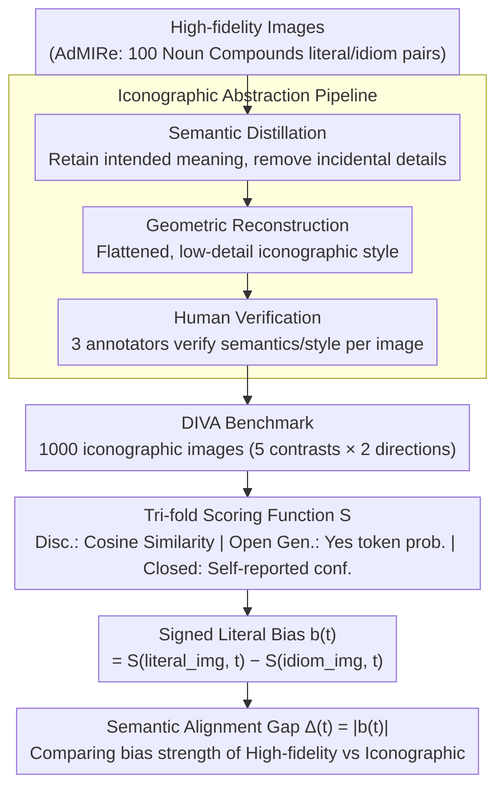

# More Than Meets the Eye: Measuring the Semiotic Gap in Vision-Language Models via Semantic Anchorage

**Conference**: ACL 2026  
**arXiv**: [2604.17354](https://arxiv.org/abs/2604.17354)  
**Code**: [GitHub](https://github.com/risehnhew/More-than-meets-the-eye)  
**Area**: Multi-modal VLM / Semiotic Understanding  
**Keywords**: Vision-Language Models, Semiotic Gap, Literal Bias, Iconographic Abstraction, Noun Compounds

## TL;DR

This paper reveals the "literal superiority bias" of VLMs from a cognitive semiotics perspective—models tend towards literal interpretation rather than metaphorical/idiomatic understanding on high-fidelity images. By introducing the DIVA benchmark (iconographically simplified images) and the Semantic Alignment Gap metric, the authors prove that reducing visual fidelity significantly narrows the gap between literal and idiomatic interpretations.

## Background & Motivation

**Background**: Text-to-image models can generate highly realistic images, and VLMs perform well in decoding the literal content of images. However, a fundamental cognitive gap remains in understanding abstract meanings (such as idioms and metaphors).

**Limitations of Prior Work**: (1) Existing VL benchmarks mainly focus on literal vision-text alignment (object detection, attribute binding, etc.), with insufficient evaluation of figurative meanings; (2) Visual representation of noun compounds (e.g., "Eye Candy") needs to shift from literal iconicity to idiomatic symbolism, but models are often misled by high-fidelity visual details; (3) There is a lack of evaluation metrics consistent across architectures—discriminative models use cosine similarity, generative models use token probability, and closed-source models can only rely on behavioral probing.

**Key Challenge**: The pre-training objectives of VLMs over-optimize for physical reconstruction and visual simulation (Iconicity), causing high-fidelity visual details to become "cognitive interference" when facing tasks requiring abstract/symbolic understanding. The model sees an "Eye" and only thinks of an actual eye, rather than the metaphorical meaning of "Eye Candy."

**Goal**: (1) Quantify the degree of literal bias in VLMs; (2) Validate the hypothesis that "reducing visual fidelity can improve symbolic understanding"; (3) Provide a unified evaluation framework across architectures.

**Key Insight**: Starting from semiotic theory—icons convey meaning through resemblance, while symbols convey meaning through convention. Text is inherently symbolic, but images are typically iconic. When the iconicity (high-fidelity details) of an image is too strong, the model becomes locked into a literal interpretation.

**Core Idea**: Through "Iconographic Abstraction"—systematically reducing the visual fidelity of images (removing textures, lighting/shadows, and simplifying composition)—images are transformed from "realistic simulations" into "meaning symbols," thereby releasing the model's potential for symbolic understanding.

## Method

### Overall Architecture

The construction process of the DIVA benchmark: (1) Obtain literal and idiomatic high-fidelity images for 100 English noun compounds from the SemEval-2025 AdMIRe task; (2) Use Gemini to generate corresponding iconographic (low-fidelity, schematic) images, generating 5 contrastive images for each compound (Strong Idiomatic, Strong Literal, Weak Idiomatic, Weak Literal, Distractor); (3) Human verification by 3 annotators. During evaluation, the pipeline follows "Database construction → Scoring → Metric calculation": high-fidelity images are first iconized into DIVA, then a tri-modal scoring function is used to score each image, and finally the score difference between literal and idiomatic images is converted into a readable literal bias metric.

### Key Designs

**1. Iconographic Abstraction Pipeline: Pushing images from simulation to symbol via "fidelity reduction"**

The core hypothesis of this paper is that "high-fidelity details are themselves cognitive interference." To verify this, a system is needed to systematically reduce visual fidelity without destroying semantics. The authors use Gemini for two-stage processing: first, semantic distillation to retain the intended meaning of noun compounds while removing incidental scene details; then, geometric reconstruction to constrain the image into a flat, low-detail iconographic style, finally verified by human annotators. 

Behind this step is the "Semantic Anchorage" theory—when visual signals become more "digital" (discrete, conventional) rather than "analog" (continuous, realistic), models are no longer locked into literal interpretations by surface textures and are more willing to adopt a symbolic stance to read metaphors. The consistent decrease in $\Delta$ across all architectures after fidelity reduction (GPT-5 dropped from 0.065 to 0.021) is direct evidence for this mechanism.

**2. Tri-fold Scoring Function: Enabling the same $\Delta$ to span discriminative, open-source generative, and closed-source models**

Since different architectures obtain "confidence signals" in completely different ways, a unified scoring function $\mathcal{S}$ is implemented in three ways: Discriminative models (CLIP/SigLIP) use the cosine similarity of image-text embeddings; open-source generative models (LLaVA/InternVL) use the probability of the "Yes" token (LID) when forced to answer Yes/No; closed-source models (GPT-5/Claude) use the model's self-reported confidence $\gamma \in [0,100]$, cross-validated by the behavior frequency of forced choices across 10 repetitions. 

Each implementation only compares trends within its own paradigm, ensuring that the definition of downstream $\Delta$ remains consistent while adapting to the heterogeneous observable signals of the three model types.

**3. Semantic Alignment Gap ($\Delta$) and Signed Literal Bias ($b$): Transforming "literal bias" into a readable scalar**

To quantify bias, for each noun compound $t$, the difference in semantic matching scores between the literal image $v_{lit}$ and idiomatic image $v_{id}$ is calculated as $b(t) = \mathcal{S}(v_{lit}, t) - \mathcal{S}(v_{id}, t)$. A value of $b(t) > 0$ represents the direction of literal preference, and the absolute value $\Delta(t) = |b(t)|$ measures the intensity of the bias. 

Because $\Delta$ is a relative difference for the same model across two images, it naturally cancels out the score scale differences between different architectures, allowing for meaningful trend comparisons within the same architecture family.

### Loss & Training

This paper is purely evaluative and does not involve model training. DIVA contains 1,000 iconographic images (100 NCs × 5 contrasts × 2 semantic directions).

## Key Experimental Results

### Main Results

| Model | $\Delta$ (AdMIRe/High-fidelity) | $\Delta$ (DIVA/Iconographic) | $\Delta$ Gain (Reduction) |
|------|------------------|----------------|--------|
| SigLIP 2 | 0.245 | 0.178 | -27% |
| EVA-CLIP-18B | 0.262 | 0.191 | -27% |
| InternVL3-78B | 0.138 | 0.089 | -36% |
| Qwen2.5-VL-32B | 0.145 | 0.095 | -34% |
| LLaVA-OV-7B | 0.176 | 0.122 | -31% |
| GPT-5 | 0.065 | 0.021 | -68% |
| Claude 4.5 Sonnet | 0.072 | 0.028 | -61% |

### Ablation Study

| Analysis Dimension | Result |
|----------|------|
| Discriminative vs. Generative | Discriminative models have the largest $\Delta$ (~0.25), generative models are significantly smaller (~0.14), and closed-source models are the smallest (~0.07). |
| Model Scale Effects | Within the same architecture, larger models do not necessarily have smaller $\Delta$—scale does not automatically solve literal bias. |
| 5-way Selection Accuracy | Iconographic images improved accuracy across all model families (Discriminative: 42.3→58.7%, Closed-source: 78.5→91.3%). |

### Key Findings

- All models exhibit positive $b(t)$ (literal preference) under all conditions, and it is more severe with high-fidelity images.
- Iconographic abstraction consistently reduces $\Delta$ across all architecture families—GPT-5 dropped from 0.065 to 0.021, approaching zero bias.
- Discriminative models suffer the most from "cognitive interference"—CLIP-like models rely excessively on texture and surface features.
- Spearman correlation analysis shows high consistency between human evaluation and the $\Delta$ metric ($\rho = 0.64-0.73$).

## Highlights & Insights

- Approaching VLM evaluation from semiotic theory is a very novel perspective—transforming "why models don't understand metaphors" into a quantifiable measurement of position on the "icon-symbol continuum."
- The counter-intuitive finding that "high fidelity is cognitive interference" is highly insightful—more realistic images do not necessarily facilitate understanding, challenging the implicit assumption that "the clearer the image, the better."
- The tri-modal design of the $\Delta$ metric cleverly solves the problem of comparability across architecture evaluations.

## Limitations & Future Work

- Limited to English noun compounds, not covering cross-cultural metaphors (e.g., Chinese "iron rice bowl").
- The specific style of iconographic images (flat design) might introduce style bias—models might perform better due to familiarity with specific styles.
- Self-reported confidence in closed-source models may reflect instruction-following tendencies rather than true semantic judgment.
- Serves only as a diagnostic tool and does not propose methods to improve models.

## Related Work & Insights

- **vs. T2I-CompBench/GenEval**: These benchmarks focus on physical compositionality (e.g., a blue ball next to a red square); this paper focuses on semantic compositionality—how noun combinations produce abstract meanings beyond the literal.
- **vs. AdMIRe (SemEval-2025)**: AdMIRe evaluates whether models can align idiomatic images but using high-fidelity images may introduce confounding factors; DIVA controls visual complexity through iconographic abstraction.
- **vs. IconQA**: IconQA uses iconographic charts for reasoning but does not involve metaphorical understanding.

## Rating

- Novelty: ⭐⭐⭐⭐⭐ (Semiotic perspective + Iconographic Abstraction hypothesis + unified cross-architecture metric)
- Experimental Thoroughness: ⭐⭐⭐⭐ (8 models, three architecture paradigms, human evaluation validation, but limited to English NCs)
- Writing Quality: ⭐⭐⭐⭐⭐ (Elegant theoretical framework, rigorous methodology, clear discourse)
- Value: ⭐⭐⭐⭐ (Deeply reveals the literal bias problem in VLMs, though lacks improvement solutions)

<!-- RELATED:START -->

## Related Papers

- [\[CVPR 2026\] More than the Sum: Panorama-Language Models for Adverse Omni-Scenes](../../CVPR2026/multimodal_vlm/more_than_the_sum_panorama-language_models_for_adverse_omni-scenes.md)
- [\[AAAI 2026\] PatientVLM Meets DocVLM: Pre-Consultation Dialogue Between Vision-Language Models for Efficient Diagnosis](../../AAAI2026/multimodal_vlm/patientvlm_meets_docvlm_pre-consultation_dialogue_between_vision_language_models.md)
- [\[ACL 2026\] Cross-Modal Taxonomic Generalization in (Vision-) Language Models](cross-modal_taxonomic_generalization_in_vision-_language_models.md)
- [\[ACL 2026\] Topology-Aware Layer Pruning for Large Vision-Language Models](topology-aware_layer_pruning_for_large_vision-language_models.md)
- [\[ACL 2026\] CArtBench: Evaluating Vision-Language Models on Chinese Art Understanding, Interpretation, and Authenticity](cartbench_evaluating_vision-language_models_on_chinese_art_understanding_interpr.md)

<!-- RELATED:END -->
