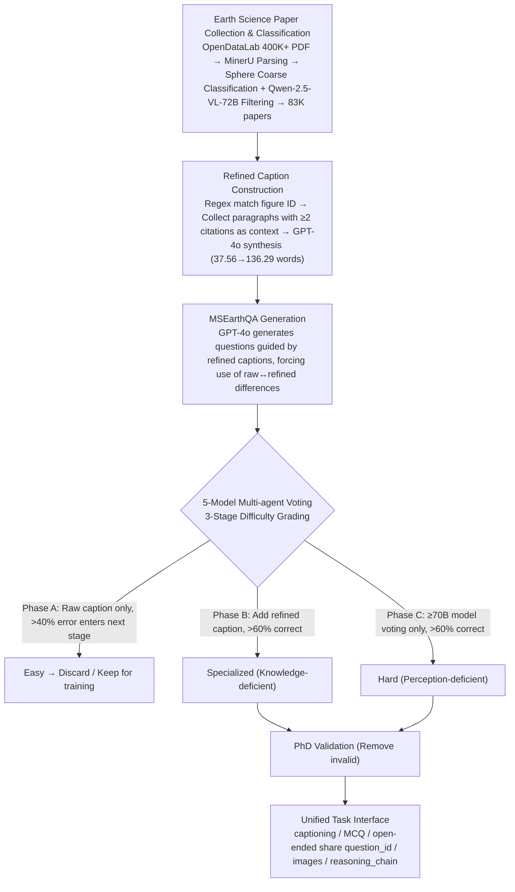

# MSEarth: A Multimodal Benchmark for Earth Science Phenomenon Discovery with MLLMs

**Conference**: ACL 2026  
**arXiv**: [2505.20740](https://arxiv.org/abs/2505.20740)  
**Code**: https://github.com/xiangyu-mm/MSEarth  
**Area**: Multimodal VLM / Scientific Benchmark / Earth Science  
**Keywords**: Earth Science Benchmark, MLLM Evaluation, Refined Caption, Graduate-level VQA, Multi-agent Voting

## TL;DR
This work extracts 289K images from 64,560 CC-BY open-source Earth Science papers, synthesizes "refined captions" using raw captions and body text context, and produces a 7,195-item graduate-level test set (covering captioning, MCQ, and open-ended questions) through 5-model multi-agent voting and three-stage PhD expert validation. It systematically reveals a "perception >> reasoning" gap of over 20 points in SOTA MLLMs for multi-image reasoning in Earth Science and provides a 441K training set that enables open-source 7B models to rival GPT-4o after GRPO.

## Background & Motivation

**Background**: MLLMs have established domain benchmarks in single disciplines like chemistry (ChemVLM), remote sensing (GeoChat), and meteorology (WeatherQA). General scientific benchmarks such as ScienceQA, MMMU, and OlympiadBench are also expanding rapidly.

**Limitations of Prior Work**: (1) General benchmarks mostly consist of **high school or undergraduate** level synthetic/textbook problems, lacking graduate-level complexity. (2) Paper-based benchmarks (SciFIBench, ArxivQA, MMSci), while reaching graduate levels, often **only use figure-caption pairs** to generate questions, discarding the critical reasoning content (hypotheses, evidence, analysis, conclusion) found in the main text, which reduces tasks to "caption matching." (3) Questions generated by native LLMs lack backing from paper text and cannot be verified. (4) Earth Science (five spheres: atmosphere, cryosphere, hydrosphere, lithosphere, and biosphere), which combines **strong spatial observation with deep domain knowledge**, lacks any graduate-level multimodal benchmark.

**Key Challenge**: "Raw captions are too short to support complex scientific reasoning." They average only 37.56 words and lack the causal chains found in the body text. Meanwhile, the body text is scattered across different paragraphs, requiring controllable retrieval-fusion methods to re-align the "image-text-reasoning chain."

**Goal**: Construct the first graduate-level Earth Science multimodal benchmark that: (a) ensures question quality is verifiable via paper text; (b) covers 5 spheres, 8 primary disciplines, and 66 sub-disciplines; (c) supports captioning, MCQ, and open-ended tasks simultaneously; and (d) provides a companion training set for open-source models to catch up.

**Key Insight**: First, the raw caption for each figure is matched with all paragraphs in the text that cite the figure number at least twice. These are fed to GPT-4o to generate a **refined caption** (averaging 136.29 words, including scientific reasoning). This refined caption serves as a "teacher signal" to drive VQA generation and automated quality grading via 5-model voting.

**Core Idea**: Explicitly **separate and then aggregate** the "image-reasoning-verification" components. The refined caption acts as the ground-truth reasoning chain. Multi-agent voting based on "accuracy without refined caption vs. accuracy with refined caption vs. large model accuracy" automatically categorizes items into four levels: easy, specialized, hard, and discarded. This is combined with PhD manual cross-checks to form a high-fidelity test set.

## Method

### Overall Architecture
MSEarth follows a 4-stage pipeline (Figure 2):
(1) **Paper Collection and Classification**: 400K+ Earth Science PDFs are sourced from OpenDataLab and parsed into structured JSON via MinerU. Abstract cosine similarity with keywords from 5 spheres is calculated using all-MiniLM-L6-v2 for coarse classification, followed by Qwen-2.5-VL-72B filtering of non-observation images, leaving 83K papers.
(2) **MSEarthCap Construction**: Figure labels are matched to text paragraphs via regex. Paragraphs with $\geq 2$ citations are kept as context. GPT-4o synthesizes the (figure, raw caption, context) into a refined caption—resulting in 289,891 images from 64,560 papers.
(3) **MSEarthQA Generation**: Guided by refined captions, GPT-4o generates MCQ and open-ended questions, forcing the questions to "exploit the difference between raw and refined captions," ensuring they are verifiable by paper content.
(4) **Multi-agent Voting + PhD Validation**: Five models (Qwen2.5-VL-7B/72B, InternVL2.5-7B/78B, GPT-4o) filter and grade question difficulty in three stages. Finally, PhD experts randomly sample and label items, removing invalid questions from 216 MCQs and 89 open-ended tasks.

### Key Designs

**1. Refined Caption: Restoring the Reasoning Chain from Text to Image**

Generating questions directly from raw captions (the ArxivQA approach) only probes surface information—descriptions averaging 37.56 words cannot support "why" reasoning questions. This work uses regex to search for figure labels (e.g., "Fig. 3") within MinerU-parsed paragraphs, collecting all paragraphs citing the figure $\geq 2$ times as context. The (figure_image, raw_caption, paper_context) is then fed to GPT-4o to generate refined captions containing hypotheses, evidence, analysis, and conclusions (prompts in Appendix E.6). 

This step expands raw captions from 37.56 to 136.29 words, increasing information density by 3.6x. The effect is twofold: it ensures the ground-truth answer is supported by paper evidence, making questions verifiable, and the refined caption itself becomes a "teacher signal" for multi-agent voting. Whether adding the caption leads to a correct answer helps distinguish between a model's lack of knowledge versus lack of perception.

**2. 5-Model Multi-agent Voting + 3-Stage Grading: Automated Grading without Full PhD Labeling**

Labeling over 7K items with PhDs is impractical. Instead, 5 MLLMs (Qwen2.5-VL-7B/72B, InternVL2.5-7B/78B, GPT-4o) independently answer questions with a 60% majority vote determining the result. Difficulty is categorized along the axes of "knowledge vs. perception" using three stages. **Phase A** provides only the raw caption + question; if $> 40\%$ of models fail, it proceeds (approx. 70% are deemed easy and discarded). **Phase B** adds the refined caption; if $> 60\%$ succeed, the item is labeled **specialized** (requires domain knowledge, ~20%). **Phase C** involves only $\geq 70B$ models; if $> 60\%$ succeed, it is labeled **hard** (requires strong perception, ~5%).

The elegance of this grading lies in decomposing "why a model fails" into two orthogonal dimensions: items corrected by adding a refined caption indicate "knowledge-deficient but perception-sufficient," while items only solvable by the largest models after refinement are "perception-deficient." This allows the benchmark to diagnose specific model weaknesses. Sampling showed Phase B had an invalid rate of only 4.4%, confirming the hypothesis.

**3. Unified Interface + Structured Metadata: Captioning, MCQ, and Open-ended tasks on the same set**

To avoid distribution drift across benchmarks, all three tasks share the same image sets and metadata (e.g., `question_id`, `images`, `classification`, `reasoning_chain`). They differ only in query and response: MCQ uses (raw_caption, question, options), open-ended uses (raw_caption, question), and captioning requires generating the refined caption. Evaluation uses standard metrics (BLEU/ROUGE/METEOR/BERTScore) for surface similarity and Qwen2.5-VL-72B as an LLM-judge for semantic-level OE-Eval and Cap-Eval. 

Conducting three tasks on the same image set allows direct comparison of whether a model "cannot see the image," "cannot describe it," or "cannot select the answer." This in-set decoupling is cleaner than cross-benchmark comparisons. During training, these can be mixed for instruction-tuning and GRPO.

### Loss & Training
The benchmark itself is for evaluation, but it provides a training set of 441,785 items (289,891 captioning + 102,753 MCQ + 49,141 open-ended). Experiments on Intern-S1-mini and Qwen2.5-VL-7B utilized instruction tuning for captioning and open-ended tasks, and GRPO (proposed by DeepSeek-Math) for MCQs, where a correct answer yields a +1 reward.

## Key Experimental Results

### Main Results
Performance of 13 open-source and 8 closed-source MLLMs on the 7,195-item test set:

| Model | Single-image | Multi-image Focus | Cross-image Reasoning | Reasoning | Perception | Overall ACC |
| :--- | :--- | :--- | :--- | :--- | :--- | :--- |
| Qwen2.5-VL-7B | 47.65 | 44.07 | 37.53 | 40.53 | 58.47 | 44.83 |
| InternVL3-78B | 57.53 | 51.37 | 45.48 | 47.00 | 73.61 | 53.38 |
| Intern-S1 | 67.01 | 65.62 | 64.11 | 61.22 | 79.61 | 65.63 |
| **Qwen-7B-MSEarth (Ours)** | 57.61 | 52.75 | 45.20 | 50.68 | 64.32 | **53.95** (+9.1) |
| **Intern-S1-mini-MSEarth (Ours)** | 65.49 | 62.97 | 58.63 | 58.81 | 78.56 | **63.54** (+5.4) |
| GPT-4o | 63.03 | 55.76 | 47.67 | 50.45 | 81.86 | 57.97 |
| Claude-3.7-Sonnet | 59.52 | 56.53 | 57.53 | 51.68 | 78.11 | 58.01 |
| Gemini-2.5-Pro-Thinking | 64.78 | 59.36 | 55.34 | 56.31 | 77.06 | 61.28 |
| Gemini-3-Flash | **70.44** | **67.70** | **66.85** | **65.14** | 80.51 | **68.82** |

**Captioning + Open-ended QA** (LLM-based evaluation, OE% / Cap-Eval):

| Model | Open-Ended OE% | Cap-Eval (1-5) |
| :--- | :--- | :--- |
| Qwen2.5-VL-72B | 44.82 | 2.56 |
| InternVL3-78B | 47.00 | 2.43 |
| Intern-S1-mini | 43.69 | 2.65 |
| **Qwen-7B-MSEarth** | **48.19** | **2.73** |
| **Intern-S1-mini-MSEarth** | **49.74** | **3.02** |
| GPT-4o | 48.55 | 2.72 |
| Gemini-3-Flash | 52.61 | 3.40 |

PhD human evaluation on a 300-item mini-set: Experts (87.00%) > o4-mini (53.00%) > Gemini-2.5-Pro (51.33%), indicating a 30+ point gap between SOTA MLLMs and specialists.

### Ablation Study

| Configuration | Reasoning | Perception | Overall |
| :--- | :--- | :--- | :--- |
| InternVL3-78B w/o raw caption | 44.54 | 59.67 | 48.17 |
| InternVL3-78B + raw caption | 47.00 | 73.61 | **53.38** (+5.2) |
| Qwen2.5-VL-72B w/o raw caption | 41.43 | 57.72 | 45.33 |
| Qwen2.5-VL-72B + raw caption | 44.40 | 70.46 | **50.65** (+5.3) |
| GPT-o4-mini CoT-low | – | – | 52.0 |
| GPT-o4-mini Non-CoT high | – | – | **54.3** (CoT decreased score) |
| Gemini-2.5-Flash-Thinking + CoT | – | – | **52.0** (Think model gains from CoT) |
| Gemini-2.5-Flash w/o think + CoT | – | – | **42.0** (Base model gains +2 from CoT) |

**Quality of Multi-agent Voting Grading**: Phase A sampling (900 items) showed a 6.6% invalid rate; Phase B (1800 items) showed 4.4%; Phase C (300 items) showed 25.7% invalid—confirming Phase B (specialized) is the highest quality.

### Key Findings
- **The Perception-Reasoning Gap is Universal**: Gemini-2.5-Pro-Thinking scored 77.06% in perception vs. 56.31% in reasoning (a 20.75 point gap). Most models reach a 75% perception ceiling before being limited by reasoning. Performance gains require domain knowledge and multi-step reasoning, not just better vision.
- **Cross-image Reasoning is Most Difficult**: All models showed the sharpest drop in cross-image tasks (comparison/correlation). Open-source models scored between 38-49, while SOTA Gemini-3-Flash scored 66.85. Half of MSEarth items are multi-image, reflecting real Earth Science scenarios.
- **MSEarth Training Data is Effective**: Qwen-7B improved by +9.1 points and Intern-S1-mini by +5.4 points on the test set. Most gains occurred in reasoning tasks rather than perception, indicating GRPO primarily injected domain knowledge.
- **Raw Captions are Key for Fair Input**: Adding raw captions improved perception by 8-12 points for all open-source models (as captions explain axes/symbols). However, raw captions risk "hint leakage" and must be used carefully.
- **CoT can be Harmful to Non-reasoning Models**: Gemini-2.5-Pro Non-CoT (52.33%) > CoT (50.67%). o4-mini high-CoT performed worse than low-CoT, suggesting CoT is mainly effective for specific "thinking" models, aligning with recent literature.
- **OE-Eval Correlates Strongly with Human Evaluation**: Krippendorff's $\alpha = 0.695$, significantly exceeding traditional metrics like BLEU/ROUGE/BERTScore, validating LLM-judge as a reasonable metric for open-ended scientific QA.

## Highlights & Insights
- **"Refined caption" as a Key Procedural Innovation**: Compressing "image + body context" back into a caption ensures all downstream VQA has verifiable ground truth. This approach is transferable to any paper-grounded benchmark in Biology, Astronomy, or Chemistry.
- **High-Fidelity, Low-Budget Expert Paradigm**: The 3-stage voting automatically categorizes difficulty levels. PhDs only perform final verification on $\approx$ 5K items, saving 80% on labeling costs while maintaining graduate-level quality.
- **Diagnostic Significance of Phases A/B/C**: Phase B (the largest and highest quality set) identifies items where models lack domain knowledge but possess sufficient perception. Phase C identifies items requiring massive scaling to "see" clearly. This provides a granular diagnosis beyond aggregate scores.
- **First Truly Multi-sphere, Multi-image Graduate Metric**: Covering 8 disciplines and 66 sub-disciplines with 54.9% multi-image questions, MSEarth fills the gap left by single-domain benchmarks like WeatherQA and treats Earth Science as a comprehensive system.

## Limitations & Future Work
- **Author Acknowledgments**: (1) Some niche sub-fields (e.g., specific paleoclimatology branches) are underrepresented; (2) tasks are mostly MCQ and short-answer, lacking exploratory tasks requiring long-range reasoning (e.g., hypothesis generation).
- **Independent Observations**: (1) **Refined caption quality is capped by GPT-4o**: If GPT-4o lacks expertise in a sub-field, the caption may be biased; (2) self-favoring bias may exist as GPT-4o participates in both generation and voting; (3) training and test data share the same papers, lacking a completely independent venue split, potentially causing distribution-specific overfitting; (4) raw captions as input significantly boost perception but may be too lenient for real research scenarios where the caption itself is the "answer"; (5) using a single LLM-judge (Qwen) might not align perfectly with humans (reported $\alpha=0.695$ is below typical inter-PhD consistency).

## Related Work & Insights
- **vs. MMMU / ScienceQA**: General science but undergraduate level without document context; MSEarth provides graduate-level depth.
- **vs. ArxivQA / MMSci**: Also use papers, but ArxivQA relies only on captions without verification context; MSEarth uses "refined captions + multi-agent filtering + PhD validation" for higher quality.
- **vs. WeatherQA / GeoChat**: These are single-domain; MSEarth spans 5 spheres and 8 disciplines, capturing the interdisciplinary nature of Earth Science.
- **vs. OlympiadBench**: This uses small sets (8K) of manually labeled competition problems for Math/Physics; MSEarth uses an automated paper-grounded pipeline for 7K test and 441K training items.

## Rating
- Novelty: ⭐⭐⭐⭐ "Refined caption + 3-stage multi-agent filtering" is a clear methodological advancement for benchmark construction.
- Experimental Thoroughness: ⭐⭐⭐⭐⭐ 21 MLLMs across 3 task types, 8 sub-disciplines, plus ablations on CoT/raw captions/training data and PhD human evaluation.
- Writing Quality: ⭐⭐⭐⭐ The data pipeline is clear and motivations for voting phases are well-defined.
- Value: ⭐⭐⭐⭐⭐ Provides both evaluation and training data for the Earth Science and multimodal communities; the 7B model GRPO success is highly encouraging.

<!-- RELATED:START -->

## Related Papers

- [\[ICLR 2026\] WebDS: An End-to-End Benchmark for Web-based Data Science](../../ICLR2026/multimodal_vlm/webds_an_end-to-end_benchmark_for_web-based_data_science.md)
- [\[CVPR 2026\] TerraScope: Pixel-Grounded Visual Reasoning for Earth Observation](../../CVPR2026/multimodal_vlm/terrascope_pixel-grounded_visual_reasoning_for_earth_observation.md)
- [\[ACL 2026\] Do MLLMs Capture How Interfaces Guide User Behavior? A Benchmark for Multimodal UI/UX Design Understanding](do_mllms_capture_how_interfaces_guide_user_behavior_a_benchmark_for_multimodal_u.md)
- [\[ACL 2026\] Can MLLMs Reason Beyond Language? VisReason: A Comprehensive Benchmark for Vision-Centric Reasoning](can_mllms_reason_beyond_language_visreason_a_comprehensive_benchmark_for_vision-.md)
- [\[ACL 2026\] GeoRC: A Benchmark for Geolocation Reasoning Chains](georc_a_benchmark_for_geolocation_reasoning_chains.md)

<!-- RELATED:END -->
