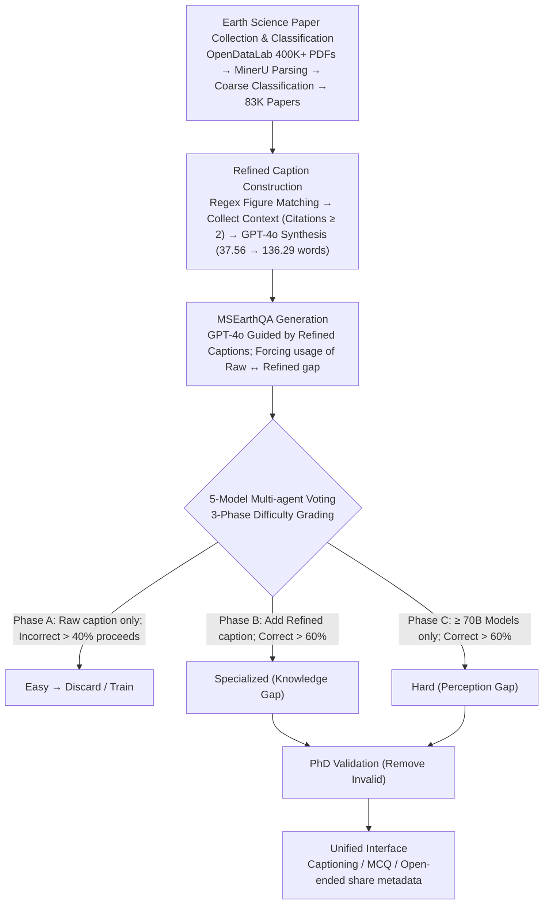

# MSEarth: A Multimodal Benchmark for Earth Science Phenomenon Discovery with MLLMs

**Conference**: ACL 2026  
**arXiv**: [2505.20740](https://arxiv.org/abs/2505.20740)  
**Code**: https://github.com/xiangyu-mm/MSEarth  
**Area**: Multimodal VLM / Scientific Benchmark / Earth Science  
**Keywords**: Earth Science Benchmark, MLLM Evaluation, Refined Caption, Graduate-level VQA, Multi-agent Voting

## TL;DR
This work extracts 289K images from 64,560 CC-BY open-source Earth science papers and synthesizes "refined captions" using "raw captions + body context." Through 5-model multi-agent voting and three-stage PhD expert validation, it generates a 7,195-item graduate-level test set (including captioning / MCQ / open-ended). The study systematically reveals a 20+ point "perception >> reasoning" gap in SOTA MLLMs regarding multi-image Earth science reasoning and provides a 441K training set that enables open-source 7B models to rival GPT-4o after GRPO.

## Background & Motivation

**Background**: MLLMs have established domain benchmarks in single disciplines such as chemistry (ChemVLM), remote sensing (GeoChat), and meteorology (WeatherQA); general scientific benchmarks like ScienceQA, MMMU, and OlympiadBench are also expanding rapidly.

**Limitations of Prior Work**: (1) General benchmarks mostly consist of **high school or undergraduate** level synthetic/textbook problems, lacking graduate-level complexity; (2) Paper-based benchmarks (SciFIBench, ArxivQA, MMSci), while reaching graduate levels, often **only use figure + caption pairs** to generate questions, discarding the reasoning content (hypotheses, evidence, analysis, conclusions) actually carried in the main text, reducing tasks to "caption matching"; (3) Questions generated by native LLMs lack paper text support and cannot be verified; (4) Earth science—encompassing five spheres: atmosphere, cryosphere, hydrosphere, lithosphere, and biosphere—which combines **strong spatial observation with domain knowledge**, lacks even a single graduate-level multimodal benchmark.

**Key Challenge**: "Raw captions are too short to support complex scientific reasoning"—averaging only 37.56 words, they lack the causal chains found in the main text. However, the main text is scattered across different sections, requiring controllable retrieval-fusion methods to realign "image-text-reasoning chains."

**Goal**: Construct the first graduate-level Earth-science multimodal benchmark that ensures: (a) question quality is verifiable via paper text; (b) coverage of five spheres, 8 primary disciplines, and 66 secondary disciplines; (c) support for captioning, MCQ, and open-ended tasks; (d) a companion training set to allow open-source models to catch up.

**Key Insight**: First, regex matching is used to pair each figure's raw caption with all main text paragraphs where the figure is cited $\ge 2$ times. These are fed to GPT-4o to generate **refined captions** (averaging 136.29 words, including scientific reasoning). Then, refined captions serve as "teacher signals" to drive VQA generation and 5-model multi-agent voting for automatic quality grading.

**Core Idea**: Explicitly **separate and then aggregate** "image-reasoning-verification." Refined captions represent the ground-truth reasoning chains. Multi-agent voting automatically categorizes questions into four tiers—easy, specialized, hard, and discarded—based on "accuracy without refined caption / accuracy with refined caption / accuracy of large models only." Coupled with PhD manual cross-checks, this forms a high-fidelity test set.

## Method

### Overall Architecture
MSEarth follows a 4-stage pipeline (Figure 2):
(1) **Paper Collection & Classification**: Over 400K Earth science PDFs are collected from OpenDataLab and parsed into structured JSON via MinerU. Cosine similarity between abstracts and keywords of the 5 spheres is calculated using all-MiniLM-L6-v2 for coarse classification, followed by a second-stage filtering of non-Earth observation images using Qwen-2.5-VL-72B, leaving 83K papers.
(2) **MSEarthCap Construction**: Figure labels are regex-matched to body paragraphs, retaining "paragraphs with $\ge 2$ citations" as context. GPT-4o synthesizes (figure, raw caption, context) into a refined caption—resulting in 289,891 images from 64,560 papers.
(3) **MSEarthQA Generation**: GPT-4o generates MCQ and open-ended questions guided by refined captions, forcing questions to "utilize the gap between raw and refined information," ensuring questions are verifiable by paper content.
(4) **Multi-agent Voting & PhD Validation**: Five models (Qwen2.5-VL-7B/72B, InternVL2.5-7B/78B, GPT-4o) grade question difficulty through 3-stage filtering. Finally, random sampling is used for PhD annotation to remove invalid questions from 216 MCQs and 89 open-ended items.

### Key Designs

**1. Refined Caption: Restoring reasoning chains from text to images**

Generating questions directly from raw captions (ArxivQA's approach) only allows for surface-level queries; descriptions averaging 37.56 words cannot support "why" reasoning. Ours uses regex to search for figure labels (e.g., "Fig. 3") in MinerU-parsed paragraphs, collecting all paragraphs citing the figure $\ge 2$ times as context. Then, (figure_image, raw_caption, paper_context) are fed to GPT-4o to generate a refined caption containing hypothesis, evidence, analysis, and conclusion. This doubles information density (37.56 to 136.29 words) and ensures ground-truth answers are supported by evidence while serving as a "teacher signal" for difficulty grading.

**2. 5-Model Multi-agent Voting + 3-Stage Grading: Automated grading without full PhD annotation**

Manual annotation of 7K+ items by PhDs is impractical. Ours uses 5 MLLMs (Qwen2.5-VL-7B/72B, InternVL2.5-7B/78B, GPT-4o) to answer independently. A 60% majority vote determines the outcome, and three phases separate questions by "knowledge vs. perception." **Phase A** provides only the raw caption; questions failed by $> 40\%$ of models proceed. **Phase B** adds the refined caption; if $> 60\%$ now succeed, the question is "specialized" (requires domain knowledge). **Phase C** involves only $\ge 70B$ models; if $> 60\%$ succeed, it is "hard" (requires strong perception). This diagnoses whether a model fails due to lack of knowledge or lack of perception.

**3. Unified Interface + Field Annotation: Captioning / MCQ / Open-ended on the same image set**

To avoid distribution shift across benchmarks, all three tasks share the same images and metadata (e.g., `question_id`, `reasoning_chain`). Differences appear only in queries and responses. Evaluation includes surface similarity metrics (BLEU/ROUGE) and semantic evaluation using Qwen2.5-VL-72B as an LLM-judge for OE-Eval/Cap-Eval. Performing three tasks on the same image set allows direct comparison of whether a model fails to see, describe, or reason—a cleaner decoupling than cross-benchmark comparisons.

### Loss & Training
The benchmark itself has no training, but provides a 441,785-item training set. Ours performed instruction tuning for captioning and open-ended tasks and used GRPO RL for MCQs (reward = +1 for correct answers) on Intern-S1-mini and Qwen2.5-VL-7B.

## Key Experimental Results

### Main Results
Performance of 13 open-source and 8 closed-source MLLMs on the 7,195-item test set:

| Model | Single-image | Multi-image Focus | Cross-image Reasoning | Reasoning | Perception | Overall ACC |
| :--- | :--- | :--- | :--- | :--- | :--- | :--- |
| Qwen2.5-VL-7B | 47.65 | 44.07 | 37.53 | 40.53 | 58.47 | 44.83 |
| InternVL3-78B | 57.53 | 51.37 | 45.48 | 47.00 | 73.61 | 53.38 |
| Intern-S1 | 67.01 | 65.62 | 64.11 | 61.22 | 79.61 | 65.63 |
| **Qwen-7B-MSEarth (Ours)** | 57.61 | 52.75 | 45.20 | 50.68 | 64.32 | **53.95** (+9.1 vs base) |
| **Intern-S1-mini-MSEarth (Ours)** | 65.49 | 62.97 | 58.63 | 58.81 | 78.56 | **63.54** (+5.4) |
| GPT-4o | 63.03 | 55.76 | 47.67 | 50.45 | 81.86 | 57.97 |
| Claude-3.7-Sonnet | 59.52 | 56.53 | 57.53 | 51.68 | 78.11 | 58.01 |
| Gemini-2.5-Pro-Thinking | 64.78 | 59.36 | 55.34 | 56.31 | 77.06 | 61.28 |
| Gemini-3-Flash | **70.44** | **67.70** | **66.85** | **65.14** | 80.51 | **68.82** |

### Ablation Study
Ablations on raw caption input, CoT prompting, and multi-agent voting quality:

| Configuration | Reasoning | Perception | Overall |
| :--- | :--- | :--- | :--- |
| InternVL3-78B w/o raw caption | 44.54 | 59.67 | 48.17 |
| InternVL3-78B + raw caption | 47.00 | 73.61 | **53.38** (+5.2) |
| GPT-o4-mini CoT-low | – | – | 52.0 |
| GPT-o4-mini Non-CoT high | – | – | **54.3** (CoT decreased) |
| Gemini-2.5-Flash-Thinking + CoT | – | – | **52.0** (Improved) |

**Multi-agent Voting Grading Quality**: In Phase B (specialized), only 80/1800 (4.4%) were found invalid during PhD review, confirming it as the highest quality tier.

### Key Findings
- **Perception-Reasoning Gap**: Gemini-2.5-Pro-Thinking shows 77.06% perception vs 56.31% reasoning. Models generally hit a 75% perception ceiling before reasoning fails, suggesting future gains lie in domain knowledge and multi-step reasoning rather than just image recognition.
- **Cross-image Reasoning is Hardest**: All models drop significantly on multi-image tasks. Open-source models score 38-49, while SOTA Gemini-3-Flash scores 66.85. 
- **MSEarth Training Data Effectiveness**: Qwen-7B improved by 9.1 points; most gains occurred in reasoning tasks, indicating GRPO primarily injected domain knowledge.
- **CoT Nuances**: CoT can be detrimental to models not trained for reasoning (e.g., Gemini-2.5-Pro Non-CoT > CoT). Only self-thinking models consistently benefit from CoT in this domain.

## Highlights & Insights
- **Innovation in "refined caption" paradigm**: Compressing "image + paragraph context" into a metadata caption provides verifiable ground truths for VQA, a method transferable to any paper-grounded scientific domain.
- **Efficient High-Fidelity Validation**: The multi-agent voting system saves 80% of annotation costs while maintaining graduate-level quality by only requiring PhDs for final verification.
- **Diagnostic Value**: The split between Phases A/B/C allows the benchmark to diagnose precisely whether a model lacks domain knowledge (Phase B) or perception (Phase C).
- **Comprehensive Earth Science Scope**: The first graduate benchmark to treat Earth science as a complete system (atmosphere, biosphere, etc.), with 54.9% of items being multi-image.

## Limitations & Future Work
- **Limitations**: (1) Niche sub-fields (e.g., paleoclimatology) are under-covered; (2) Most tasks are MCQ/short answer, lacking exploratory tasks like hypothesis generation.
- **Observations**: (1) Refined caption quality is capped by GPT-4o's limits; (2) Multi-agent voting may involve self-favoring bias as GPT-4o generates and votes; (3) Real-world scientific scenarios might find the provision of raw captions too "forgiving."

## Related Work & Insights
- **vs. MMMU / ScienceQA**: Those are undergraduate level without paper context; MSEarth provides graduate-level depth.
- **vs. ArxivQA / MMSci**: ArxivQA only uses captions (unverifiable); MSEarth uses refined captions and PhD verification.
- **vs. WeatherQA / GeoChat**: These target single domains; MSEarth covers the vertical integration of 5 spheres.
- **vs. OlympiadBench**: While OlympiadBench covers Math/Physics via manual competition tasks, MSEarth uses a paper-grounded automated pipeline for Earth science.

## Rating
- Novelty: ⭐⭐⭐⭐ 
- Experimental Thoroughness: ⭐⭐⭐⭐⭐ 
- Writing Quality: ⭐⭐⭐⭐ 
- Value: ⭐⭐⭐⭐⭐ 

<!-- RELATED:START -->

<!-- RELATED:END -->

## Related Papers

- [\[ICLR 2026\] WebDS: An End-to-End Benchmark for Web-based Data Science](../../ICLR2026/multimodal_vlm/webds_an_end-to-end_benchmark_for_web-based_data_science.md)
- [\[NeurIPS 2025\] The Transparent Earth: A Multimodal Foundation Model for the Earth's Subsurface](../../NeurIPS2025/multimodal_vlm/the_transparent_earth_a_multimodal_foundation_model_for_the_earths_subsurface.md)
- [\[ACL 2026\] Do MLLMs Capture How Interfaces Guide User Behavior? A Benchmark for Multimodal UI/UX Design Understanding](do_mllms_capture_how_interfaces_guide_user_behavior_a_benchmark_for_multimodal_u.md)
- [\[ACL 2026\] From Charts to Code: A Hierarchical Benchmark for Multimodal Models](from_charts_to_code_a_hierarchical_benchmark_for_multimodal_models.md)
- [\[ACL 2026\] ChartDiff: A Large-Scale Benchmark for Comprehending Pairs of Charts](chartdiff_a_large-scale_benchmark_for_comprehending_pairs_of_charts.md)

<!-- RELATED:END -->
