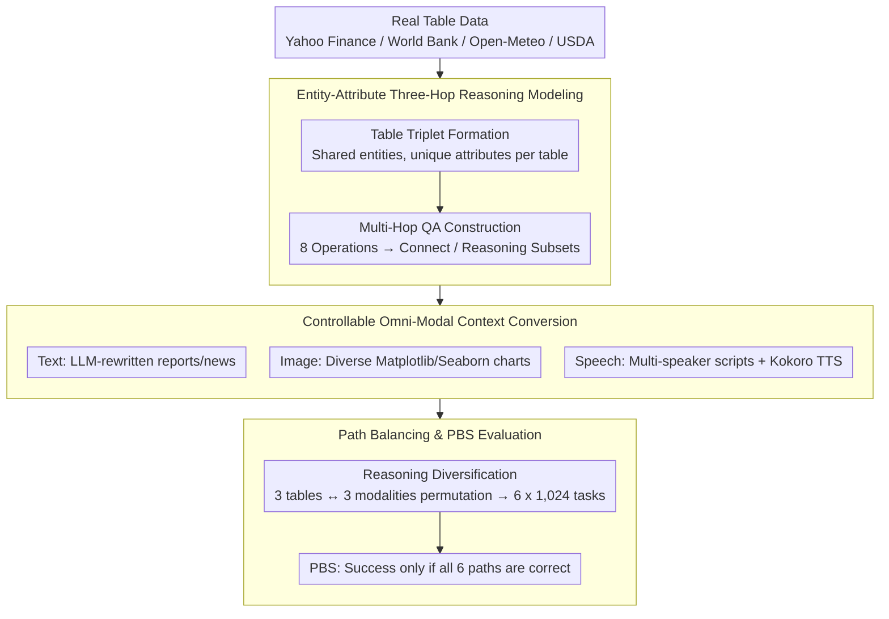

# OMHBench: Benchmarking Balanced and Grounded Omni-Modal Multi-Hop Reasoning

**Conference**: ACL 2026 Findings  
**arXiv**: [2508.16198](https://arxiv.org/abs/2508.16198)  
**Code**: No public code (Dataset: https://huggingface.co/datasets/HYU-NLP/OMHBench)  
**Area**: Multimodal VLM  
**Keywords**: Omni-modal Reasoning, Multi-hop QA, Speech Understanding, Path Balancing, Benchmark

## TL;DR
OMHBench constructs a 6,144-task omni-modal three-hop reasoning benchmark covering text, image, and speech contexts. Through entity-attribute chains and six balanced reasoning paths, it exposes systematic weaknesses in current MLLMs regarding speech grounding, path robustness, and cross-modal grounding.

## Background & Motivation
**Background**: Multimodal large models have evolved from bi-modal (text-image or text-speech) models toward omni-modal models capable of simultaneously processing text, vision, and speech. Corresponding evaluations are generally divided into two categories: Omni-Modal Understanding (OMU) benchmarks, which emphasize the ability to receive three modalities, and Cross-Modal Multi-Hop Reasoning (CMR) benchmarks, which focus on combining evidence across modalities to complete multi-hop reasoning.

**Limitations of Prior Work**: Both evaluation types have blind spots. In OMU datasets, while inputs include images and speech, text often only appears in the question or options; thus, many questions can be answered by bypassing specific modalities, creating a modality shortcut. CMR datasets emphasize reasoning chains but mostly cover only text and images, lacking speech. Furthermore, reasoning path distributions in CMR are highly imbalanced—for example, many questions follow the same I-T or T-I sequence—so high scores on a single path do not necessarily reflect true cross-modal reasoning capability.

**Key Challenge**: Omni-modal evaluation seeks to verify both "whether all modalities are used" and "whether multi-hop reasoning is executed stably," but existing datasets often satisfy only one requirement. Simply including three modalities does not force their usage, and multi-hop QA does not guarantee fair path distribution across different modal sequences.

**Goal**: The authors aim to construct a more controlled benchmark: first, questions must depend on text, image, and speech evidence; second, each question has an explicit three-hop entity-attribute reasoning chain; third, the same question can be instantiated into six modal sequences to check path robustness; fourth, answer formats are explicit to facilitate reproducible exact match evaluation.

**Key Insight**: Multi-hop reasoning is abstracted as "entities shared across modalities, while attributes are visible only within a specific modality." For instance, a model might first identify a company in an image chart based on goodwill, then retrieve inventory from text, and finally aggregate a value from speech. This structure ensures each step lands on a specific modality and allows for explicit path control.

**Core Idea**: Generate three-hop QA based on three attribute tables of the same set of entities. These three tables are converted into text, image, and speech, respectively. By permuting the assignment of modalities to these tables, the authors obtain content-equivalent evaluations with different reasoning paths.

## Method
OMHBench proposes a construction pipeline for omni-modal multi-hop reasoning rather than a new model. Its key lies in decoupling "task semantics," "modal carrier format," and "reasoning path": the underlying entities and answers remain constant, but evidence is placed in different modalities to force the model through a specified modal sequence.

### Overall Architecture
The pipeline consists of four steps.

First is **Table Triplet Formation**. Real-world table data is collected from finance, economics, climate, and nutrition domains (e.g., Yahoo Finance, World Bank). For each sample, a triplet of small tables is constructed; these tables share the same entities but contain disjoint sets of attributes. Each table includes 10 entities and 3 attributes, mixed with distractor entities and attributes.

Second is **Multi-Hop QA Construction**. Three-hop questions are generated from the table triplets. The first two hops typically locate or filter entities, while the final hop retrieves or aggregates the answer. Eight operation types are defined (Lookup, Ranking, Comparison, Range, Proximity, Retrieval, Mean, Summation), combined into two subsets: Connect and Reasoning.

Third is **Omni-Modal Context Generation**. The three tables are converted into three contexts: text, image, and speech. Text is rewritten by LLMs into natural language scenarios like reports or news; images are generated using Matplotlib and Seaborn across various chart types; speech is synthesized using multi-speaker scripts and Kokoro-82M TTS.

Fourth is **Reasoning Diversification**. The assignment of the three tables to the three modalities is permuted, resulting in six reasoning paths: S-I-T, S-T-I, I-S-T, T-S-I, I-T-S, and T-I-S. The underlying answer remains the same for a given group, but the sequence of modalities to be accessed changes, allowing for a comparison of path-specific performance.

### Key Designs

**1. Entity-Attribute Three-Hop Reasoning Modeling: Structural Constraints on Modality Usage**

The biggest loophole in omni-modal evaluation is the modality shortcut—where answers can be retrieved by bypassing a modality. OMHBench addresses this by sharing entities across three tables while distributing attributes. Once mapped to text, vision, and speech, tracking an entity requires cross-modal jumping. The Connect subset focuses on chain-linking via Lookup-Comparison-Retrieval, while the Reasoning subset uses operations like Ranking and Summation for set filtering and numerical aggregation.

**2. Controllable Conversion: Consistent Facts Across Diverse Styles**

To prevent fact drift during conversion, the authors use real tables as a factual base and apply controlled variability. Text uses 24 domain prompts, images use 10 chart types across various fonts/colors, and speech involves 22 scenarios and 27 TTS voices. The conversion process achieved 100% factual consistency in audited samples.

**3. Path Balance Score (PBS): Enforcing Robust Grounding**

Existing datasets are often dominated by one or two modal sequences. OMHBench permutes the three modalities for 1,024 samples per path ($3!=6$ paths total, 6,144 tasks). The Path Balance Score (PBS) is defined such that a task is only counted as successful if the model answers correctly across all 6 path variations. This prevents models from hiding asymmetric grounding capabilities behind a high average accuracy.

### Loss & Training
The authors do not train a new model. Evaluation uses zero-shot chain-of-thought (CoT) prompting without a fixed format. For models supporting a reasoning mode, an 8,192-token thinking budget is set. Outputs are parsed into discrete numerical answers for Exact Match (EM) evaluation.

## Key Experimental Results

### Main Results
Thirteen MLLMs were evaluated, including Gemini variants and open-source models like Qwen3-Omni.

| Model | OMHBench-Connect Avg Acc | PBS | Strongest Path | Weakest Path |
| :--- | :--- | :--- | :--- | :--- |
| Gemini 3 Flash | 78.3 | 32.2 | S-T-I 98.4 | I-T-S 60.2 |
| Gemini 2.5 Pro | 72.5 | 25.0 | S-T-I 96.9 | T-I-S 50.8 |
| Qwen3-Omni 30B | 46.8 | 2.3 | S-T-I 77.0 | I-T-S/T-I-S 16.0 |

The Connect subset is relatively simple, yet even Gemini 3 Flash achieves a PBS of only 32.2, indicating it struggles to maintain consistency across all paths. Qwen3-Omni 30B, while the strongest open-source model, shows a 61.0 percentage point gap between its strongest and weakest paths.

| Model | OMHBench-Reasoning Avg Acc | PBS | Strongest Path | Weakest Path |
| :--- | :--- | :--- | :--- | :--- |
| Gemini 3 Flash | 49.4 | 8.6 | S-T-I 58.8 | I-T-S 40.0 |
| Gemini 2.5 Pro | 48.8 | 10.9 | S-I-T 53.9 | I-T-S 41.4 |
| Qwen3-Omni 30B | 15.0 | 0.0 | S-T-I 28.5 | I-T-S/T-I-S 2.7 |

The Reasoning subset is significantly more difficult due to set filtering and numerical aggregation. Most open-source models score near zero on PBS, highlighting the gap between "perceiving multiple modalities" and "controlled multi-hop reasoning."

### Ablation Study
- **Modality Shortcut Verification**: Removing vision or speech inputs makes tasks in OMHBench unsolvable, whereas 70-80% of samples in traditional OMU benchmarks remain solvable.
- **Path Robustness (PBS@k)**: While Gemini 3 Flash can solve at least one path version for nearly 100% of tasks, its ability to solve all six versions (PBS@6) drops to 32.2% (Connect) and 8.6% (Reasoning).
- **Asymmetric Omni-modal Grounding**: Accuracy is higher when speech is placed early in the reasoning path (e.g., S-T-I). Performance drops significantly when speech appears late (e.g., T-I-S), indicating models struggle to ground speech against preceding multi-modal context.

### Key Findings
- Proprietary models outperform open-source ones, yet even they suffer from path asymmetry.
- Speech positioning is a core bottleneck; grounding speech in the middle or end of a reasoning chain is significantly harder.
- Reasoning operations like Ranking are easier than Proximity or Range, where models frequently fail on set constraints.
- Advanced prompting (Self-Ask, Plan-and-Solve) does not consistently improve performance, suggesting a fundamental lack of cross-modal semantic transfer rather than prompt-related issues.

## Highlights & Insights
- By duplicating questions across six path versions, OMHBench isolates the impact of modal sequence while keeping semantics constant.
- PBS is a more rigorous metric than average accuracy, exposing inconsistent grounding that would otherwise be hidden.
- The use of real-world table data as a factual foundation ensures that evaluations are high-fidelity and reproducible via Exact Match.
- The benchmark elevates speech from "background information" to a "necessary evidence source," which is crucial for training future speech-aware VLMs.

## Limitations & Future Work
- **Controlled Tasks**: The entities and three-hop chains are structured for diagnosis; real-world tasks like open-ended video reasoning are more complex.
- **TTS Quality**: While high-quality, synthetic speech does not capture the nuances of real human dialogue (accents, noise, interruptions).
- **Visual Diversity**: Grounding is currently limited to charts and tables; natural imagery or document scans are not included.
- **Numerical Focus**: Answers are limited to positive integers for EM reliability, excluding open-ended reasoning or evidence citation.

## Related Work & Insights
- Compared to OMU benchmarks like OmniBench, OMHBench prevents modality shortcuts by ensuring each modality carries indispensable information.
- Compared to CMR benchmarks like MMQA, it expands the modal space to include speech and enforces path balance.
- **Insight for Training**: MLLMs may require explicit supervision of intermediate cross-modal states (e.g., outputting "Current Entity + Modality") to mitigate failures in late-chain speech grounding.

## Rating
- **Novelty**: ⭐⭐⭐⭐☆ Combines omni-modality, multi-hop reasoning, and path balancing into a clean, diagnostic framework.
- **Experimental Thoroughness**: ⭐⭐⭐⭐⭐ Comprehensive evaluation across 13 models with detailed path-level analysis.
- **Writing Quality**: ⭐⭐⭐⭐☆ Clear structure and logical flow in analysis.
- **Value**: ⭐⭐⭐⭐⭐ Highly valuable for identifying specific bottlenecks in omni-modal grounding and setting a higher bar for MLLM robustness.

<!-- RELATED:START -->

## Related Papers

- [\[ACL 2025\] FCMR: Robust Evaluation of Financial Cross-Modal Multi-Hop Reasoning](../../ACL2025/multimodal_vlm/fcmr_robust_evaluation_of_financial_cross-modal_multi-hop_reasoning.md)
- [\[ICLR 2026\] ThinkOmni: Lifting Textual Reasoning to Omni-modal Scenarios via Guidance Decoding](../../ICLR2026/multimodal_vlm/thinkomni_lifting_textual_reasoning_to_omni-modal_scenarios_via_guidance_decodin.md)
- [\[CVPR 2026\] CRIT: Graph-Based Automatic Data Synthesis to Enhance Cross-Modal Multi-Hop Reasoning](../../CVPR2026/multimodal_vlm/crit_graph-based_automatic_data_synthesis_to_enhance_cross-modal_multi-hop_reaso.md)
- [\[ICLR 2026\] FRIEDA: Benchmarking Multi-Step Cartographic Reasoning in Vision-Language Models](../../ICLR2026/multimodal_vlm/frieda_benchmarking_multi-step_cartographic_reasoning_in_vision-language_models.md)
- [\[ACL 2026\] Structured and Abstractive Reasoning on Multi-modal Relational Knowledge Images](structured_and_abstractive_reasoning_on_multi-modal_relational_knowledge_images.md)

<!-- RELATED:END -->
