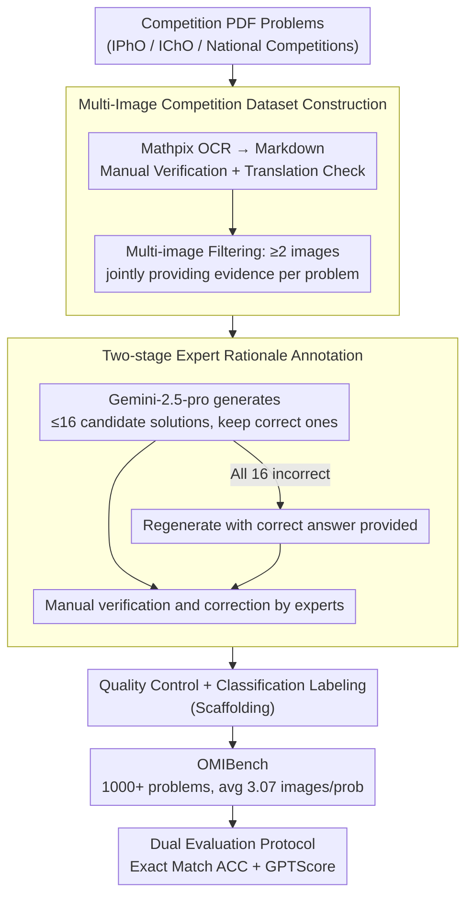

# OMIBench: Benchmarking Olympiad-Level Multi-Image Reasoning in Large Vision-Language Models

**Conference**: ACL 2026  
**arXiv**: [2604.20806](https://arxiv.org/abs/2604.20806)  
**Code**: [GitHub](https://github.com/LightChen233/OMIBench)  
**Area**: Multimodal VLM / LLM Evaluation  
**Keywords**: Multi-image Reasoning, Olympiad-level Reasoning, Vision-Language Model Benchmark, Cross-image Association, Scientific Reasoning

## TL;DR
This paper introduces OMIBench—the first large-scale benchmark for Olympiad-level multi-image reasoning. It covers over 1000 competition problems in Biology, Chemistry, Mathematics, and Physics. The study finds that even the strongest LVLM (Gemini-3-Pro) achieves only approximately 50% accuracy, representing a decline of over 25% compared to single-image benchmarks.

## Background & Motivation

**Background**: LVLMs have made significant progress in standard reasoning tasks, and Chain-of-Thought (CoT) prompting has achieved major breakthroughs on single-image Olympiad benchmarks. Existing benchmarks like OlympiadBench are nearing saturation by top-tier models.

**Limitations of Prior Work**: (1) Existing Olympiad-level multimodal benchmarks are almost entirely restricted to single-image problem settings, whereas many real-world scientific competition problems rely on multiple interrelated charts and experimental diagrams; (2) Existing multi-image benchmarks (e.g., MuirBench, MMIU) focus on perception and cross-image referencing but lack difficulty and strong semantic/quantitative cross-image associations, making them insufficient for evaluating Olympiad-level reasoning; (3) There is a lack of expert reasoning path annotations, preventing in-depth analysis of specific failure points in the model's reasoning process.

**Key Challenge**: Olympiad-level multi-image reasoning requires models not only to understand individual images but also to (1) maintain consistency in the cross-image information flow and (2) execute deep cross-image and cross-modal reasoning—a qualitative leap from perception to integrated reasoning that existing benchmarks cannot effectively evaluate.

**Goal**: Construct an Olympiad-level multi-image reasoning benchmark covering four major science disciplines, including expert reasoning annotations and multiple evaluation protocols, to systematically expose the reasoning shortcomings of LVLMs in multi-image scenarios.

**Key Insight**: Collect real competition problems from international and national science competitions that require joint reasoning across multiple images, rather than using synthetic or simplified multi-image tasks.

**Core Idea**: Extend Olympiad-level reasoning evaluation from single-image to multi-image—reasoning difficulty undergoes a qualitative change rather than a quantitative one when evidence is scattered across multiple images.

## Method

### Overall Architecture
OMIBench contains 1000+ Olympiad-level multi-image reasoning problems, with an average of 3.07 images per problem. It supports both multiple-choice and open-ended question formats. Each problem is equipped with an expert-verified reasoning rationale, supporting both exact match and semantic equivalence evaluation modes. The data construction pipeline connects three contributory phases: multi-image competition dataset construction, two-stage expert reasoning path annotation, and dual evaluation protocols, with quality control and classification labeling steps interspersed as scaffolding.

### Key Designs

**1. Multi-Image Competition Dataset Construction: Ensuring evidence is truly scattered across multiple images to force cross-image reasoning**

Existing Olympiad benchmarks are almost entirely single-image, masking model deficiencies in integrating multi-image information. Therefore, the first step is to ensure every problem "requires multiple images." The authors collected PDF problems from international Olympiads (IPhO, IChO, etc.), national/regional competitions, and mixed-complexity benchmarks, converted them to Markdown using Mathpix OCR with manual verification, and checked translations for non-English problems. A critical filtering criterion is that each problem must contain $\geq 2$ images that jointly provide reasoning evidence—these are not supplementary illustrations but essential components without which the problem cannot be solved. The resulting problems average 3.07 images, ensuring competition-level difficulty and non-trivial semantic/quantitative dependencies between images.

**2. Two-stage Expert Rationale Annotation: Drafting with strong models followed by expert finalization**

Most competition datasets provide only the final answer without the solution process, making it impossible to pinpoint where a model fails. OMIBench provides expert-verified rationales for each problem using a "machine draft + human refinement" two-stage process. Gemini-2.5-pro-thinking first generates up to 16 candidate solutions per problem, retaining the correct ones. If all 16 are incorrect, the correct answer is fed back to the model for regeneration—a step that reduced manual annotation workload by approximately 20%. Experienced annotators then verify and correct each solution step-by-step to ensure accuracy, completeness, and standardization. This reference path enables fine-grained failure analysis, such as identifying that "46% of key steps contain logical errors."

**3. Dual Evaluation Protocol (Exact Match + GPTScore): Closing the loophole of underestimated open-ended answers**

Open-ended scientific answers often have multiple equivalent expressions (different units, equivalent chemical formulas, varied levels of expression simplification). Using only character-level exact matching misidentifies "correct but differently written" answers as wrong, systematically underestimating model capabilities. OMIBench employs two parallel metrics: Exact Match (ACC) for strict consistency as a lower bound, and GPTScore to determine if an open-ended answer is semantically equivalent to the reference under multimodal contextual constraints. This dual approach helps define the true range of model capability.

### Loss & Training
This work is a pure benchmark and does not involve model training.

## Key Experimental Results

### Main Results

| Model | Biology Score | Chemistry Score | Math Score | Physics Score | Overall Score |
|------|-----------|-----------|-----------|-----------|-----------|
| Gemini-3-Pro | 71.31 | 25.35 | 62.56 | 38.92 | **50.53** |
| GPT-5 | 62.55 | 29.03 | 56.51 | 40.80 | 48.11 |
| GPT-5-mini | 59.36 | 24.42 | 56.74 | 43.63 | 47.73 |
| Qwen3-VL-32B | 58.57 | 20.74 | 40.70 | 25.00 | 35.78 |
| InternVL3-78B | 46.61 | 20.74 | 17.21 | 18.63 | 23.83 |

### Analysis

| Analysis | Data |
|------|------|
| Gemini-3-Pro: OlympiadBench → OMIBench | 75.67% → 50.53% (↓25%+) |
| Model Ranking Correlation (Spearman $\rho$) | 0.614 < 0.7 (Moderate correlation) |
| Manual Review of o4-mini Reasoning Error Rate | 46% of key steps have logical errors |

### Key Findings
- Even the strongest model, Gemini-3-Pro, only achieves 50.53%, indicating that multi-image Olympiad reasoning remains a massive challenge.
- Moving from single-image to multi-image causes a >25% drop in accuracy and significantly changes model rankings ($\rho = 0.614$), suggesting multi-image reasoning cannot be simply inferred from single-image capability.
- A significant gap exists between closed-source and open-source models—Gemini-3-Pro outperforms the best open-source model by ~15%, yet GPT-4o performs similarly to open-source models, indicating that scale is not the sole determinant.
- Long CoT, test-time scaling, and ICL provide modest but consistent gains; parameter scaling and "think-with-image" methods provide minimal or even negative returns.
- Chemistry and Physics are the most difficult (lowest scores), while Biology is the "easiest"—likely because Biology questions focus more on knowledge retrieval than multi-step reasoning.

## Highlights & Insights
- The **"qualitative change" from single to multi-image** is supported by solid experimental evidence—the >25% absolute drop and rank reshuffling ($\rho = 0.614$) together show this is not merely an accumulation of difficulty.
- Manual inspection found that 46% of key reasoning steps contain logical errors—models can generate fluent reasoning chains that are logically flawed, serving as a critical warning for CoT evaluation methodologies.
- The coverage of four disciplines allows the benchmark to reveal imbalances in reasoning capabilities across subjects, providing a reference for education and capability assessment.

## Limitations & Future Work
- The dataset size is roughly 1000 problems; some subject subsets may be small, limiting statistical power.
- Dependence on GPTScore for semantic evaluation; the reliability of LLM-as-judge for determining equivalence in math/science answers requires further validation.
- The types of dependencies between multiple images (supplementary, contradictory, temporal changes, etc.) have not been classified at a fine-grained level.
- Multimodal RAG or tool-augmented strategies have not been tested.
- Sources are tilted toward International and Chinese competitions, which may introduce cultural biases for certain models.

## Related Work & Insights
- **vs OlympiadBench (He et al., 2024)**: Similarly competition-level but contains <5% multi-image problems. OMIBench is entirely multi-image, exposing deficiencies previously masked by single-image settings.
- **vs MuirBench / MMIU**: These multi-image benchmarks have lower difficulty, lack competition-level reasoning, and provide no reasoning rationales.
- **vs ReMI (Kazemi et al., 2024)**: Covers Math and Physics at H/COL difficulty levels but excludes Biology and Chemistry and lacks reasoning annotations.

## Rating
- Novelty: ⭐⭐⭐⭐ The combination of multi-image and Olympiad-level is a new evaluation perspective, though the benchmark construction methodology is relatively standard.
- Experimental Thoroughness: ⭐⭐⭐⭐⭐ 30+ model evaluations, analysis of multiple enhancement strategies, and systematic comparison with single-image benchmarks.
- Writing Quality: ⭐⭐⭐⭐ Clear structure and rich data.
- Value: ⭐⭐⭐⭐ Fills the gap in multi-image Olympiad reasoning evaluation and provides valuable insights for model capability analysis.

<!-- RELATED:START -->

## Related Papers

- [\[ACL 2026\] LaMI: Augmenting Large Language Models via Late Multi-Image Fusion](lami_augmenting_large_language_models_via_late_multi-image_fusion.md)
- [\[ICLR 2026\] FRIEDA: Benchmarking Multi-Step Cartographic Reasoning in Vision-Language Models](../../ICLR2026/multimodal_vlm/frieda_benchmarking_multi-step_cartographic_reasoning_in_vision-language_models.md)
- [\[ACL 2026\] Cross-Cultural Expert-Level Art Critique Evaluation with Vision-Language Models](cross-cultural_expert-level_art_critique_evaluation_with_vision-language_models.md)
- [\[ACL 2026\] ErrorRadar: Benchmarking Complex Mathematical Reasoning of Multimodal Large Language Models Via Error Detection](errorradar_benchmarking_complex_mathematical_reasoning_of_multimodal_large_langu.md)
- [\[ACL 2026\] Addressing Overthinking in Large Vision-Language Models via Gated Perception-Reasoning Optimization](addressing_overthinking_in_large_vision-language_models_via_gated_perception-rea.md)

<!-- RELATED:END -->
