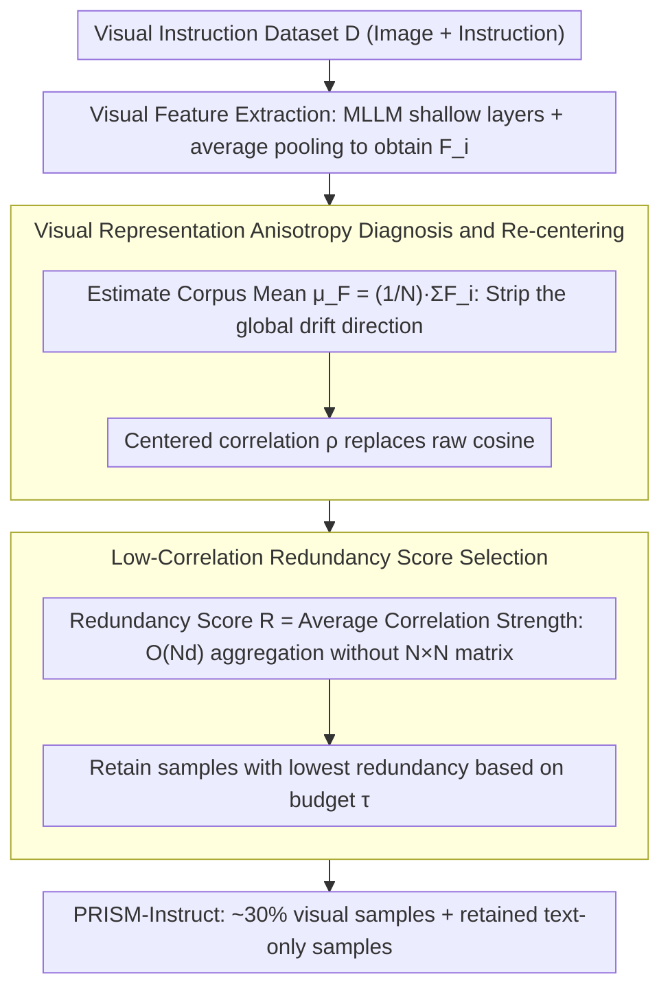

# PRISM: Self-Pruning Intrinsic Selection Method for Training-Free Multimodal Data Selection

**Conference**: ACL2026 Best Paper  
**arXiv**: [2502.12119](https://arxiv.org/abs/2502.12119)  
**Code**: Yes, URL not explicitly provided yet  
**Area**: Multimodal VLM / Data Selection  
**Keywords**: Multimodal data selection, visual instruction tuning, representation anisotropy, training-free selection, redundancy pruning  

## TL;DR
PRISM discovers that the non-zero mean of MLLM visual features causes Global Semantic Drift, which contaminates similarity-based data selection. By using training-free mean re-centering and low-correlation sample selection, it achieves 101.7% relative performance while retaining only approximately 30% of visual samples, reducing end-to-end GPU time by about 70%.

## Background & Motivation
**Background**: Multimodal Large Language Models (MLLMs) typically undergo large-scale image-text pre-training followed by instruction tuning with visual instruction data. As data pools like LLaVA and VisionFlan expand, the number of instruction samples has grown significantly, but they contain substantial amounts of redundant, low-information, or noisy samples.

**Limitations of Prior Work**: Existing visual instruction data selection methods mostly rely on proxy models, external scorers, training loss, perplexity, gradients, or influence functions. These methods either require additional model inference or necessitate iterative training and gradient computation. The cost of selection itself is high, sometimes even offsetting the efficiency gains from using less training data.

**Key Challenge**: Data selection is intended to save computational resources, but many selectors transfer costs to the selection phase. The authors argue the root cause is the direct use of the raw geometry of MLLM visual features. These visual embeddings are not uniformly distributed around the origin; instead, they are pulled into a narrow cone by a strong global mean direction, causing cosine similarity to mistake shared background drift for semantic similarity.

**Goal**: Propose a proxy-free, training-free, and gradient-free multimodal instruction selection method that maintains or exceeds full fine-tuning performance while truly reducing the total cost of selection + tuning.

**Key Insight**: Starting from a diagnostic of representation geometry, the paper proves that visual features exhibit representation anisotropy and singular value concentration. The data selection problem is then reformulated as "removing global drift first, then estimating redundancy based on the unique semantic components of samples."

**Core Idea**: Use mean re-centering of the target MLLM's own visual features to restore a more reliable similarity geometry, then retain samples with low correlation to the overall pool and more unique information.

## Method
The key to PRISM is not training a stronger selector, but making the visual representations already present in the MLLM usable again. It structures the selection process into four steps: single-pass feature extraction, global mean estimation, redundancy scoring, and percentile filtering. Consequently, the cost consists mainly of one forward pass and linear aggregation.

### Overall Architecture
Given a visual instruction dataset $D=\{d_1,\dots,d_N\}$, where each sample contains an image and a text instruction, PRISM first extracts visual features $F_i$ for each sample using the target MLLM's visual encoder, projector, and intermediate LLM layers. A global image representation is obtained via average pooling.

Then, PRISM calculates the feature mean of the entire corpus: $\mu_F=\frac{1}{N}\sum_i F_i$. This mean represents the global drift shared by all visual samples rather than the unique semantics of a single sample. For any two samples, PRISM no longer uses raw cosine similarity; instead, it performs $(F_i-\mu_F)$ and $(F_j-\mu_F)$ before calculating the normalized dot product.

Next, the Redundancy Score for each sample is the average of its centered correlations with all other samples. Intuitively, if a sample is highly correlated with a large number of samples, it is likely a redundant or low-marginal-gain sample; if the correlation is low, it likely carries more unique visual semantics.

Finally, a portion of samples with the lowest redundancy scores is selected based on a budget $\tau$. In the main experiment, PRISM uses a 30% budget for the visual samples of LLaVA-665K while retaining text-only samples, resulting in PRISM-Instruct-250K.

> Note: OSC (Overall Selection Cost) is the end-to-end bridge for evaluating whether a selector is "truly saving resources." It is the motivation behind the training-free pipeline but not a specific stage within the selection pipeline itself.

### Key Designs

**1. Overall Selection Cost Criterion: Asking if a data selector "Truly Saves Resources"**

Many selection methods report performance only on the subset while hiding expensive selection overhead. This leads to scenarios where selection is accurate, but the cost of selection plus training is higher than full training. PRISM establishes an honest metric by multiplying the performance ratio and time ratio:

$$C=\frac{P(D_{full})}{P(D_{sub})}\times\frac{T_{select}+T_{tune}(D_{sub})}{T_{tune}(D_{full})}.$$

Only when $C<1$ does a method simultaneously maintain performance and achieve net end-to-end savings. This metric forces a comparison back to end-to-end costs and is the core motivation for PRISM's adherence to a "training-free, single forward pass" approach.

**2. Visual Representation Anisotropy Diagnosis and Re-centering: Fix the Similarity Before Selecting Data**

The authors found the root cause is not that selectors are weak, but that the raw geometry of MLLM visual features is flawed. These embeddings are not uniformly distributed but are pulled into a narrow cone by a strong global mean direction, making raw cosine similarity mistake "shared background drift" for "semantic similarity." Decomposing visual features as $x_i = \mu + \delta_i$ (where $\mu$ is the global component and $\delta_i$ is the sample-specific semantics), when $\|\mu\|$ is much larger than $\|\delta_i\|$, the raw cosine is dominated by $\mu$ and approaches 1. PRISM's countermeasure is to estimate the corpus mean $\mu_F=\frac{1}{N}\sum_i F_i$ and use centered correlation:

$$\rho(F_i,F_j)=\frac{(F_i-\mu_F)^\top(F_j-\mu_F)}{\|F_i-\mu_F\|_2\,\|F_j-\mu_F\|_2}$$

as a replacement for raw cosine. Notably, the authors explicitly state this is not full whitening; it specifically targets the corpus-level mean shift that most disrupts redundancy estimation. Rather than introducing external scorers, it is better to correct the most significant first-order geometric bias within the target model's own feature space.

**3. Low-Correlation Redundancy Score Selection: Finding Unique Semantics via First-Order Aggregation**

After fixing the similarity, one must calculate who is redundant and who is unique among hundreds of thousands of samples. Constructing an $N \times N$ similarity matrix or running exact greedy coverage is prohibitively expensive. PRISM defines a redundancy score for each sample as:

$$R(d_i)=\frac{1}{N-1}\sum_{j\ne i}\rho(F_i,F_j),$$

which is its average connection strength to other samples in the centered semantic map. A high score suggests high correlation with many samples (redundant), while a low score indicates unique visual semantics (high training value). Using an exact aggregate implementation, this score can be computed in $O(Nd)$ without materializing the full pairwise matrix. Finally, samples with redundancy scores below the percentile threshold defined by budget $\tau$ are retained.

### Loss & Training
PRISM itself has no training loss and is a training-free selector. After data selection, the authors perform one round of visual instruction tuning following official LLaVA-1.5 hyperparameters. The main setup uses LLaVA-665K and LLaVA-1.5-7B, comparing against Random, Length, EL2N, Perplexity, GraNd, TIVE, InstructionGPT-4, Self-Filter, COINCIDE, ICONS, and DataTailor. Additional experiments validate generalization and knowledge retention on VisionFlan-186K, different MLLM architectures, and text-only benchmarks.

## Key Experimental Results

### Main Results
On LLaVA-1.5-7B, PRISM achieves 101.7% integrated performance relative to full fine-tuning and outperforms full data or strong selection methods across multiple multimodal benchmarks.

| Method | SQA | SQA-I | VizWiz | POPE-P/R/A | MM-Vet | MMBench | MME-C | MMMU | Rel. |
|------|-----|-------|--------|------------|--------|---------|-------|------|------|
| Full-Finetune | 69.4 | 66.8 | 50.0 | 86.1 / 87.3 / 84.2 | 31.1 | 64.3 | 311.9 | 35.4 | 100% |
| TIVE | 72.2 | 70.6 | - | 85.6 / 85.6 / 85.6 | - | 63.2 | 322.1 | - | 100.6% |
| ICONS | - | 70.8 | - | 87.5 / 87.5 / 87.5 | - | 63.1 | - | - | 101.0% |
| PRISM | 71.3 | 69.1 | 50.1 | 87.7 / 88.7 / 85.5 | 32.0 | 65.2 | 330.0 | 34.7 | 101.7% |

On VisionFlan-186K, PRISM selects 57K samples with the same 30% budget, still exceeding the full-data aggregate and significantly outperforming random selection.

| Method | Size | VizWiz | SQA-I | TextVQA | POPE | MME | MMBench | Rel. |
|------|--------|--------|-------|---------|------|-----|---------|------|
| Full Data | 186K | 41.7 | 60.8 | 50.4 | 83.4 | 1263.2 | 52.6 | 100.0 |
| Random | 57K | 38.8 | 56.5 | 46.9 | 83.1 | 1175.0 | 48.9 | 94.1 |
| PRISM | 57K | 42.3 | 61.1 | 50.8 | 84.1 | 1275.5 | 53.1 | 100.9 |

### Ablation Study
The core ablation study validates three points: shallow visual features work best, low-correlation samples are superior, and average pooling outperforms the last token.

| Config | SQA | SQA-I | VizWiz | POPE-P/R/A | MM-Vet | MMBench | MME-C | Rel. |
|------|-----|-------|--------|------------|--------|---------|-------|------|
| Deep Layer | 71.2 | 69.1 | 51.6 | 86.6/88.0/84.2 | 31.1 | 62.9 | 254.0 | 97.2% |
| Middle Layer | 70.9 | 69.1 | 47.7 | 86.5/87.8/84.2 | 31.9 | 65.0 | 276.0 | 97.9% |
| Shallow Layer | 71.3 | 69.1 | 50.1 | 87.7/88.7/85.5 | 32.0 | 65.2 | 330.0 | 100.0% |
| High Correlation | 70.6 | 68.0 | 48.1 | 85.8/87.6/83.9 | 30.7 | 64.0 | 275.3 | 96.3% |
| Low Correlation | 71.3 | 69.1 | 50.1 | 87.7/88.7/85.5 | 32.0 | 65.2 | 330.0 | 100.0% |
| Last Token | 69.9 | 67.3 | 49.4 | 87.4/88.3/85.0 | 31.6 | 62.6 | 272.0 | 97.4% |
| Avg Pooling | 71.3 | 69.1 | 50.1 | 87.7/88.7/85.5 | 32.0 | 65.2 | 330.0 | 100.0% |

Cross-model generalization shows that PRISM is not limited to LLaVA-1.5-7B but performs slightly better than full fine-tuning across various LLM and vision encoder combinations.

| Model Combo | Full Rel. | PRISM Rel. | Representative Change |
|----------|-----------|-------------|------------|
| Phi2-3B | 100% | 100.1% | MME 1765.7 → 1790.5 |
| Vicuna-7B | 100% | 101.7% | MMBench 64.3 → 65.2 |
| Vicuna-13B | 100% | 100.4% | MME 1826.7 → 1846.0 |
| Qwen2.5-7B Base | 100% | 101.0% | SQA-I 76.7 → 78.9 |
| Qwen2.5-7B Instruct | 100% | 100.9% | MMBench 71.0 → 72.4 |
| Llama-3-8B | 100% | 100.8% | SQA-I 75.2 → 77.3 |

### Key Findings
- PRISM's main result is not just "maintaining performance with less data," but slightly improving over full fine-tuning: 101.7% on LLaVA-665K and 100.9% on VisionFlan-186K.
- Low-correlation samples outperform high and medium correlation samples, supporting the core hypothesis that low redundancy after re-centering provides higher training value.
- Shallow features outperform mid-to-deep layers, suggesting that geometric structures for redundancy detection are cleaner in early visual-token representations.
- PRISM-Instruct-250K consists of 250,557 samples, naturally determined by the global threshold (e.g., LLaVA 53K, VG 28K, VQAv2 27K), rather than hardcoded source ratios.
- Text-only retention yields gains: PRISM-7B achieved 101.9% and PRISM-13B achieved 130.6% relative to baselines, suggesting cleaner visual instruction data may reduce catastrophic forgetting.

## Highlights & Insights
- PRISM's ingenuity lies in shifting the data selection problem from "model scoring" to "geometric calibration." If raw embedding similarity is flawed, even complex distance-based selectors will be misled.
- The OSC metric is highly practical. By requiring both performance fidelity and net efficiency gain, it serves as an honest constraint for data selection research.
- Choosing corpus mean re-centering over full whitening is a pragmatic trade-off. Full whitening requires high-dimensional covariance estimation and rank selection; PRISM sacrifices full isotropization for stability and hyperparameter-free scalability.
- Visual-first selection is insightful. The appendix notes that text features are already closer to the center; joint multimodal feature selection yielded only 97.8% relative performance, lower than the 101.7% of visual-only PRISM.

## Limitations & Future Work
- PRISM only addresses semantic redundancy pruning based on feature correlation; it does not detect factual errors, ethical biases, or labeling quality. It is an efficiency selector, not a comprehensive data governance tool.
- The method primarily corrects first-order global mean drift rather than performing full whitening. Re-centering may be insufficient if a data pool's primary issue stems from complex second-order covariance structures.
- Use cases are focused on vision-language instruction tuning. Extending to other modalities (audio, video, robotics) requires verifying the existence of exploitable first-order drift in those domains.
- Implementation depends on the target MLLM's intermediate visual representations; deployment is limited if the model is inaccessible or representations are unstable.
- The current objective is low-redundancy retention without explicit modeling of task coverage, fairness, or safety-critical samples. Combining geometric redundancy scores with quality/safety filters is a logical next step.

## Related Work & Insights
- **vs Random / Length / Perplexity**: These are cheap but have weak semantic signals. PRISM is equally cheap but utilizes the target MLLM's centered visual geometry.
- **vs Proxy-Based Selection**: Methods like InstructionGPT-4 or TIVE rely on external models, introducing proxy bias and inference overhead. PRISM is self-contained.
- **vs Training-Based Selection**: EL2N, GraNd, and ICONS use strong but expensive signals like training dynamics. PRISM replaces iterative training signals with a single feature extraction pass.
- **vs Whitening / Top-PC Removal**: These geometric corrections are more thorough but require extra hyperparameters or covariance estimation. PRISM balances performance and scalability with simple first-order re-centering.

## Rating
- Novelty: ⭐⭐⭐⭐☆ Explains data selection inefficiency via representation anisotropy with solid theoretical support.
- Experimental Thoroughness: ⭐⭐⭐⭐⭐ Comprehensive analysis including main results, ablations, VisionFlan, cross-model tests, and efficiency.
- Writing Quality: ⭐⭐⭐⭐☆ Logical and well-supplemented by the appendix, though high density due to many formulas and figures.
- Value: ⭐⭐⭐⭐⭐ Highly practical for multimodal instruction data screening, especially for scenarios requiring true end-to-end training cost reduction.

<!-- RELATED:START -->

## Related Papers

- [\[ICML 2026\] Toward Structural Multimodal Representations: Specialization, Selection, and Sparsification via Mixture-of-Experts](../../ICML2026/multimodal_vlm/toward_structural_multimodal_representations_specialization_selection_and_sparsi.md)
- [\[ACL 2026\] Utility-Oriented Visual Evidence Selection for Multimodal Retrieval-Augmented Generation](utility-oriented_visual_evidence_selection_for_multimodal_retrieval-augmented_ge.md)
- [\[ICCV 2025\] Mastering Collaborative Multi-modal Data Selection: A Focus on Informativeness, Uniqueness, and Representativeness](../../ICCV2025/multimodal_vlm/mastering_collaborative_multi-modal_data_selection_a_focus_on_informativeness_un.md)
- [\[NeurIPS 2025\] CoIDO: Efficient Data Selection for Visual Instruction Tuning via Coupled Importance-Diversity Optimization](../../NeurIPS2025/multimodal_vlm/coido_efficient_data_selection_for_visual_instruction_tuning_via_coupled_importa.md)
- [\[CVPR 2026\] Rethinking Model Selection in VLM Through the Lens of Gromov-Wasserstein Distance](../../CVPR2026/multimodal_vlm/rethinking_model_selection_in_vlm_through_the_lens_of_gromov-wasserstein_distanc.md)

<!-- RELATED:END -->
