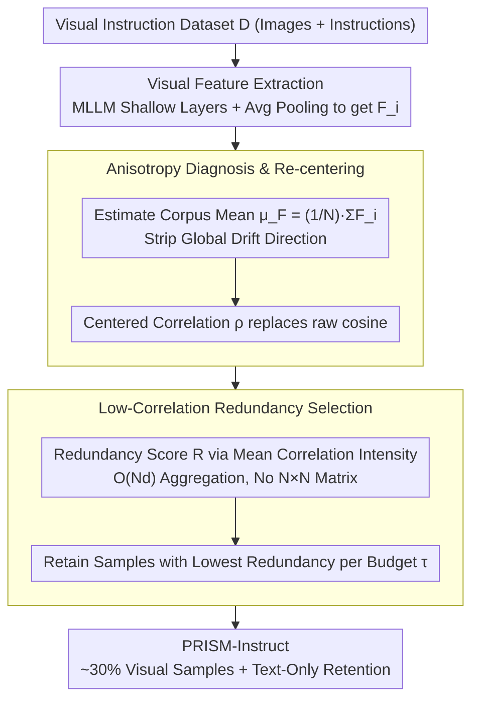

# PRISM: Self-Pruning Intrinsic Selection Method for Training-Free Multimodal Data Selection

**Conference**: ACL2026 Best Paper  
**arXiv**: [2502.12119](https://arxiv.org/abs/2502.12119)  
**Code**: Yes, cache URL not explicitly provided  
**Area**: Multimodal VLM / Data Selection  
**Keywords**: Multimodal data selection, visual instruction tuning, representation anisotropy, training-free selection, redundancy pruning  

## TL;DR
PRISM discovers that the non-zero mean of MLLM visual features causes Global Semantic Drift, which contaminates similarity-based data selection. By using training-free mean re-centering and low-correlation sample filtering, it achieves 101.7% relative performance while retaining only approximately 30% of visual samples, reducing end-to-end GPU time by about 70%.

## Background & Motivation
**Background**: Multimodal large language models (MLLMs) typically undergo large-scale image-text pre-training followed by instruction tuning with visual instruction data. As data pools like LLaVA and VisionFlan expand, the number of instruction samples has grown significantly, but these pools often contain redundant, low-information, or noisy samples.

**Limitations of Prior Work**: Existing visual instruction data selection methods mostly rely on proxy models, external scorers, training loss, perplexity, gradients, or influence functions. These methods either require extra model inference or iterative training and gradient computation. The cost of selecting the data itself is high, sometimes even offsetting the efficiency gains from using less training data.

**Key Challenge**: Data selection is intended to save computational resources, but many selectors transfer the cost to the selection phase. The authors argue the root cause is that most methods directly use the raw geometry of MLLM visual features. These visual embeddings are not uniformly distributed around the origin but are pulled into a narrow cone by a strong global mean direction, leading cosine similarity to mistake shared background drift for semantic similarity.

**Goal**: To propose a proxy-free, training-free, and gradient-free multimodal instruction selection method that maintains or even exceeds full fine-tuning performance while significantly reducing the total cost of selection and tuning.

**Key Insight**: Starting from a diagnostic of representation geometry, the paper proves that visual features exhibit representation anisotropy and singular value concentration. It reformulates the data selection problem as "removing global drift first, then estimating redundancy based on unique semantic components of the samples."

**Core Idea**: Use mean re-centering of the target MLLM's own visual features to restore a more reliable similarity geometry, then retain samples that have low correlation with the overall sample set and thus carry more unique information.

## Method
The key to PRISM is not training a stronger selector, but making the visual representations already present in the MLLM usable again. The selection pipeline is executed in four steps: single-pass feature extraction, global mean estimation, redundancy scoring, and percentile filtering. Thus, the cost is primarily a single forward pass and linear aggregation.

### Overall Architecture
Given a visual instruction dataset $D=\{d_1,\dots,d_N\}$, where each sample contains an image and a text instruction, PRISM first extracts visual features $F_i$ for each sample using the target MLLM's visual encoder, projector, and intermediate LLM layers, obtaining a global image representation through average pooling.

Then, PRISM calculates the feature mean of the entire corpus $\mu_F=\frac{1}{N}\sum_i F_i$. This mean represents the global drift shared by all visual samples rather than the unique semantics of an individual sample. For any two samples, PRISM no longer uses raw cosine similarity but computes the normalized inner product after performing $F_i-\mu_F$ and $F_j-\mu_F$.

Next, the Redundancy Score for each sample is the average of its correlations with all other samples after centering. Intuitively, if a sample is highly correlated with a large number of other samples, it is more likely to be redundant or provide low marginal utility; if the correlation is low, it likely carries more unique visual semantics.

Finally, a portion of samples with the lowest redundancy scores is selected based on a budget $\tau$. In the main experiments, PRISM uses a 30% budget for LLaVA-665K visual samples while retaining text-only samples, resulting in PRISM-Instruct-250K.

> Note: Overall Selection Cost (OSC) is the end-to-end metric used to evaluate whether a selector actually saves costs. It is the motivation for the training-free pipeline and not a stage within the pipeline itself, and is thus excluded from the diagram.

### Key Designs

**1. Overall Selection Cost (OSC): A metric to verify if a data selector "actually saves money"**

Many selection methods only report performance on subsets but hide expensive selection overhead. This leads to the awkward situation where "selection is accurate, but the selection cost plus training cost is more expensive than full dataset training." PRISM establishes an honest metric: multiplying the performance ratio by the time ratio,

$$C=\frac{P(D_{full})}{P(D_{sub})}\times\frac{T_{select}+T_{tune}(D_{sub})}{T_{tune}(D_{full})}.$$

Only when $C<1$ does a method simultaneously maintain performance and achieve net end-to-end computational savings. This indicator forces the comparison back to end-to-end costs and is the core motivation for PRISM's "training-free, single-forward-pass" approach.

**2. Representation Anisotropy Diagnosis & Re-centering: Fix similarity before selecting data**

The authors found that the root cause is not that selectors are weak, but that the raw geometry of MLLM visual features is flawed. These visual embeddings are not uniformly distributed around the origin but are pulled into a narrow cone by a strong global mean, causing cosine similarity to mistake "shared background drift" for "semantic similarity." By decomposing visual features into $x_i=\mu+\delta_i$ (where $\mu$ is the shared global component and $\delta_i$ is the sample-specific semantics), raw cosine is dominated by $\mu$ and approaches 1 when $\|\mu\| \gg \|\delta_i\|$. PRISM's countermeasure is to estimate the corpus mean $\mu_F=\frac{1}{N}\sum_i F_i$ and use the centered correlation

$$\rho(F_i,F_j)=\frac{(F_i-\mu_F)^\top(F_j-\mu_F)}{\|F_i-\mu_F\|_2\,\|F_j-\mu_F\|_2}$$

instead of raw cosine. Notably, the authors explicitly state this is not full whitening, but specifically targets the corpus-level mean shift that most disrupts redundancy estimation—rather than introducing an external scorer, it is better to first fix the most significant first-order geometric bias in the target model's own feature space.

**3. Low-Correlation Redundancy Score Selection: Finding the most unique semantics via first-order aggregation**

Once similarity is fixed, one must determine who is redundant or unique among hundreds of thousands of samples. Constructing an $N\times N$ similarity matrix or running exact greedy coverage is prohibitively expensive. PRISM defines a redundancy score for each sample:

$$R(d_i)=\frac{1}{N-1}\sum_{j\ne i}\rho(F_i,F_j),$$

which is the average connection intensity to all other samples in the centered semantic map. A high score indicates high correlation with many samples, suggesting redundancy or low marginal utility. A low score suggests more unique visual semantics and higher training value. Using an exact aggregate implementation, this score can be computed in $O(Nd)$ without materializing the full pairwise matrix. Finally, samples with redundancy scores below a percentile threshold are retained according to the selection budget $\tau$.

### Loss & Training
PRISM itself has no training loss as it is a training-free selector. After data selection, the authors perform one round of visual instruction tuning following official LLaVA-1.5 hyperparameters. The main setup uses LLaVA-665K and LLaVA-1.5-7B, comparing with methods like Random, Length, EL2N, Perplexity, GraNd, TIVE, InstructionGPT-4, Self-Filter, COINCIDE, ICONS, and DataTailor. Additional experiments validate generalization and knowledge retention on VisionFlan-186K, different MLLM architectures, and text-only benchmarks.

## Key Experimental Results

### Main Results
On LLaVA-1.5-7B, PRISM achieves 101.7% relative performance compared to full fine-tuning, while exceeding full data or strong selection methods across multiple multimodal benchmarks.

| Method | SQA | SQA-I | VizWiz | POPE-P/R/A | MM-Vet | MMBench | MME-C | MMMU | Rel. |
|------|-----|-------|--------|------------|--------|---------|-------|------|------|
| Full-Finetune | 69.4 | 66.8 | 50.0 | 86.1 / 87.3 / 84.2 | 31.1 | 64.3 | 311.9 | 35.4 | 100% |
| TIVE | 72.2 | 70.6 | N/A | 85.6 / 85.6 / 85.6 | N/A | 63.2 | 322.1 | N/A | 100.6% |
| ICONS | N/A | 70.8 | N/A | 87.5 / 87.5 / 87.5 | N/A | 63.1 | N/A | N/A | 101.0% |
| PRISM | 71.3 | 69.1 | 50.1 | 87.7 / 88.7 / 85.5 | 32.0 | 65.2 | 330.0 | 34.7 | 101.7% |

On VisionFlan-186K, PRISM selects 57K samples with the same 30% budget, still exceeding the full-data aggregate and significantly outperforming random selection.

| Method | Samples | VizWiz | SQA-I | TextVQA | POPE | MME | MMBench | Rel. |
|------|--------|--------|-------|---------|------|-----|---------|------|
| Full Data | 186K | 41.7 | 60.8 | 50.4 | 83.4 | 1263.2 | 52.6 | 100.0 |
| Random | 57K | 38.8 | 56.5 | 46.9 | 83.1 | 1175.0 | 48.9 | 94.1 |
| PRISM | 57K | 42.3 | 61.1 | 50.8 | 84.1 | 1275.5 | 53.1 | 100.9 |

### Ablation Study
Core ablations validated three points: shallow visual features are best, low-correlation samples are best, and average pooling is superior to last token.

| Config | SQA | SQA-I | VizWiz | POPE-P/R/A | MM-Vet | MMBench | MME-C | Rel. |
|------|-----|-------|--------|------------|--------|---------|-------|------|
| Deep Layer | 71.2 | 69.1 | 51.6 | 86.6 / 88.0 / 84.2 | 31.1 | 62.9 | 254.0 | 97.2% |
| Middle Layer | 70.9 | 69.1 | 47.7 | 86.5 / 87.8 / 84.2 | 31.9 | 65.0 | 276.0 | 97.9% |
| Shallow Layer | 71.3 | 69.1 | 50.1 | 87.7 / 88.7 / 85.5 | 32.0 | 65.2 | 330.0 | 100.0% |
| High Correlation | 70.6 | 68.0 | 48.1 | 85.8 / 87.6 / 83.9 | 30.7 | 64.0 | 275.3 | 96.3% |
| Low Correlation | 71.3 | 69.1 | 50.1 | 87.7 / 88.7 / 85.5 | 32.0 | 65.2 | 330.0 | 100.0% |
| Last Token | 69.9 | 67.3 | 49.4 | 87.4 / 88.3 / 85.0 | 31.6 | 62.6 | 272.0 | 97.4% |
| Avg Pooling | 71.3 | 69.1 | 50.1 | 87.7 / 88.7 / 85.5 | 32.0 | 65.2 | 330.0 | 100.0% |

Cross-model generalization shows PRISM is not only applicable to LLaVA-1.5-7B, but slightly outperforms full fine-tuning across various LLM and vision encoder combinations.

| Model Combination | Full Rel. | PRISM Rel. | Representative Change |
|----------|-----------|-------------|------------|
| Phi2-3B | 100% | 100.1% | MME 1765.7 → 1790.5 |
| Vicuna-7B | 100% | 101.7% | MMBench 64.3 → 65.2 |
| Vicuna-13B | 100% | 100.4% | MME 1826.7 → 1846.0 |
| Qwen2.5-7B Base | 100% | 101.0% | SQA-I 76.7 → 78.9 |
| Qwen2.5-7B Instruct | 100% | 100.9% | MMBench 71.0 → 72.4 |
| Llama-3-8B | 100% | 100.8% | SQA-I 75.2 → 77.3 |

### Key Findings
- PRISM's main result is not just "maintaining performance with less training," but slightly improving over full fine-tuning: 101.7% in LLaVA-665K and 100.9% in VisionFlan-186K.
- Low-correlation samples outperform high- and medium-correlation samples, directly supporting the core hypothesis that low redundancy after re-centering has higher training value.
- Shallow features outperform middle and deep layers, suggesting that the geometric structure for redundancy detection is cleaner in early visual-token representations; deeper layers may introduce more task-specific and abstract artifacts.
- The final composition of PRISM-Instruct-250K is naturally determined by the global low-redundancy threshold rather than hardcoded source ratios (e.g., LLaVA 53,591, VG 28,777, VQAv2 27,567, OCRVQA 26,638, Text-Only 40,688).
- Text-only retention yields benefits: PRISM-7B achieved 101.9% and PRISM-13B reached 130.6% relative performance, suggesting cleaner visual instruction data might reduce catastrophic forgetting.

## Highlights & Insights
- PRISM's brilliance lies in transforming data selection from a "model scoring problem" into a "geometric calibration problem." If the raw embedding similarity is inherently flawed, even complex cheap distance selectors will be misled.
- The OSC metric is highly practical. It requires a selector to simultaneously satisfy performance fidelity and net efficiency gain, providing a more honest evaluation constraint for data selection papers.
- Performing only corpus mean re-centering rather than full whitening is a pragmatic trade-off. Full whitening requires high-dimensional covariance estimation, regularization, and rank selection; PRISM sacrifices complete isotropization for a stable, hyperparameter-free, and mass-deployable approach.
- Vision-priority selection is insightful. The appendix notes that text features are relatively closer to the center; joint multimodal feature selection only achieved 97.8% relative performance, lower than the 101.7% of visual-only PRISM. This indicates that multimodal selection doesn't necessarily require concatenating all modalities.

## Limitations & Future Work
- PRISM only targets semantic redundancy pruning based on feature correlation and does not detect factual errors, ethical biases, harmful content, or annotation quality issues. Thus, it is suitable as an efficiency selector but should not be treated as a complete data governance tool.
- The method primarily corrects first-order global mean drift rather than complete whitening. If the main problem of certain data pools stems from more complex second-order covariance structures, simple re-centering may be insufficient.
- Tasks mainly focused on visual-language instruction tuning. The authors suggest future extension to other modalities, but whether an exploitable first-order drift exists in audio, video, or robotic trajectories still needs verification.
- PRISM depends on the target MLLM's intermediate visual representation; deployment is restricted when the target model is inaccessible or visual token representations are unstable.
- The current selection goal is to retain low-redundancy samples, but it does not explicitly model task coverage, fairness, rare categories, or safety-critical samples. Future work could combine geometric redundancy scores with quality/safety filters.

## Related Work & Insights
- **vs Random / Length / Perplexity**: These methods are cheap but have weak semantic signals; PRISM is equally cheap but utilizes the centered visual geometry of the target MLLM to estimate redundancy.
- **vs Proxy-Based Selection**: Methods like InstructionGPT-4, Self-Filter, and TIVE depend on external models or scorers, potentially introducing proxy bias and inference overhead; PRISM does not require external evaluators.
- **vs Training-Based Selection**: EL2N, GraNd, and ICONS use training dynamics or gradient signals, which are informative but expensive; PRISM replaces iterative training signals with a single feature extraction pass.
- **vs whitening / top-PC removal**: These geometric corrections are more thorough but require extra hyperparameters or high-dimensional covariance estimation; PRISM chooses simple first-order re-centering to balance performance and scalability.

## Rating
- Novelty: ⭐⭐⭐⭐☆ Explaining data selection inefficiency via visual representation anisotropy is a clear and theoretically supported perspective.
- Experimental Thoroughness: ⭐⭐⭐⭐⭐ Main results, ablations, VisionFlan, cross-model analysis, language retention, and efficiency analysis are all solid.
- Writing Quality: ⭐⭐⭐⭐☆ The method's logic is complete and the appendix is comprehensive, but the main text has high formula and table density, making it a dense read.
- Value: ⭐⭐⭐⭐⭐ Highly practical for multimodal instruction data selection, especially for scenarios requiring genuine end-to-end training cost reduction.

<!-- RELATED:START -->

## Related Papers

- [\[ICML 2026\] Toward Structural Multimodal Representations: Specialization, Selection, and Sparsification via Mixture-of-Experts](../../ICML2026/multimodal_vlm/toward_structural_multimodal_representations_specialization_selection_and_sparsi.md)
- [\[ACL 2026\] iReasoner: Trajectory-Aware Intrinsic Reasoning Supervision for Self-Evolving Large Multimodal Models](ireasoner_trajectory-aware_intrinsic_reasoning_supervision_for_self-evolving_lar.md)
- [\[ICCV 2025\] Mastering Collaborative Multi-modal Data Selection: A Focus on Informativeness, Uniqueness, and Representativeness](../../ICCV2025/multimodal_vlm/mastering_collaborative_multi-modal_data_selection_a_focus_on_informativeness_un.md)
- [\[NeurIPS 2025\] CoIDO: Efficient Data Selection for Visual Instruction Tuning via Coupled Importance-Diversity Optimization](../../NeurIPS2025/multimodal_vlm/coido_efficient_data_selection_for_visual_instruction_tuning_via_coupled_importa.md)
- [\[CVPR 2026\] Rethinking Model Selection in VLM Through the Lens of Gromov-Wasserstein Distance](../../CVPR2026/multimodal_vlm/rethinking_model_selection_in_vlm_through_the_lens_of_gromov-wasserstein_distanc.md)

<!-- RELATED:END -->
