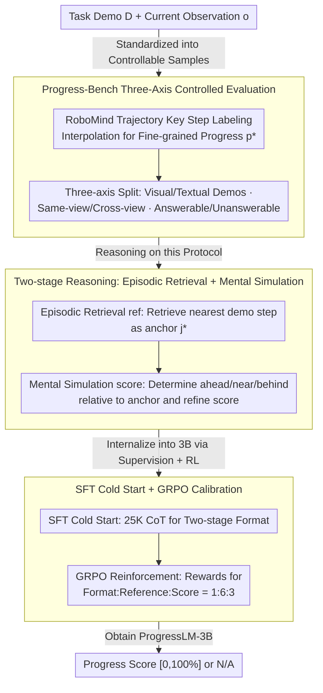

# PROGRESSLM: Towards Progress Reasoning in Vision-Language Models

**Conference**: ACL2026  
**arXiv**: [2601.15224](https://arxiv.org/abs/2601.15224)  
**Code**: Website / Code / Model / Dataset annotated in the cache, but URLs not expanded  
**Area**: Multimodal VLM / Embodied Task Progress Reasoning  
**Keywords**: Progress Reasoning, VLM Evaluation, Embodied AI, Two-stage Reasoning, RL Fine-tuning

## TL;DR
This paper defines the ability to "judge task completion steps from a single-frame observation" as progress reasoning for VLMs. It constructs Progress-Bench and ProgressLM-45K, demonstrating that explicit learning of "episodic retrieval + mental simulation" is more stable than simple inference prompting.

## Background & Motivation
**Background**: Existing VLMs excel at describing "what is there" in single images and answering local state questions in robotics or embodied tasks. However, many practical systems prioritize "how far the task has progressed," such as monitoring robot execution stalls, determining how close a Web agent is to a goal, or generating dense rewards for online RL.

**Limitations of Prior Work**: Traditional progress estimation typically relies on task-specific regressors or transforms the problem into indirect objectives like trajectory re-ranking or pairwise comparison. These methods either depend heavily on specific task distributions or require entire trajectories as context, failing to address a more general question: given a task demonstration and a current single-frame observation, can a VLM directly infer normalized progress?

**Key Challenge**: Single-frame observations provide static visual evidence, whereas progress is essentially a state variable in the temporal dimension. The model cannot simply perform image matching; it must place the current observation back into the task trajectory to determine which stage it spans and how much progress has been made within that stage.

**Goal**: The authors first construct a controllable benchmark to systematically distinguish between visual and textual demonstrations, same-view and cross-view scenarios, and answerable vs. unanswerable samples. They then evaluate 14 VLMs and finally train a small-scale ProgressLM-3B to verify if progress reasoning can be acquired through explicit supervision and reinforcement learning.

**Key Insight**: The paper draws inspiration from how humans understand task progress: first finding a coarse-grained reference point in memory, and then imagining how the state continues to evolve around that reference. This perspective is more interpretable than direct percentage regression and better handles the uncertainty introduced by cross-view or textual demonstrations.

**Core Idea**: Decompose progress estimation into two stages: "episodic retrieval for anchor localization" and "mental simulation for percentage refinement," explicitly teaching this reasoning format to the VLM using ProgressLM-45K.

## Method
The method consists of a benchmark, a reasoning paradigm, and a training pipeline. Progress-Bench standardizes the progress reasoning problem, training-free prompts test the inherent capabilities of existing VLMs, and ProgressLM-3B internalizes two-stage reasoning into model parameters.

### Overall Architecture
The input consists of a task demonstration $D$ and a current observation $o$. Demonstrations can be sequences of keyframes labeled with progress or textual action steps. Observations are single images from an intermediate moment of task execution. The model outputs a progress score in $[0,100\%]$; if the demonstration is inconsistent with the observation or progress cannot be inferred, it outputs N/A.

Progress-Bench is built upon RoboMind. Each task trajectory is first labeled with several key steps, then intermediate frames are sampled between adjacent steps, with fine-grained progress obtained via linear interpolation $p^*=p_j+\delta(p_{j+1}-p_j)$. Visual demonstrations are further split into same-view and cross-view categories to test if the model truly understands task states rather than performing pixel-level similarity matching. Unanswerable samples are constructed by modifying demonstrations or editing observations to check if the model actively refuses to answer during semantic mismatches.

ProgressLM's reasoning output follows a fixed structure: it first generates `<ref_think>` and `<ref>` to find the demonstration step closest to the current observation, then generates `<score_think>` and `<score>` to estimate whether the current state is ahead of, near, or behind this anchor. The training phase uses supervised fine-tuning to learn this format, followed by GRPO reinforcement learning to optimize the format, reference points, and progress scores.

### Key Designs

**1. Progress-Bench Three-Axis Controlled Evaluation: Measuring progress error, ordinal consistency, and rejection capability with a single task definition**

If one only focuses on the final percentage error, a model might cheat using fixed templates or discrete scores, creating an illusion of progress understanding. To expose this, the benchmark decomposes samples along three axes: demonstration modality (visual keyframes vs. textual steps), visual view (same-view vs. cross-view), and answerability status. This structure allows failures to be localized to specific patterns—whether the model fails to understand progress entirely, loses ordering under cross-view conditions, or fails to refuse answers when appropriate. These granular behaviors are revealed rather than being masked by average error.

**2. Two-stage Reasoning (Episodic Retrieval + Mental Simulation): Decomposing continuous progress estimation into anchor selection followed by local comparison**

Directly asking a model for a progress percentage often results in heuristic answers like 0%, 50%, or 100%. ProgressLM mimics human progress judgment by splitting it into two steps: the first stage retrieves the step $j^\star$ in the demonstration closest to the current observation as an anchor; the second stage determines if the current frame falls before, near, or after that step based on state differences, providing a refined score. The output format is fixed—using `<ref_think>`/`<ref>` for anchoring and `<score_think>`/`<score>` for estimation. Explicit anchors constrain scores to an interpretable task state, suppressing heuristic collapse and making errors diagnosable as either anchor selection or detail estimation.

**3. SFT Cold Start + GRPO Alignment: Training small models to follow two-stage formats while binding them to correct anchors and scores**

Simply learning the `<ref>`/`<score>` format is insufficient, as small models may produce the correct format but incorrect anchors and scores. ProgressLM employs ProgressLM-25K-CoT for autoregressive supervised cold-starting with loss $\mathcal{L}_{SFT}=-\frac{1}{N}\sum_i\log P_\theta(r_i^*|D_i,o_i)$ to establish the reasoning skeleton. Subsequently, 20K samples are used for GRPO reinforcement learning, with rewards decomposed into format, reference point, and score components: $R=\alpha R_{format}+\beta R_{ref}+\gamma R_{score}$. The weight ratio is $1:6:3$, placing the majority of the reward on anchor correctness. While SFT teaches "how to reason," RL penalizes anchor errors and score deviations, specifically calibrating the model for difficult cross-view and unanswerable scenarios.

### Loss & Training
The training data is ProgressLM-45K, with 25K used for CoT supervised cold-start and 20K for RL refinement; training tasks do not overlap with Progress-Bench. SFT utilizes LLaMA-Factory with LoRA rank 8, a learning rate of $1\times10^{-4}$, and an effective batch size of 64 on 4 H100 GPUs for 2 epochs. RL uses EasyR1/GRPO with an actor learning rate of $1\times10^{-6}$, KL coefficient of 0.01, and $n=16$ rollouts per prompt, training for 2 epochs over approximately 23 hours on 16 H100 GPUs.

Evaluation uses a large maximum output length to ensure the model can generate complete two-stage reasoning. The paper compares direct prediction, training-free prompting, and training-based ProgressLM to distinguish between gains from prompt formatting and those from training.

## Key Experimental Results

### Main Results
Progress-Bench contains 240 task trajectories and 3,325 sampled observations, evaluating 14 VLMs. Metrics for answerable samples include NSE↓, PRC↑, and AFRR↓; lower NSE indicates smaller percentage error, higher PRC indicates more consistent progress ordering along trajectories, and lower AFRR indicates fewer answerable samples are incorrectly rejected.

| Model | Macro Avg. NSE↓ | Macro Avg. PRC↑ | Macro Avg. AFRR↓ | Note |
|------|-------------|-------------|--------------|------|
| GPT-5 | 21.3 | 72.6 | 4.2 | Strong closed-source baseline, still affected by modality |
| GPT-5-mini | 20.9 | 71.4 | 5.1 | Small closed-source model, PRC close to GPT-5 |
| Qwen2.5-VL-3B | 39.0 | 20.2 | 0.01 | Base model for ProgressLM, weak at direct prediction |
| ProgressLM-3B-SFT | 24.0 | 59.3 | 7.8 | Significant error reduction and improved ordering after SFT |
| ProgressLM-3B-RL | 17.5 | 77.0 | 7.0 | Macro Avg. NSE/PRC better than GPT-5 |

### Ablation Study
| Configuration | Key Metrics | Note |
|------|----------|------|
| Qwen2.5-VL-3B, same-view | NSE 29.2 / PRC 43.0 / AFRR 9.9 | Small model has basic visual matching in same-view |
| Qwen2.5-VL-3B, cross-view | NSE 33.4 / PRC 28.9 / AFRR 6.5 | Significant drop in ordering ability under cross-view |
| ProgressLM-3B-RL, same-view | NSE 10.3 / PRC 93.5 / AFRR 0.1 | Two-stage training is very stable in same-view |
| ProgressLM-3B-RL, cross-view | NSE 15.2 / PRC 88.8 / AFRR 11.7 | Error increases in cross-view, but PRC remains high |
| Qwen2.5-VL-7B, vision no-think | PRC 33.7 / NSE 34.0 / AFRR 28.3 | Direct prediction by 7B remains unreliable |
| Qwen2.5-VL-7B, vision training-based | PRC 85.7 / NSE 13.4 / AFRR 32.4 | Training-based reasoning significantly improves ordering and error |
| Qwen2.5-VL-7B, text training-based | PRC 50.5 / NSE 26.6 / AFRR 1.4 | Textual demos are harder, but training still yields gains |

### Key Findings
- Existing VLMs frequently collapse progress scores into a few heuristic positions (e.g., 0%, 50%, or 100%), leading to negative or undefined PRC. ProgressLM-SFT/RL shows more continuous distributions.
- Training-free reasoning offers conditional benefits only on strong models; small models often follow the output format without true improvement in progress understanding.
- Textual demonstrations are more challenging than visual ones because the model must accumulate implicit state; for example, the same textual step "operating pot lid" can correspond to entirely different object states.
- Identifying unanswerable samples cannot rely solely on UDA; while Intern3.5-VL-38B rejects many anomalies, its high AFRR on answerable samples suggests that excessive conservatism harms system utility.

## Highlights & Insights
- Transitioning the "task progress" of VLMs from a vague capability into a measurable metric is the most valuable contribution. It examines not just image comprehension, but the ability to place single-frame states into a complete task timeline.
- The two-stage reasoning design is simple yet crucial: anchoring first, then estimating details, mirrors human progress judgment and allows for easier error diagnosis.
- ProgressLM-3B surpassing GPT-5 in macro average NSE/PRC suggests that these capabilities are not solely reliant on model scale; targeted supervision and reward design can effectively push small models to more stable performance.
- Unanswerable samples in the benchmark are essential. If progress estimation is used for robot monitoring or agent self-improvement, incorrectly providing a "precise-looking" percentage can be more dangerous than a refusal to answer.

## Limitations & Future Work
- The authors acknowledge that Progress-Bench focuses primarily on robotic manipulation with relatively clear and monotonic progress; open-ended, cyclical, or dynamic goal tasks may not be well-described by a single percentage.
- Training data for ProgressLM involves manipulation tasks with similar structures; migration to Web agents, code agents, or human activities may require new demonstration formats and progress labels.
- Experiments show that AFRR still rises in cross-view scenarios, indicating that the model is not perfectly calibrated between "conservative rejection" and "robust estimation."
- Future work could integrate progress scores into online control: e.g., using low progress growth to detect stalls, high uncertainty to trigger re-planning, or ProgressLM as a dense reward generator to assist RL.

## Related Work & Insights
- **vs. Task-specific Progress Regressors**: Traditional methods train regression models on fixed tasks or environments, with generalization limited to the training distribution. This work treats progress estimation as a general reasoning problem for VLMs using single-frame observations.
- **vs. Trajectory Re-ranking / Pairwise Comparison**: These methods obtain estimates indirectly by re-ranking frames or comparing relative progress, requiring full trajectory context. ProgressLM infers absolute progress from a demo and a single frame, making it more suitable for online monitoring.
- **vs. Inference-time CoT Prompting**: While training-free prompting can force models to state reference steps, the gains are unstable. This work suggests that complex reasoning formats require tying training to rewards to avoid "formatted explanations" without substance.
- **Insight**: For agent evaluation, a "Task Progress Benchmark" could be designed similarly: given a goal, history, and current state, the model must judge completion, identify next bottlenecks, and determine answerability.

## Rating
- Novelty: ⭐⭐⭐⭐☆ Defines progress estimation as a structured reasoning capability for VLMs and builds a three-axis benchmark with clear problem settings.
- Experimental Thoroughness: ⭐⭐⭐⭐⭐ Covers 14 VLMs, same/cross-view, textual/visual demos, unanswerable samples, and 3B/7B training scaling with solid evidence.
- Writing Quality: ⭐⭐⭐⭐☆ Clear narrative and information-dense tables, though some macro-conclusions require synthesis by the reader.
- Value: ⭐⭐⭐⭐⭐ Directly insightful for embodied AI, long-horizon agent monitoring, and RL reward shaping.

<!-- RELATED:START -->

## Related Papers

- [\[NeurIPS 2025\] The Illusion of Progress? A Critical Look at Test-Time Adaptation for Vision-Language Models](../../NeurIPS2025/multimodal_vlm/the_illusion_of_progress_a_critical_look_at_testtime_adaptat.md)
- [\[ACL 2026\] VL-Calibration: Decoupled Confidence Calibration for Large Vision-Language Models Reasoning](vl-calibration_decoupled_confidence_calibration_for_large_vision-language_models.md)
- [\[ACL 2026\] MMErroR: A Benchmark for Erroneous Reasoning in Vision-Language Models](mmerror_a_benchmark_for_erroneous_reasoning_in_vision-language_models.md)
- [\[ACL 2026\] GeoArena: Evaluating Open-World Geographic Reasoning in Large Vision-Language Models](geoarena_evaluating_open-world_geographic_reasoning_in_large_vision-language_mod.md)
- [\[ACL 2026\] Addressing Overthinking in Large Vision-Language Models via Gated Perception-Reasoning Optimization](addressing_overthinking_in_large_vision-language_models_via_gated_perception-rea.md)

<!-- RELATED:END -->
