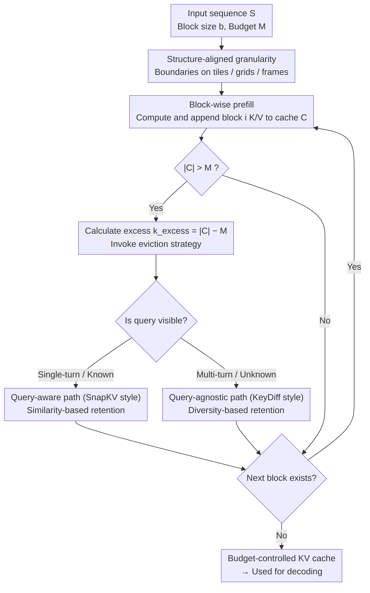

# Reducing Peak Memory Usage for Modern Multimodal Large Language Model Pipelines

**Conference**: ACL 2026  
**arXiv**: [2604.16734](https://arxiv.org/abs/2604.16734)  
**Code**: Not released  
**Area**: Multimodal VLM / Inference Efficiency / KV Cache Compression  
**Keywords**: Multimodal Large Language Models, KV Cache, Prefill Compression, VRAM Optimization, Visual Tokens

## TL;DR
The paper shifts the VRAM bottleneck of Multimodal Large Language Models (MLLMs) from "long-context caching during decoding" to the "visual token peak caching during prefill." It proposes a structure-aware KV-cache framework that performs computation and compression concurrently during the prefill phase, maintaining peak VRAM within a fixed budget while preserving image and video understanding capabilities.

## Background & Motivation
**Background**: Modern MLLMs typically use visual encoders to extract image or video features, which are then fed into the LLM backbone via a projection layer. This results in text tokens and a massive number of visual tokens entering the self-attention mechanism simultaneously. High-resolution images, multi-tile inputs, and long video frame sequences cause visual tokens to expand rapidly, requiring the model to process extremely long multimodal prefixes before decoding begins.

**Limitations of Prior Work**: KV cache was originally designed to reduce redundant computation during autoregressive decoding, but its size grows linearly with the number of tokens, layers, and heads. In MLLMs, peak VRAM usage often occurs not during long response generation, but during the prefill phase: the model must construct the KV cache for the entire visual context before generation starts. Many existing KV compression methods perform eviction or merging *after* the full cache has already been built, thus failing to prevent VRAM spikes and OOM (Out-of-Memory) errors during prefill.

**Key Challenge**: Multimodal inference requires retaining sufficiently fine-grained visual information, especially for high-resolution localization and long-video temporal cues. However, if encoding is completed before compression, the VRAM peak has already occurred. Conversely, directly reducing input resolution or dropping visual tokens causes a loss of task-essential details.

**Goal**: Design an inference framework that maintains a fixed KV-cache budget during the prefill process, enabling models to handle larger-scale visual inputs. Additionally, compare query-aware and query-agnostic online eviction strategies and analyze the relationships between VRAM, latency, and accuracy.

**Key Insight**: The authors observe that visual tokens differ from pure text tokens; images possess spatial continuity and videos possess temporal redundancy. These structures imply that compression granularity should not be entirely random or rely solely on global attention statistics, but should instead align with visual patches, tiles, or frame groups.

**Core Idea**: Instead of waiting for the full multimodal prefix to be encoded before compressing, the visual context is processed in blocks during prefill. Each time a block is processed, the KV cache is compressed back to a fixed budget, effectively changing "process first, compress later" to "compress as you prefill."

## Method
The method proposed in this paper does not involve training a new model but instead reconstructs the inference execution path of MLLMs. The key is to decompose traditional one-time prefill into block-wise prefill: the input sequence is divided into continuous blocks, and the model calculates KV for each block sequentially. After appending new KV pairs, if the cache exceeds the budget, tokens are immediately removed according to an eviction strategy. Thus, the full visual context never resides in VRAM as a complete cache simultaneously; peak VRAM is controlled by the budget rather than the original visual token count.

### Overall Architecture
Given a multimodal input sequence $S$, block size $b$, and cache budget $M$, the framework first divides $S$ into continuous blocks. When processing the $i$-th block, the model computes its key/value pairs and appends them to the existing cache $C$. If $|C| > M$, the system calculates the excess $k_{excess} = |C| - M$ and invokes the eviction strategy to compress the cache back within the budget. This process continues until prefill is complete, resulting in a budget-controlled compressed KV cache for subsequent decoding.

The paper considers two types of online eviction. In single-turn Q&A, where the text query is visible, a query-aware "SnapKV-style" strategy estimates the importance of visual tokens relative to the current question using similarity between proxy queries and cached keys. In potential multi-turn scenarios where future queries are unknown, a query-agnostic "KeyDiff-style" strategy is used, retaining tokens that deviate more from the mean key representation to maintain visual diversity.

### Key Designs

**1. Fixed-budget block-wise prefill: Pinning peak VRAM near budget $M$ rather than expanding with original visual tokens**

The long visual input of MLLMs creates high VRAM spikes before decoding even begins—the model must build the KV cache for the full visual context to generate the first token. Optimizing only the generation phase does not address this peak. This framework decomposes prefill into block-wise execution: the input sequence is cut into blocks of size $b$. When processing block $i$, calculated K/V pairs are added to cache $C$; if $|C| > M$, $k_{excess} = |C| - M$ tokens are immediately evicted. This ensures the full visual context never resides in VRAM as a complete cache. Compared to post-prefill eviction methods, online compression acts directly at the spike's origin to prevent OOM.

**2. Structure-aligned compression granularity: Aligning block boundaries with tiles, spatial grids, and frame groups to avoid deleting critical visual information**

Redundancy in visual tokens is not unstructured noise but stems from repetition in adjacent regions and frames. If compression granularity cuts across these structures, tokens necessary for localization and fine-grained understanding may be erroneously deleted. Thus, block boundaries are intentionally aligned with the natural structure of visual inputs. Analysis shows Qwen2.5-VL-7B performs best with a block size of 784, which exactly matches its $28 \times 28$ visual tokenization. Structure alignment ensures eviction makes trade-offs while respecting spatial/temporal continuity.

**3. Query-aware vs. query-agnostic dual-path eviction: Addressing "task-specific utility" vs. "future-proofed utility"**

In single-turn Q&A, the text query is visible, making task relevance the primary goal. However, in multi-turn scenarios, subsequent queries are unknown, requiring the cache to maintain reusability. The framework provides two paths: the query-aware path uses a SnapKV-style approach to retain tokens relevant to the current question, while the query-agnostic path uses a KeyDiff-style approach, calculating the deviation of each key from the mean representation to preserve rare and representative tokens. This dual-path approach allows the framework to cover both single-turn and potential multi-turn deployments.

### Loss & Training
This paper does not introduce a new training objective or require model fine-tuning; it is an inference-time KV-cache management method. Primary hyperparameters include KV budget, block size, and eviction strategy. The default block size is 256, though the authors found that structure-aligned block sizes significantly improve performance. To mitigate latency from pure block-wise execution, a hybrid strategy is used: bulk forward is used for the portion of the sequence that fits within the budget, with block-wise execution triggered only when the budget is exceeded.

## Key Experimental Results

### Main Results
Main experiments cover fine-grained image localization and long video understanding tasks, including ImageNeedleInHaystack, V*, MLVU, and Video-MME long setting. The following 8B/7B model results demonstrate compression effectiveness (Average: higher is better; Delta: average drop relative to full cache).

| Model | Method / KV Budget | ImageNeedle | V* | MLVU | Video-MME(L) | Average | Delta ↓ |
|------|---------------|-------------|----|------|--------------|---------|---------|
| InternVL3.5-8B | Full Cache | 80.31 | 84.35 | 51.28 | 53.89 | 67.46 | - |
| InternVL3.5-8B | SnapKV 1024 | 80.00 | 82.61 | 51.00 | 53.11 | 66.68 | 0.78 |
| InternVL3.5-8B | KeyDiff 1024 | 74.06 | 74.35 | 50.40 | 52.22 | 62.76 | 4.70 |
| Qwen2.5-VL-7B | Full Cache | 83.70 | 79.58 | 48.80 | 50.00 | 65.52 | - |
| Qwen2.5-VL-7B | SnapKV 4096 | 85.00 | 78.53 | 44.82 | 48.77 | 64.28 | 1.24 |
| Qwen2.5-VL-7B | KeyDiff 4096 | 81.56 | 79.58 | 47.41 | 49.33 | 64.47 | 1.05 |

Model scale experiments indicate the method works on larger backbones, though degradation is more pronounced at a 1024 budget.

| Model | Method / KV Budget | ImageNeedle | V* | MLVU | Video-MME(L) | Average | Delta ↓ |
|------|---------------|-------------|----|------|--------------|---------|---------|
| InternVL3.5-14B | Full Cache | 84.06 | 83.76 | 49.67 | 57.89 | 68.95 | - |
| InternVL3.5-14B | SnapKV 1024 | 66.25 | 82.72 | 47.61 | 56.45 | 63.26 | 7.73 |
| InternVL3.5-14B | KeyDiff 1024 | 75.94 | 64.92 | 46.41 | 52.78 | 60.01 | 8.84 |
| Qwen2.5-VL-32B | Full Cache | 96.56 | 83.77 | 48.40 | 55.22 | 70.99 | - |
| Qwen2.5-VL-32B | SnapKV 1024 | 66.25 | 82.72 | 47.61 | 56.45 | 63.26 | 7.73 |
| Qwen2.5-VL-32B | KeyDiff 1024 | 67.19 | 72.25 | 45.82 | 54.56 | 59.96 | 11.03 |

### Ablation Study
Prefill strategy analysis shows that benefits do not simply come from reducing input resolution, nor is any dynamic budget effective.

| Analysis Item | Setting | ImageNeedle | Note |
|--------|------|-------------|------|
| Forward under budget | Block Forward 1024 | 80.94 | Full block-wise execution, stable VRAM but higher latency |
| Forward under budget | Bulk Forward 1024 | 80.31 | Default hybrid strategy, near accuracy with lower latency |
| Static vs. Dynamic | Static 1024 | 80.31 | Fixed budget is more reliable during prefill |
| Static vs. Dynamic | Dynamic 1024 | 74.68 | Dynamic layer-wise budget drops 5.63 points |
| Input res. vs. Compression | Compression 1024 | 80.31 | Retains high-res input, compresses KV cache only |
| Input res. vs. Compression | Reduction 1024 | 9.38 | Direct resolution reduction destroys visual localization |

Block size ablation further proves that "structure alignment" is critical for compression robustness.

| Block size / KV Budget | ImageNeedle | Global Peak (GB) | Avg. Peak (GB) | Observation |
|----------------------|-------------|------------------|----------------|------|
| 256 / 2048 | 72.19 | 17.80 | 17.12 | Default small block, lowest VRAM but lower accuracy |
| 512 / 2048 | 75.31 | 18.00 | 17.19 | Incompletely aligned with visual grid |
| 784 / 2048 | 80.63 | 18.21 | 17.26 | Matches $28 \times 28$ tokenization, best performance |
| 1024 / 2048 | 79.38 | 18.38 | 17.37 | Slightly higher VRAM for good accuracy |

### Key Findings
- The prefill phase is the critical VRAM bottleneck for MLLMs with many visual tokens; post-prefill compression does not solve this.
- On InternVL3.5-8B, a budget of 1024 resulted in only a 0.78 average drop, suggesting ~90% KV cache compression can still preserve major visual capabilities.
- Query-aware eviction is stronger when the query is visible, while query-agnostic KeyDiff provides a reusable solution for multi-turn or unknown query scenarios.
- Directly reducing input resolution causes ImageNeedle to drop from 80.31 to 9.38, indicating that retaining original visual input while compressing the cache is safer than input-level reduction.
- The method converts OOM failures into an adjustable memory-latency trade-off, though increased latency is an unavoidable system cost.

## Highlights & Insights
- The paper accurately identifies the problem: VRAM pressure in MLLMs results not only from "long generation" but from the "massive visual tokens injected before generation." This perspective extends KV-cache compression from decoding optimization to prefill optimization.
- The method does not require retraining, making it low-impact for engineering. As long as the inference system supports block-wise prefill and online eviction, it can be integrated into existing MLLMs.
- The structure-alignment analysis is insightful. Visual token compression cannot rely solely on numerical importance; it must respect structures like patch grids, tiles, and frame sequences.
- The comparison with input downsampling is compelling. The paper shows that "viewing a lower resolution" is not equivalent to "viewing a high-resolution image but compressing the cache," with the latter being superior for fine-grained tasks.

## Limitations & Future Work
- Block-wise prefill increases Time-to-First-Token (TTFT), especially under small budgets; systems must balance feasibility and latency.
- Query-agnostic eviction only preserves representation diversity and does not account for what the user will actually ask, making it weaker in task-relevance compared to query-aware strategies.
- Compression effectiveness depends on aligning block boundaries with visual tokenization, which may require per-model tuning for different MLLMs.
- The method only compresses during inference without training the model to adapt; future work could train models to be more robust under prefill-stage compression conditions.
- VRAM curves in the paper are primarily shown in figures; exact numerical values for peaks were not provided in text, requiring code or figure analysis for precise replication.

## Related Work & Insights
- **vs SnapKV / H2O etc. post-prefill KV eviction**: These compress decoding-phase caches but usually require building the full context first. This work moves compression into the prefill phase to lower peak VRAM.
- **vs KeyDiff**: KeyDiff is a query-agnostic diversity retention strategy; this paper integrates it into an online prefill framework to maintain a continuous cache budget during visual context construction.
- **vs Input-level token pruning / resolution reduction**: Input pruning reduces the visual information entering the model, leading to detail loss; this paper retains high-resolution input and controls the budget at the KV cache layer.
- **vs MEDA / FlowMM**: While these emphasize hierarchical or cross-modal cache structures, this work suggests that system execution timing (compressing during or after prefill) leads to entirely different peak VRAM outcomes.

## Rating
- Novelty: ⭐⭐⭐⭐ Explicitly moving KV-cache compression to the MLLM prefill stage provides a clear problem definition and system perspective.
- Experimental Thoroughness: ⭐⭐⭐⭐ Covers images, video, various model sizes, and numerous ablations, though specific VRAM numerical readability is limited.
- Writing Quality: ⭐⭐⭐⭐ Standard structure, direct motivation, and clear explanation of system trade-offs.
- Value: ⭐⭐⭐⭐ Practical for deploying high-resolution and long-video MLLMs, especially in VRAM-constrained inference environments.

<!-- RELATED:START -->

## Related Papers

- [\[ACL 2026\] From Verbatim to Gist: Distilling Pyramidal Multimodal Memory via Semantic Information Bottleneck](from_verbatim_to_gist_distilling_pyramidal_multimodal_memory_via_semantic_inform.md)
- [\[CVPR 2026\] Scaling the Long Video Understanding of Multimodal Large Language Models via Visual Memory Mechanism](../../CVPR2026/multimodal_vlm/scaling_the_long_video_understanding_of_multimodal_large_language_models_via_vis.md)
- [\[CVPR 2026\] CAPT: Confusion-Aware Prompt Tuning for Reducing Vision-Language Misalignment](../../CVPR2026/multimodal_vlm/capt_confusion-aware_prompt_tuning_for_reducing_vision-language_misalignment.md)
- [\[ACL 2026\] Enhancing Multimodal Large Language Models for Ancient Chinese Character Evolution Analysis via Glyph-Driven Fine-Tuning](enhancing_multimodal_large_language_models_for_ancient_chinese_character_evoluti.md)
- [\[CVPR 2026\] PointThinker: Point-Incentivized Parallel Thinking for Multimodal Large Language Model](../../CVPR2026/multimodal_vlm/pointthinker_point-incentivized_parallel_thinking_for_multimodal_large_language_.md)

<!-- RELATED:END -->
