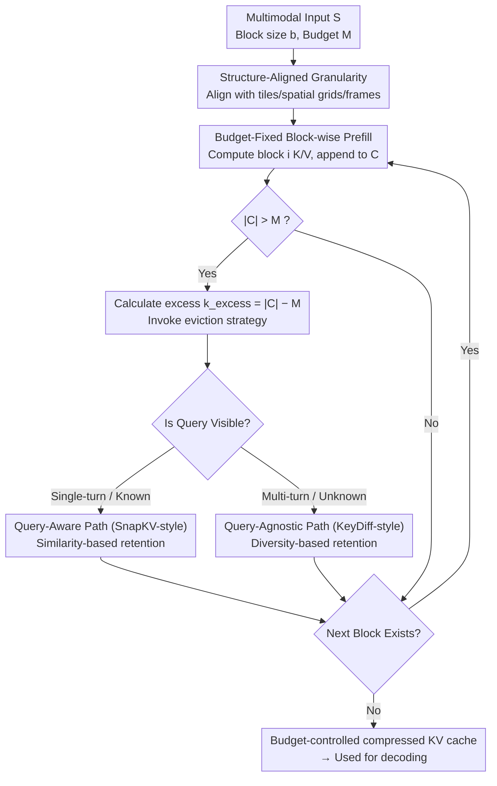

# Reducing Peak Memory Usage for Modern Multimodal Large Language Model Pipelines

**Conference**: ACL 2026  
**arXiv**: [2604.16734](https://arxiv.org/abs/2604.16734)  
**Code**: Not disclosed  
**Area**: Multimodal VLM / Inference Efficiency / KV Cache Compression  
**Keywords**: Multimodal Large Models, KV Cache, Prefill Compression, Memory Optimization, Visual Tokens

## TL;DR
The paper shifts the memory bottleneck of Multimodal Large Language Models (MLLMs) from "long-context caching in the decoding stage" to the "peak visual token caching in the prefill stage." It proposes a structure-aware KV-cache framework that performs computation and compression concurrently during prefill, maintaining peak memory within a fixed budget while preserving image and video understanding capabilities.

## Background & Motivation
**Background**: Modern MLLMs typically utilize a visual encoder to extract image or video features, which are then fed into the LLM backbone via a projection layer. This results in text tokens and a massive number of visual tokens entering the self-attention mechanism together. High-resolution images, multi-tile inputs, and long video frame sequences cause visual token counts to explode, requiring the model to process extremely long multimodal prefixes before decoding.

**Limitations of Prior Work**: KV cache was originally designed to reduce redundant computation in autoregressive decoding, but cache size grows linearly with the number of tokens, layers, and heads. In MLLMs, peak memory usage often occurs during the prefill stage rather than during long answer generation: the model must construct the KV cache for the entire visual context before beginning generation. Many existing KV compression methods perform eviction or merging only after the full cache is established, failing to avoid memory spikes and Out-Of-Memory (OOM) errors during prefill.

**Key Challenge**: Multimodal inference requires maintaining sufficiently fine-grained visual information, particularly for high-resolution localization and long-video temporal cues. However, if full encoding precedes compression, the memory peak has already occurred. Conversely, directly reducing input resolution or discarding visual tokens loses details essential for the task.

**Goal**: To design an inference framework that maintains a fixed KV-cache budget during the prefill process, enabling the model to handle larger-scale visual inputs. Additionally, the paper compares query-aware and query-agnostic online eviction strategies and analyzes the relationships between memory, latency, and accuracy.

**Key Insight**: The authors observe that visual tokens differ from pure text tokens; images possess spatial continuity, and videos exhibit temporal redundancy. These structures imply that compression granularity should not be entirely random or solely dependent on global attention statistics, but should instead align with visual patches, tiles, or frame groups.

**Core Idea**: Instead of waiting for the entire multimodal prefix to be encoded before compressing, the visual context is processed in blocks during prefill. Each time a block is processed, the KV cache is compressed back to a fixed budget, shifting from "process first, compress later" to "compress as you prefill."

## Method
The methodology does not involve training a new model but rather restructuring the inference execution path of MLLMs. The key is to decompose the traditional one-shot prefill into block-wise prefill: the input sequence is divided into consecutive blocks, and the model calculates the KV for each block sequentially. After appending the KV of a new block, if the cache exceeds the budget, the eviction strategy immediately removes parts of the tokens. This ensures the full visual context never resides in memory simultaneously as a full cache; peak memory is controlled by the budget $M$ rather than the original visual token count.

### Overall Architecture
Given a multimodal input sequence $S$, block size $b$, and cache budget $M$, the framework divides $S$ into consecutive blocks. When processing the $i$-th block, the model computes the key/value for that block and appends them to the existing cache $C$. If $|C| > M$, the system calculates the excess $k_{excess}=|C|-M$ and invokes an eviction strategy to compress the cache back within the budget. This process continues until prefill is complete, resulting in a budget-controlled compressed KV cache for subsequent decoding.

The paper considers two types of online eviction. In single-turn QA, the text query is already visible, allowing for a query-aware SnapKV-style strategy using a proxy query from the prompt and cache-key similarity to estimate token importance. In potential multi-turn scenarios where subsequent queries may be unknown, a query-agnostic KeyDiff-style strategy is used, retaining tokens that deviate significantly from the average key representation to maintain visual diversity.

### Key Designs

**1. Fixed-budget block-wise prefill: Fixing peak memory near budget $M$ instead of expanding with raw visual tokens.**

The long visual input of MLLMs creates a memory spike even before decoding starts. Existing generation-stage optimizations cannot mitigate this peak. This framework decomposes the one-shot prefill: the input is sliced into blocks of size $b$. When processing block $i$, the K/V is appended to $C$. If $|C| > M$, $k_{excess}$ is calculated and eviction is triggered immediately. Thus, the full context never exists simultaneously in memory. Compared to post-prefill methods that wait for the full cache, online compression acts directly where the spike occurs to prevent OOM.

**2. Visual structure-aligned compression granularity: Aligning block boundaries with tiles, spatial grids, and frame groups to avoid deleting critical visual information.**

Redundancy in visual tokens is not unstructured noise but stems from adjacent regions and frames. If compression granularity cuts across these structures, critical localization and fine-grained information may be lost. Block boundaries are intentionally aligned with the natural structure of visual inputs. Analysis shows Qwen2.5-VL-7B performs best with a block size of 784, which corresponds exactly to its $28 \times 28$ visual tokenization. Structure alignment ensures eviction makes trade-offs while respecting spatial/temporal continuity.

**3. Query-aware and query-agnostic dual-path eviction: Addressing "current task utility" and "future task potential" respectively.**

In single-turn QA, the visibility of the text query allows for focusing on task relevance. In multi-turn scenarios, however, the cache must remain reusable for unknown future queries. The framework provides two paths: the query-aware path (SnapKV-style) uses proxy queries to retain relevant tokens, while the query-agnostic path (KeyDiff-style) calculates deviations from the mean representation to retain "rare" or representative tokens. This ensures coverage for both single-turn and potential multi-turn deployments.

### Loss & Training
This work does not introduce new training objectives or require model fine-tuning; it is an inference-time KV-cache management method. Primary hyperparameters include KV budget, block size, and eviction strategy. The default block size is 256, though structure-aligned sizes yield better results. To mitigate latency from pure block-wise execution, a hybrid strategy is used: bulk forward handles the portion within the budget, entering block-wise execution only when the budget is exceeded.

## Key Experimental Results

### Main Results
Experiments cover fine-grained image localization and long video understanding, including ImageNeedleInHaystack, V*, MLVU, and Video-MME long settings. Results for 8B/7B models are highlighted below. Average is higher the better; Delta represents the average decrease relative to full cache.

| Model | Method / KV Budget | ImageNeedle | V* | MLVU | Video-MME(L) | Average | Delta ↓ |
|------|---------------|-------------|----|------|--------------|---------|---------|
| InternVL3.5-8B | Full Cache | 80.31 | 84.35 | 51.28 | 53.89 | 67.46 | - |
| InternVL3.5-8B | SnapKV 1024 | 80.00 | 82.61 | 51.00 | 53.11 | 66.68 | 0.78 |
| InternVL3.5-8B | KeyDiff 1024 | 74.06 | 74.35 | 50.40 | 52.22 | 62.76 | 4.70 |
| Qwen2.5-VL-7B | Full Cache | 83.70 | 79.58 | 48.80 | 50.00 | 65.52 | - |
| Qwen2.5-VL-7B | SnapKV 4096 | 85.00 | 78.53 | 44.82 | 48.77 | 64.28 | 1.24 |
| Qwen2.5-VL-7B | KeyDiff 4096 | 81.56 | 79.58 | 47.41 | 49.33 | 64.47 | 1.05 |

Model scale experiments show that the method works on larger models, though performance drops significantly at a 1024 budget.

| Model | Method / KV Budget | ImageNeedle | V* | MLVU | Video-MME(L) | Average | Delta ↓ |
|------|---------------|-------------|----|------|--------------|---------|---------|
| InternVL3.5-14B | Full Cache | 84.06 | 83.76 | 49.67 | 57.89 | 68.95 | - |
| InternVL3.5-14B | SnapKV 1024 | 66.25 | 82.72 | 47.61 | 56.45 | 63.26 | 7.73 |
| InternVL3.5-14B | KeyDiff 1024 | 75.94 | 64.92 | 46.41 | 52.78 | 60.01 | 8.84 |
| Qwen2.5-VL-32B | Full Cache | 96.56 | 83.77 | 48.40 | 55.22 | 70.99 | - |
| Qwen2.5-VL-32B | SnapKV 1024 | 66.25 | 82.72 | 47.61 | 56.45 | 63.26 | 7.73 |
| Qwen2.5-VL-32B | KeyDiff 1024 | 67.19 | 72.25 | 45.82 | 54.56 | 59.96 | 11.03 |

### Ablation Study
Prefill strategy analysis shows that gains are not merely due to lower input resolution, nor are arbitrary dynamic budgets effective.

| Analysis Item | Setting | ImageNeedle | Details |
|--------|------|-------------|------|
| Forward under budget | Block Forward 1024 | 80.94 | Constant block execution, stable memory but higher latency |
| Forward under budget | Bulk Forward 1024 | 80.31 | Default hybrid strategy, lower latency with similar accuracy |
| Static vs. Dynamic | Static 1024 | 80.31 | Fixed budget is more reliable during prefill |
| Static vs. Dynamic | Dynamic 1024 | 74.68 | Dynamic per-layer budget drops 5.63 points |
| Input res. vs. Compression | Compression 1024 | 80.31 | Keeps high-res input, only compresses KV cache |
| Input res. vs. Compression | Reduction 1024 | 9.38 | Direct resolution reduction destroys localization |

Block size ablation confirms that structure alignment is a critical factor for compression robustness.

| Block size / KV Budget | ImageNeedle | Global Peak (GB) | Avg. Peak (GB) | Observation |
|----------------------|-------------|------------------|----------------|------|
| 256 / 2048 | 72.19 | 17.80 | 17.12 | Small blocks, lowest memory but lower accuracy |
| 512 / 2048 | 75.31 | 18.00 | 17.19 | Not fully aligned with visual grid |
| 784 / 2048 | 80.63 | 18.21 | 17.26 | Matches $28 \times 28$ tokenization, best performance |
| 1024 / 2048 | 79.38 | 18.38 | 17.37 | Slightly higher memory for good accuracy |

### Key Findings
- The prefill stage is the critical memory bottleneck for MLLMs with heavy visual tokens; post-prefill compression cannot resolve this.
- On InternVL3.5-8B, a SnapKV 1024 budget results in only a 0.78 average drop, suggesting ~90% KV cache compression still preserves core visual abilities.
- Query-aware eviction is superior when the query is visible; query-agnostic KeyDiff provides a reusable solution for multi-turn scenarios.
- Directly reducing input resolution causes ImageNeedle to drop from 80.31 to 9.38, indicating that retaining raw input while compressing the cache is safer for fine-grained tasks.
- The method converts OOM failures into a tunable memory-latency trade-off, though increased latency is an inherent system cost.

## Highlights & Insights
- The paper correctly identifies the problem: memory pressure in MLLMs arises not just from "generating long" but from "fitting massive visual tokens before generation." This perspective extends KV-cache compression from decoding optimization to prefill optimization.
- The method does not require retraining, minimizing engineering overhead. It can be integrated into existing MLLMs as long as the inference system supports block-wise prefill and online eviction.
- The analysis of structure alignment is insightful. Visual token compression should respect input structures like patch grids, tiles, and frame sequences rather than just numerical importance.
- The comparison with input downsampling is compelling, showing that "seeing less" is not the same as "seeing the whole image with a compressed cache." The latter is better for fine-grained visual tasks.

## Limitations & Future Work
- Block-wise prefill increases time-to-first-token, requiring a balance between feasibility and latency.
- Query-agnostic eviction preserves representation diversity but lacks task-specific knowledge, making it weaker than query-aware strategies.
- Compression performance depends on the alignment of block boundaries with visual tokenization; different MLLMs may require specific parameter tuning.
- The method compresses only at inference time; future work could involve training models to be more robust under prefill-stage compression.
- Memory curves are primarily shown as figures without accompanying exact numerical tables for peaks; replication would require these metrics.

## Related Work & Insights
- **vs SnapKV / H2O (post-prefill KV eviction)**: These methods compress decoding-stage caches but usually require constructing the full context first. This work moves compression into the prefill process to reduce peak memory.
- **vs KeyDiff**: KeyDiff is a query-agnostic diversity retention strategy. This paper embeds it into an online prefill framework for continuous budget control.
- **vs Input-level token pruning / resolution reduction**: Input pruning reduces the visual information entering the model, often losing details. This work preserves high-res inputs and controls budgets at the KV cache layer.
- **vs MEDA / FlowMM**: While those focus on layered or cross-modal structures, this work emphasizes that the execution timing (during prefill vs. after prefill) significantly impacts peak memory.

## Rating
- Novelty: ⭐⭐⭐⭐ Explicitly moves KV-cache compression to the MLLM prefill stage with clear problem positioning.
- Experimental Thoroughness: ⭐⭐⭐⭐ Covers various images, videos, model sizes, and ablations, though visual memory curves lack numerical precision.
- Writing Quality: ⭐⭐⭐⭐ Concise structure, direct motivation, and clear explanation of system trade-offs.
- Value: ⭐⭐⭐⭐ Highly practical for deploying high-res and long-video MLLMs, especially in memory-constrained environments.

<!-- RELATED:START -->

## Related Papers

- [\[CVPR 2026\] Scaling the Long Video Understanding of Multimodal Large Language Models via Visual Memory Mechanism](../../CVPR2026/multimodal_vlm/scaling_the_long_video_understanding_of_multimodal_large_language_models_via_vis.md)
- [\[ACL 2026\] From Verbatim to Gist: Distilling Pyramidal Multimodal Memory via Semantic Information Bottleneck](from_verbatim_to_gist_distilling_pyramidal_multimodal_memory_via_semantic_inform.md)
- [\[ACL 2026\] Enhancing Multimodal Large Language Models for Ancient Chinese Character Evolution Analysis via Glyph-Driven Fine-Tuning](enhancing_multimodal_large_language_models_for_ancient_chinese_character_evoluti.md)
- [\[CVPR 2026\] CAPT: Confusion-Aware Prompt Tuning for Reducing Vision-Language Misalignment](../../CVPR2026/multimodal_vlm/capt_confusion-aware_prompt_tuning_for_reducing_vision-language_misalignment.md)
- [\[CVPR 2026\] MeteorPred: A Meteorological Multimodal Large Model and Dataset for Severe Weather Event Prediction](../../CVPR2026/multimodal_vlm/meteorpred_a_meteorological_multimodal_large_model_and_dataset_for_severe_weathe.md)

<!-- RELATED:END -->
