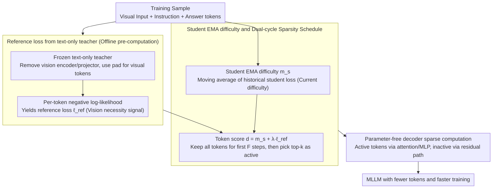

# ReGATE: Learning Faster and Better with Fewer Tokens in MLLMs

**Conference**: ACL 2026  
**arXiv**: [2507.21420](https://arxiv.org/abs/2507.21420)  
**Code**: https://people-robots.github.io/regate (Project Page)  
**Area**: Multimodal VLM / Training Acceleration / Token Pruning  
**Keywords**: Multimodal Large Language Models, Training Acceleration, Token Elision, Teacher-Student, Sparse Computation

## TL;DR
ReGATE utilizes a frozen text-only teacher to estimate which output tokens require visual information, combined with the student's historical learning difficulty to dynamically select training tokens. This allows MLLMs to train faster with fewer tokens without changing the architecture or adding parameters, achieving or exceeding standard fine-tuning performance on multiple image and video benchmarks.

## Background & Motivation
**Background**: The training cost of MLLMs is primarily driven by long-sequence self-attention and large-scale visual inputs. This is particularly evident in video tasks, where multiple frames are expanded into a massive number of visual tokens, which then enter the LLM backbone alongside instruction and answer tokens, making each forward/backward pass expensive.

**Limitations of Prior Work**: Most token reduction, token merging, and token compression methods target the inference stage. While they speed up generation in trained models, they fail to reduce the tokens that must be processed during each training step. Existing training-time acceleration methods either originate from text-only LMs or rely on additional modules, specialized scorers for visual tokens, or heuristic pruning, making them difficult to transfer seamlessly across different MLLMs.

**Key Challenge**: Not all tokens are equally worth computing during training. Functional words, template words, or tokens directly predictable from text context contribute limited value to multimodal grounding. However, simply pruning tokens based on naive rules might mistakenly remove critical cues for color, action, object attributes, and temporal sequences that require visual evidence.

**Goal**: To construct a training-time token elision framework that can identify critical tokens requiring visual grounding while dynamically adjusting the computational budget based on the student's current learning state, all without altering the model structure or adding trainable parameters.

**Key Insight**: The authors use "whether the text context can predict the token" as a proxy signal for visual dependency. If a frozen text-only teacher can easily predict a token after masking visual inputs, the marginal value of that token for multimodal training is likely low; conversely, high reference loss typically indicates a need for visual information.

**Core Idea**: Use the reference loss from a text-only teacher to represent visual necessity and the EMA loss from the student to represent current learning difficulty. By summing these two, high-scoring tokens are selected for sparse computation, concentrating training compute on tokens that are "both vision-dependent and still difficult to learn."

## Method
The name ReGATE stands for Reference-Guided Adaptive Token Elision. Instead of crudely deleting visual tokens, it calculates an importance mask for output tokens during training and restricts the transformer decoder's primary computation to selected tokens. Inactive tokens do not participate in attention or MLP re-computation but retain their original representations via residuals. Thus, the model's functional form remains unchanged and compatible with pre-trained weights, while each training step processes fewer low-value tokens.

### Overall Architecture
The workflow is divided into two stages. The first stage is reference loss generation: a frozen text-only teacher is constructed from the student MLLM's LLM backbone by removing the vision encoder and projector, replacing visual tokens with `<pad>` placeholders to maintain sequence length. The teacher calculates per-token negative log-likelihood for the answer tokens, yielding $\ell^{ref}_{b,i}$. High reference loss suggests that the teacher struggles to predict the token based on text alone, indicating higher dependence on visual evidence.

The second stage is student training: during training, the EMA difficulty $m_{s,i}$ for each token in every sample is maintained and continuously updated with the current student loss. ReGATE combines these into a token score $d_{b,i}=m_{s,i}+\lambda\ell^{ref}_{b,i}$, and selects top-$k$ tokens as active tokens according to the current sparsity schedule. Active tokens undergo normal attention, MLP, and backpropagation, while inactive tokens skip major computations, thereby reducing token usage, training time, and activation memory.

### Key Designs

**1. Reference loss from text-only teacher: Using "text predictability" as a proxy for visual necessity**

The true cost in multimodal training lies in learning cross-modal evidence rather than repeatedly training functional or template words. However, these low-value tokens are mixed with tokens for color, action, and object attributes that require visual context, and simple rules can easily cause collateral damage. ReGATE's solution is to copy a frozen text-only teacher from the student's own LLM backbone, remove the vision encoder and projector, and replace visual tokens with `<pad>` to maintain sequence length. This forces the teacher to predict answer tokens based solely on text context, calculating the per-token negative log-likelihood to obtain $\ell^{ref}_{b,i}$. A higher reference loss indicates the teacher cannot "guess" the token without visual information, signifying a higher likelihood of visual grounding dependence. This signal requires no manual annotation, can be pre-computed offline, and effectively tags each output token with its "visual necessity."

**2. Student EMA difficulty and dual-cycle sparsity schedule: Allowing pruned tokens to evolve with training progress**

The teacher only reflects static visual dependence, but a token that is difficult to learn now may not remain so—computing already-learned tokens is wasteful. ReGATE thus maintains an EMA difficulty $m_{s,i}$ based on historical student loss for each token, updated via $m_{s,i}\leftarrow\beta m_{s,i}+(1-\beta)\ell^{stu}_{b,i}$, and sums it with the teacher signal to create a token score:

$$d_{b,i}=m_{s,i}+\lambda\ell^{ref}_{b,i}$$

Training runs in cycles of $C$; for the first $F$ steps of each cycle, all tokens are kept to stabilize difficulty estimates, after which only the proportion $p_{sparse}$ with the highest scores are kept as active tokens. This selection ensures the model doesn't obsess over tokens that have become easy, nor does it rely solely on static signals while ignoring the student's progress. Compute is guided toward the intersection of "vision-dependent" and "still difficult to learn."

**3. Parameter-free decoder sparse computation: Translating token masks into actual flops/memory savings**

Simply masking tokens at the loss layer does not save the bulk of forward/backward pass overhead. ReGATE sinks sparsity into the decoder layers: query/key/value generation and attention are performed only for active tokens. Similarly, the MLP only gathers hidden states of active tokens for computation before scattering them back. Inactive tokens bypass these paths via residuals and do not receive gradients. Since the model's functional form is preserved and pre-trained weights remain compatible, this sparsification adds zero trainable parameters while significantly reducing per-step training time and activation memory, translating "processing fewer tokens" into real training acceleration.

### Loss & Training
ReGATE maintains the original MLLM fine-tuning objectives while changing which tokens participate in primary computation. In experiments, teacher reference loss is pre-computed and cached for the entire fine-tuning dataset before training to avoid running the teacher at every step. Default hyperparameters include a cycle $C=128$, stable steps $F=16$, sparsity ratio $p_{sparse}=0.5$, global warm-up of 100 iterations, EMA decay $\beta=0.9$, and teacher loss weight $\lambda=0.5$. VideoLLaMA2 and VideoChat2 experiments utilized 4 H100 GPUs, while InternVL3.5 used 16 H100s; the method covers both full fine-tuning and LoRA fine-tuning.

## Key Experimental Results

### Main Results
Image understanding experiments show that while reducing tokens by 41% to 44%, ReGATE typically improves performance on tasks like ScienceQA, MME, and VizWiz. The two numbers for MME correspond to perception / cognition.

| Model | Tokens | ScienceQA | MME | VizWiz | POPE | SEED-I |
|------|--------|-----------|-----|--------|------|--------|
| VideoChat2 | 3.93B | 40.8 | 314.6 / 1244.0 | 28.5 | 86.2 | 45.9 |
| VideoChat2-ReGATE | 2.22B (↓43.51%) | 46.6 | 360.7 / 1287.8 | 32.5 | 85.1 | 47.2 |
| VideoLLaMA2 | 83.82M | 61.4 | 376.4 / 1474.0 | 46.8 | 86.7 | 70.4 |
| VideoLLaMA2-ReGATE | 49.27M (↓41.22%) | 80.5 | 391.1 / 1507.1 | 48.0 | 87.5 | 70.0 |
| InternVL3.5 | 3.96B | 93.3 | 681.6 / 1694.3 | 60.6 | 91.6 | 76.8 |
| InternVL3.5-ReGATE | 2.32B (↓41.41%) | 94.4 | 689.3 / 1698.8 | 61.5 | 93.1 | 76.6 |

Long and short video experiments further verify ReGATE's applicability beyond static images. It shows improvements on Video-MME, MLVU, MVBench, and Perception, though slight declines occur in EgoSchema, LongVideoBench, or NExT-QA, indicating limitations of a fixed sparsity rate.

| Model | Tokens | Video-MME | LongVideoBench | MLVU | EgoSchema | MVBench | Perception |
|------|--------|-----------|----------------|------|-----------|---------|------------|
| VideoChat2 | 3.93B | 26.0 | 21.8 | 36.0 | 55.6 | 55.7 | 48.4 |
| VideoChat2-ReGATE | 2.22B | 32.7 | 24.3 | 40.5 | 54.8 | 56.6 | 50.0 |
| VideoLLaMA2 | 83.82M | 53.7 | 47.7 | 53.2 | 58.2 | 52.0 | 53.0 |
| VideoLLaMA2-ReGATE | 49.27M | 54.5 | 47.6 | 54.5 | 56.4 | 53.6 | 54.1 |
| InternVL3.5 | 3.96B | 62.4 | 57.9 | 63.7 | 64.7 | 68.3 | 65.3 |
| InternVL3.5-ReGATE | 2.32B | 63.0 | 58.0 | 64.2 | 63.9 | 69.6 | 66.7 |

The efficiency table demonstrates the "learning faster" conclusion. Aggressive ReGATE approaches the baseline within fewer GPU-hours, while extended ReGATE exceeds baseline average accuracy with less training time.

| Model | Setting | Tokens ↓ | Teacher Cost | Train Time | Avg. Mem/GPU | Avg. Acc. ↑ |
|------|------|----------|--------------|------------|--------------|-------------|
| VideoLLaMA2 | Baseline | 83.82M | - | 129.6 | 69.1 GB | 48.2 |
| VideoLLaMA2 | ReGATE extended | 49.27M | 2.1 | 107.6 | 61.3 GB | 48.9 |
| VideoLLaMA2 | ReGATE fast | 29.32M | 2.1 | 64.0 | - | 48.0 |
| VideoChat2 | Baseline | 3.93B | - | 148.8 | 70.8 GB | 46.1 |
| VideoChat2 | ReGATE extended | 2.22B | 10.0 | 130.0 | 63.7 GB | 47.8 |
| VideoChat2 | ReGATE fast | 1.51B | 10.0 | 86.4 | - | 46.0 |
| InternVL3.5 | Baseline | 3.96B | - | 435.2 | 58.3 GB | 61.8 |
| InternVL3.5 | ReGATE extended | 2.32B | 11.3 | 374.4 | 51.9 GB | 62.2 |
| InternVL3.5 | ReGATE fast | 1.63B | 11.3 | 262.4 | - | 61.6 |

### Ablation Study
Ablations in the appendix show both signals are vital. Using only student EMA or only reference loss is inferior to the combined signal, and a capacity-aligned teacher is more suitable than one that is too small or too large.

| Ablation Item | Setting | Avg. Acc. | Explanation |
|----------|------|-----------|------|
| λ Weight | λ=0.0, Student EMA Only | 47.7 | Lacks vision dependency signal |
| λ Weight | λ=1.0, Reference Loss Only | 46.4 | Only teacher signal, ignores student state |
| λ Weight | λ=0.5, Combined Signal | 48.9 | Signals are complementary; best performance |
| Teacher Capacity | Qwen2-1.5B | 45.4 | Weak teacher misidentifies linguistic difficulty as vision-heavy |
| Teacher Capacity | Qwen2-57B | 46.8 | Strong teacher uses world knowledge to "guess," underestimating vision dependency |
| Teacher Capacity | Qwen2-7B | 48.9 | Aligned with student capacity and tokenizer; most reliable |

### Key Findings
- ReGATE reduces tokens by approximately 41% to 44% across 3 MLLMs, while frequently improving zero-shot image and video understanding metrics.
- Acceleration gains vary by training method: full fine-tuning (VideoLLaMA2) benefits most, while LoRA (VideoChat2) sees relatively smaller time gains as the backward pass is already light.
- Reference teacher capacity follows a Goldilocks principle; an overly powerful teacher might "guess" visual words using world knowledge, causing the removal of tokens that the student actually needs for visual grounding.
- A fixed $p_{sparse}=0.5$ is simple and stable, though failure cases in the appendix show critical tokens can occasionally be skipped due to the fixed ratio.
- Attention visualizations indicate that ReGATE-trained models pay more attention to task-relevant regions like hands or manipulated objects, suggesting token elision shifts the learning focus rather than just saving compute.

## Highlights & Insights
- The most ingenious aspect is using a text-only teacher as a vision dependency probe. It doesn't require labeling "which words need a picture"; it simply measures prediction difficulty without visual input to yield fine-grained token signals.
- The paper avoids complex architectural modifications. ReGATE requires no trainable parameters or structural rewrites, making it more transferable to existing MLLMs than many other training-time compression methods.
- Combining student EMA and teacher reference loss is intuitive. The former indicates "what the model doesn't know," while the latter indicates "what likely requires vision"—the combination is more robust than either signal alone.
- Results suggest training acceleration doesn't have to sacrifice precision. Removing low-value tokens from training calculations might actually reduce background noise, allowing the model to focus on cross-modal evidence.

## Limitations & Future Work
- The current sparsity schedule is fixed and cannot adaptively adjust retention ratios based on sample complexity, task type, or training stability.
- Reference supervision comes from a frozen text-only teacher, which has limited coverage of fine-grained spatial/temporal reasoning; future work could explore stronger multimodal-aware but capacity-aligned teachers.
- Per-token reference loss depends on tokenizer alignment, making it difficult to use cross-architecture teachers and limiting teacher selection.
- The method was primarily validated on publicly trainable 7B/14B MLLMs; engineering gains in larger-scale closed-source or web-scale training remain unconfirmed.
- Fixed sparsity can miss a few critical tokens; failure analysis shows useful words like "static" or "NASA" were skipped, indicating adaptive sparsity is a natural next step.

## Related Work & Insights
- **vs RHO-1**: RHO-1 selects high-value tokens in text-only LMs using a reference model; ReGATE extends this to MLLMs and interprets reference loss as a visual dependency signal.
- **vs LaVi**: LaVi skips visual tokens via additional visual modulation modules, requiring architectural changes and new parameters; ReGATE is parameter-free and primarily gates the training computation of output text tokens.
- **vs LLaVA-Meteor**: Meteor uses visual token scorers and heuristic pruning mainly for image instruction tuning; ReGATE combines teacher loss with student EMA for both images and videos and adapts to LoRA/full fine-tuning.
- **vs inference-time token pruning**: Inference pruning does not reduce training costs; ReGATE acts directly on the forward/backward pass, making it more suitable for large-scale MLLM fine-tuning.

## Rating
- Novelty: ⭐⭐⭐⭐ Using text-only reference loss as a vision dependency signal for MLLM training is simple and effective.
- Experimental Thoroughness: ⭐⭐⭐⭐⭐ Covers 3 models, images/long video/short video, efficiency, baseline comparisons, and ablation studies; the evidence is comprehensive.
- Writing Quality: ⭐⭐⭐⭐ The methodology is clear and experiments are rich, though the tables are numerous and the layout is slightly dense.
- Value: ⭐⭐⭐⭐⭐ Highly practical for reducing MLLM fine-tuning costs, especially for video models and resource-constrained training.

<!-- RELATED:START -->

## Related Papers

- [\[CVPR 2026\] Better, Stronger, Faster: Tackling the Trilemma in MLLM-based Segmentation with Simultaneous Textual Mask Prediction](../../CVPR2026/multimodal_vlm/better_stronger_faster_tackling_the_trilemma_in_mllm-based_segmentation_with_sim.md)
- [\[NeurIPS 2025\] Better Tokens for Better 3D: Advancing Vision-Language Modeling in 3D Medical Imaging](../../NeurIPS2025/multimodal_vlm/better_tokens_for_better_3d_advancing_vision-language_modeling_in_3d_medical_ima.md)
- [\[CVPR 2026\] Hugging Visual Prompt and Segmentation Tokens: Consistency Learning for Fine-Grained Visual Understanding in MLLMs](../../CVPR2026/multimodal_vlm/hugging_visual_prompt_and_segmentation_tokens_consistency_learning_for_fine-grai.md)
- [\[ACL 2026\] MathFlow: Enhancing the Perceptual Flow of MLLMs for Visual Mathematical Problems](mathflow_enhancing_the_perceptual_flow_of_mllms_for_visual_mathematical_problems.md)
- [\[ACL 2025\] Sharper and Faster mean Better: Towards More Efficient Vision-Language Model for Hour-scale Long Video Understanding](../../ACL2025/multimodal_vlm/sophia_efficient_long_video.md)

<!-- RELATED:END -->
