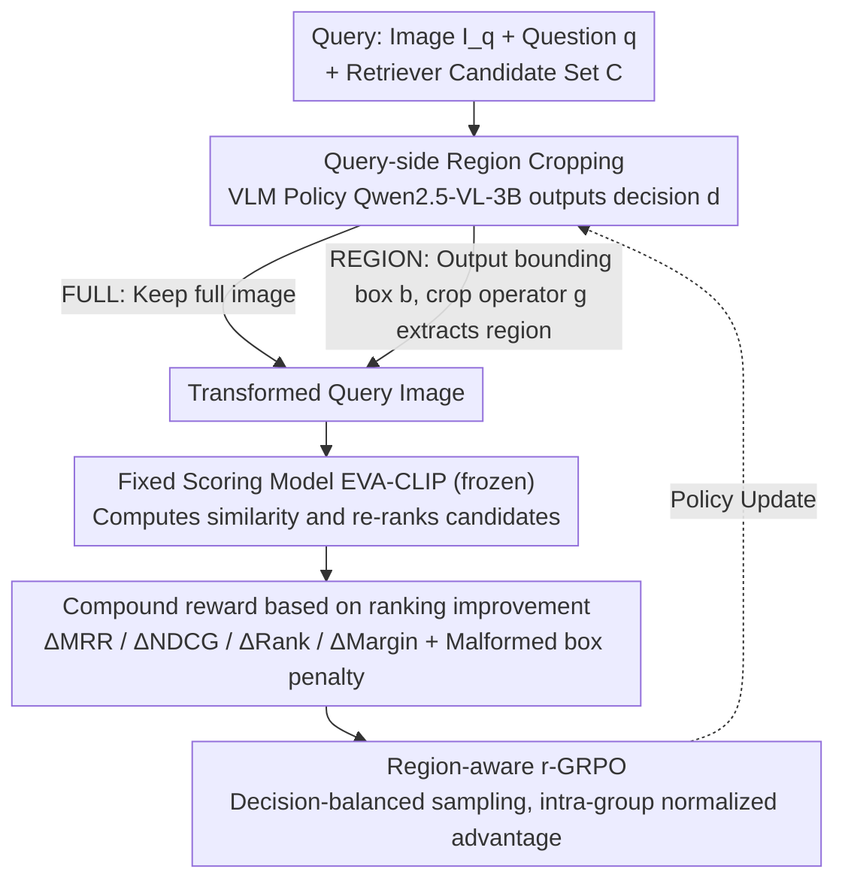

# Region-R1: Reinforcing Query-Side Region Cropping for Multi-Modal Re-Ranking

**Conference**: ACL 2026 Findings  
**arXiv**: [2604.05268](https://arxiv.org/abs/2604.05268)  
**Code**: None  
**Area**: Multi-modal VLM / Information Retrieval  
**Keywords**: Multi-modal Re-ranking, Query-side Region Cropping, Reinforcement Learning, Visual Question Answering, Retrieval-Augmented Generation

## TL;DR
This paper proposes Region-R1, which models query-side region cropping in multi-modal re-ranking as a decision-making problem. By employing reinforcement learning (r-GRPO) to learn when and how to crop question-relevant regions in query images, it improves CondRecall@1 by 20% on E-VQA and 8% on InfoSeek.

## Background & Motivation

**Background**: Multi-modal Retrieval-Augmented Generation (MM-RAG) systems typically adopt a "Retriever-Reranker-Generator" pipeline, where the re-ranking stage is crucial for filtering the most relevant evidence from a candidate pool. Existing work primarily focuses on improving the retriever or designing more complex re-ranking models (e.g., EchoSight, OMGM).

**Limitations of Prior Work**: Standard re-rankers treat the query image as a global embedding, implicitly assuming all regions are relevant to the user's question. However, in practical scenarios, query images often contain significant noise (e.g., cluttered backgrounds, irrelevant objects). When these irrelevant regions dominate the global visual representation, similarity estimation is distorted, leading to degraded re-ranking performance.

**Key Challenge**: The contradiction between global image representation and the need for question-focused attention—global representations preserve all visual information but introduce interference, while simple heuristic cropping may lose useful context. This is a multi-modal specific issue that does not exist in text-only RAG.

**Goal**: To design a query-side visual information selection mechanism that can adaptively decide whether to crop the query image and which region to crop during the re-ranking stage, thereby reliably improving re-ranking performance.

**Key Insight**: Modern vision-language models already possess strong localization capabilities. Preliminary analysis indicates that replacing the full image with appropriately selected regions can significantly improve re-ranking under a fixed candidate pool and scoring model. However, a learning framework is required to decide "when to crop" and "where to crop."

**Core Idea**: Model query-side region cropping as a reinforcement learning decision problem. Directly optimize re-ranking metrics using an improved GRPO (r-GRPO) to learn a policy that dynamically decides between retaining the full image or cropping a specific region.

## Method

### Overall Architecture
Region-R1 operates in the re-ranking stage of MM-RAG. Given a query $x=(I_q, q)$ and a candidate set $\mathcal{C}$ produced by an upstream retriever, the system first determines whether to keep the full image (FULL) or crop a region (REGION) via a vision-language model policy. Similarity scores are then calculated between the transformed query image and the candidate set for re-ranking. The process includes: policy model outputting the cropping decision $\rightarrow$ image transformation $\rightarrow$ fixed scoring model calculating rankings $\rightarrow$ reward feedback based on ranking improvement $\rightarrow$ r-GRPO policy optimization.

### Key Designs

**1. Query-side Region Cropping: Letting the model decide "whether and where to crop" instead of indiscriminately using the full image.**

Standard re-rankers compress the query image into a global embedding, defaulting to the assumption that the entire image is relevant. If the background is cluttered or filled with irrelevant objects, these distracting regions dominate the global representation and distort similarity. Region-R1 addresses this by defining cropping as a discrete decision variable $d \in \{\text{REGION}, \text{FULL}\}$. If FULL is chosen, the full image is retained. If REGION is chosen, the VLM (Qwen2.5-VL-3B) outputs a bounding box $b=(x_1, y_1, x_2, y_2)$, and a cropping operator $g(\cdot)$ extracts that region to replace the original image.

This mechanism is applied only in the re-ranking stage, leaving the retrieval stage untouched. The reasoning is practical: retrieval requires scanning the entire database, and premature cropping might discard critical information, lowering recall. Re-ranking faces only a small candidate set (e.g., $K=20$), enabling per-query cropping overhead while avoiding recall loss.

**2. Compound Reward based on Re-ranking Improvement: Quantifying whether cropping improved the ranking as a training signal.**

Using only ranking metrics as rewards results in sparse signals—when candidate scores are close, slight changes in positive sample scores may not change the rank, preventing the policy from learning gradient directions. Region-R1 decomposes the reward into a weighted sum of four "improvements over baseline": $\Delta\text{MRR}$, $\Delta\text{NDCG}$, $\Delta\text{Rank}$ (log-rank improvement of the positive sample), and $\Delta\text{Margin}$ (improvement in the score gap between the positive and the strongest negative sample), plus a malformed box penalty. When the decision is FULL, a positive reward is given only if the baseline already ranked the positive sample at the 1st position, preventing over-rewarding "doing nothing."

The $\Delta\text{Margin}$ term is a key highlight: it bypasses discrete ranks to directly encourage the policy to pull positive samples closer and push the strongest negatives away, providing continuous gradients rather than step-wise signals. In ablations, adding the Margin term increased InfoSeek MRR from 0.613 to 0.706, the largest jump among all reward components.

**3. Region-aware r-GRPO: Suppressing training variance in mixed action spaces with decision-balanced sampling.**

The action space is hybrid—containing both discrete decisions (REGION / FULL) and continuous bounding boxes—which causes high variance and unstable updates in standard GRPO. r-GRPO follows the GRPO paradigm by sampling $N$ action groups per query and calculating intra-group normalized advantages, but introduces "decision-balanced group sampling": it forces each group to contain both REGION and FULL decisions. This prevents the majority decision type from setting the baseline for the minority, ensuring intra-group comparisons occur between similar decision types for cleaner advantage estimation and stable training.

### Loss & Training
Qwen2.5-VL-3B is used as the base model and fine-tuned via r-GRPO. The scoring model uses a pre-trained EVA-CLIP, which remains frozen during training. The candidate pool size is $K=20$, and training is conducted only on queries where the candidate pool contains at least one positive sample.

## Key Experimental Results

### Main Results

| Method | E-VQA MRR | E-VQA R@1 | InfoSeek MRR | InfoSeek R@1 |
|------|-----------|-----------|--------------|--------------|
| EVA-CLIP | 0.224 | 14.2 | 0.553 | 46.3 |
| EchoSight | 0.402 | 36.5 | 0.586 | 53.2 |
| OMGM | 0.473 | 42.8 | 0.681 | 64.0 |
| **Region-R1** | **0.473** | **44.7** | **0.706** | **66.5** |

| Method | E-VQA CondR@1 | InfoSeek CondR@1 |
|------|---------------|------------------|
| EchoSight | 0.75 | 0.68 |
| OMGM | 0.73 | 0.75 |
| **Region-R1** | **0.90** | **0.81** |

### Ablation Study

| Reward Config | InfoSeek MRR | E-VQA MRR |
|---------|-------------|-----------|
| ΔMRR only | 0.611 | 0.408 |
| + ΔNDCG | 0.613 (↑) | 0.425 (↑) |
| + ΔRank | 0.613 (-) | 0.426 (↑) |
| + ΔMargin (Full) | **0.706** | **0.473** |

### Key Findings
- The Margin term is critical for performance; its inclusion jumped InfoSeek MRR from 0.613 to 0.706 and E-VQA from 0.426 to 0.473.
- The learned policy exhibits appropriate cropping behavior: Region Cropping (RC) rates are lower when the positive sample is already at the 1st position and significantly higher when it is ranked lower.
- Zero-shot VLM cropping yields an RC rate of only ~20%, largely equivalent to the no-cropping baseline.
- Heuristic cropping (center/random) performs poorly, as it often discards critical information.

## Highlights & Insights
- The concept of query-side adaptation is simple yet effective: without changing the model or the candidates, modifying the query representation alone significantly improves re-ranking performance. This approach is transferable to other retrieval-matching tasks.
- The decision-balanced sampling in r-GRPO effectively addresses training instability in mixed action spaces, providing a reference for other RL applications involving discrete and continuous actions.
- The discovery of the Margin reward is insightful: while ranking metrics provide sparse discrete signals, the margin provides continuous gradient directions.

## Limitations & Future Work
- Operates only in the re-ranking stage; it cannot recover positive samples missing from the retriever's top-K pool.
- Supports only single-region cropping, which may be insufficient for complex queries requiring focus on multiple areas.
- The scoring model is fixed; the cropping strategy might overfit to a specific scorer.
- Evaluated on only two datasets; generalizability needs further validation.
- Future directions: multi-region selection, soft attention mechanisms, and extending query-side adaptation to the retrieval stage.

## Related Work & Insights
- **vs EchoSight/OMGM**: These models improve performance by modifying the re-ranking model itself. Ours keeps the scoring model fixed and only modifies the query representation; the two directions are complementary.
- **vs Zero-shot VLM Cropping**: The RC rate of direct VLM prompting is too low, indicating that general visual understanding capability is not equivalent to task-specific cropping capability.

## Rating
- Novelty: ⭐⭐⭐⭐ The perspective of query-side region cropping is novel, and modeling it as an RL decision problem is a sound innovation.
- Experimental Thoroughness: ⭐⭐⭐⭐ Two datasets, multiple baseline comparisons, detailed ablations, and behavior analysis.
- Writing Quality: ⭐⭐⭐⭐ Motivation is clear, methodology is detailed, and experimental analysis is in-depth.
- Value: ⭐⭐⭐⭐ The "modify query, not model" approach is simple and effective, providing practical value to the MM-RAG community.

<!-- RELATED:START -->

## Related Papers

- [\[CVPR 2026\] STAR-R1: Multi-View Spatial TrAnsformation Reasoning by Reinforcing Multimodal LLMs](../../CVPR2026/multimodal_vlm/star-r1_multi-view_spatial_transformation_reasoning_by_reinforcing_multimodal_ll.md)
- [\[NeurIPS 2025\] Video-R1: Reinforcing Video Reasoning in MLLMs](../../NeurIPS2025/multimodal_vlm/video-r1_reinforcing_video_reasoning_in_mllms.md)
- [\[CVPR 2026\] Chain-of-Thought Guided Multi-Modal Object Re-Identification](../../CVPR2026/multimodal_vlm/chain-of-thought_guided_multi-modal_object_re-identification.md)
- [\[ICLR 2026\] SophiaVL-R1: Reinforcing MLLMs Reasoning with Thinking Reward](../../ICLR2026/multimodal_vlm/sophiavl-r1_reinforcing_mllms_reasoning_with_thinking_reward.md)
- [\[ICLR 2026\] Grasp Any Region: Towards Precise, Contextual Pixel Understanding for Multimodal LLMs](../../ICLR2026/multimodal_vlm/grasp_any_region_towards_precise_contextual_pixel_understanding_for_multimodal_l.md)

<!-- RELATED:END -->
