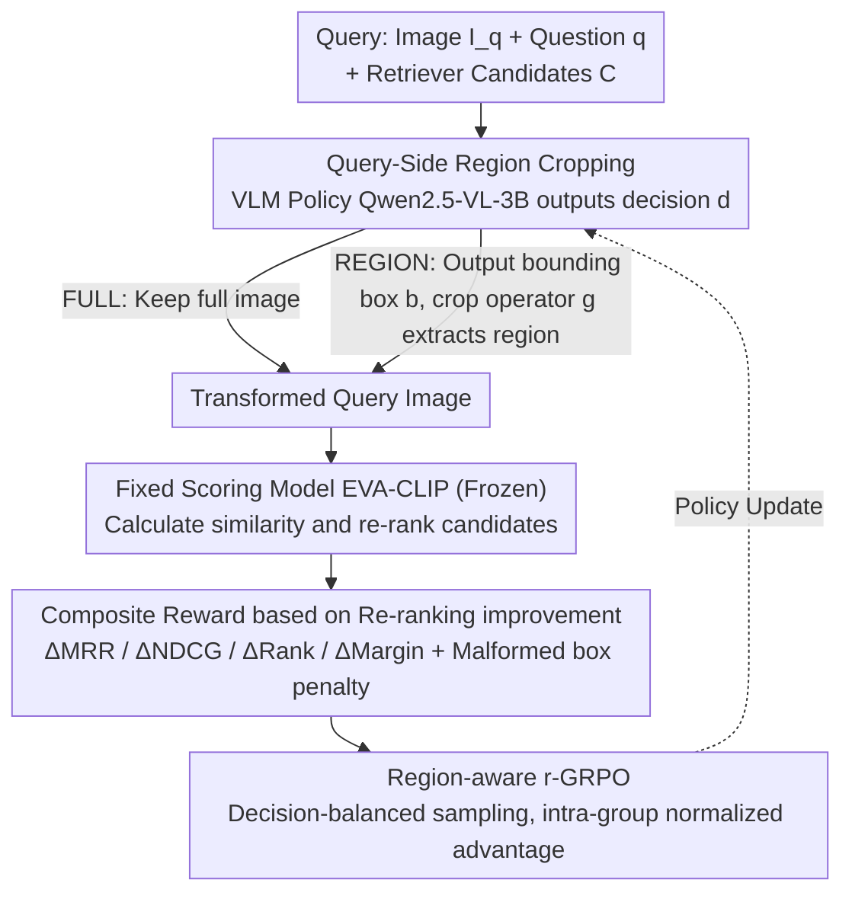

# Region-R1: Reinforcing Query-Side Region Cropping for Multi-Modal Re-Ranking

**Conference**: ACL 2026 Findings  
**arXiv**: [2604.05268](https://arxiv.org/abs/2604.05268)  
**Code**: None  
**Area**: Multi-modal VLM / Information Retrieval  
**Keywords**: Multi-modal Re-ranking, Query-side Region Cropping, Reinforcement Learning, Visual Question Answering, Retrieval-Augmented Generation

## TL;DR
This paper proposes Region-R1, which models query-side region cropping in multi-modal re-ranking as a decision problem. By using reinforcement learning (r-GRPO) to learn when and how to crop question-relevant regions in the query image, it improves CondRecall@1 by 20% on E-VQA and 8% on InfoSeek.

## Background & Motivation

**Background**: Multi-modal Retrieval-Augmented Generation (MM-RAG) systems typically employ a "Retriever-Reranker-Generator" pipeline, where the re-ranking stage is crucial for filtering the most relevant evidence from a candidate pool. Existing work focuses primarily on improving retrievers or designing complex re-ranking models (e.g., EchoSight, OMGM).

**Limitations of Prior Work**: Standard re-rankers treat the query image as a global embedding, implicitly assuming all regions are relevant to the user's question. In practice, query images often contain significant noise (e.g., cluttered backgrounds, irrelevant objects). When these irrelevant regions dominate the global visual representation, they distort similarity estimates, degrading re-ranking performance.

**Key Challenge**: The contradiction between global image representations and the need for task-focused visual attention. Global representations preserve all information but introduce noise, while simple heuristic cropping may discard essential context. This is a unique challenge in multi-modal RAG that does not exist in text-only RAG.

**Goal**: To design a query-side visual information selection mechanism that adaptively decides whether to crop the query image and which region to select during the re-ranking stage, reliably improving performance.

**Key Insight**: Modern Vision-Language Models (VLMs) possess strong grounding capabilities. Preliminary analysis shows that replacing the full image with a properly selected region can significantly improve re-ranking within a fixed candidate pool. However, a learning framework is needed to determine "when to crop" and "where to crop."

**Core Idea**: Model query-side region cropping as a reinforcement learning decision problem. Using an improved GRPO (r-GRPO), the model directly optimizes re-ranking metrics to learn a policy that dynamically decides between the full image or a specific cropped region.

## Method

### Overall Architecture
Region-R1 operates in the re-ranking stage of MM-RAG. Given a query $x=(I_q, q)$ and a candidate set $\mathcal{C}$ from an upstream retriever, a VLM policy decides whether to keep the full image (FULL) or crop a portion (REGION). The transformed image is then used to compute similarity scores for re-ranking. The workflow includes: policy decision $\rightarrow$ image transformation $\rightarrow$ scoring by a fixed model $\rightarrow$ reward feedback based on rank improvement $\rightarrow$ r-GRPO policy optimization.

### Key Designs

**1. Query-side region cropping: Letting the model decide "whether to crop and where to crop" instead of indiscriminately using the full image.**

Standard re-rankers compress the query image into a global embedding, assuming the entire image is relevant. However, background clutter or irrelevant objects can dominate this representation. Region-R1 formulates cropping as a discrete decision variable $d \in \{\text{REGION}, \text{FULL}\}$. If REGION is chosen, the VLM (Qwen2.5-VL-3B) generates a bounding box $b=(x_1, y_1, x_2, y_2)$, and a crop operator $g(\cdot)$ extracts that region to represent the query.

This mechanism is applied only to the re-ranking stage rather than retrieval. The rationale is that retrieval requires scanning large databases where premature cropping might discard critical information; re-ranking handles a small candidate set ($K=20$), making the per-query cropping cost manageable without risking initial recall.

**2. Composite reward based on re-ranking improvement: Quantifying whether cropping actually improved the ranking.**

Using only rank-based metrics as rewards leads to sparse signals. If candidate scores are close, slight improvements in positive sample scores might not change the final rank. Region-R1 defines the reward as a weighted sum of four "improvements over baseline": $\Delta\text{MRR}$, $\Delta\text{NDCG}$, $\Delta\text{Rank}$ (log-rank improvement of the positive sample), and $\Delta\text{Margin}$ (improvement in the score gap between the positive sample and the strongest negative), plus a penalty for malformed boxes. For FULL decisions, positive rewards are given only if the baseline already ranked the positive sample at 1st place.

The $\Delta\text{Margin}$ term is pivotal: it bypasses discrete ranks to encourage the policy to pull positive samples closer and push negative samples further, providing continuous gradients rather than step-wise signals. Performance on InfoSeek MRR jumped from 0.613 to 0.706 with the inclusion of the Margin term.

**3. Region-aware r-GRPO: Suppressing training variance in hybrid action spaces via decision-balanced sampling.**

The action space is hybrid, containing both discrete decisions (REGION/FULL) and continuous bounding box coordinates. Standard GRPO exhibits high variance in such spaces. r-GRPO samples $N$ actions per query and calculates intra-group normalized advantages, but introduces "decision-balanced group sampling": each group is forced to contain both REGION and FULL decisions. This prevents the majority decision type from setting an unfair baseline for the minority, leading to cleaner advantage estimation and stable training.

### Loss & Training
Qwen2.5-VL-3B serves as the base policy model, fine-tuned via r-GRPO. The scoring model is a pre-trained EVA-CLIP, which remains frozen. The candidate pool size is $K=20$. Training is conducted only on queries where the candidate pool contains at least one positive sample.

## Key Experimental Results

### Main Results

| Method | E-VQA MRR | E-VQA R@1 | InfoSeek MRR | InfoSeek R@1 |
|------|-----------|-----------|--------------|--------------|
| EVA-CLIP | 0.224 | 14.2 | 0.553 | 46.3 |
| EchoSight | 0.402 | 36.5 | 0.586 | 53.2 |
| OMGM | 0.473 | 42.8 | 0.681 | 64.0 |
| **Region-R1** | **0.473** | **44.7** | **0.706** | **66.5** |

| Method | E-VQA CondR@1 | InfoSeek CondR@1 |
|------|---------------|------------------|
| EchoSight | 0.75 | 0.68 |
| OMGM | 0.73 | 0.75 |
| **Region-R1** | **0.90** | **0.81** |

### Ablation Study

| Reward Config | InfoSeek MRR | E-VQA MRR |
|---------|-------------|-----------|
| ΔMRR only | 0.611 | 0.408 |
| + ΔNDCG | 0.613 (↑) | 0.425 (↑) |
| + ΔRank | 0.613 (-) | 0.426 (↑) |
| + ΔMargin (Full) | **0.706** | **0.473** |

### Key Findings
- The Margin term is critical for performance; its addition increased InfoSeek MRR from 0.613 to 0.706 and E-VQA MRR from 0.426 to 0.473.
- The learned policy exhibits appropriate behavior: the Region Cropping (RC) rate is low when the positive sample is already at rank 1, and significantly higher when the positive sample is ranked lower.
- Zero-shot VLM cropping has an RC rate of only ~20%, effectively defaulting to the full-image baseline in most cases.
- Heuristic cropping (center/random) performs poorly as it often discards critical information.

## Highlights & Insights
- The concept of query-side adaptation is elegant: significant re-ranking gains are achieved by modifying query representations without changing the model architecture or candidates. This is transferable to other retrieval tasks.
- The decision-balanced sampling in r-GRPO effectively stabilizes training for hybrid action spaces, offering a reference for other RL applications involving discrete and continuous actions.
- The discovery of the Margin reward is insightful: while ranking metrics provide sparse signals, the margin provides a continuous gradient direction.

## Limitations & Future Work
- The method operates only at the re-ranking stage and cannot recover positive samples missing from the top-K candidate pool.
- It supports only single-region cropping, which may be insufficient for complex queries requiring multiple focus areas.
- The scoring model is fixed; the cropping policy may overfit to a specific scorer.
- Evaluation is limited to two datasets; broad generalization requires further verification.
- Future directions: Multi-region selection, soft attention mechanisms, and extending query-side adaptation to the retrieval stage.

## Related Work & Insights
- **vs EchoSight/OMGM**: These methods improve the re-ranking model itself. Ours keeps the scoring model fixed and modifies the query representation; the two approaches are complementary.
- **vs Zero-shot VLM Cropping**: The low RC rate of zero-shot VLM prompting indicates that general visual understanding does not equate to task-specific cropping capability.

## Rating
- Novelty: ⭐⭐⭐⭐ Query-side cropping is a fresh perspective, and modeling it as an RL problem is a sound innovation.
- Experimental Thoroughness: ⭐⭐⭐⭐ Extensive comparisons across two datasets, detailed ablations, and behavioral analysis.
- Writing Quality: ⭐⭐⭐⭐ Clear motivation, detailed method description, and insightful analysis.
- Value: ⭐⭐⭐⭐ The "edit query, not model" approach is simple and effective, providing practical value to the MM-RAG community.

<!-- RELATED:START -->

## Related Papers

- [\[ICLR 2026\] Grasp Any Region: Towards Precise, Contextual Pixel Understanding for Multimodal LLMs](../../ICLR2026/multimodal_vlm/grasp_any_region_towards_precise_contextual_pixel_understanding_for_multimodal_l.md)
- [\[CVPR 2026\] DRS-GUI: Dynamic Region Search for Training-Free GUI Grounding](../../CVPR2026/multimodal_vlm/drs-gui_dynamic_region_search_for_training-free_gui_grounding.md)
- [\[ICLR 2026\] SR-3D: 3D-Aware Region Prompted Vision Language Model](../../ICLR2026/multimodal_vlm/3d_aware_region_prompted_vision_language_model.md)
- [\[ICLR 2026\] Efficient Discriminative Joint Encoders for Large Scale Vision-Language Re-ranking](../../ICLR2026/multimodal_vlm/efficient_discriminative_joint_encoders_for_large_scale_vision-language_rerankin.md)
- [\[CVPR 2025\] DynRefer: Delving into Region-level Multimodal Tasks via Dynamic Resolution](../../CVPR2025/multimodal_vlm/dynrefer_delving_into_region-level_multimodal_tasks_via_dynamic_resolution.md)

<!-- RELATED:END -->
