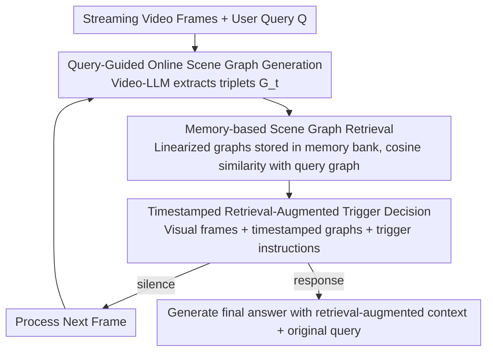

# Response-G1: Explicit Scene Graph Modeling for Proactive Streaming Video Understanding

**Conference**: ACL2026  
**arXiv**: [2605.07575](https://arxiv.org/abs/2605.07575)  
**Code**: https://github.com/kadmkbl/Response-G1  
**Area**: Video Understanding  
**Keywords**: Streaming Video Understanding, Proactive Response, Scene Graph, Retrieval-Augmented Generation, Video-LLM

## TL;DR
Response-G1 utilizes query-guided online scene graphs, historical scene graph retrieval, and timestamped trigger prompts to explicitly align visual evidence in streaming video with the response conditions of user queries. This approach significantly improves the ability of Video-LLMs to determine "whether to answer now" without requiring fine-tuning.

## Background & Motivation
**Background**: Video-LLMs are already capable of video question answering and long-form video understanding. Streaming Video Understanding further requires models to perform incremental perception, reasoning, and interaction as video continuously arrives. Most existing systems remain reactive: the user asks a question at a specific time point, and the model immediately answers based on observed segments.

**Limitations of Prior Work**: In real-world interactions, many questions are anticipatory, such as "Tell me when someone starts doing something." For these queries, the answer conditions might not has appeared at the time of questioning. The model must remain silent and only respond when the evidence met the conditions. Existing proactive methods either train EOS/binary classification trigger heads, which depends on fine-grained frame-level annotations, or use frame-difference thresholds or multi-agent prompts, which often ignore query semantics.

**Key Challenge**: The key to proactive response is not "whether the video has changed," but "whether the currently accumulated evidence satisfies the response conditions implicit in the query." If both visual evidence and query conditions exist only implicitly within Video-LLM hidden states or prompts, it is difficult for the model to stably align them or explain why it triggered at a specific moment.

**Goal**: The authors aim to design a framework that requires no fine-tuning or frame-level labels, allowing Video-LLMs to explicitly model query-related evidence, retrieve historical evidence, and decide between silence/response accordingly in streaming videos.

**Key Insight**: User queries typically describe a target scene composed of objects, attributes, and relations (e.g., "a boy in red is talking to someone"). This can naturally be represented as a scene graph. If video segments are also converted into scene graphs, evidence-condition matching can be performed within the same structural space.

**Core Idea**: Convert both streaming video observations and query conditions into scene graphs, feed the top-K most relevant historical evidence back to the Video-LLM via scene graph retrieval, and perform frame-by-frame response timing judgments using trigger prompts.

## Method
Response-G1 is a fine-tuning-free pipeline. Instead of training a new trigger classifier, it uses the Video-LLM itself as a scene graph generator, a text encoder, and the final decision-maker. The key is compressing long video history into a structured, query-relevant, and retrievable graph memory rather than stuffing all visual tokens into the context.

### Overall Architecture
The input consists of a streaming video frame sequence and a user query provided at a specific time. The output is a `silence` or `response` decision at each timestep, followed by a natural language answer upon triggering. The framework involves three steps: first, generating query-guided online scene graphs for the current clip to extract object-predicate-object triplets; second, storing historical scene graphs in a memory bank and performing top-K retrieval based on similarity to the query condition graph; finally, inputting visual tokens, timestamped retrieved scene graphs, and trigger instructions into the Video-LLM to judge whether to respond.

### Key Designs

**1. Query-Guided Online Scene Graph Generation: Compressing clips into query-relevant structural evidence**

Generating scene graphs indiscriminately for video segments results in many triplets irrelevant to the trigger conditions, introducing noise to later retrieval. Conversely, directly putting target objects into the prompt might induce the model to "see" things that haven't appeared, causing hallucinations. Response-G1 adopts a middle ground: for clip $C_t$ near time $t$, the Video-LLM generates a scene graph $G_t=(O_t,P_t)$ under the soft guidance of the original query $Q$. Nodes are objects with attributes and edges are spatio-temporal relations, represented as a set of triplets $G_t=\{(o_i,p_{ij},o_j)\}$. The query is injected into the generation prompt as a soft condition, encouraging the model to prioritize describing objects and relations relevant to the trigger conditions, thus balancing relevance and factuality.

**2. Memory-based Scene Graph Retrieval: Selecting historical evidence by query semantics rather than temporal proximity**

Proactive response requires determining if the evidence accumulated so far satisfies the query conditions, necessitating the precise retrieval of relevant segments from long histories. Response-G1 linearizes each scene graph triplet into a natural language phrase and concatenates the full graph into $\Phi_t$ for the memory bank. The query is also parsed into a condition graph $G_q$ and linearized into $\Phi_q$ to maintain format consistency. Mean pooling via the Video-LLM's text encoder produces graph vectors $g_t$ and query vectors $g_q$, and the top-K scene graphs are retrieved from the memory bank based on cosine similarity. By converting both queries and videos into graph text before comparison, retrieval focuses on object-relation matching rather than the format gap between raw query text and video frames.

**3. Timestamped Retrieval-Augmented Trigger Decision: Transforming evidence into localizable temporal chains**

Simply knowing that "the target relationship occurred" is insufficient; the model must also understand the temporal order of evidence and whether it is sufficient to trigger at the current moment. Response-G1 attaches text timestamps (e.g., `<2.0s>`) to the retrieved scene graphs before including them in the context. The input for the trigger stage includes visual frame embeddings, these timestamped retrieved scene graphs, and instructions like "Should I answer now? Yes or No." If "silence" is output, the next frame is processed; if "response" is output, the final answer is generated using the same retrieval-augmented context and the original query. Timestamps upgrade graph memory from static retrieved segments into an evidence chain capable of temporal grounding.

### Loss & Training
Response-G1 does not perform parameter training; it is an inference-time pipeline. Experiments use Qwen3-VL-8B as the Video-LLM backbone. OVO-Bench uses the default 1 FPS. StreamingBench follows official sampling rules: 1 FPS for short videos, 0.5 FPS for medium, and 0.2 FPS for long videos. All experiments run on A100 80GB with FP16. Latency analysis shows the original Response-G1 embedding version takes ~825ms per frame (1.2 FPS); using streaming KV-Cache reduces this to ~473ms (2.1 FPS), meeting the 1 FPS requirement.

## Key Experimental Results

### Main Results
On OVO-Bench, the advantage of Response-G1 over open-source streaming Video-LLMs is concentrated in Forward Active Responding, which best represents proactive capability. While its overall score does not exceed closed-source models like Gemini 1.5 Pro, it leads significantly among open-source streaming models.

| Model | Parameters | Real-Time Visual Perception Avg↑ | Backward Tracing Avg↑ | Forward Active Responding Avg↑ | Overall Avg↑ |
|------|------|----------------------------------|-----------------------|--------------------------------|--------------|
| GPT-4o | - | 63.6 | 58.7 | 53.4 | 58.6 |
| Gemini 1.5 Pro | - | 70.8 | 62.3 | 57.2 | 65.3 |
| TimeChat-Online | 7B | 58.6 | 42.0 | 36.4 | 45.6 |
| StreamAgent | 7B | 61.3 | 41.7 | 45.4 | 49.4 |
| Response-G1 | 8B | 73.6 | 52.1 | 58.2 | 61.3 |

On StreamingBench, Response-G1 achieves the highest Overall score among open-source models and increases the Proactive Output (PO) from approximately 29 to 44. While the PO of closed-source GPT-4o remains higher, Response-G1 significantly narrows the gap.

| Model | Parameters | Real-Time Visual Understanding Avg↑ | PO↑ | Overall Avg↑ | Description |
|------|------|-------------------------------------|-----|--------------|------|
| GPT-4o | - | 73.3 | 56.9 | 70.5 | Strong closed-source baseline |
| LLaVA-OneVision | 7B | 71.1 | 29.6 | 66.3 | Strong open-source Video-LLM |
| TimeChat-Online | 7B | 75.4 | 28.8 | 70.9 | Open-source streaming baseline |
| StreamAgent | 7B | 74.3 | 28.9 | 70.2 | Multi-agent prompt baseline |
| Response-G1 | 8B | 77.5 | 44.0 | 73.7 | Highest Overall and PO among open-source |

### Ablation Study
Both retrieval augmentation and timestamps are effective. Removing retrieval augmentation causes a drop in both proactive and reactive tasks. Removing timestamp encoding affects tasks requiring temporal localization (e.g., CRR/PO) more significantly.

| Configuration | OVO ACR↑ | OVO HLD↑ | OVO CRR↑ | Streaming CS↑ | Streaming PR↑ | Streaming PO↑ |
|------|----------|----------|----------|---------------|---------------|---------------|
| w/o Retrieval Augmentation | 66.1 | 28.0 | 55.4 | 83.6 | 79.6 | 36.8 |
| w/o Timestamp Encoding | 74.0 | 33.6 | 60.4 | 87.7 | 82.9 | 43.6 |
| Full | 74.3 | 33.9 | 61.7 | 88.0 | 83.3 | 44.0 |

Query guidance is also critical. Directly inserting parsed object-relations into the prompt increases relevance but risks causing the model to see target objects prematurely. Original query guidance is the most stable.

| SGG Strategy | Streaming PO↑ | OVO REC↑ | OVO SSR↑ | OVO CRR↑ | Explanation |
|----------------|---------------|----------|----------|----------|------|
| w/o Guidance | 38.8 | 34.1 | 66.9 | 59.4 | Generates many irrelevant triplets |
| Object-Guidance | 43.6 | 40.2 | 67.9 | 61.3 | More relevant but higher hallucination risk |
| Query-Guidance | 44.0 | 41.9 | 71.1 | 61.7 | Best balance of relevance and factuality |

### Key Findings
- Explicit structural evidence is particularly useful for proactive timing. Response-G1's most significant gains are in OVO’s FAR and StreamingBench’s PO, indicating that scene graphs help the model judge if conditions are met.
- Retrieval is not just for context compression; it reorders long video history based on query semantics, ensuring the trigger decision sees the most relevant evidence, not just the most recent.
- Graph-text format consistency is vital. Comparing raw query text with query graph text shows the latter performs better in similarity retrieval, suggesting format alignment before cross-modal retrieval cannot be ignored.
- KV-Cache moves the method from a proof-of-concept toward real-time deployment. Latency results (1.2 FPS to 2.1 FPS) show that additional SGG/SGR costs are manageable, making it suitable for low-FPS streaming understanding.

## Highlights & Insights
- A major strength is reformulating proactive response timing as evidence-condition alignment, rather than a vague decision on "whether to answer." This problem reframing is valuable.
- Scene graphs here are not traditional visual parsing modules but open-vocabulary structural memories generated by the Video-LLM. This sacrifices some rigor for universality without needing specific detectors or fine-tuning.
- The ablation of query-guided SGG is insightful: too little guidance introduces noise, while too much object guidance causes hallucinations; original queries as soft conditions are the most appropriate.
- The method is transferable to robotics/agent memory: converting perceived segments into structural event graphs and retrieving historical evidence based on task intent to trigger actions or answers.

## Limitations & Future Work
- The authors note that object-relation representations in scene graphs cannot cover all reasoning needs, especially why-style questions, causal explanations, and implicit motivation reasoning.
- Current clip sizes are fixed, which might miss event boundaries or split semantic events. Future work could use event-level triggers or semantic change detection to decide when to generate scene graphs.
- LLM-based open-set SGG still poses hallucination risks. Failures in Object-Guidance show that excessive prompting for target objects can lead to the generation of non-existent triplets.
- The method relies on the text encoding and prompt-following capabilities of the Video-LLM. While validated across architectures in the appendix, switching backbones may require recalibrating prompts, K-values, and sampling rates.
- Validation currently focuses on benchmarks at 1 FPS or lower; latency and safety are insufficient for autonomous driving or high-frequency robot control.

## Related Work & Insights
- **vs VideoLLM-online / Flash-Vstream**: These emphasize streaming token processing and efficiency; Response-G1 focuses on query-aware proactive timing, supplementing visual tokens with structured graph memory.
- **vs Dispider / StreamBridge**: These typically train activation models or auxiliary heads; Response-G1 achieves trigger decisions using prompts and retrieval without relying on frame-level labels.
- **vs StreamAgent**: StreamAgent uses multi-agent prompting for response timing; Response-G1 explicitly aligns evidence and conditions using scene graphs, offering better explainability and higher PO gains.
- **vs Traditional SGG**: Traditional SGG depends on closed-set detectors; this paper uses Video-LLM as an open-vocabulary graph generator, which is better for long-tail videos but requires hallucination suppression.

## Rating
- Novelty: ⭐⭐⭐⭐ Introducing scene graph retrieval to proactive streaming video understanding provides a clear problem entry and memory design.
- Experimental Thoroughness: ⭐⭐⭐⭐ Covers OVO-Bench, StreamingBench, ablations, cases, latency, and cross-architecture validation, though real deployment at high frame rates needs more study.
- Writing Quality: ⭐⭐⭐⭐ Architecture diagrams and phase-based narratives are easy to follow; some tables are dense and require careful comparison.
- Value: ⭐⭐⭐⭐ Practical insights for video assistants, embodied AI, and streaming surveillance, particularly for enhancing open-source Video-LLMs without fine-tuning.

<!-- RELATED:START -->

## Related Papers

- [\[CVPR 2026\] Towards Spatio-Temporal World Scene Graph Generation from Monocular Videos](../../CVPR2026/video_understanding/towards_spatio-temporal_world_scene_graph_generation_from_monocular_videos.md)
- [\[CVPR 2025\] HyperGLM: HyperGraph for Video Scene Graph Generation and Anticipation](../../CVPR2025/video_understanding/hyperglm_hypergraph_for_video_scene_graph_generation_and_anticipation.md)
- [\[ICML 2025\] Fine-Grained Captioning of Long Videos through Scene Graph Consolidation](../../ICML2025/video_understanding/fine-grained_captioning_of_long_videos_through_scene_graph_consolidation.md)
- [\[AAAI 2026\] Explicit Temporal-Semantic Modeling for Dense Video Captioning via Context-Aware Cross-Modal Interaction](../../AAAI2026/video_understanding/explicit_temporal-semantic_modeling_for_dense_video_captioning_via_context-aware.md)
- [\[CVPR 2026\] FluxMem: Adaptive Hierarchical Memory for Streaming Video Understanding](../../CVPR2026/video_understanding/fluxmem_adaptive_hierarchical_memory_for_streaming_video_understanding.md)

<!-- RELATED:END -->
