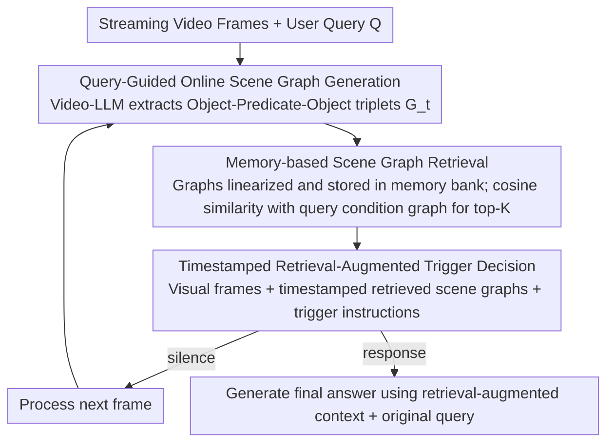

# Response-G1: Explicit Scene Graph Modeling for Proactive Streaming Video Understanding

**Conference**: ACL2026  
**arXiv**: [2605.07575](https://arxiv.org/abs/2605.07575)  
**Code**: https://github.com/kadmkbl/Response-G1  
**Area**: Video Understanding  
**Keywords**: Streaming video understanding, proactive response, scene graph, retrieval augmentation, Video-LLM

## TL;DR
Response-G1 utilizes query-guided online scene graphs, historical scene graph retrieval, and timestamped trigger prompts to explicitly align visual evidence with the response conditions of user queries. This approach significantly enhances the "when to answer" decision-making capability of Video-LLMs in streaming videos without requiring fine-tuning.

## Background & Motivation
**Background**: Video-LLMs are already capable of processing video question answering and long video understanding. Streaming Video Understanding further requires models to incrementally perceive, reason, and interact as video data continuously arrives. Most existing systems remain reactive: the user asks at a specific point, and the model immediately answers based on observed segments.

**Limitations of Prior Work**: Many real-world interactions are anticipatory, such as "Tell me when someone starts doing something." In these cases, the answer conditions might not be met when the query is asked; the model must remain silent until the evidence satisfies the conditions. Existing proactive methods either train EOS/binary classification trigger heads, relying on fine-grained frame-level annotations, or use frame-difference thresholds and multi-agent prompting, which often overlook query semantics.

**Key Challenge**: The key to proactive response is not "whether the video has changed," but "whether the currently accumulated evidence satisfies the response conditions implicit in the query." If both visual evidence and query conditions exist only implicitly within Video-LLM hidden states or prompts, it is difficult for the model to stably align them or explain why it triggered at a particular moment.

**Goal**: The authors aim to design a framework that requires no fine-tuning or frame-level labels, allowing Video-LLMs to explicitly model query-related evidence in streaming video, retrieve historical evidence, and determine silence/response based on this data.

**Key Insight**: User queries typically describe a target scene composed of objects, attributes, and relations (e.g., "a boy in red talking to someone"). This naturally lends itself to a scene graph representation. If video segments are also converted into scene graphs, evidence-condition matching can be performed in the same structural space.

**Core Idea**: Convert both streaming video observations and query conditions into scene graphs. Use top-K scene graph retrieval to feed the most relevant historical evidence back to the Video-LLM, followed by a trigger prompt for frame-by-frame response timing decisions.

## Method
Response-G1 is a fine-tuning-free pipeline. Instead of training a new trigger classifier, it uses the Video-LLM itself as a scene graph generator, text encoder, and final decision-maker. The key mechanism is compressing long video history into a structured, query-relevant, and retrievable graph memory rather than cramming all visual tokens into the context.

### Overall Architecture
The input consists of streaming video frame sequences and a user query; the output is a `silence` or `response` decision at each timestep, followed by a natural language answer upon triggering. The framework includes three steps: first, generating a query-guided online scene graph for the current clip to extract object-predicate-object triplets; second, storing historical scene graphs in a memory bank and calculating similarity with the query condition graph to retrieve top-K relevant segments; third, inputting visual tokens, timestamped retrieved scene graphs, and trigger instructions into the Video-LLM to judge whether to respond.

### Key Designs

**1. Query-Guided Online Scene Graph Generation: Compressing clips into structured evidence with only query-relevant details**

Indiscriminately generating scene graphs for video segments produces numerous triplets irrelevant to the trigger condition, introducing noise to retrieval. Conversely, directly putting target objects into the prompt can induce hallucinations where the model "sees" non-existent items. Response-G1 takes a middle ground: for clip $C_t$ near time $t$, the Video-LLM generates scene graph $G_t=(O_t,P_t)$ under the soft guidance of the original query $Q$. Nodes are objects with attributes, and edges are spatio-temporal relations; the graph is represented as a set of triplets $G_t=\{(o_i,p_{ij},o_j)\}$. The query acts as a soft condition in the prompt, encouraging the model to prioritize objects and relations related to the trigger condition. This balances relevance and factuality—ablation studies show that Query-Guidance achieves better PO and factuality than Object-Guidance.

**2. Memory-based Scene Graph Retrieval: Selecting historical evidence by query semantics rather than temporal proximity**

Proactive response requires determining if accumulated evidence satisfies the query. Response-G1 linearizes each scene graph triplet into natural language phrases and aggregates them into $\Phi_t$ to store in a memory bank. The query is also parsed into a condition graph $G_q$ and linearized into $\Phi_q$ to maintain format consistency. The Video-LLM's text encoder performs mean pooling to obtain graph vector $g_t$ and query vector $g_q$, and the top-K scene graphs are retrieved via cosine similarity. By converting both query and video into graph text before comparison, retrieval focuses on object-relation matching rather than the format gap between raw query text and video frames.

**3. Timestamped Retrieval-Augmented Trigger Decision: Turning evidence from static retrieval results into a localizable temporal chain**

Simply knowing "a target relation appeared" is insufficient; the model must know the temporal order and if current evidence is sufficient to trigger. Response-G1 appends textual timestamps (e.g., `<2.0s>`) to retrieved scene graphs. The trigger phase input includes visual frame embeddings, these timestamped scene graphs, and an instruction like "Should I answer now? Yes or No." If the output is silence, the next frame is processed; if response, the final answer is generated. Timestamps upgrade graph memory from static segments to an evidence chain for temporal grounding, explaining why tasks like CRR/PO drop significantly in ablations without timestamp encoding.

### Loss & Training
Response-G1 does not perform parameter training; it is an inference-time pipeline. Experiments use Qwen3-VL-8B as the Video-LLM backbone. OVO-Bench uses 1 FPS; StreamingBench follows official rules (1 FPS for short, 0.5 FPS for medium, 0.2 FPS for long videos). All experiments run on A100 80GB with FP16. Latency analysis shows the original embedding version takes ~825ms/frame (1.2 FPS), while using streaming KV-Cache reduces this to ~473ms (2.1 FPS), satisfying the 1 FPS requirement.

## Key Experimental Results

### Main Results
On OVO-Bench, Response-G1's advantage over open-source streaming Video-LLMs is concentrated in Forward Active Responding, the core of proactive capability. While overall scores do not surpass closed-source models like Gemini 1.5 Pro, it leads significantly among open-source streaming models.

| Model | Params | Real-Time Visual Perception Avg↑ | Backward Tracing Avg↑ | Forward Active Responding Avg↑ | Overall Avg↑ |
|------|------|----------------------------------|-----------------------|--------------------------------|--------------|
| GPT-4o | - | 63.6 | 58.7 | 53.4 | 58.6 |
| Gemini 1.5 Pro | - | 70.8 | 62.3 | 57.2 | 65.3 |
| TimeChat-Online | 7B | 58.6 | 42.0 | 36.4 | 45.6 |
| StreamAgent | 7B | 61.3 | 41.7 | 45.4 | 49.4 |
| Response-G1 | 8B | 73.6 | 52.1 | 58.2 | 61.3 |

On StreamingBench, Response-G1 achieves the highest Overall score among open-source models and improves proactive output (PO) from ~29 to 44. Although GPT-4o's PO remains higher, Response-G1 narrows the gap significantly for open-source models.

| Model | Params | Real-Time Visual Understanding Avg↑ | PO↑ | Overall Avg↑ | Description |
|------|------|-------------------------------------|-----|--------------|------|
| GPT-4o | - | 73.3 | 56.9 | 70.5 | Strong closed-source baseline |
| LLaVA-OneVision | 7B | 71.1 | 29.6 | 66.3 | Strong open-source Video-LLM |
| TimeChat-Online | 7B | 75.4 | 28.8 | 70.9 | Open-source streaming baseline |
| StreamAgent | 7B | 74.3 | 28.9 | 70.2 | Multi-agent prompt baseline |
| Response-G1 | 8B | 77.5 | 44.0 | 73.7 | Highest overall/PO among open-source |

### Ablation Study
Both retrieval augmentation and timestamps are effective. Removing retrieval augmentation causes drops in both proactive and reactive tasks. Removing timestamp encoding affects temporal-localization-heavy tasks like CRR/PO more severely.

| Config | OVO ACR↑ | OVO HLD↑ | OVO CRR↑ | Streaming CS↑ | Streaming PR↑ | Streaming PO↑ |
|------|----------|----------|----------|---------------|---------------|---------------|
| w/o Retrieval Augmentation | 66.1 | 28.0 | 55.4 | 83.6 | 79.6 | 36.8 |
| w/o Timestamp Encoding | 74.0 | 33.6 | 60.4 | 87.7 | 82.9 | 43.6 |
| Full | 74.3 | 33.9 | 61.7 | 88.0 | 83.3 | 44.0 |

Query guidance is also critical. Placing parsed object relations directly into prompts increases relevance but risks causing the model to prematurely "see" target objects; original query guidance is the most stable.

| SGG Strategy | Streaming PO↑ | OVO REC↑ | OVO SSR↑ | OVO CRR↑ | Explanation |
|----------------|---------------|----------|----------|----------|------|
| w/o Guidance | 38.8 | 34.1 | 66.9 | 59.4 | Generates many irrelevant triplets |
| Object-Guidance | 43.6 | 40.2 | 67.9 | 61.3 | Higher relevance but hallucination risk |
| Query-Guidance | 44.0 | 41.9 | 71.1 | 61.7 | Best balance of relevance/factuality |

### Key Findings
- Explicit structured evidence is particularly useful for proactive timing. Response-G1 shows most obvious gains in OVO's FAR and StreamingBench's PO.
- Retrieval is not just for context compression; it reorders long video history by query semantics, ensuring the trigger decision sees relevant rather than just recent evidence.
- Graph-text format consistency is vital. Comparison shows query graph text outperforms raw query text in similarity retrieval.
- KV-Cache moves the method from POC toward real-time deployment. Sub-500ms latency indicates SGG/SGR costs are manageable for low-FPS streaming.

## Highlights & Insights
- The strength of this work lies in concretizing "proactive response timing" as "evidence-condition alignment" rather than a vague judgment. This problem reformulation is valuable.
- Scene graphs here act as an open-vocabulary structural memory generated by the Video-LLM itself, sacrificing some rigor for zero-shot universality.
- Query-guided SGG ablation provides insight: too little guidance adds noise, while too much (Object-Guidance) causes hallucinations. Soft guidance is optimal.
- The method is transferable to Robotics/Agents: capturing online segments as event graphs and retrieving historical evidence based on task intent to trigger actions.

## Limitations & Future Work
- Scene graph representations cannot cover all reasoning needs, especially why-style questions or causal/motivational reasoning.
- Fixed clip sizes might miss event boundaries or fragment semantic events. Future work could use event-level triggers.
- LLM-based open-set SGG still carries hallucination risks. Object-Guidance failure cases show that over-suggesting targets can lead to premature generation of non-existent triplets.
- High dependency on Video-LLM text encoding and prompt following. Switching backbones might require retuning prompts, K-values, and sampling rates.
- Primarily validated at $\le 1$ FPS. Latency and safety are insufficient for high-frequency control or autonomous driving.

## Related Work & Insights
- **vs VideoLLM-online / Flash-Vstream**: Focus on streaming token efficiency; Response-G1 focuses on query-aware proactive timing using structured graph memory.
- **vs Dispider / StreamBridge**: These typically train activation models; Response-G1 uses prompts and retrieval without frame-level trigger labels.
- **vs StreamAgent**: USes multi-agent prompting; Response-G1 uses scene graphs for explicit alignment, offering better interpretability and higher PO gains.
- **vs Traditional SGG**: Traditional SGG relies on closed-set detectors; this work uses Video-LLM as an open-vocabulary generator, better for long-tail videos but requiring hallucination suppression.

## Rating
- Novelty: ⭐⭐⭐⭐ Clear design for structured memory in proactive streaming.
- Experimental Thoroughness: ⭐⭐⭐⭐ Extensive benchmarks and ablations, though high-FPS real-world deployment needs more work.
- Writing Quality: ⭐⭐⭐⭐ Clear diagrams and phased descriptions.
- Value: ⭐⭐⭐⭐ Practical insights for video assistants and embodied AI, especially for enhancing fine-tuning-free models.

<!-- RELATED:START -->

## Related Papers

- [\[CVPR 2026\] Streaming Video Instruction Tuning (Streamo)](../../CVPR2026/multimodal_vlm/streaming_video_instruction_tuning.md)
- [\[CVPR 2026\] Scene-VLM: Multimodal Video Scene Segmentation via Vision-Language Models](../../CVPR2026/multimodal_vlm/scene-vlm_multimodal_video_scene_segmentation_via_vision-language_models.md)
- [\[ACL 2026\] DualFact: A Multimodal Fact Verification Framework for Procedural Video Understanding](dualfact_a_multimodal_fact_verification_framework_for_procedural_video_understan.md)
- [\[CVPR 2026\] Can We Build Scene Graphs, Not Classify Them? FlowSG: Progressive Image-Conditioned Scene Graph Generation with Flow Matching](../../CVPR2026/multimodal_vlm/can_we_build_scene_graphs_not_classify_them_flowsg_progressive_image-conditioned.md)
- [\[ACL 2026\] GameplayQA: A Benchmarking Framework for Decision-Dense POV-Synced Multi-Video Understanding of 3D Virtual Agents](gameplayqa_a_benchmarking_framework_for_decision-dense_pov-synced_multi-video_un.md)

<!-- RELATED:END -->
