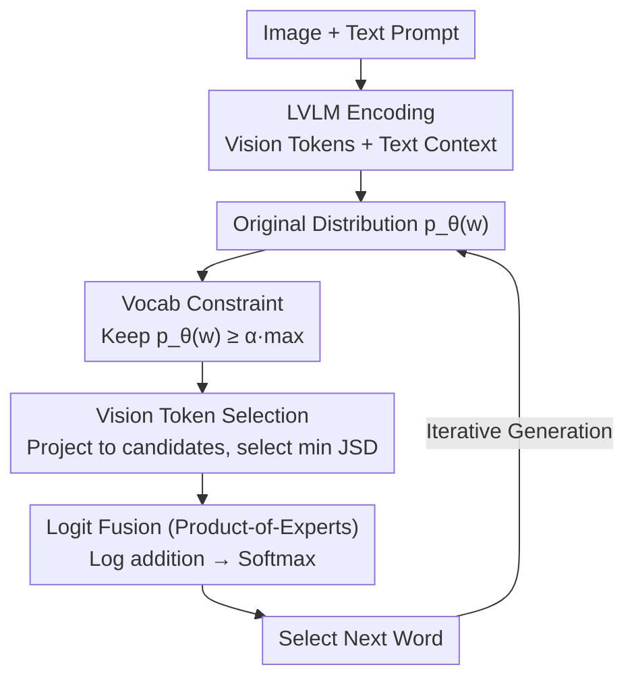

# Revisit What You See: Revealing Visual Semantics in Vision Tokens to Guide LVLM Decoding

**Conference**: ACL2026 Oral  
**arXiv**: [2506.09522](https://arxiv.org/abs/2506.09522)  
**Code**: https://github.com/bscho333/ReVisiT  
**Area**: Multimodal VLM  
**Keywords**: Vision-Language Models, Hallucination Suppression, Decoding Strategy, Vision Tokens, Training-free Method

## TL;DR
ReVisiT discovers that the hidden states of vision tokens in LVLMs already encode interpretable object semantics. By utilizing context-constrained vocabularies, vision token selection, and logit fusion, it enhances visual grounding and reduces hallucinations without requiring additional training or extra forward passes.

## Background & Motivation
**Background**: Current Large Vision-Language Models (LVLMs) typically encode images into vision tokens, which are then fed into the language model decoder alongside text tokens. Dominant hallucination suppression methods usually operate during the decoding stage via contrastive decoding, attention reweighting, perturbed input comparison, or post-generation correction using external verifiers.

**Limitations of Prior Work**: While these methods reduce some object hallucinations, they often treat visual information as implicit context. There is a lack of direct analysis regarding what vision tokens contribute to the next-token distribution, whether they contain object-level semantics, and why these semantics are frequently ignored by standard greedy decoding.

**Key Challenge**: LVLMs do not necessarily "fail to see" the correct object at hallucination positions. Empirical analysis shows that the ground-truth object often remains a high-probability candidate in the model's output distribution, but linguistic priors override visual grounding signals at specific timesteps. Thus, the problem is not just providing more visual information, but explicitly pulling existing semantics from vision tokens back into the decoding decision.

**Goal**: The authors aim to answer two questions: First, do vision tokens carry object semantics that map to the text vocabulary? Second, if so, can a lightweight mechanism select the most relevant vision token during decoding to correct next-token probabilities?

**Key Insight**: The paper adopts a "logit lens" approach, projecting the hidden states of vision tokens into the language model's vocabulary space. A key observation is that direct projection onto the full vocabulary is diluted by irrelevant words, but the object semantics of vision tokens become clear once the vocabulary is restricted to reasonable candidates based on the current context.

**Core Idea**: Adaptively construct a candidate vocabulary using the current output distribution, select the vision token most relevant to the context within this constrained space, and fuse its projected distribution as a visual reference signal with the original logits.

## Method
ReVisiT is a decoding-time method that requires no structural changes, extra annotations, or re-training. It transforms static vision tokens into a "visual evidence bank" referable at each step. For every generation step, it determines potential words based on the original distribution, identifies the vision token that best explains these candidates, and corrects the output probability using that token's distribution.

### Overall Architecture
Input consists of an image and a user prompt. The LVLM processes these to obtain vision tokens and text context, calculating the original output distribution. ReVisiT performs three steps on this distribution: first, it filters context-relevant candidates from the full vocabulary using a probability threshold; second, it projects cached vision tokens into the same candidate space and selects the most relevant token/layer using Jensen-Shannon Divergence (JSD); third, it fuses the original log-probabilities with the selected vision token's log-projections, followed by a softmax to obtain the final distribution.

The key to this process is that all comparisons occur within the same constrained vocabulary. This avoids noise from function words, punctuation, and low-relevance terms in the full vocabulary, allowing vision token semantics to align with the current context.

### Key Designs
**1. Context-Aware Vocabulary Constraint: Narrowing the field to words "actually likely to be spoken" to reveal visual semantics.**

Projecting vision token hidden states directly to the full vocabulary results in dilution by irrelevant tokens—analysis shows top-1 recall for ground-truth objects is only $2.03\%$. ReVisiT's first step is to retain only tokens $w$ satisfying $p_\theta(w) \geq \alpha \cdot \max_{w'}p_\theta(w')$. The threshold $\alpha$ controls the candidate set: smaller values include more possibilities, while larger values emphasize high-confidence candidates. Once projected onto this semantically consistent subset, the vision token top-1 recall jumps from $2.03\%$ to $40.44\%$. This step is a prerequisite for "visible" semantics rather than just a pruning trick for efficiency.

**2. Min-JSD Based Vision Token Selection: Turning "which vision token to reference" into a context-aware choice rather than blind weight addition.**

After constraining the vocabulary, the model must decide which vision token and layer to trust. ReVisiT uses the LM head to project each vision token's hidden state into a probability distribution over the candidate vocabulary. It computes the Jensen-Shannon Divergence (JSD) between these and the current output distribution, picking the token and layer with the minimum JSD. Intuitively, a smaller JSD indicates the vision token's semantic direction is most consistent with the candidates the model is currently considering.

**3. Product-of-Experts Logit Fusion: Treating the selected vision token as an "expert" voting with the text context.**

To integrate the chosen token's opinion, ReVisiT adds the log-probabilities of the original output and the selected vision token projection within the constrained candidate set, followed by re-normalization. This is essentially a Product-of-Experts approach where a candidate must be supported by both the linguistic context and the visual evidence to win. This preserves the fluency of the language model while bringing visual grounding directly into the decision layer.

### Loss & Training
ReVisiT has no training loss. Vision token projections onto the full vocabulary can be cached before decoding starts. At each timestep, the model only needs to slice the cache according to the candidate vocabulary, calculate distribution shifts, and fuse logits. The authors use deterministic greedy decoding with a maximum length of 512.

## Key Experimental Results

### Main Results
The paper evaluates LLaVA-1.5-7B, Qwen2.5-VL-7B, and InternVL3-8B on HallusionBench, CHAIR, POPE, VQAv2, and MMMU, comparing against baselines like Greedy, DoLa, VCD, M3ID, CODE, and SID.

| Dataset / Model | Metric | Ours (ReVisiT) | Greedy | Gain |
|--------|------|------|----------|------|
| HallusionBench / LLaVA-1.5-7B | qAcc | 20.22 | 11.55 | +8.67 (~75% relative) |
| CHAIR / Qwen2.5-VL-7B | CHAIRI ↓ / F1 ↑ | 7.04 / 81.16 | 8.43 / 79.85 | Improved F1 +1.31 |
| POPE / LLaVA-1.5-7B | Accuracy / F1 | 81.80 / 83.45 | 79.47 / 82.36 | Acc +2.33, F1 +1.09 |
| VQAv2 / Qwen2.5-VL-7B | Accuracy | 67.60 | 65.80 | +1.80 |
| MMMU / InternVL3-8B | Accuracy | 54.14 | 53.54 | +0.60 |

ReVisiT reduces object hallucinations while maintaining or improving accuracy in VQA and knowledge-intensive multimodal QA, suggesting it does not simply make the model more "conservative."

### Ablation Study
Analysis on Qwen2.5-VL (CHAIR) regarding selection criteria, vocabulary constraints, and layer ranges:

| Configuration | Key Metric | Description |
|------|---------|------|
| Full ReVisiT | F1 = 81.16 | Best performance using vocab constraint, min-JSD, all layers. |
| max-JSD selection | F1 = 0.67 | Performance collapses when selecting most dissimilar tokens. |
| random selection | F1 = 17.63 | Random visual reference fails to provide stable grounding. |
| min-JSD + full vocab | F1 = 1.52 | Visual projections deviate without semantic constraints. |
| last-layer variant | F1 = 80.97 | Slightly lower than all-layers but remains effective. |

### Key Findings
- In 190 hallucinated steps, the correct object appeared in the top-50 candidates 63.2% of the time, and top-500 95.8% of the time, proving the model often "knows" the correct object but lacks the signal to select it.
- Full-vocabulary projection top-1 recall is $2.03\%$, but rises to $40.44\%$ on CHAIR subsets and $89.24\%$ for top-30. This supports the hypothesis that semantic constraints make vision tokens interpretable.
- Inference latency increases by only $0.6\%$ to $2.0\%$, whereas multi-forward methods like VCD or M3ID approach or exceed $2\times$ overhead.

## Highlights & Insights
- The most valuable insight is transforming vision tokens from "invisible internal context" into "projectable, selectable, and referable semantic evidence." This shifts hallucination suppression from empirical logit adjustment to explainable visual semantic utilization.
- It emphasizes that visual information must be activated within the current textual candidate space rather than simply assuming more visual weight is better.
- Its training-free nature makes it highly suitable for deployment with existing LVLMs, especially for closed-source models or cost-sensitive scenarios where hidden states are accessible.
- The paper suggests that hallucinations are not always due to missing visual knowledge in representations, but rather a failure of decoding strategies to utilize existing knowledge.

## Limitations & Future Work
- The method heavily depends on semantics already present in vision tokens. If the encoder fails to capture small objects or fine-grained attributes, ReVisiT cannot "invent" that info.
- Strengthening visual grounding might cause the model to over-focus on salient objects, potentially hurting tasks requiring common sense or external knowledge.
- Experiments focused on 7B to 32B models; whether the same patterns hold for 70B+ or proprietary models requires further confirmation.
- The current focus is on object-level hallucinations. Relations, attributes, OCR, and complex reasoning errors may require more granular extensions.

## Related Work & Insights
- **vs VCD / M3ID**: These emphasize suppressing linguistic priors via perturbed images (requiring extra forward passes), whereas ReVisiT directly references existing tokens for higher efficiency.
- **vs DoLa**: DoLa utilizes logit differences between early and late layers. ReVisiT specifically targets visual grounding signals from vision tokens rather than general layer-wise factualness.
- **vs attention-based**: Unlike DAMRO or SID which adjust decoding via attention patterns, ReVisiT explicitly maps hidden states to the semantic vocabulary space.
- **Insight**: "Constrained semantic projection" could be a general tool for multimodal models to locate the contribution of specific video frames, audio segments, or retrieved documents.

## Rating
- Novelty: ⭐⭐⭐⭐⭐ The combination of constrained projection and decoding reference is natural and highly explainable.
- Experimental Thoroughness: ⭐⭐⭐⭐⭐ Covers 5 benchmarks, 3 architectures, and multiple sizes with speed and mechanism analysis.
- Writing Quality: ⭐⭐⭐⭐☆ Logical analysis chain; rich tables (though some math/tables are dense).
- Value: ⭐⭐⭐⭐⭐ High reference value for training-free hallucination suppression and multimodal decoding.

<!-- RELATED:START -->

## Related Papers

- [\[ICML 2026\] What You Think is What You See: Driving Exploration in VLM Agents via Visual-Linguistic Curiosity (GLANCE)](../../ICML2026/multimodal_vlm/what_you_think_is_what_you_see_driving_exploration_in_vlm_agents_via_visual-ling.md)
- [\[ACL 2026\] "I See What You Did There": Can Large Vision-Language Models Understand Multimodal Puns?](i_see_what_you_did_there_can_large_vision-language_models_understand_multimodal_.md)
- [\[CVPR 2026\] Aligning What Vision-Language Models See and Perceive with Adaptive Information Flow](../../CVPR2026/multimodal_vlm/aif_adaptive_information_flow_vlm.md)
- [\[ACL 2025\] I See What You Mean: Co-Speech Gestures for Reference Resolution in Multimodal Dialogue](../../ACL2025/multimodal_vlm/i_see_what_you_mean_co-speech_gestures_for_reference_resolution_in_multimodal_di.md)
- [\[ACL 2026\] What Do Vision-Language Models Encode for Personalized Image Aesthetics Assessment?](what_do_vision-language_models_encode_for_personalized_image_aesthetics_assessme.md)

<!-- RELATED:END -->
