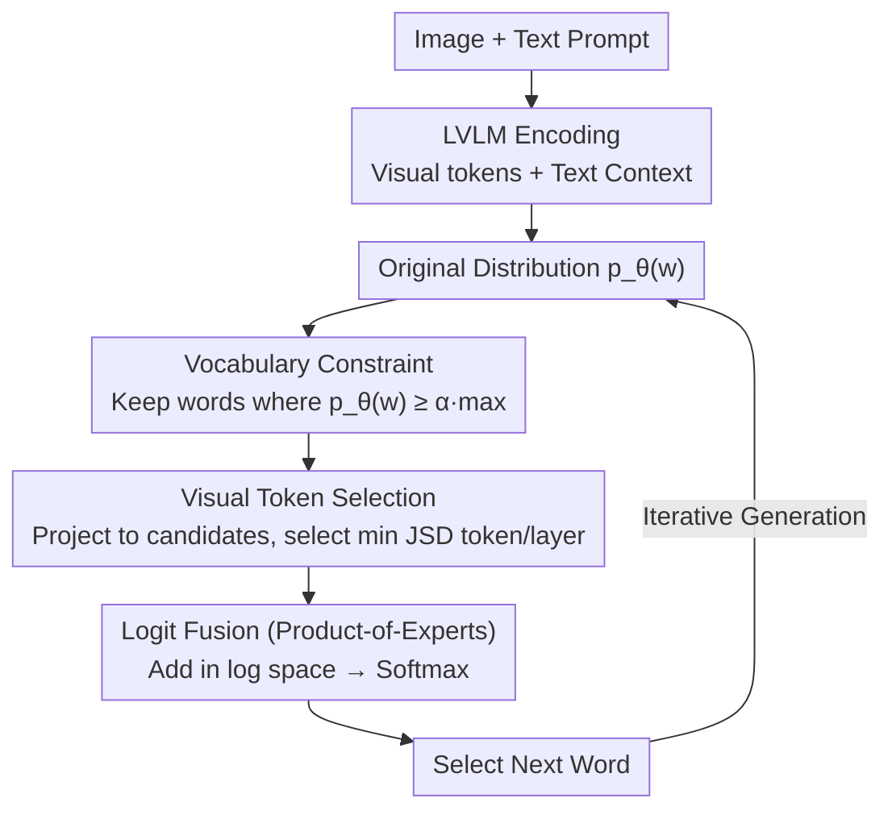

# Revisit What You See: Revealing Visual Semantics in Vision Tokens to Guide LVLM Decoding

**Conference**: ACL2026 Oral  
**arXiv**: [2506.09522](https://arxiv.org/abs/2506.09522)  
**Code**: https://github.com/bscho333/ReVisiT  
**Area**: Multimodal VLM  
**Keywords**: Large Vision-Language Models, Hallucination Mitigation, Decoding Strategy, Vision tokens, Training-free method

## TL;DR
ReVisiT discovers that visual tokens in LVLMs already encode interpretable object semantics. By utilizing contextually constrained vocabularies, visual token selection, and logit fusion, it enhances visual grounding and reduces hallucinations without retraining or additional forward passes.

## Background & Motivation
**Background**: Current Large Vision-Language Models (LVLMs) typically encode images into visual tokens, which are then fed into the language model decoder alongside text tokens. Dominant hallucination mitigation methods mostly operate during the decoding phase through contrastive decoding, attention re-weighting, input perturbation, or post-generation verification using external verifiers.

**Limitations of Prior Work**: While these methods reduce object hallucinations, they often treat visual information as implicit context. There is a lack of direct analysis regarding what visual tokens contribute to the next-word distribution, whether they inherently contain object-level semantics, and why these semantics are not selected by standard greedy decoding.

**Key Challenge**: LVLMs do not necessarily "fail to see" the correct object at hallucination points. Empirical analysis in the paper reveals that the ground-truth object often remains among the high-probability candidates in the output distribution; however, language priors override visual grounding signals at specific timesteps. Thus, the problem is not just about providing more visual information, but how to explicitly pull existing semantics from visual tokens back into decoding decisions.

**Goal**: The authors aim to answer two questions: first, whether visual tokens carry object semantics that can be mapped to the text vocabulary; second, if so, whether a lightweight mechanism can select the most relevant visual tokens during decoding to correct next-word probabilities.

**Key Insight**: The paper adopts a "logit lens" approach by projecting the hidden states of visual tokens into the language model's vocabulary space. A crucial observation is that direct projection onto the full vocabulary is diluted by irrelevant words, but once the vocabulary is restricted to a reasonable candidate set based on the current context, the object semantics within visual tokens become clear.

**Core Idea**: Adaptively construct a candidate vocabulary from the current output distribution, select the visual token closest to the current context within this constrained space, and fuse its projected distribution as a visual reference signal with the original logits.

## Method
ReVisiT is a decoding-time method that requires no structural changes, extra annotations, or retraining. It transforms static visual tokens into an "evidence bank" referenceable at each step: for every generation step, it filters candidates from the full vocabulary, identifies the visual token that best explains these candidates, and uses its distribution to refine the output.

### Overall Architecture
The input consists of an image and a text prompt. The LVLM processes these to obtain visual tokens and text context, calculating the original output distribution. ReVisiT performs three steps on this distribution: first, it filters contextually relevant candidates using a probability threshold; second, it projects cached visual token distributions into this candidate space and selects the most relevant token/layer via Jensen-Shannon Divergence (JSD); third, it fuses the original and visual distributions in log space using a Product-of-Experts approach.

The key to this pipeline is that all comparisons occur within the same constrained vocabulary, avoiding noise from function words or punctuation while aligning visual semantics with the current context.

### Key Designs
**1. Context-aware vocabulary constraint: Narrowing the vocabulary to "words likely to be spoken" to reveal visual semantics**

Projecting visual hidden states to the full vocabulary results in dilution by irrelevant tokens. Analysis shows that the top-1 recall of ground-truth objects is only $2.03\%$ in this setting. ReVisiT first filters the vocabulary based on the original distribution $p_\theta(w)$, retaining only tokens where $p_\theta(w) \geq \alpha \cdot \max_{w'}p_\theta(w')$. The threshold $\alpha$ controls the candidate set size. Once projected onto this semantically consistent subset, the top-1 recall for the same visual tokens jumps to $40.44\%$.

**2. Minimum JSD-based visual token selection: Turning "referencing visual tokens" into a context-aware selection**

To decide which visual token or layer to trust, ReVisiT projects each visual token's hidden state into the candidate vocabulary space. It then calculates the Jensen-Shannon Divergence (JSD) between these projections and the current output distribution. The token/layer with the minimum JSD is selected, as a smaller JSD indicates the visual token provides semantic directions most consistent with the model's current consideration.

**3. Product-of-Experts logit fusion: Treating the selected visual token as an "expert" voting with the language context**

ReVisiT adds the log-probabilities of the original distribution and the selected visual token's projection within the constrained set, followed by re-normalization. This ensures the final token is supported by both linguistic context and visual evidence. This acts as a Product-of-Experts where the language model provides contextual constraints and the visual token provides grounding.

### Loss & Training
Ours has no training loss. Visual token projections to the full vocabulary can be cached before decoding. During generation, the model only performs slicing, divergence calculation, and logit fusion. Experiments use deterministic greedy decoding with a maximum length of 512.

## Key Experimental Results

### Main Results
The method was evaluated on HallusionBench, CHAIR, POPE, VQAv2, and MMMU using LLaVA-1.5-7B, Qwen2.5-VL-7B, and InternVL3-8B.

| Dataset / Model | Metric | ReVisiT | Greedy | Gain |
|--------|------|------|----------|------|
| HallusionBench / LLaVA-1.5-7B | qAcc | 20.22 | 11.55 | +8.67 (~75% relative) |
| CHAIR / Qwen2.5-VL-7B | CHAIRI ↓ / F1 ↑ | 7.04 / 81.16 | 8.43 / 79.85 | +1.31 F1 |
| POPE / LLaVA-1.5-7B | Accuracy / F1 | 81.80 / 83.45 | 79.47 / 82.36 | +2.33 Acc |
| VQAv2 / Qwen2.5-VL-7B | Accuracy | 67.60 | 65.80 | +1.80 |
| MMMU / InternVL3-8B | Accuracy | 54.14 | 53.54 | +0.60 |

ReVisiT reduces object hallucinations while maintaining or improving accuracy in VQA and knowledge-intensive tasks, suggesting the method does not simply make the model more conservative.

### Ablation Study
Analyzed on Qwen2.5-VL (CHAIR) regarding selection criteria, vocabulary constraints, and layer range.

| Configuration | Key Metric | Description |
|------|---------|------|
| Full ReVisiT | F1 = 81.16 | Uses candidate vocab, min-JSD, all layers; best performance. |
| max-JSD selection | F1 = 0.67 | Performance collapses when selecting the most dissimilar token. |
| random selection | F1 = 17.63 | Random visual reference fails to provide stable grounding. |
| min-JSD + full vocabulary | F1 = 1.52 | Visual projection deviates from target semantics without constraints. |

### Key Findings
- In 190 hallucination steps, at least one ground-truth object appeared in the top-50 candidates 63.2% of the time, reaching 95.8% for the top-500, indicating the model "knows" the correct object but fails to select it.
- Top-1 recall for ground-truth objects in visual token projections is $2.03\%$ on full vocab but $40.44\%$ on the CHAIR subset, reaching $89.24\%$ for top-30.
- Inference latency increases by only $0.6\%$ to $2.0\%$, whereas multi-forward methods like VCD or M3ID approach or exceed $2\times$ overhead.

## Highlights & Insights
- The most valuable insight is transforming visual tokens from "internal invisible context" into "interpretable and referenceable semantic evidence," moving hallucination mitigation toward explainable visual semantic utilization.
- It emphasizes that visual information must be activated within the current textual candidate space rather than simply increasing visual weights.
- The training-free nature makes it highly suitable for deploying on existing LVLMs, especially in closed-source or cost-sensitive scenarios where retraining is impossible.
- The work suggests that hallucinations are not always due to a lack of visual knowledge in representations, but rather a failure of the decoding strategy to utilize existing knowledge.

## Limitations & Future Work
- The method depends on existing semantics in visual tokens. If the encoder fails to capture small objects or fine-grained attributes, ReVisiT cannot recover them.
- Increased visual grounding might cause the model to focus excessively on salient objects, potentially overlooking common sense or implicit context.
- Evaluation was limited to 7B to 32B models; whether visual tokens in 70B+ or proprietary models require similar constraints remains to be confirmed.
- While effective for object hallucinations, extensions are needed for relation, attribute, and complex reasoning errors.

## Related Work & Insights
- **vs VCD / M3ID**: These methods use perturbed images for contrastive distributions; ReVisiT references visual token projections directly without extra forward passes, ensuring higher efficiency.
- **vs DoLa**: DoLa uses layer-wise differences for factuality; ReVisiT's signal is specifically directed at visual grounding from vision tokens.
- **vs attention-based methods**: Methods like DAMRO or SID use attention patterns; ReVisiT maps hidden states explicitly to the semantic space of the vocabulary.
- **Insight**: "Constrained semantic projection" of internal tokens could be a general tool for identifying the contribution of specific frames, audio segments, or retrieved documents in generative models.

## Rating
- Novelty: ⭐⭐⭐⭐⭐ 
- Experimental Thoroughness: ⭐⭐⭐⭐⭐ 
- Writing Quality: ⭐⭐⭐⭐☆ 
- Value: ⭐⭐⭐⭐⭐ 

<!-- RELATED:START -->

## Related Papers

- [\[ACL 2026\] "I See What You Did There": Can Large Vision-Language Models Understand Multimodal Puns?](i_see_what_you_did_there_can_large_vision-language_models_understand_multimodal_.md)
- [\[CVPR 2026\] Aligning What Vision-Language Models See and Perceive with Adaptive Information Flow](../../CVPR2026/multimodal_vlm/aif_adaptive_information_flow_vlm.md)
- [\[ACL 2025\] I See What You Mean: Co-Speech Gestures for Reference Resolution in Multimodal Dialogue](../../ACL2025/multimodal_vlm/i_see_what_you_mean_co-speech_gestures_for_reference_resolution_in_multimodal_di.md)
- [\[ICLR 2026\] Revisit Visual Prompt Tuning: The Expressiveness of Prompt Experts](../../ICLR2026/multimodal_vlm/revisit_visual_prompt_tuning_the_expressiveness_of_prompt_experts.md)
- [\[ACL 2026\] What Do Vision-Language Models Encode for Personalized Image Aesthetics Assessment?](what_do_vision-language_models_encode_for_personalized_image_aesthetics_assessme.md)

<!-- RELATED:END -->
