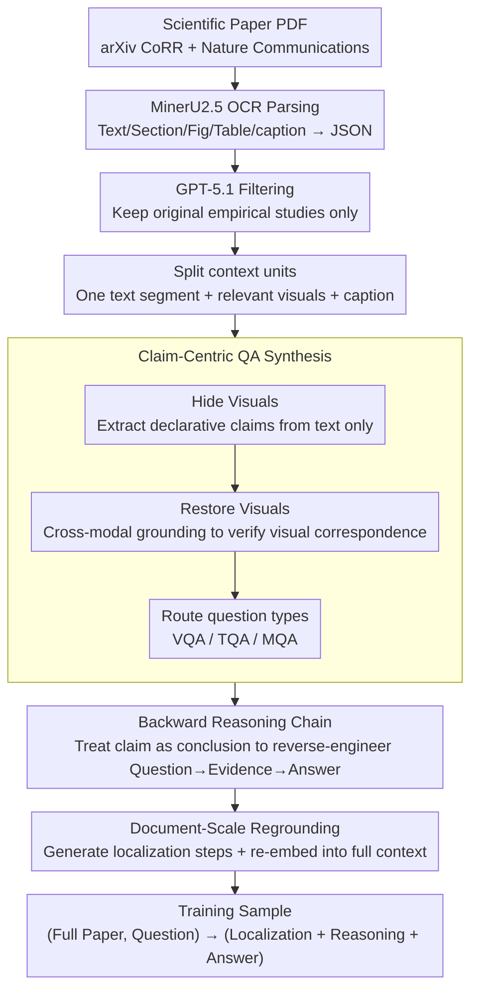

# SciMDR: Advancing Scientific Multimodal Document Reasoning

**Conference**: ACL2026  
**arXiv**: [2603.12249](https://arxiv.org/abs/2603.12249)  
**Code**: No public code link found  
**Area**: Multimodal VLM / Scientific Document Understanding  
**Keywords**: Scientific Document Reasoning, Multimodal QA, Data Synthesis, Long Document Understanding, Evidence Localization

## TL;DR
SciMDR proposes a synthesize-and-reground data construction framework. It first synthesizes faithful QA pairs and reasoning chains based on atomic claims, and then re-embeds them into full scientific papers for training. This enables a 7B VLM to approach the performance of the GPT-5 series in scientific multimodal document reasoning.

## Background & Motivation
**Background**: Scientific document understanding is evolving from summary-level QA and chart QA toward full-paper-level reasoning. Real-world research questions often require simultaneous reading of body text, figures, tables, captions, and experimental descriptions, while localizing evidence within long documents.

**Limitations of Prior Work**: There is a triagonal contradiction in high-quality scientific QA data: manual annotations are high-quality but small-scale; data constructed from snippets or charts are faithful but unrealistic; generating questions directly from full documents is realistic but long contexts dilute attention and increase hallucinations, leading to unreliable answers and reasoning chains.

**Key Challenge**: Training a scientific assistant requires both faithful supervisory signals and realistic full-document tasks. Training only on short snippets prevents the model from learning to find evidence in full papers, while synthesis from full papers makes it difficult to guarantee annotation accuracy.

**Goal**: Construct a large-scale training set, SciMDR, and an expert-annotated evaluation set, SciMDR-Eval. This aims to let models learn to localize evidence in full scientific documents, connect textual and visual elements, and perform multi-step scientific reasoning, while verifying if synthetic data truly improves scientific QA capabilities.

**Key Insight**: The authors decouple "generating faithful QA" from "constructing realistic training tasks." Phase 1 generates QA and CoT within small, verifiable atomic contexts. Phase 2 leverages the evidence locations recorded in claims to re-embed the QA into the full document and provides information localization steps.

**Core Idea**: Lock the answer and evidence to atomic claims first, then place the same supervisory signal back into the full paper environment. This forces the model to learn to "find evidence first, then reason, and finally answer" within a high-noise, long-context environment.

## Method
The focus of SciMDR is not a new model architecture, but a training data generation paradigm for scientific multimodal documents. it parses scientific papers into text, sections, figures, and captions, generates three types of QA (VQA/TQA/MQA) around claims, and transforms these into full-document training samples via document-scale regrounding.

### Overall Architecture
Input consists of scientific paper PDFs filtered from arXiv CoRR and Nature Communications. Text, sections, figures, tables, and captions are extracted via MinerU2.5 OCR and serialized into JSON. GPT-5.1 then determines if the paper is an original empirical study, filtering out surveys, position papers, tutorials, and conceptual articles. The final training data covers ~20K papers and 300K QA pairs; the evaluation set comprises 907 high-quality QA pairs manually constructed from 300 arXiv papers by three CS graduate students.

The framework includes two stages. Claim-Centric QA Synthesis is responsible for generating faithful data in small contexts; Document-Scale Regrounding converts this data into full-paper-level training tasks. The training format is `(Full Document Context, Question) -> (Information Localization + Reasoning + Final Answer)`.

### Key Designs
**1. Claim-Centric QA Synthesis: Locking answers in small verifiable contexts before generating QA and reasoning chains**

Providing a full paper for an LLM to generate open-ended questions carries a high risk of hallucinations and evidence mismatch—long contexts dilute attention, leading models to invent "plausible but unsupported" answers. SciMDR takes the opposite approach: each multimodal context unit contains only one text segment and its relevant visuals. The system identifies sentences citing visual elements, hides those visuals, and lets the LLM extract discrete declarative claims from the text alone. Visuals are then restored, and cross-modal grounding determines if each claim has a visual counterpart, routing it to VQA, TQA, or MQA.

The brilliance of this approach is that the claim serves as an "answer blueprint," downgrading reasoning chain generation from "open-ended inference" to "explaining why this answer holds." By confining the generation space to a verifiable small scope, hallucinations and evidence mismatches are significantly reduced.

**2. Backward Reasoning Chain Construction: Using claims as known conclusions to link questions, evidence, and answers in reverse**

The two hardest parts of scientific QA are evidence retrieval (finding evidence in long text) and open-ended inference (deriving conclusions). If a model is forced to perform forward inference, these difficulties compound, making CoT quality unstable. SciMDR treats the claim as a ground-truth conclusion, allowing the LLM to skip discovering the answer and instead construct a reasoning chain that starts from the question, passes through the evidence, and lands on the claim.

In other words, "finding evidence" is partially outsourced to the prior claim extraction and localization step, leaving the model only to smooth out the logical chain. By decomposing and outsourcing the difficulty, the resulting CoT supervisory signals are more stable, imitable, and verifiable.

**3. Document-Scale Regrounding: Re-inserting atomic QA into the full paper to maintain realistic long-document noise**

The first two steps ensure faithfulness but at the cost of realism—real users do not pre-segment relevant paragraphs for the model. Since each QA-bound claim already records the location of textual and visual evidence, SciMDR can automatically generate an Information Localization step (e.g., "First check Section X, then cross-reference Table Y"). This is prepended to the synthetic reasoning chain and packaged with the full document context. The final training format is `(Full Document Context, Question) -> (Information Localization + Reasoning + Final Answer)`.

This step bridges the gap of being "faithful but not realistic." The task restores the high-noise, long-context of the full paper, forcing the model to learn "localization before reasoning," while the answer chain remains anchored by precise evidence.

### A Complete Example: How an experimental description becomes a document-level training sample

Using an arXiv paper with experimental figures as an example:

1.  **Parsing**: The PDF is processed via MinerU2.5 OCR to extract text, sections, and figures into JSON. GPT-5.1 identifies it as an empirical study.
2.  **Context Unit Slicing**: A segment from Section 4, "Figure 3 shows our method outperforms baseline by 5 points," is combined with Figure 3 and its caption.
3.  **Claim Extraction (Visuals Hidden)**: Figure 3 is covered. A claim is extracted from text: "Ours performs 5 points better than baseline on this metric."
4.  **Routing (Visuals Restored)**: Figure 3 is revealed. Cross-modal grounding finds that the key number requires reading the figure. It is routed to VQA. Question generated: "How much did Ours improve over the baseline?"
5.  **Backward Chain Construction**: Using the claim as the conclusion, the CoT is generated: "Question asks for performance gap → Evidence in Figure 3 bar chart → Difference between bars is 5 → Answer: 5 points."
6.  **Document-Scale Regrounding**: The full paper is used as context. The step "First locate Section 4, then cross-reference Figure 3" is prepended. A training sample is finalized.

This process yields 300K QA pairs from ~20K papers, each robust against long-document noise and backed by precise evidence.

### Loss & Training
The paper employs supervised fine-tuning (SFT) rather than a new loss function. Qwen2.5-VL-7B is used as the base model and trained in two stages: Stage 1 uses VQA and TQA data for 1 epoch (peak $LR=1\times10^{-5}$, batch size 64); Stage 2 uses MQA data for 1 epoch ($LR=1\times10^{-6}$). The vision encoder and projector are frozen during fine-tuning; only the language model is updated. The SPIQA baseline is reproduced using the same base model to isolate the effects of data quality.

## Key Experimental Results

### Main Results
The table shows the improvements SciMDR brings to Qwen2.5-VL-7B. The final column corresponds to SciMDR-Eval. `+ SciMDR` denotes the model fine-tuned on the 300K dataset.

| Model | ChartQA | CharXiv-D | CharXiv-R | SPIQA-A | SPIQA-B | SPIQA-C | SciMDR-Eval |
| :--- | :--- | :--- | :--- | :--- | :--- | :--- | :--- |
| GPT-5.1 | - | 90.9 | 58.3 | 79.4 | 79.8 | 71.6 | 47.2 |
| GPT-5.2 | - | 95.2 | 73.1 | 79.9 | 75.4 | 74.0 | 49.9 |
| Qwen-3-VL-8B | 87.4 | 74.2 | 40.1 | 73.2 | 64.0 | 62.3 | 34.2 |
| Qwen2.5-VL-7B | 84.6 | 65.0 | 37.7 | 66.4 | 56.6 | 48.9 | 19.8 |
| Qwen2.5-VL-7B + SPIQA | 81.8 | 50.9 | 33.3 | 62.7 | 44.7 | 40.0 | 5.6 |
| Qwen2.5-VL-7B + SciMDR | 86.3 | 75.6 | 37.9 | 68.6 | 58.8 | 47.3 | 49.1 |

The direct comparison with proprietary models shows that SciMDR-Eval is challenging, but specialized 7B training significantly narrows the gap.

| Model | SciMDR-Eval |
| :--- | :--- |
| GPT-5.2 | 49.9 |
| GPT-5.1 | 47.2 |
| GPT-4o | 24.7 |
| Qwen2.5-VL-7B | 19.8 |
| Qwen2.5-VL-7B + SciMDR | 49.1 |

### Ablation Study
A LLaVA-1.5-7B probe is used to analyze data quality. The authors compare original SPIQA, SciMDR VQA, and SPIQA re-annotated with the claim-centric pipeline at a fixed 50K sample scale. Re-annotating SPIQA improved results from 35.7 to 39.8, with average output length on CharXiv being ~5x longer than original data, indicating gains stem from reasoning chain quality.

| Configuration | Key Result | Description |
| :--- | :--- | :--- |
| Qwen2.5-VL-7B base | SciMDR-Eval 19.8 | General VLMs struggle with full-paper reasoning |
| + SPIQA Data | SciMDR-Eval 5.6 | Short-context synthetic data degrades on full documents |
| + SciMDR Data | SciMDR-Eval 49.1 | Localization + Reasoning chains significantly boost performance |
| SPIQA Re-annotated | 39.8 vs 35.7 (orig) | Claim-centric annotation is superior for the same documents |

### Key Findings
- `+ SciMDR` provides the largest gain on SciMDR-Eval (from 19.8 to 49.1), nearly matching GPT-5.2.
- `+ SPIQA` leads to performance drops across most metrics, suggesting that standard short-context synthetic data does not inherently teach models to find evidence in full papers.
- On CharXiv-D, SciMDR improved from 65.0 to 75.6, showing that claim-centric data generalizes to chart-based scientific QA beyond the proprietary evaluation set.
- A slight drop of 1.6 on SPIQA-C suggests that specialized training for full-document localization may slightly sacrifice performance on specific sub-tasks or reflects differing skill distributions.

## Highlights & Insights
- The core insight is decoupling the two goals of data synthesis: faithfulness is ensured in small contexts, while realism is restored in full documents. This is more stable than "direct full-document generation" and more applicable than "snippet-only QA."
- The **claim** acts as a versatile intermediate representation. It is both the answer blueprint for QA generation and the localization map for the re-embedding stage.
- **Information Localization** supervision is often overlooked in scientific document assistant training. While many datasets only provide the final answer and CoT, SciMDR explicitly requires the model to specify which section/table/figure to consult.
- Results remind us that data scale does not equal effectiveness. Synthetic data like SPIQA can harm models when it does not match the task format; training specifically for full-document formats is key.

## Limitations & Future Work
- Data quality is constrained by the proprietary teacher (GPT-5.1). Even with atomic claims, subtle teacher errors in niche scientific fields may be encoded into the student model.
- Experiments focus on STEM (mostly CS and Natural Sciences). it is unverified whether the SciMDR pipeline applies to the different argumentative structures and evidence types of Humanities or Social Sciences.
- Construction relies heavily on OCR, chart parsing, and section extraction. Errors in MinerU2.5 could impact claim accuracy and localization quality; the paper does not quantify this error propagation.
- SciMDR-Eval uses an LLM judge for open-ended answers. While standard, this may introduce judge bias. Future work could include manual verification and cross-judge stability analysis.

## Related Work & Insights
- **vs ChartQA / CharXiv**: These benchmarks emphasize understanding specific charts or images. SciMDR focuses on cross-modal evidence localization and reasoning within full papers.
- **vs SPIQA**: SPIQA is a recent scientific QA dataset but uses short-context synthesis. SciMDR demonstrates that explicitly adding full-document regrounding is necessary for full-document reasoning tasks.
- **vs Manual Scientific QA**: ExpertQA and QASPER have high quality but limited scale. SciMDR scales this to 300K QA pairs using a claim-centric approach while maintaining validation via a 907-item manual evaluation set.
- **Insight**: This "atomic faithful annotation + document-level regrounding" paradigm can be extended to other long multimodal materials like medical records, legal documents, or patents.

## Rating
- Novelty: ⭐⭐⭐⭐☆ Not a new model, but a highly practical data construction paradigm. The dual use of claims as answer blueprints and evidence maps is clever.
- Experimental Thoroughness: ⭐⭐⭐⭐☆ Strong main results and proprietary model comparisons, though analysis of OCR error and judge stability is lacking.
- Writing Quality: ⭐⭐⭐⭐☆ Clear logic; the faithfulness-realism dilemma is well-articulated.
- Value: ⭐⭐⭐⭐⭐ Highly instructive for scientific VLM training, especially for building assistants capable of reading full papers.

<!-- RELATED:START -->

## Related Papers

- [\[ACL 2026\] TeXOCR: Advancing Document OCR Models for Compilable Page-to-LaTeX Reconstruction](texocr_advancing_document_ocr_models_for_compilable_page-to-latex_reconstruction.md)
- [\[ACL 2026\] Position: Multimodal Large Language Models Can Significantly Advance Scientific Reasoning](position_multimodal_large_language_models_can_significantly_advance_scientific_r.md)
- [\[CVPR 2026\] DocSeeker: Structured Visual Reasoning with Evidence Grounding for Long Document Understanding](../../CVPR2026/multimodal_vlm/docseeker_long_document_understanding.md)
- [\[ACL 2026\] ShredBench: Evaluating the Semantic Reasoning Capabilities of Multimodal LLMs in Document Reconstruction](shredbench_evaluating_the_semantic_reasoning_capabilities_of_multimodal_llms_in_.md)
- [\[ACL 2026\] Decoding Scientific Experimental Images: The SPUR Benchmark for Perception, Understanding, and Reasoning](decoding_scientific_experimental_images_the_spur_benchmark_for_perception_unders.md)

<!-- RELATED:END -->
