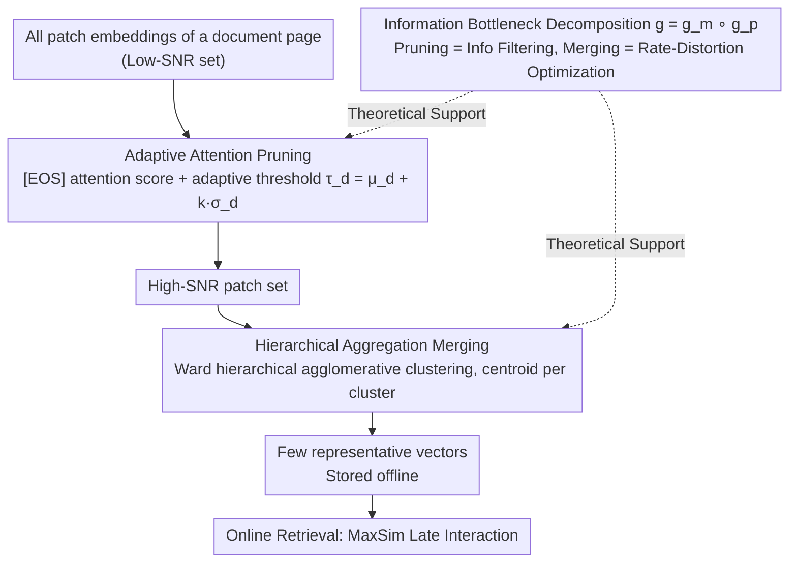

# Prune-then-Merge: Towards Efficient Multi-Vector Visual Document Retrieval

**Conference**: ACL 2026 Findings  
**arXiv**: [2602.19549](https://arxiv.org/abs/2602.19549)  
**Code**: None  
**Area**: Information Retrieval / Document Retrieval  
**Keywords**: Visual Document Retrieval, Multi-vector compression, adaptive pruning, hierarchical aggregation, ColPali

## TL;DR

This paper proposes Prune-then-Merge, a two-stage training-free multi-vector document compression framework. It first removes low-information patches via adaptive attention pruning, then merges the remaining high-signal patches through hierarchical agglomerative clustering. It extends the near-lossless compression range from 50-60% to 60-70% across 29 VDR datasets and significantly outperforms single-stage methods at high compression rates of 80%+.

## Background & Motivation

**Background**: Visual Document Retrieval (VDR) employs LVLMs to treat document pages as images. Multi-vector paradigms (e.g., ColPali) represent each page as a collection of patch-level embeddings, achieving fine-grained matching via MaxSim late interaction, which provides optimal performance.

**Limitations of Prior Work**: Storage and computational overhead for multi-vector models are massive—storing hundreds or thousands of vectors per page is impractical for large-scale deployment. Existing optimizations follow two paths: (1) Pruning methods (e.g., DocPruner) are near-lossless at moderate compression rates but suffer sharp performance degradation at high rates; (2) Merging methods (e.g., Light-ColPali) are more graceful at high rates but may dilute discriminative features, leading to unstable near-lossless ranges.

**Key Challenge**: Pruning excels at accurately removing noise but cannot handle high redundancy; merging excels at high-ratio compression but its centroids are skewed by noise in noisy data. Both methods have limitations, and using them individually fails to satisfy the dual requirements of near-lossless recovery and high compression.

**Goal**: Synergize two complementary methods—pruning to improve the Signal-to-Noise Ratio (SNR), followed by merging for high-ratio compression.

**Key Insight**: Grounded in Information Bottleneck (IB) theory, total compression is decomposed into two more manageable sub-problems: query-independent information filtering (pruning) and redundancy elimination (merging).

**Core Idea**: Refine then compress—pruning transforms the input from a low-SNR set to a high-SNR set, allowing subsequent merging to operate on high-quality vectors and avoiding centroid shifts caused by noise.

## Method

### Overall Architecture

Prune-then-Merge is an offline, query-independent, and entirely training-free multi-vector compression framework. It addresses the issue that multi-vector VDR models like ColPali incur heavy storage and late interaction costs. The problem of maintaining performance at high compression rates is split into two sequential steps: prune and then merge. Given all patch embeddings of a document page, Stage 1 utilizes the attention weights from the last layer of the LVLM to calculate patch importance, pruning low-information patches based on an adaptive threshold. Stage 2 applies Hierarchical Agglomerative Clustering (HAC) to the remaining high-quality patches, representing each cluster by its centroid. This serial design is supported by Information Bottleneck (IB) theory, explaining why "refining before compressing" is superior to single-stage approaches.

### Key Designs

**1. Adaptive Attention Pruning: Deciding patch retention based on document-specific information density.** This step eliminates low-information patches such as white spaces or decorative borders. The method reuses the attention weights from the last Transformer layer of the encoder, taking the average attention of the [EOS] token toward each patch as the importance score $I(\mathbf{d}_j) = \bar{\mathbf{A}}^{(L)}_{\text{eos},j}$. An adaptive threshold is set using document-level statistics $\tau_d = \mu_d + k \cdot \sigma_d$, retaining only patches with scores above the threshold. The hyperparameter $k$ controls pruning strictness.

The key is that the threshold is dynamically calculated based on the mean and variance of each document rather than a fixed ratio. Information density varies greatly across pages—a page full of tables versus a cover page with vast white space requires different retention levels. Fixed-ratio pruning either over-prunes dense pages or retains too much noise in sparse ones.

**2. Hierarchical Aggregation Merging: Computing unbiased centroids on clean sets.** Semantic redundancy may persist after pruning (e.g., multiple patches describing the same table row). This step performs L2 normalization on embeddings, computes a cosine distance matrix, and uses Ward's method for hierarchical agglomerative clustering. The target number of clusters is $N_p'' = \max(1, \lfloor N_p' / m \rfloor)$, where $m$ is the merging factor. Each cluster uses its mean centroid as the new representative vector.

Placing merging after pruning is critical: clustering directly on a noisy raw set causes centroids to be pulled toward blank/noise patches, diluting discriminative features. Pruning noise first ensures centroids fall in the center of high-signal samples, remaining unbiased and preserving retrieval accuracy.

**3. Information Bottleneck Decomposition: Theoretical justification for the two-step approach.** The authors decompose the overall IB optimization objective $\max I(\mathbf{D}''; s(q,\mathbf{D})) - \beta I(\mathbf{D}''; \mathbf{D})$ into a composite mapping $g = g_m \circ g_p$. Pruning $g_p$ handles query-independent information filtering to maximize global semantic retention, while merging $g_m$ performs rate-distortion optimization to minimize MSE caused by quantization (centroid replacement).

This decomposition breaks a difficult joint compression problem into two sub-problems with clear optimization goals. It theoretically confirms the intuition that single-stage merging suffers from noise-induced centroid shifts, whereas the two-stage filter-then-quantize approach yields nearly unbiased centroids.

### Loss & Training

Prune-then-Merge is a completely training-free post-processing framework. It involves no model training and can be directly applied to any multi-vector VDR model. The only hyperparameters are the pruning strictness $k$ and the merging factor $m$.

## Key Experimental Results

### Main Results

**nDCG@5 on 29 VDR datasets (60% compression rate)**

| Method | ColQwen2.5 | ColNomic | Jina-v4 |
|------|-----------|---------|---------|
| No Compression | Baseline | Baseline | Baseline |
| DocPruner (Pruning) | Near-lossless | Slight drop | Slight drop |
| Light-ColPali (Merging) | Significant drop | Significant drop | Significant drop |
| **Prune-then-Merge** | **Near-lossless** | **Near-lossless** | **Near-lossless** |

### Ablation Study

| Compression Rate | Pruning Only | Merging Only | Prune-then-Merge |
|--------|--------|--------|-----------------|
| 50% | Near-lossless | Slight drop | Near-lossless |
| 60% | Starts to drop | Significant drop | **Near-lossless** |
| 70% | Sharp drop | Drop | Slight drop |
| 80% | Collapse | Large drop | **Still usable** |

### Key Findings

- The near-lossless compression range is extended from [50-60%] to [60-70%], an average improvement of 10 percentage points.
- At 80%+ compression rates, pruning-only methods suffer performance collapse, which Prune-then-Merge avoids.
- Consistently effective across three mainstream multi-vector models: ColQwen2.5, ColNomic, and Jina-v4.
- Theoretical predictions align with experimental results—improving SNR before compression reduces centroid shift.

## Highlights & Insights

- The "refine then compress" approach is simple yet profound—decomposing complex problems into manageable sub-problems.
- Completely training-free and model-agnostic, allowing immediate application to any multi-vector retrieval model.
- IB theory analysis not only justifies the method's effectiveness but also provides principled guidance for hyperparameter selection.

## Limitations & Future Work

- The $O(N^2)$ space complexity of hierarchical clustering may become a bottleneck for extremely large documents.
- Query-independent pruning might inadvertently remove patches that are important for specific queries.
- Selection of the merging factor $m$ remains empirical.
- Future work could explore query-aware adaptive compression and learned merging strategies.

## Related Work & Insights

- **vs DocPruner**: Pruning only, collapses at high compression; Prune-then-Merge extends the range via subsequent merging.
- **vs Light-ColPali**: Merging only, centroids are diluted by noise; Prune-then-Merge prunes noise before merging.
- **vs MetaEmbed**: Requires training and architectural modifications; Prune-then-Merge is entirely training-free.

## Rating

- Novelty: ⭐⭐⭐⭐ The sequential compression logic is simple and effective; IB theory adds depth.
- Experimental Thoroughness: ⭐⭐⭐⭐⭐ Comprehensive evaluation across 29 datasets, 3 models, and multiple compression rates.
- Writing Quality: ⭐⭐⭐⭐⭐ Clear methodology with a strong link between theory and experiments.
- Value: ⭐⭐⭐⭐ Provides a plug-and-play compression solution for practical multi-vector retrieval deployment.

<!-- RELATED:START -->

## Related Papers

- [\[ACL 2025\] Towards Storage-Efficient Visual Document Retrieval: An Empirical Study on Reducing Patch-Level Embeddings](../../ACL2025/multimodal_vlm/towards_storage-efficient_visual_document_retrieval_an_empirical_study_on_reduci.md)
- [\[ACL 2026\] SlideAgent: Hierarchical Agentic Framework for Multi-Page Visual Document Understanding](slideagent_hierarchical_agentic_framework_for_multi-page_visual_document_underst.md)
- [\[AAAI 2026\] URaG: Unified Retrieval and Generation in Multimodal LLMs for Efficient Long Document Understanding](../../AAAI2026/multimodal_vlm/urag_unified_retrieval_and_generation_in_multimodal_llms_for.md)
- [\[ACL 2026\] Utility-Oriented Visual Evidence Selection for Multimodal Retrieval-Augmented Generation](utility-oriented_visual_evidence_selection_for_multimodal_retrieval-augmented_ge.md)
- [\[CVPR 2026\] Prime Once, then Reprogram Locally: An Efficient Alternative to Black-Box Service Model Adaptation](../../CVPR2026/multimodal_vlm/prime_once_then_reprogram_locally_an_efficient_alternative_to_black-box_service_.md)

<!-- RELATED:END -->
