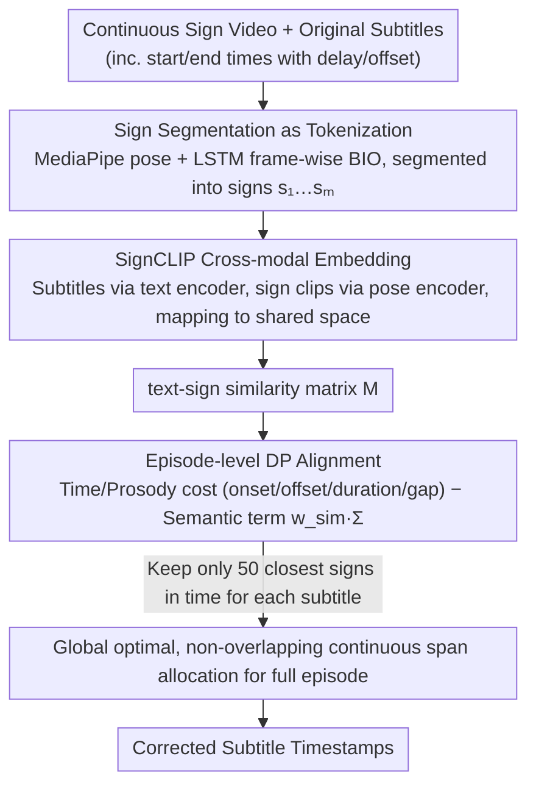

# Segment, Embed, and Align: A Universal Recipe for Aligning Subtitles to Signing

**Conference**: ACL2026  
**arXiv**: [2512.08094](https://arxiv.org/abs/2512.08094)  
**Code**: https://github.com/J22Melody/SEA  
**Area**: Human Understanding / Sign Language Processing / Video-Text Alignment  
**Keywords**: Sign-subtitle alignment, SignCLIP, Dynamic Programming, Cross-lingual Transfer, subtitle alignment

## TL;DR
SEA decomposes continuous sign language video subtitle alignment into sign segmentation, text-sign embedding, and episode-level dynamic programming. It achieves SOTA F1@0.50 on BOBSL, How2Sign, WMT-SLT SRF, and SwissSLi datasets, and can efficiently process long videos on CPUs.

## Background & Motivation
**Background**: Both sign language translation and corpus construction rely on high-quality text-sign parallel data. Many broadcast or online sign language videos contain subtitles in spoken languages, but these are typically aligned to the original audio. Due to non-fixed delays in sign language interpretation, subtitle timestamps often mismatch the actual signing.

**Limitations of Prior Work**: Manual alignment is extremely expensive. In the BOBSL context, a proficient expert requires approximately 10 to 15 hours to align 1 hour of continuous video; WMT-SLT 22 reported labor costs of approximately $40 per hour. Existing methods like SAT/SAT+ rely on manually aligned data and end-to-end training, lacking flexibility when generalizing to other languages, data sources, or low-resource scenarios.

**Key Challenge**: High-quality alignment requires understanding both the temporal boundaries and semantic content of signing. However, retraining an end-to-end aligner for every sign language or dataset involves high costs, sparse supervision, and weak generalization. A more universal approach should leverage existing segmentation and embedding models while treating alignment itself as a lightweight global optimization.

**Goal**: The authors aim to construct a cross-lingual, cross-source subtitle-to-sign alignment framework that requires minimal direct in-domain alignment supervision to automatically correct subtitle timestamps and generate better parallel sign-text data.

**Key Insight**: SEA treats the problem as an NLP-style pipeline: first "tokenizing" continuous signing into sign units via segmentation, then mapping sign clips and subtitle text into a shared latent space, and finally performing global alignment over an entire episode using dynamic programming.

**Core Idea**: Utilize replaceable pre-trained segmentation and SignCLIP embedding modules to provide boundary and semantic signals, and unify temporal, prosody, and semantic similarity within a CPU-friendly DP objective function.

## Method
SEA is a modular pipeline rather than an end-to-end subtitle aligner. It first identifies which video frames belong to signing and their segment boundaries, then encodes each sign segment and subtitle unit into vectors to construct a similarity matrix. Finally, it assigns each subtitle to a sequence of continuous sign segments and rewrites the timestamps.

### Overall Architecture
Input consists of a continuous sign language episode and an original subtitle sequence where each subtitle has start/end times. The output is corrected subtitle timestamps. The first step, segmentation, uses a pre-trained sign segmentation model to produce signs $s_1,\ldots,s_m$. The second step, embedding, uses SignCLIP to map sign clips and subtitles into a shared space. The third step, alignment, selects a continuous sign span $s_l,\ldots,s_r$ for each subtitle $t_i$ and updates the subtitle time to the boundaries of that span.

### Key Designs

**1. Sign Segmentation as Tokenization: Segmenting continuous signing into alignable units like tokenization**

The first alignment step is knowing "where to cut." SEA adopts the automatic sign segmentation model from Moryossef et al., which uses MediaPipe Holistic poses with a lightweight LSTM to output BIO predictions per frame. Although trained on only ~73 hours of DGS labeled data, authors found it generalizes directly to BSL, ASL, and DSGS without retraining, a key part of the "universal recipe."

Importantly, linguistically perfect sign boundaries are not required. Experiments shows that slightly over-segmented sub-sign units are sufficient—they provide candidate cut points and pause information for subsequent DP, whereas alignment is indifferent to whether a boundary corresponds exactly to a complete linguistic gesture.

**2. SignCLIP Cross-modal Embedding: Pulling subtitles and sign segments into the same space for semantic matching**

Temporal and pause information alone specifies "where to cut" but not "which signing corresponds to this subtitle." Semantic signals are added via cross-modal embedding. SEA defaults to SignCLIP-multilingual: subtitles pass through a BERT-like text encoder, while MediaPipe pose sequences of sign clips pass through a pose encoder to map both into a shared latent space. To distinguish languages, ISO 639-3 codes are embedded in text prompts, e.g., `<en> <bfi>` for BSL/English, `<en> <ase>` for ASL/English, and `<de> <sgg>` for DSGS/German.

As this is a modular component, the authors also fine-tuned SignCLIP-BSL, SignCLIP-ASL, and SignCLIP-Suisse for specific languages. Performance gains from language-specific versions are significant—e.g., ISLR on BSL jumps from 0.5 to 43.0, and the BOBSL alignment score rises from 66.70 to 72.78, indicating that stronger semantic signals lead to more accurate alignment.

**3. Episode-level Dynamic Programming Alignment: Global non-overlapping alignment for entire episodes**

The final step integrates cut points and semantics into a global optimization. For subtitle $t_i$ and candidate sign span $s_l,\ldots,s_r$, the cost consists of temporal/prosody terms: onset distance, offset distance, duration difference, and inter-sign gaps. SEA adds a semantic term $-w_{sim}\Sigma(i;l,r)$, where $\Sigma(i;l,r)=\sum_{j=l}^{r}M_{ij}$ and $M_{ij}$ represents text-sign similarity. To maintain locality and speed, only the 50 closest signs in time are kept for each row before solving for the global optimum via DP.

Unlike SAT, which predicts in local 20-second windows and resolves overlap conflicts post-hoc with DTW, episode-level DP treats "non-overlapping" as a global constraint. This eliminates the need for secondary conflict resolution and remains CPU-friendly, making it suitable for processing entire long-form episodes.

### Loss & Training
The core alignment in SEA does not involve gradient-based training; it optimizes a weighted cost function via dynamic programming. Trainable components come from external pre-training or optional fine-tuning: segmentation uses the E4s-1 checkpoint. For BSL, segmentation is fine-tuned on 3.3 hours of BSL Corpus with negative sampling. The embedding module can undergo language-specific SignCLIP fine-tuning on BOBSL sign spottings (~3.5M examples), ASL isolated sign datasets (~200K examples), or Signsuisse (16,213 lexical items).

## Key Experimental Results

### Main Results
The primary metric is F1@0.50, where a predicted subtitle span is correct if its IoU with the manual alignment span is at least 0.50. Four datasets cover BSL/English, ASL/English, and DSGS/German.

| Method | BOBSL Test | How2Sign Test | WMT-SLT SRF Test | SwissSLi Test |
|------|------------|---------------|------------------|---------------|
| Original alignment | 14.11 | 33.06 | 46.85 | 60.48 |
| Original+ fixed offset | 44.61 | 36.21 | 74.83 | N/A |
| SAT | 54.57 | N/A | 75.32 | N/A |
| SAT+ | 63.81 | N/A | N/A | N/A |
| Segment and Align | 49.58 | 36.17 | 76.83 | 84.19 |
| SEA + SignCLIP-multilingual | 50.68 | 37.51 | 76.43 | 85.57 |
| SEA + finetuned SignCLIP | 54.50 | 39.57 | 77.69 | 85.22 |
| SEA + SignCLIP-BSL + SAT+ subtitles | 65.81 | N/A | N/A | N/A |

### Ablation Study
Ablations show that segmentation "boundary detection scores" do not equate to alignment quality, whereas the cross-modal retrieval capability of the embedding aligns more closely with final alignment scores.

| Configuration | Key Metric | Description |
|------|----------|------|
| moryossef segmentation | BSLCP F1 31.13, BOBSL Align 66.24 | Average segmentation metrics, but most useful for alignment |
| Renz segmentation a | BSLCP F1 47.71, BOBSL Align 57.98 | Better segmentation but worse alignment, likely due to false positives |
| finetuned + negative sampling | BSLCP F1 52.09, BOBSL Align 63.61 | SOTA segmentation but still below original for alignment |
| SignCLIP-multilingual on BSL | ISLR 0.5, BOBSL Align 66.70 | Semantic signal is weak but still functional |
| SignCLIP-BSL | ISLR 43.0, BOBSL Align 72.78 | Language-specific fine-tuning brings significant gain |
| CSLR2 pseudo glosses | BOBSL Align 68.80 | Hard gloss matching is inferior to soft embedding |
| CSLR2 human glosses oracle | BOBSL Align 78.75 | Upper bound shows room for stronger semantic representations |
| SignCLIP-ASL | ISLR 84.3, How2Sign Val Align 38.32 | ASL fine-tuning also improves alignment |

### Key Findings
- SEA achieves SOTA on all test sets: 65.81 on BOBSL via SAT+ initialization, 39.57 on How2Sign, 77.69 on WMT-SLT SRF, and a high of 85.57 on SwissSLi.
- Using only segmentation and temporal/prosody costs already significantly improves interpretive datasets; e.g., WMT-SLT SRF improves from Original+ 74.83 to Segment and Align 76.83.
- Adding embeddings provides further gains on most datasets, particularly in studio signing scenarios like How2Sign where pauses are rare and semantic signals are more critical.
- Dataset bias remains important. The authors found that adding a fixed 1s offset after DP is generally helpful on evaluation sets, as annotators tend to keep subtitles active for extra duration after signing stops.

## Highlights & Insights
- SEA's strength lies in its modularity. Different languages can swap segmentation or embedding modules without rewriting or retraining the alignment DP.
- The paper effectively distinguishes between segmentation quality and downstream alignment utility. A linguistically correct sign boundary is not necessarily the best for subtitle alignment; the task objective determines the utility of the intermediate representation.
- Soft similarity matrices are more robust than hard gloss matching. Paraphrasing, omissions, and interpretive translations between sign and spoken languages make hard vocabulary matching fragile.
- Global DP is a simple yet effective choice. It unifies time, duration, gaps, and semantics into a single objective while avoiding the need to fix conflicts introduced by local window methods.

## Limitations & Future Work
- Embedding and alignment could be iteratively optimized, but joint improvement or closed-loop self-training was not explored.
- The method remains sensitive to dataset-specific bias and subtitle quality. Errors may be inherited if initial subtitle timing is poor or contains irrelevant signing/subtitles.
- The authors suggest future work to enable the algorithm to discard irrelevant signing/subtitles and merge segments when boundaries are unclear, which would also benefit paragraph-level downstream tasks.
- Human-in-the-loop post-editing and evaluation were not investigated; in practical corpus construction, semi-automatic workflows may be more reliable than fully automatic ones.

## Related Work & Insights
- **vs SAT / SAT+**: SAT methods rely on manual alignment data and end-to-end training, performing well on BOBSL. SEA is more modular, usable across languages and low-resource datasets, and can refine SAT+ outputs.
- **vs General video-text alignment**: Methods like HowTo100M / MIL-NCE handle general video narration. SEA is specifically designed for signing pauses, translation delays, and sign-text semantic discrepancies.
- **vs Gloss-based matching**: Gloss matching is interpretable but rigid. SEA’s SignCLIP soft similarity better handles non-word-for-word correspondence between subtitles and signing.
- **Insight**: For other weakly-aligned multimodal corpora—such as lecture subtitles-blackboard, medical videos-captions, or exercise instruction text-video—the "segment, embed, global align" structure can be adopted.

## Rating
- Novelty: ⭐⭐⭐⭐☆ Components are relatively standard, but the combination into a cross-lingual sign alignment recipe is highly practical.
- Experimental Thoroughness: ⭐⭐⭐⭐⭐ Covers 4 datasets, 3 sign languages, main experiments, qualitative results, and segmentation/embedding ablations.
- Writing Quality: ⭐⭐⭐⭐☆ Problem motivation and pipeline are clear; table formatting in the cache was slightly difficult to read.
- Value: ⭐⭐⭐⭐⭐ High value for large-scale sign language corpus cleaning, subtitle post-editing, and SLT data construction.

<!-- RELATED:START -->

## Related Papers

- [\[AAAI 2026\] To Align or Not to Align: Strategic Multimodal Representation Alignment for Optimal Performance](../../AAAI2026/multimodal_vlm/to_align_or_not_to_align_strategic_multimodal_representation_alignment_for_optim.md)
- [\[ICML 2026\] VLANeXt: A Recipe for Building Robust VLA Models](../../ICML2026/multimodal_vlm/vlanext_recipes_for_building_strong_vla_models.md)
- [\[ACL 2026\] Aligned Multi-View Scripts for Universal Chart-to-Code Generation](aligned_multi-view_scripts_for_universal_chart-to-code_generation.md)
- [\[CVPR 2026\] Illuminating Visual Identity in Universal Multimodal Embeddings](../../CVPR2026/multimodal_vlm/illuminating_visual_identity_in_universal_multimodal_embeddings.md)
- [\[ICML 2026\] Universal Skeleton Understanding: Differentiable Rendering and MLLMs](../../ICML2026/multimodal_vlm/universal_skeleton_understanding_via_differentiable_rendering_and_mllms.md)

<!-- RELATED:END -->
