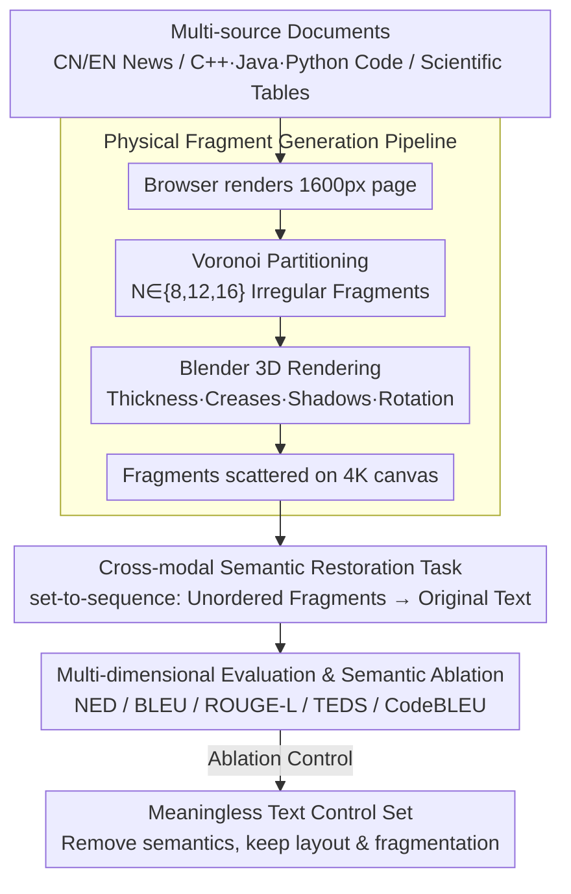

# ShredBench: Evaluating the Semantic Reasoning Capabilities of Multimodal LLMs in Document Reconstruction

**Conference**: ACL2026 Findings  
**arXiv**: [2604.23813](https://arxiv.org/abs/2604.23813)  
**Code**: https://github.com/ythere-y/ShredBench  
**Area**: Multimodal VLM / Document Understanding / Multimodal Reasoning  
**Keywords**: Document Reconstruction, MLLM Evaluation, Fragmented Documents, Semantic Reasoning, OCR Robustness

## TL;DR
ShredBench constructs an evaluation benchmark that requires multimodal large language models to restore content from "shredded" documents. The results demonstrate that while current MLLMs are proficient in conventional OCR, they generally lack the ability to integrate visual fragments, reading order, and semantic context for reasoning.

## Background & Motivation
**Background**: Multimodal large models have covered scenarios such as OCR, table parsing, information extraction, and visual question answering in document understanding tasks. Common evaluations mostly assume that input documents are clear, complete, and stable in layout. Models are only required to read text and parse layouts in high-resolution images to output structured content.

**Limitations of Prior Work**: Real-world document processing does not always involve perfect scans. Paper may be torn, obscured, folded, or shuffled. Models must not only recognize local text but also infer the sequential relationship between fragments. Existing OCR or document parsing benchmarks typically only measure "visibility" and rarely test the ability to "bridge broken visual evidence with linguistic common sense."

**Key Challenge**: Reconstructing fragmented documents lies between visual jigsaw puzzles and linguistic reasoning. Traditional jigsaws rely more on edge matching, whereas document fragments often feature black text on a white background with sparse boundary information. The truly usable clues are grammar, semantics, code structures, and 2D table layouts. Whether MLLMs can fuse these clues is a question that has not been systematically evaluated.

**Goal**: The authors aim to construct an automated, scalable evaluation set with controlled contamination risks, covering natural language, code, and tables. The goal is to observe how model capabilities degrade with the degree of structural destruction across different fragment counts.

**Key Insight**: The paper defines document restoration as a set-to-sequence task: the input is a set of unordered fragment images, and the output is the original document text. This preserves the complexity of visual inputs while allowing for repeatable evaluation using text similarity and structural metrics.

**Core Idea**: A controllable physical rendering pipeline is used to generate fragmented documents, forcing models to rely on cross-fragment semantic bridging rather than clean OCR or simple edge matching for restoration.

## Method

### Overall Architecture
The ShredBench workflow is divided into three steps. First, multi-source documents are collected, including English news, Chinese news, C++/Java/Python code, and scientific tables. Second, the original content is rendered into high-resolution pages, using Voronoi partitioning and 3D physical rendering to generate irregular fragments. Third, the scattered fragments are provided as a single visual input to the MLLM, which is tasked with outputting text or table content as close to the original document as possible.

The dataset contains 756 documents, each generated at three fragment granularities: 8, 12, and 16. The authors emphasize that data sources can be flexibly replaced with the latest or unseen text to mitigate the impact of training set contamination on evaluation validity.

### Key Designs

**1. Physical Fragment Generation Pipeline: Realistic tearing scars to prevent pixel-edge cheating**

Ordinary rectangular cropping preserves strong pixel continuity, allowing models to bypass semantic reasoning by aligning strokes on adjacent edges. ShredBench renders the generation process "physical": pages are rendered at 1600px width, then $N \in \{8,12,16\}$ Voronoi seed points are randomly sampled to cut the image into irregular fragments. Finally, Blender is used to add paper thickness, creases, shadows, and random rotations, outputting fragments scattered on a 4K canvas. Voronoi partitioning ensures irregular, non-parallel boundaries, while 3D rendering erases low-level pixel continuity clues. This forces models to rely on text, grammar, and layout semantics rather than edge matching.

**2. Cross-modal Semantic Restoration Task: Requiring correct text instead of coordinates**

If models were asked to explicitly predict the position of each fragment, the task would degenerate into a geometric puzzle. ShredBench defines it as set-to-sequence: given an unordered set of fragments $\mathcal{I}=\{f_1,\dots,f_N\}$, the model outputs text $\hat{T}$ consistent with the original document $D$. The implicit stitching capability is reflected by the final text quality. This task simultaneously imposes constraints from OCR, reading order, linguistic priors, code syntax, and 2D table layouts, exposing MLLM weaknesses in global reasoning more effectively than simple OCR.

**3. Multi-dimensional Evaluation & Semantic Ablation: Proving reliance on semantics over puzzles**

To distinguish between semantic reasoning and visual puzzling, standard text metrics (NED, BLEU, ROUGE-L) are used, with TEDS for tables and CodeBLEU for code. For diagnosis, a "meaningless text" control set is constructed by removing real semantics while keeping layout and character length constant. If models relied purely on visual edge matching, performance on meaningless text should not significantly degrade. However, the substantial performance drop observed in all models on the control set proves that their success relies primarily on semantic priors.

### Loss & Training
This paper does not propose a new training method but focuses on benchmarking. A unified zero-shot prompt is used during inference, instructing models to ignore physical noise and restore content verbatim. Temperature is set to 0 or the lowest supported value, and outputs undergo unified post-processing to ensure metrics reflect restoration quality rather than formatting noise.

## Key Experimental Results

### Main Results
The overall results show that Gemini 3 Pro and Gemini 3 Flash significantly lead, though even the strongest models degrade as the number of fragments increases. Open-source and specialized OCR models are generally weak at fragment restoration, indicating that "OCR capability" does not equate to "reconstruction capability."

| Model | 8-piece NED↓ / BLEU↑ / ROUGE↑ | 12-piece NED↓ / BLEU↑ / ROUGE↑ | 16-piece NED↓ / BLEU↑ / ROUGE↑ | Observation |
|------|---------------------------|----------------------------|----------------------------|------|
| Gemini 3 Pro | 0.33 / 0.51 / 0.83 | 0.37 / 0.48 / 0.81 | 0.41 / 0.44 / 0.76 | Best overall; degradation is relatively smooth as fragments increase |
| Gemini 3 Flash | 0.34 / 0.47 / 0.82 | 0.40 / 0.44 / 0.77 | 0.44 / 0.41 / 0.74 | Close to Pro; stronger in table scenarios |
| Qwen-VL-Plus | 0.59 / 0.26 / 0.58 | 0.63 / 0.22 / 0.53 | 0.65 / 0.20 / 0.50 | Moderate level; significant drop with more fragments |
| GLM-4.6v | 0.67 / 0.20 / 0.45 | 0.70 / 0.17 / 0.40 | 0.71 / 0.15 / 0.37 | Restores partial semantics; global order is unstable |
| DeepSeek-OCR | 0.86 / 0.02 / 0.12 | 0.87 / 0.01 / 0.09 | 0.87 / 0.01 / 0.10 | Specialized OCR almost fails on fragmented input |

Performance across document types is also insightful. In code, Java and C++ showed better average NED than Python, likely because explicit structures like braces and semicolons provided more anchor points. In table scenarios, Gemini 3 Flash (NED 0.49) outperformed Gemini 3 Pro (NED 0.59), suggesting that semantic-heavy models may not be optimal for rigid 2D layouts.

### Ablation Study
The semantic ablation confirms whether models are merely performing visual puzzling. 50 meaningless text documents were constructed, preserving layout, character length, and fragmentation, and evaluated under the 16-piece condition.

| Model | Real EN ROUGE↑ | Meaningless ROUGE↑ | ROUGE Drop | Real EN NED↓ | Meaningless NED↓ | Interpretation |
|------|----------------|-------------------|------------|---------------|------------------|------|
| Gemini 3 Pro | 0.73 | 0.33 | -0.40 | 0.35 | 0.65 | Strongest model relies heavily on semantic bridging |
| Gemini 3 Flash | 0.67 | 0.29 | -0.38 | 0.41 | 0.71 | Visual clues insufficient without semantics |
| Qwen-VL-Plus | 0.38 | 0.13 | -0.25 | 0.65 | 0.75 | Moderate models also show significant degradation |
| GLM-4.6v | 0.30 | 0.18 | -0.12 | 0.70 | 0.74 | Weak semantic utilization leads to smaller drop |
| GPT-5.1 | 0.15 | 0.08 | -0.07 | 0.80 | 0.81 | Overall weak restoration; small gap in control set |

### Key Findings
- Fragment count is a stable difficulty knob: Gemini 3 Pro's NED increased by only 0.08 from 8 to 16 pieces, while Qwen-VL-Plus increased by ~0.14, indicating smoother degradation for stronger models.
- Chinese news is more difficult than English news due to high information density (semantic loss when single characters are cut) and sensitivity of BLEU/ROUGE to Chinese segmentation boundaries.
- Code restoration failures primarily stem from line order errors and omitted content; narrow fragments are often ignored as visual noise.
- Semantic ablation shows models do not complete tasks via simple edge matching; without semantics, models converge to a similar low-performance range.

## Highlights & Insights
- This paper advances "document understanding robustness" from noise, blur, and rotation to the level of structural destruction. The task is natural and closer to real-world damaged document processing than traditional OCR benchmarks.
- The data generation pipeline is clever: using replaceable text sources to mitigate contamination, 3D rendering to weaken visual shortcuts, and three granularities to create a difficulty gradient.
- Analysis of code and tables shows that semantic reasoning is not a panacea. Code requires syntactic constraints and tables require 2D structural constraints; future models might need explicit structural search or constrained decoding.
- The "meaningless text" ablation provides the most critical insight: MLLM success depends heavily on linguistic priors, while pure visual stitching capability remains weak when semantics are removed.

## Limitations & Future Work
- Data remains synthetic; although physical rendering is used, real shredded paper may contain occlusions, folds, stains, material variations, and scan angle deviations.
- Evaluation focuses on final text similarity without explicitly assessing fragment ordering or geometric reconstruction, making it hard to distinguish if a model "stiches then reads" or "guesses while reading."
- Metrics for tables and code remain imperfect; string metrics penalize formatting differences, while structural metrics may not cover semantic equivalence.
- ShredBench could be combined with search-based reordering, OCR candidates, program syntax checkers, or table structure parsers to build stronger multi-stage restoration systems.

## Related Work & Insights
- **vs. OmniDocBench / WildDoc**: These benchmarks focus on complete document parsing or robustness in natural scenes; ShredBench completely shuffles input structure, emphasizing cross-fragment semantic bridging.
- **vs. Jigsaw-Puzzles / RePAIR**: Traditional reconstruction relies on visual or geometric matching; ShredBench focuses on semantic constraints from text, code, and tables.
- **vs. Pure OCR Models**: Models like DeepSeek-OCR and Hunyuan-OCR are strong in standard recognition but perform poorly on fragmented inputs, indicating that document restoration requires global reasoning modules.
- **Insight**: For automated research systems, "structural destruction robustness" should be a key evaluation dimension for document parsing models when dealing with paper scans, damaged tables, or low-quality PDFs.

## Rating
- Novelty: ⭐⭐⭐⭐☆ The benchmark task is novel and clearly defined, making it an excellent probe for MLLM semantic reasoning.
- Experimental Thoroughness: ⭐⭐⭐⭐⭐ Covers 756 documents, 4 scenarios, 3 granularities, and 14 models, supplemented by semantic ablation and code structure metrics.
- Writing Quality: ⭐⭐⭐⭐☆ The logic is smooth, and charts are information-dense.
- Value: ⭐⭐⭐⭐⭐ Directly valuable for document understanding, OCR robustness, multimodal reasoning, and real-world damaged document recovery.

<!-- RELATED:START -->

## Related Papers

- [\[NeurIPS 2025\] MME-VideoOCR: Evaluating OCR-Based Capabilities of Multimodal LLMs in Video Scenarios](../../NeurIPS2025/multimodal_vlm/mme-videoocr_evaluating_ocr-based_capabilities_of_multimodal_llms_in_video_scena.md)
- [\[ACL 2026\] TeXOCR: Advancing Document OCR Models for Compilable Page-to-LaTeX Reconstruction](texocr_advancing_document_ocr_models_for_compilable_page-to-latex_reconstruction.md)
- [\[CVPR 2026\] VisRes Bench: On Evaluating the Visual Reasoning Capabilities of VLMs](../../CVPR2026/multimodal_vlm/visres_bench_on_evaluating_the_visual_reasoning_capabilities_of_vlms.md)
- [\[ACL 2026\] SciMDR: Advancing Scientific Multimodal Document Reasoning](scimdr_advancing_scientific_multimodal_document_reasoning.md)
- [\[ACL 2025\] Chart-based Reasoning: Transferring Capabilities from LLMs to VLMs](../../ACL2025/multimodal_vlm/chart-based_reasoning_transferring_capabilities_from_llms_to_vlms.md)

<!-- RELATED:END -->
