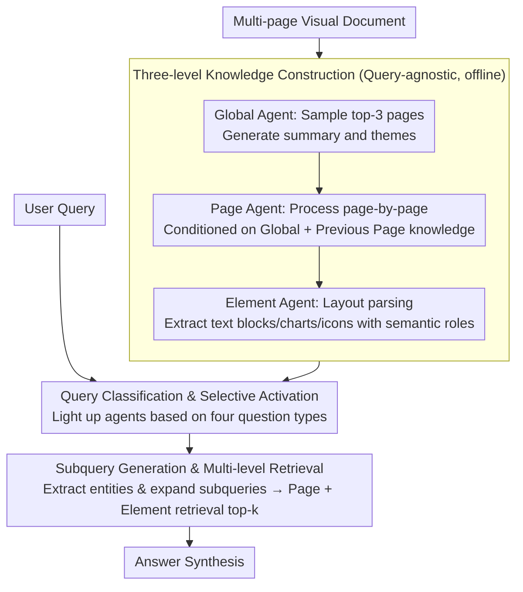

# SlideAgent: Hierarchical Agentic Framework for Multi-Page Visual Document Understanding

**Conference**: ACL 2026  
**arXiv**: [2510.26615](https://arxiv.org/abs/2510.26615)  
**Code**: [SlideAgent](https://SlideAgent.github.io/)  
**Area**: Information Retrieval / Document Understanding  
**Keywords**: Multi-page Document Understanding, Hierarchical Agents, Visual Document QA, Slide Understanding, Element-level Reasoning

## TL;DR

SlideAgent is proposed as a hierarchical agentic framework that constructs structured knowledge representations via three specialized agents—global, page, and element—to significantly enhance fine-grained understanding of multi-page visual documents, particularly slides.

## Background & Motivation

**Background**: Multi-page visual documents (e.g., financial reports, academic presentations, technical manuals) are prevalent in high-stakes domains like finance, science, and education. These documents convey information not only through text but also through layout, icons, color coding, and cross-page references.

**Limitations of Prior Work**: Current multimodal large language models (MLLMs) face three major challenges when processing multi-page visual documents: (1) **Insufficient fine-grained reasoning** — MLLMs tend to process pages holistically, ignoring element-level details (e.g., specific data segments in charts); (2) **Lack of domain-specific visual semantics** — Pre-training is primarily based on natural images, leading to inadequate understanding of professional charts, icon meanings, and spatial layouts in documents; (3) **Reliance on metadata** — Many systems depend on clean document metadata (e.g., chart bounding boxes, hierarchical labels), which is often missing or corrupted in real-world scenarios.

**Key Challenge**: MLLMs may fail during holistic reasoning on a full page (e.g., miscounting categories in a chart) but can correctly identify information once the relevant chart is cropped. This suggests that the models possess reasoning capabilities but lack an effective mechanism for fine-grained information extraction.

**Goal**: To build a universal agent framework capable of processing multi-page multimodal documents without relying on document metadata, achieving precise document understanding through hierarchical knowledge construction and selective agent activation.

**Core Idea**: Inspired by human information processing models, document understanding is decomposed into three levels: global (overall theme), page (single-page features + cross-page relationships), and element (fine-grained parsing of charts/text blocks/icons). Each level is equipped with a specialized agent that collaborates during the knowledge construction and reasoning stages.

## Method

### Overall Architecture

SlideAgent operates in two phases: (1) **Knowledge construction phase** — Top-down construction of a hierarchical, query-agnostic knowledge base $\mathcal{K}=\{\mathcal{K}_g, \mathcal{K}_p, \mathcal{K}_e\}$; (2) **Reasoning phase** — Classifying user queries and selectively activating corresponding level agents for multi-level retrieval and answer synthesis. The framework is model-agnostic and can be paired with different backbones such as GPT-4o or InternVL3-8B.

### Key Designs

**1. Three-level Knowledge Construction: Decomposing documents into Global-Page-Element layers with specialized agents for offline indexing**

MLLMs often miss element-level details during full-page processing, but succeed when elements are cropped—indicating a need for fine-grained extraction rather than improved reasoning. SlideAgent constructs a query-agnostic hierarchical knowledge base $\mathcal{K}=\{\mathcal{K}_g, \mathcal{K}_p, \mathcal{K}_e\}$. The Global agent $\mathcal{M}_g$ samples the first three pages to generate document-level summaries and themes. The Page agent $\mathcal{M}_p$ processes pages sequentially, conditioned on global and previous page knowledge: $\mathcal{K}_p^i = \mathcal{M}_p(v_i, \mathcal{K}_g^{(0)}, \mathcal{K}_p^{i-1})$, thereby incorporating sequential context and cross-page associations. The Element agent $\mathcal{M}_e$ uses layout parsing to decompose each page into text blocks, charts, and icons, assigning semantic roles and functional descriptions to each. These three layers are complementary: Global provides the thematic framework, Page ensures cross-page coherence, and Element offers fine-grained spatial and content detail.

**2. Query Classification & Selective Activation: Determining required information levels to activate only relevant agents**

The required granularity varies significantly across different questions; activating all three levels for every query is computationally expensive and introduces noise. SlideAgent first classifies queries into four categories: global understanding (activates Global agent), factual queries (activates Page + Element agents), multi-hop reasoning (activates all), and layout/visual relationship queries (activates Element agent). Unclassified queries default to activating all levels. This approach balances efficiency and accuracy by using a lightweight setup for simple questions and the full hierarchy for complex ones.

**3. Subquery Generation & Multi-level Retrieval: Expanding short queries into multiple subqueries for precise page and element level retrieval**

Original user queries are often short, leading to insufficient semantic coverage and high noise during retrieval, especially for multi-hop questions where key evidence pages might be missed. SlideAgent extract key entities from the query to generate several subqueries, then performs a joint retrieval of top-k pages and their elements using the original and subqueries. Retrievers can include sparse BM25, dense SFR, or multimodal COLPALI. Subqueries broaden the semantic search space of a general question into specific targets, yielding the most significant gains in multi-hop scenarios.

### Mechanism: A multi-hop cross-page query example

Taking a typical multi-hop query like "How much did Q3 revenue grow compared to Q1?" as an example:

- **Knowledge Construction (Offline, query-agnostic)**: The Global agent identifies the document as a "company financial report." The Page agent notes that "Page 4 contains a Q1 revenue bar chart" and "Page 9 contains a Q3 revenue table." The Element agent parses specific bar charts, tables, and numerical annotations on these pages.
- **Query Classification**: The system identifies this as multi-hop reasoning and activates all agents.
- **Subquery Generation**: Entities are extracted to form "What is the Q1 revenue?" and "What is the Q3 revenue?"
- **Multi-level Retrieval**: The original and subqueries jointly retrieve Page 4, Page 9, and their respective revenue elements.
- **Answer Synthesis**: The model reads specific values from the retrieved elements, performs the subtraction and percentage calculation, and provides the answer. While a whole-page approach might miscount or confuse the two pages, the element-level decomposition ensures accuracy.

### Loss & Training

A training-free approach is adopted—all agents are implemented via prompt engineering based on existing MLLMs. During the knowledge construction phase, carefully designed prompt templates guide the agents to generate structured knowledge. Global knowledge is refined through a step involving a single rewrite of all fields to ensure global information is synthesized from all pages, reducing bias towards initial pages.

## Key Experimental Results

### Main Results

| Dataset | Metric | SlideAgent (GPT-4o) | GPT-4o | Gain |
|---------|--------|---------------------|----------|-------|
| SlideVQA | Overall | 84.9 | 77.0 | +7.9% |
| TechSlides | Overall | 70.9 | 63.4 | +7.5% |
| FinSlides | Overall | 85.5 | 80.0 | +5.5% |
| InfoVQA | Overall | 79.6 | 69.0 | +10.6% |
| SlideVQA (InternVL3) | Overall | 72.7 | 63.0 | +9.8% |

### Ablation Study

| Setting | Key Metric (Overall) | Description |
|---------|-----------------------|-------------|
| w/o Page Agent | -6.3 (GPT-4o) | Largest drop; page-level reasoning is vital for cross-page coherence |
| w/o Element Agent | -4.6 (GPT-4o) | Fine-grained reasoning is crucial for numerical questions |
| w/o Global Agent | -2.8 (GPT-4o) | Smallest drop; lower-level agents partially embed global context |
| w/o Subquery | -5.0 (GPT-4o) | Significantly impacts retrieval-heavy scenarios |

### Key Findings
- Hierarchical knowledge construction improves not only QA performance but also page-level retrieval (the text retriever SFR achieved a +6.4 MRR gain).
- Multi-hop reasoning queries gained the most (+9.8%), proving the value of structured knowledge guidance for complex reasoning.
- Even in an oracle setting (providing ground-truth pages), a +7.7% gain was observed, indicating the independent value of element-level retrieval.
- Only 12.5% of errors were attributed to OCR/parsing failures; most errors stemmed from query ambiguity or ground-truth annotation issues.

## Highlights & Insights
- **Hierarchical Divide-and-Conquer Strategy**: Adopting a "Global-Page-Element" model mirrors human cognition, making it both intuitive and modular for engineering extensions.
- **Training-free, Plug-and-Play Design**: Entirely based on prompt engineering and existing MLLMs, allowing direct application to any backbone model.
- **Necessity of Element-level Reasoning**: Intuitive case studies demonstrate that MLLMs fail at whole-page reasoning but succeed after element-level cropping.
- **Knowledge Construction Benefits Retrieval**: Generated structured knowledge (page descriptions and subqueries) serves as an enhancement signal for retrieval.
- **Model Agnostic**: Consistent and significant improvements across diverse backbones like GPT-4o and InternVL3-8B.

## Limitations & Future Work
- Element boundaries depend on OCR and layout parsing tools; quality varies by tool.
- Global knowledge initialization only samples the first three pages, which may under-represent long documents; content-based page selection could be explored.
- Primarily uses text retrievers (SFR); the potential of multimodal retrievers remains to be fully explored.
- Multi-turn dialogue scenarios are not addressed; extending to interactive document QA is a key direction.
- High computational overhead in the construction phase due to individual MLLM calls per page.

## Related Work & Insights
- **vs ViDoRAG**: While both use multi-agent architectures, SlideAgent’s three-level design and element-level parsing are more granular, outperforming it across all datasets.
- **vs VDocRAG**: VDocRAG combines retrieval and reasoning but lacks element-level decomposition; SlideAgent shows a clear advantage in numerical reasoning (Num).
- **vs COLPALI**: A pure multimodal retrieval method; SlideAgent demonstrates that the combination of text retrieval and structured knowledge can rival or exceed multimodal retrieval.

## Rating
- Novelty: ⭐⭐⭐⭐ Combination of hierarchical agents and element-level reasoning is novel in the document understanding field.
- Experimental Thoroughness: ⭐⭐⭐⭐⭐ 4 datasets, 15+ baselines, and exhaustive ablation/error analysis.
- Writing Quality: ⭐⭐⭐⭐ Clear structure, intuitive case studies, and rigorous method descriptions.
- Value: ⭐⭐⭐⭐ Highly versatile framework with direct application value for enterprise document understanding.

<!-- RELATED:START -->

## Related Papers

- [\[ACL 2026\] TeXOCR: Advancing Document OCR Models for Compilable Page-to-LaTeX Reconstruction](texocr_advancing_document_ocr_models_for_compilable_page-to-latex_reconstruction.md)
- [\[CVPR 2026\] VCU-Bridge: Hierarchical Visual Connotation Understanding via Semantic Bridging](../../CVPR2026/multimodal_vlm/vcu-bridge_hierarchical_visual_connotation_understanding_via_semantic_bridging.md)
- [\[CVPR 2026\] Mimic Human Cognition, Master Multi-Image Reasoning: A Meta-Action Framework for Enhanced Visual Understanding](../../CVPR2026/multimodal_vlm/mimic_human_cognition_master_multi-image_reasoning_a_meta-action_framework_for_e.md)
- [\[CVPR 2025\] MARTEN: Visual Question Answering with Mask Generation for Multi-Modal Document Understanding](../../CVPR2025/multimodal_vlm/marten_visual_question_answering_with_mask_generation_for_multi-modal_document_u.md)
- [\[CVPR 2026\] Agentic Video Summarization via Self-Reflecting Multimodal Understanding](../../CVPR2026/multimodal_vlm/agentic_video_summarization_via_self-reflecting_multimodal_understanding.md)

<!-- RELATED:END -->
