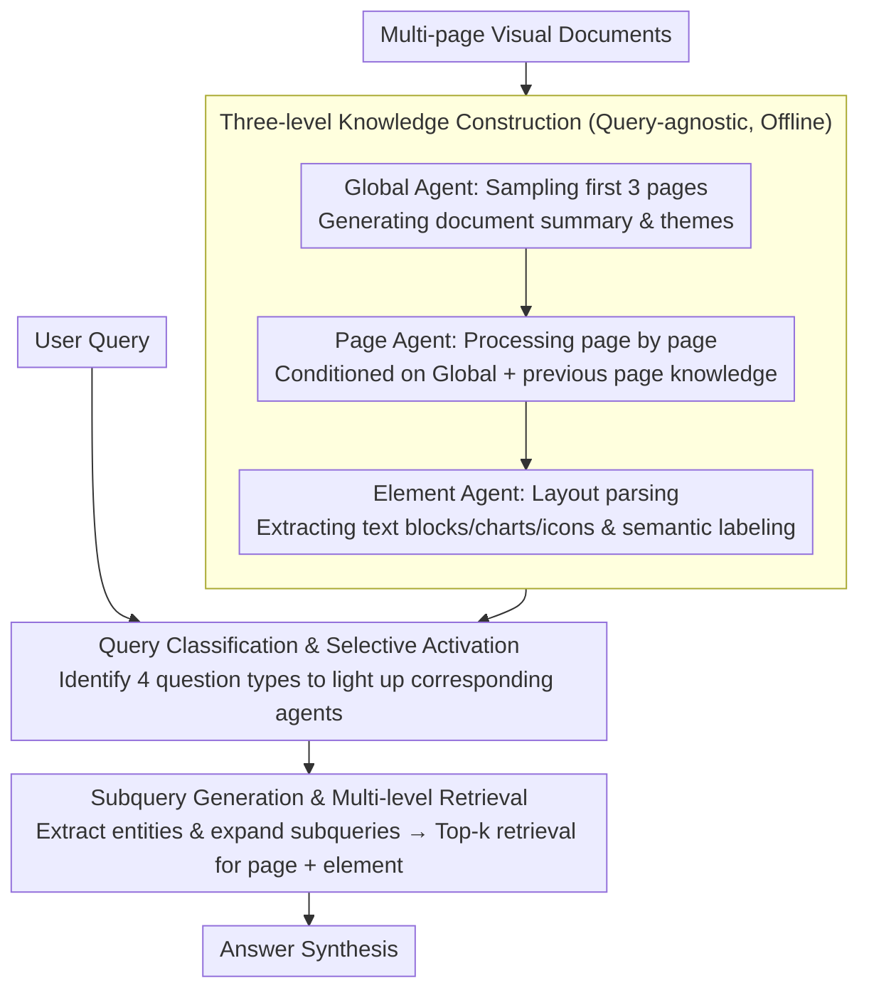

# SlideAgent: Hierarchical Agentic Framework for Multi-Page Visual Document Understanding

**Conference**: ACL 2026  
**arXiv**: [2510.26615](https://arxiv.org/abs/2510.26615)  
**Code**: [SlideAgent](https://SlideAgent.github.io/)  
**Area**: Information Retrieval / Document Understanding  
**Keywords**: Multi-page document understanding, hierarchical agents, visual document QA, slide understanding, element-level reasoning

## TL;DR

Ours proposes SlideAgent, a hierarchical agentic framework that constructs structured knowledge representations through three levels of specialized agents (global, page, and element), significantly enhancing the fine-grained understanding of multi-page visual documents, particularly slides.

## Background & Motivation

**Background**: Multi-page visual documents (e.g., financial reports, academic presentations, and technical manuals) are prevalent in high-stakes fields such as finance, science, and education. These documents rely not only on text but also on layout, icons, color coding, and cross-page references to convey information.

**Limitations of Prior Work**: Current Multimodal Large Language Models (MLLMs) face three major challenges when processing multi-page visual documents: (1) **Insufficient fine-grained reasoning** — MLLMs tend to process each page holistically, ignoring element-level details (e.g., specific data segments in a chart); (2) **Lack of domain-specific visual semantics** — pre-training is primarily based on natural images, resulting in an inadequate understanding of professional charts, icon meanings, and spatial layouts in documents; (3) **Reliance on metadata** — many systems depend on clean document metadata (such as chart bounding boxes or hierarchical labels), which are often missing or corrupted in real-world scenarios.

**Key Challenge**: MLLMs may fail during holistic reasoning on a full page (e.g., miscounting categories in a chart) but can correctly identify information when the relevant chart is cropped out—this indicates that models possess reasoning capabilities but lack an effective mechanism for fine-grained information extraction.

**Goal**: To build a general agentic framework capable of processing multi-page multimodal documents without relying on document metadata, achieved through hierarchical knowledge construction and selective agent activation for precise document understanding.

**Core Idea**: Drawing inspiration from human information processing models, document understanding is decomposed into three levels: global (overall theme), page (single-page features + cross-page relationships), and element (fine-grained parsing of charts, text blocks, and icons). Specialized agents are assigned to each level to collaborate during both the knowledge construction and reasoning phases.

## Method

### Overall Architecture

SlideAgent operates in two phases: (1) **Knowledge Construction Phase** — top-down construction of a hierarchical, query-agnostic knowledge base $\mathcal{K}=\{\mathcal{K}_g, \mathcal{K}_p, \mathcal{K}_e\}$; (2) **Reasoning Phase** — classifying user queries and selectively activating corresponding levels of agents for multi-level retrieval and answer synthesis. This framework is model-agnostic and can be paired with various backbones such as GPT-4o or InternVL3-8B.

### Key Designs

**1. Three-level Knowledge Construction: Decomposing documents into Global-Page-Element layers with specialized agents for offline indexing**

MLLMs often overlook element-level details during full-page processing (e.g., miscounting items in a chart), yet they succeed when the specific chart is cropped—suggesting the bottleneck is fine-grained extraction rather than reasoning. SlideAgent addresses this by constructing a query-agnostic hierarchical knowledge base $\mathcal{K}=\{\mathcal{K}_g, \mathcal{K}_p, \mathcal{K}_e\}$ from the top down. The global agent $\mathcal{M}_g$ samples the first three pages to generate document-level summaries and themes. The page agent $\mathcal{M}_p$ processes pages sequentially, conditioned on global and previous page knowledge, $\mathcal{K}_p^i = \mathcal{M}_p(v_i, \mathcal{K}_g^{(0)}, \mathcal{K}_p^{i-1})$, to capture sequential context and cross-page associations. Finally, the element agent $\mathcal{M}_e$ utilizes layout parsing to decompose each page into text blocks, charts, and icons, assigning semantic roles and functional descriptions to each. These three layers are complementary: global provides thematic context, page ensures cross-page coherence, and element offers fine-grained spatial and content detail.

**2. Query Classification & Selective Activation: Identifying the required information granularity to activate specific agents**

Different questions require vastly different levels of granularity. Activating all levels for every query is computationally expensive and introduces noise from irrelevant layers. SlideAgent classifies queries into four categories: global understanding (Global Agent only), factual queries (Page + Element Agents), multi-hop reasoning (all levels), and layout/visual relationship queries (Element Agent only). A fallback mechanism activates all levels if the query is ambiguous. This achieves a balance between efficiency and accuracy by using the full hierarchy only when necessary.

**3. Subquery Generation & Multi-level Retrieval: Expanding short queries into subqueries for precise page and element retrieval**

Original user queries are often brief, leading to insufficient semantic coverage and noise, particularly for multi-hop questions where key evidence might be missed. SlideAgent extracts key entities to generate several subqueries, then combines the original query with these subqueries for joint top-k retrieval of pages and their elements. This process can utilize sparse (BM25), dense (SFR), or multimodal (COLPALI) retrievers. Subquery generation decomposes the semantics of a broad question into specific targets, yield significant gains in multi-hop scenarios requiring evidence from multiple pages.

### A Complete Example: Answering a Multi-hop Cross-page Question

Consider a typical multi-hop query: "How much did Q3 revenue grow compared to Q1?"

- **Knowledge Construction (Offline)**: The global agent identifies the document as a corporate financial report. The page agent notes that "Page 4 contains a Q1 revenue bar chart" and "Page 9 contains a Q3 revenue table." The element agent parses the bar chart, tables, and numerical labels as semantic-rich elements.
- **Query Classification**: The system identifies this as multi-hop reasoning and activates all three levels.
- **Subquery Generation**: Entities are extracted to form subqueries like "What is the Q1 revenue?" and "What is the Q3 revenue?"
- **Multi-level Retrieval**: The combined query and subqueries retrieve Page 4 and Page 9, along with their respective revenue elements.
- **Answer Synthesis**: The model extracts specific values from the retrieved elements at each page and calculates the growth percentage. While a model might miscount or confuse pages when asked holistically, it remains robust after being narrowed down to the element level.

### Loss & Training

Ours adopts a training-free approach—all agents are implemented via prompt engineering based on existing MLLMs, requiring no additional training or fine-tuning. During knowledge construction, carefully designed prompt templates guide agents to generate structured knowledge. Global knowledge incorporates a refine step (a single full-field rewrite) to synthesize information from all pages, reducing bias towards the initial pages.

## Key Experimental Results

### Main Results

| Dataset | Metric | SlideAgent (GPT-4o) | GPT-4o | Gain |
|--------|------|------|----------|------|
| SlideVQA | Overall | 84.9 | 77.0 | +7.9% |
| TechSlides | Overall | 70.9 | 63.4 | +7.5% |
| FinSlides | Overall | 85.5 | 80.0 | +5.5% |
| InfoVQA | Overall | 79.6 | 69.0 | +10.6% |
| SlideVQA (InternVL3) | Overall | 72.7 | 63.0 | +9.8% |

### Ablation Study

| Configuration | Key Metric (Overall) | Description |
|------|---------|------|
| w/o Page Agent | -6.3 (GPT-4o) | Largest drop; page-level reasoning is vital for cross-page coherence. |
| w/o Element Agent | -4.6 (GPT-4o) | Fine-grained reasoning is critical for numerical questions. |
| w/o Global Agent | -2.8 (GPT-4o) | Smallest drop, as low-level agents already embed some global context. |
| w/o Subquery | -5.0 (GPT-4o) | Impact is particularly significant in retrieval scenarios. |

### Key Findings
- Hierarchical knowledge construction not only boosts QA performance but also significantly improves page-level retrieval (the SFR text retriever achieves +6.4 MRR).
- Multi-hop reasoning queries see the largest improvement (+9.8%), demonstrating the value of structured knowledge guidance for complex reasoning.
- In an oracle setting providing ground-truth pages, there is still a +7.7% improvement, indicating that element-level retrieval has independent value.
- Only 12.5% of errors are attributable to OCR/parsing failures; most errors arise from query ambiguity or answer labeling issues.

## Highlights & Insights
- **Hierarchical Divide-and-Conquer**: Modeling after human cognition (Global-Page-Element) is both systematic and intuitive, facilitating modular engineering extensions.
- **Training-free, Plug-and-play Design**: Entirely based on prompt engineering and existing MLLMs, making it directly applicable to any backbone model.
- **Necessity of Element-level Reasoning**: Intuitive case studies demonstrate how MLLMs fail at holistic reasoning but succeed after element-level cropping, providing a compelling argument for the approach.
- **Knowledge Construction for Retrieval**: Generated structured knowledge (page descriptions and subqueries) serves dual purposes: QA reasoning and as an enhancement signal for retrieval.
- **Model Agnosticism**: Consistent and significant improvements are observed across distinct backbones (GPT-4o and InternVL3-8B).

## Limitations & Future Work
- Element boundaries rely on OCR and layout parsing tools; quality may vary based on the specific tool used.
- Global knowledge initialization only samples the first three pages, which may not be representative for long documents; future work could explore content-based page selection.
- Primarily uses text-based retrievers (SFR); the potential of multimodal retrievers remains to be fully explored.
- Currently does not handle multi-turn dialogue; extending to interactive document QA is a key direction.
- The knowledge construction phase involves high computational overhead, requiring MLLM calls for every page.

## Related Work & Insights
- **vs ViDoRAG**: While ViDoRAG also uses a multi-agent architecture, SlideAgent's three-level hierarchical design and element-level parsing are more detailed, achieving superior performance across all datasets.
- **vs VDocRAG**: VDocRAG combines retrieval and reasoning but lacks element-level decomposition; SlideAgent shows a particularly strong advantage in numerical reasoning (Num).
- **vs COLPALI**: As a pure multimodal retrieval method, SlideAgent demonstrates that the combination of text retrieval and structured knowledge can rival or even surpass purely multimodal approaches.

## Rating
- Novelty: ⭐⭐⭐⭐ The combination of hierarchical agents and element-level reasoning is relatively novel in document understanding.
- Experimental Thoroughness: ⭐⭐⭐⭐⭐ 4 datasets, 15+ baseline models, and exhaustive ablation/error analysis.
- Writing Quality: ⭐⭐⭐⭐ Clear structure, intuitive case studies, and rigorous methodology description.
- Value: ⭐⭐⭐⭐ Strong framework universality with direct application value for enterprise-level document understanding scenarios.

<!-- RELATED:START -->

## Related Papers

- [\[CVPR 2026\] M3DocDep: Multi-modal, Multi-page, Multi-document Dependency Chunking with Large Vision-Language Models](../../CVPR2026/multimodal_vlm/m3docdep_multi-modal_multi-page_multi-document_dependency_chunking_with_large_vi.md)
- [\[ACL 2026\] TeXOCR: Advancing Document OCR Models for Compilable Page-to-LaTeX Reconstruction](texocr_advancing_document_ocr_models_for_compilable_page-to-latex_reconstruction.md)
- [\[ACL 2026\] GameplayQA: A Benchmarking Framework for Decision-Dense POV-Synced Multi-Video Understanding of 3D Virtual Agents](gameplayqa_a_benchmarking_framework_for_decision-dense_pov-synced_multi-video_un.md)
- [\[ACL 2026\] Prune-then-Merge: Towards Efficient Multi-Vector Visual Document Retrieval](sculpting_the_vector_space_towards_efficient_multi-vector_visual_document_retrie.md)
- [\[CVPR 2026\] VCU-Bridge: Hierarchical Visual Connotation Understanding via Semantic Bridging](../../CVPR2026/multimodal_vlm/vcu-bridge_hierarchical_visual_connotation_understanding_via_semantic_bridging.md)

<!-- RELATED:END -->
