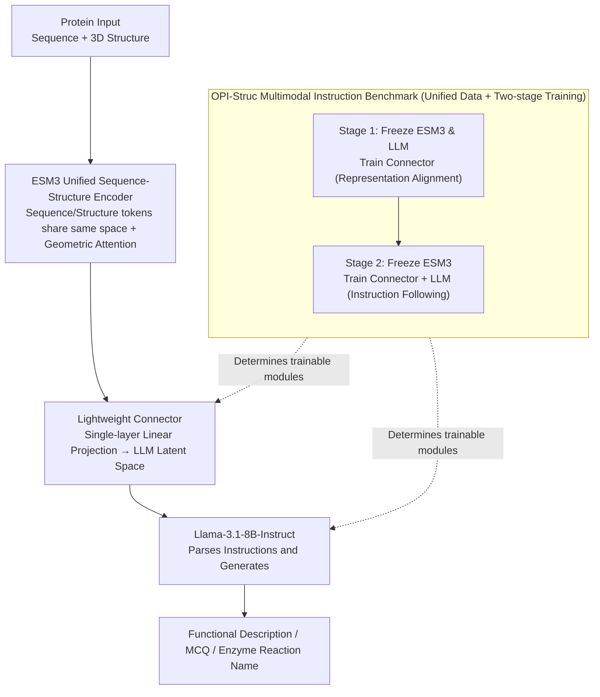

# STELLA: A Multimodal LLM for Protein Functional Annotation via Unified Sequence-Structure Encoding

**Conference**: ACL2026 Findings  
**arXiv**: [2506.03800](https://arxiv.org/abs/2506.03800)  
**Code**: https://github.com/ocx-lab/STELLA  
**Area**: Multimodal VLM / Protein Functional Annotation  
**Keywords**: Protein Functional Annotation, Multimodal LLM, ESM3, Structure-Sequence Encoding, OPI-Struc

## TL;DR
STELLA integrates the unified sequence-structure protein representations of ESM3 into Llama-3.1-8B-Instruct. Through two-stage multimodal instruction tuning, it performs protein functional description and enzyme catalytic reaction prediction, setting new benchmarks for functional annotation on the OPI-Struc series.

## Background & Motivation
**Background**: The core chain in protein research consists of sequence, structure, and function. While structural prediction and databases have expanded rapidly in recent years, a large number of proteins still lack high-quality functional annotations. Protein language models (pLMs) can learn representations from sequences or structures, while LLMs excel at expressing knowledge in natural language.

**Limitations of Prior Work**: Many protein-text models require separate sequence encoders, structure encoders, and additional fusion modules, leading to complex architectures and unstable optimization. Furthermore, most pLMs perform well only on latent representations or specific attribute predictions, lacking generative capabilities for natural language functional descriptions.

**Key Challenge**: Protein functional annotation requires simultaneous understanding of structural geometry, sequence context, and textual knowledge. Pure pLMs are not adept at generating detailed explanations, while pure LLMs lack protein structure inputs; multi-encoder fusion schemes can access multiple modalities but suffer from high system complexity and cross-modal alignment costs.

**Goal**: The authors aim to build a more concise protein multimodal LLM: using a unified sequence-structure encoder to represent protein inputs, connected via a lightweight connector to a general-purpose instruction-following LLM. This enables the model to output reliable text or categorical judgments for both functional description and enzyme function prediction tasks.

**Key Insight**: The paper selects ESM3 as the unified protein encoder because it naturally organizes sequence, structure, and function-related token tracks within the same representation space; Llama-3.1-8B-Instruct is then utilized for natural language generation and instruction following.

**Core Idea**: Transfer the "encoder + connector + LLM" paradigm from vision-language models to protein functional annotation. By using ESM3 for unified protein sequence-structure representation, the cost of multi-encoder fusion is reduced, and multimodal instruction tuning is supported through the OPI-Struc benchmark.

## Method

### Overall Architecture
This note summarizes STELLA from the perspective of the computational model and benchmark. The architecture of STELLA resembles LLaVA: a protein encoder encodes sequence-structure information into high-dimensional representations, a linear modality connector maps these representations to the LLM's latent space, and Llama-3.1-8B-Instruct generates functional descriptions or prediction results based on natural language instructions.

Training employs two-stage Multimodal Instruction Tuning. In Stage 1, ESM3 and the LLM are frozen, and only the connector is trained for cross-modal representation alignment. In Stage 2, ESM3 remains frozen while the connector and LLM are trained, enabling the model to follow protein-related natural language instructions and complete task outputs. Use is made of the carefully constructed OPI-Struc data resource for both stages, with different optimization objectives and trainable modules.

### Key Designs

**1. ESM3 Unified Sequence-Structure Encoder: Handling sequence and 3D structure with a single protein foundation model**

Traditional protein-text schemes often require separate sequence and structure encoders, along with additional fusion modules, leading to fragmented architectures and high alignment costs. STELLA directly uses ESM3 (`esm3_sm_open_v1`) as the sole protein encoder. It organizes multiple modality token tracks into the same embedding space and introduces geometric attention in early transformer blocks to capture structural topology and local spatial relationships. Consequently, sequence context and structural geometry are aligned before entering the language model, allowing the connector to focus solely on the "protein representation $\rightarrow$ text space" mapping.

**2. Lightweight Connector and LLM Generation Head: Translating protein representations into LLM-consumable inputs**

Protein representations and the latent space of language models are not naturally compatible. The authors use a single-layer linear projection as the modality connector to map ESM3 outputs to LLM input representations. Llama-3.1-8B-Instruct then handles task instruction parsing and the output of functional narratives or classification answers. By keeping the "bridge" lightweight and relying on a strong instruction-tuned LLM for reasoning, the model compensates for the generative shortcomings of traditional pLMs.

**3. OPI-Struc Multimodal Instruction Benchmark: Providing unified resources for "Protein Structure $\rightarrow$ Text"**

To address the scarcity of high-quality protein-text instruction data, OPI-Struc divides tasks into Function and Enzyme domains. The Function domain includes free-text descriptions and multiple-choice functional recognition, while the Enzyme domain focuses on standard name prediction for catalytic functions. The evaluation set covers FP_ft_eval, the out-of-time FP_ft_eval_v2401, FP_mc_eval_1x, FP_mc_eval_4x, and EP_eval. Including both MCQA and enzyme accuracy provides objective signals unaffected by phrasing differences.

### Loss & Training
The focus is on multimodal instruction tuning rather than new loss functions. Stage 1 updates only the connector, while Stage 2 updates the connector and the LLM with distinct learning rates. Textual similarity and semantic consistency for FP tasks are measured using BLEU-4, BERTScore, and ROUGE-1/2/L. Accuracy serves as the objective metric for FP-MCQA and EP tasks.

## Key Experimental Results

### Main Results
In the hold-out evaluation for functional description, STELLA significantly outperforms the Foldseek retrieval baseline, Prot2Text, and ProteinChat.

| Method | BLEU-4 | BERTScore | ROUGE-1 | ROUGE-2 | ROUGE-L |
|------|--------|-----------|---------|---------|---------|
| Foldseek | 0.3627 | 0.8358 | 0.4799 | 0.4027 | 0.4586 |
| Prot2TextBASE | 0.3511 | 0.8430 | 0.5059 | 0.4271 | 0.4849 |
| Prot2TextLARGE | 0.3629 | 0.8520 | 0.5368 | 0.4560 | 0.5140 |
| ProteinChat | 0.1918 | 0.7970 | 0.3957 | 0.2799 | 0.3648 |
| STELLA (e3+e6) | 0.4300 | 0.8564 | 0.5423 | 0.4747 | 0.5257 |

In the structural degradation robustness evaluation, STELLA's ROUGE-L decline is smaller than that of Prot2TextLARGE, indicating the unified representation is more stable against incomplete inputs.

| Model | Complete ROUGE-L | Incomplete ROUGE-L | Gain (Drop) |
|------|------------------|--------------------|----------|
| Prot2TextLARGE | 0.5140 | 0.4438 | -13.7% |
| STELLA (e3+e3) | 0.5041 | 0.4805 | -4.7% |
| STELLA (e3+e6) | 0.5257 | 0.4915 | -4.1% |

On the enzyme catalytic reaction prediction task (EP_eval), STELLA reaches a new level of accuracy.

| Method | Accuracy |
|------|----------|
| UniRep | 72.90 |
| 3DCNN | 78.80 |
| IEConv | 87.20 |
| CDConv | 88.50 |
| GearNet-Multiview-Contrast | 87.50 |
| Sable | 88.50 |
| STELLA (e3+e3) | 88.06 |
| STELLA (e3+e6) | 88.85 |

### Ablation Study
Comparisons of encoders, LLM backbones, and training stages show that performance stems from the synergy of the unified encoder, the appropriate LLM, and the two-stage training.

| Variant | BLEU-4 | BERTScore | ROUGE-1 | ROUGE-2 | ROUGE-L | Insight |
|------|--------|-----------|---------|---------|---------|------|
| STELLA-ESM3-Llama-3.1-8B | 0.4024 | 0.8496 | 0.5218 | 0.4487 | 0.5041 | ESM3 + Llama-3.1 is strongest |
| STELLA-ESM3-Llama-3-8B | 0.4020 | 0.8503 | 0.5138 | 0.4478 | 0.5001 | Close but slightly lower |
| STELLA-ESM3-Phi-3-mini | 0.3807 | 0.8435 | 0.4991 | 0.4273 | 0.4839 | Smaller head is weaker |
| STELLA-Prot2Text-Llama-3.1-8B | 0.4009 | 0.8497 | 0.5284 | 0.4454 | 0.5031 | Prot2Text encoder is strong but inferior |
| STELLA-SaProt-Llama-3-8B | 0.3588 | 0.8276 | 0.4685 | 0.3965 | 0.4523 | SaProt configuration is significantly weaker |

Two-stage training outperforms single-stage training, particularly in ROUGE-L and BLEU-4.

| Strategy | Stage 1 epoch | Stage 2 epoch | BLEU-4 | BERTScore | ROUGE-1 | ROUGE-2 | ROUGE-L |
|------|---------------|---------------|--------|-----------|---------|---------|---------|
| Single-stage | - | e1 | 0.2233 | 0.7885 | 0.3530 | 0.2631 | 0.3350 |
| Single-stage | - | e3 | 0.3642 | 0.8363 | 0.4840 | 0.4073 | 0.4660 |
| Two-stage | e3 | e1 | 0.2653 | 0.8065 | 0.3938 | 0.3097 | 0.3770 |
| Two-stage | e3 | e3 | 0.4024 | 0.8496 | 0.5218 | 0.4487 | 0.5041 |

Out-of-time (OOD) evaluation shows a significant performance drop for all methods, indicating that recently annotated proteins remain a difficult scenario.

| Model | BLEU-4 | BERTScore | ROUGE-1 | ROUGE-2 | ROUGE-L |
|------|--------|-----------|---------|---------|---------|
| STELLA-ESM3-Llama-3.1-8B | 0.0489 | 0.7565 | 0.2210 | 0.1085 | 0.1867 |
| STELLA-Prot2Text-Llama-3.1-8B | 0.0425 | 0.7555 | 0.2454 | 0.1020 | 0.1919 |
| STELLA-Prot2Text-Mistral-7B | 0.0440 | 0.7685 | 0.2529 | 0.1046 | 0.1975 |
| ProteinChat | 0.0205 | 0.7413 | 0.2121 | 0.0855 | 0.1691 |

### Key Findings
- STELLA achieves a ROUGE-L of 0.5257 on the FP hold-out, outperforming Prot2TextLARGE (0.5140) and surpassing the Foldseek retrieval baseline by 14.6%.
- In FP-MCQA, STELLA reaches 80.56 and 76.18 accuracy for fixed and permuted options respectively, showing it can perform discriminative functional selection.
- In EP_eval, extending Stage 2 training increased accuracy from 88.06 to 88.85, exceeding CDConv and Sable (88.50).
- Higher structural homology leads to more accurate descriptions; ROUGE-L rises from 0.4323 for near-unique structures to 0.6691 for high-density clusters, confirming OOD structures as a core challenge.

## Highlights & Insights
- The primary highlight is architectural simplification: using ESM3 to unifiedly host sequence and structure avoids complex fusion of multiple encoders.
- OPI-Struc systematically evaluates protein multimodal LLMs by integrating free text, MCQs, and enzyme prediction under one benchmark.
- The two-stage training design aligns with multimodal LLM best practices: aligning representations first, then training instruction following to reduce the risk of overfitting text patterns too early.
- The OOD results are transparent: while hold-out results are strong, temporal evaluation shows a sharp decline, suggesting that current models cannot yet generalize perfectly to new knowledge.

## Limitations & Future Work
- Performance is constrained by structural tokenization granularity and the difficulty of aligning high-dimensional geometric features with discrete text tokens.
- The model relies heavily on the general LLM's knowledge; it may lack fine-grained domain judgment in highly specialized discovery scenarios.
- The sharp drop on temporal OOD benchmarks indicates that recent functions, new structural motifs, and long-tail labels are not yet adequately covered.
- NLP metrics like BLEU/ROUGE may not fully capture biological semantic correctness; MCQA and EP accuracy are helpful but insufficient.
- Future directions include high-resolution structural adapters, retrieval-augmented functional knowledge, and more rigorous multimodal protein benchmarks.

## Related Work & Insights
- **vs Prot2Text**: Prot2Text mapped structures to text earlier but relied on traditional encoder-decoder pairs; STELLA uses ESM3 + Llama for better generation and structural unification.
- **vs ProteinChat / ProtChatGPT**: These emphasize conversational understanding but often rely on specific encoders or sequence inputs; STELLA focuses on unified representation and systematic benchmarking.
- **vs SaProt / ESM pLMs**: pLMs excel at representation and attribute prediction; STELLA connects these to LLMs for natural language output.
- **vs Foldseek Retrieval**: Retrieval depends on structural similarity; STELLA attempts to learn a more general mapping from sequence-structure-function to language.
- **Insight**: The key to biological multimodal LLMs may not be more complex fusion layers, but choosing a sufficiently unified domain encoder and connecting it via stable two-stage instruction tuning.

## Rating
- Novelty: ⭐⭐⭐⭐☆ The engineering path of connecting a unified ESM3 encoder to an LLM is clear and effective.
- Experimental Thoroughness: ⭐⭐⭐⭐☆ Extensive comparisons across FP, MCQA, EP, robustness, and OOD; however, biological semantic evaluation is still limited by metrics.
- Writing Quality: ⭐⭐⭐⭐☆ Clear description of architecture and benchmarks; well-supported by tables.
- Value: ⭐⭐⭐⭐☆ Highly relevant for protein annotation and scientific multimodal LLM research.

<!-- RELATED:START -->

## Related Papers

- [\[ICCV 2025\] Unified Multimodal Understanding via Byte-Pair Visual Encoding](../../ICCV2025/multimodal_vlm/unified_multimodal_understanding_via_byte-pair_visual_encoding.md)
- [\[NeurIPS 2025\] STRUCTURE: With Limited Data for Multimodal Alignment, Let the Structure Guide You](../../NeurIPS2025/multimodal_vlm/with_limited_data_for_multimodal_alignment_let_the_structure_guide_you.md)
- [\[CVPR 2026\] From Where Things Are to What They Are For: Benchmarking Spatial–Functional Intelligence in Multimodal LLMs](../../CVPR2026/multimodal_vlm/from_where_things_are_to_what_they_are_for_benchmarking_spatial-functional_intel.md)
- [\[ICCV 2025\] MUSE-VL: Modeling Unified VLM through Semantic Discrete Encoding](../../ICCV2025/multimodal_vlm/musevl_modeling_unified_vlm_through_semantic_discrete_encodi.md)
- [\[CVPR 2026\] SO-Bench: A Structural Output Evaluation of Multimodal LLM](../../CVPR2026/multimodal_vlm/so-bench_a_structural_output_evaluation_of_multimodal_llm.md)

<!-- RELATED:END -->
