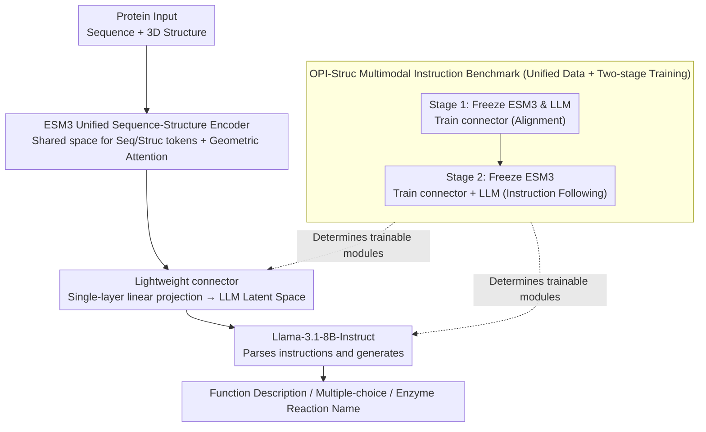

# STELLA: A Multimodal LLM for Protein Functional Annotation via Unified Sequence-Structure Encoding

**Conference**: ACL2026 Findings  
**arXiv**: [2506.03800](https://arxiv.org/abs/2506.03800)  
**Code**: https://github.com/ocx-lab/STELLA  
**Area**: Multimodal VLM / Protein Functional Annotation  
**Keywords**: Protein function annotation, Multimodal LLM, ESM3, Structure-sequence encoding, OPI-Struc  

## TL;DR
STELLA connects the unified sequence-structure protein representation of ESM3 to Llama-3.1-8B-Instruct. Through two-stage multimodal instruction tuning, it performs protein function description and enzyme catalytic reaction prediction, achieving state-of-the-art results on several functional annotation metrics across the OPI-Struc benchmark series.

## Background & Motivation
**Background**: The core chain in protein research involves sequence, structure, and function. While structure prediction and databases have expanded rapidly, many proteins still lack high-quality functional annotations. Protein language models (pLMs) learn representations from sequences or structures, whereas LLMs excel at expressing knowledge in natural language.

**Limitations of Prior Work**: Many protein-text models require separate sequence encoders, structure encoders, and additional fusion modules, resulting in complex architectures and unstable optimization. Notably, many pLMs perform well only on latent representations or specific attribute predictions, lacking generation capabilities for natural language functional descriptions.

**Key Challenge**: Protein functional annotation requires simultaneous understanding of structural geometry, sequence context, and textual knowledge. Pure pLMs are not adept at generating detailed explanations, while pure LLMs lack protein structure inputs. Multi-encoder fusion solutions can access multiple modalities but introduce high system complexity and cross-modal alignment costs.

**Goal**: The authors aim to build a more concise protein multimodal LLM: using a unified sequence-structure encoder for protein input, connected via a lightweight connector to a general instruction-following LLM, enabling reliable text output or category judgment for both functional description and enzyme function prediction.

**Key Insight**: The paper selects ESM3 as the unified protein encoder because it naturally organizes sequence, structure, and function-related token tracks within the same representation space. Llama-3.1-8B-Instruct is then utilized for natural language generation and instruction following.

**Core Idea**: Transfer the "encoder + connector + LLM" paradigm from vision-language models to protein functional annotation. By using ESM3 for unified protein sequence-structure representation, the cost of multi-encoder fusion is reduced, supported by the OPI-Struc benchmark for multimodal instruction tuning.

## Method

### Overall Architecture
This note summarizes the computational model and benchmark aspects. STELLA's architecture is similar to LLaVA: a protein encoder encodes sequence-structure information into high-dimensional representations, a linear modality connector maps these to the LLM's latent space, and Llama-3.1-8B-Instruct generates functional descriptions or predictions based on natural language instructions.

Training follows a two-stage Multimodal Instruction Tuning process. Stage 1 freezes both ESM3 and the LLM, training only the connector for cross-modal representation alignment. Stage 2 continues to freeze ESM3 while training the connector and LLM to follow protein-related natural language instructions. Due to the scarcity of high-quality protein-text instruction data, both stages utilize the same carefully constructed OPI-Struc resource, differing only in optimization objectives and trainable modules.

### Key Designs

**1. ESM3 Unified Sequence-Structure Encoder: Handling sequence and 3D structure with a single foundation model**

Traditional protein-text schemes often attach a sequence encoder and a structure encoder separately, requiring additional fusion modules, which leads to fragmented architectures and high alignment costs. STELLA uses ESM3 (`esm3_sm_open_v1`) as the sole protein encoder because it organizes sequence, structure, and other modality token tracks into a single embedding space, introducing geometric attention in early transformer blocks to capture structural topology and local spatial relationships.

Consequently, sequence context and structural geometry are aligned within the same representation space before reaching the language model. The downstream connector does not need to reconcile heterogeneous features but only learns the "protein representation → text space" mapping, significantly reducing the optimization burden.

**2. Lightweight connector and LLM generation head: Translating protein representations for LLM consumption**

Protein representations and LLM latent spaces are not naturally compatible, requiring a bridge. However, if the bridge is too heavy, it introduces training instability and computational overhead. The authors use a single-layer linear projection as the modality connector to map ESM3 outputs to LLM input representations. Llama-3.1-8B-Instruct then handles task instructions, functional narratives, multiple-choice answers, or enzyme reaction names.

By keeping the "connection" lightweight and offloading "reasoning and linguistic expression" to a strong instruction-following LLM, the model compensates for traditional pLM weaknesses—pLMs excel at representation but struggle with detailed natural language generation. The simple linear connector ensures stable training and efficient use of limited protein-text data for alignment.

**3. OPI-Struc Multimodal Instruction Benchmark: Unified training and evaluation for "Protein Structure → Text"**

High-quality protein-text instruction data is scarce, and evaluating purely with free-text metrics is often biased by phrasing differences. OPI-Struc divides tasks into two domains: Function and Enzyme. The Function domain includes free-text descriptions and multiple-choice functional recognition. The Enzyme domain represents catalytic functions as standard name predictions. The evaluation set covers FP_ft_eval, temporal OOD FP_ft_eval_v2401, FP_mc_eval_1x, FP_mc_eval_4x, and EP_eval.

Including MCQA and enzyme function accuracy provides objective signals unaffected by phrasing, complementing free-text metrics. The two-stage training reuses this dataset, varying the optimization targets and trainable modules to support both representation alignment and instruction following under data scarcity.

### Loss & Training
The focus is on multimodal instruction tuning rather than new loss functions. Stage 1 updates only the connector, while Stage 2 updates the connector and LLM with different learning rates. FP tasks are evaluated using BLEU-4, BERTScore, and ROUGE-1/2/L for text similarity and semantic consistency. FP-MCQA and EP tasks use Accuracy as an objective metric.

## Key Experimental Results

### Main Results
In hold-out functional description evaluations, STELLA significantly outperforms Foldseek retrieval baselines, Prot2Text, and ProteinChat.

| Method | BLEU-4 | BERTScore | ROUGE-1 | ROUGE-2 | ROUGE-L |
|------|--------|-----------|---------|---------|---------|
| Foldseek | 0.3627 | 0.8358 | 0.4799 | 0.4027 | 0.4586 |
| Prot2TextBASE | 0.3511 | 0.8430 | 0.5059 | 0.4271 | 0.4849 |
| Prot2TextLARGE | 0.3629 | 0.8520 | 0.5368 | 0.4560 | 0.5140 |
| ProteinChat | 0.1918 | 0.7970 | 0.3957 | 0.2799 | 0.3648 |
| STELLA (e3+e6) | 0.4300 | 0.8564 | 0.5423 | 0.4747 | 0.5257 |

In structural degradation robustness tests, STELLA's ROUGE-L drop is smaller than Prot2TextLARGE, indicating the unified representation is more stable for incomplete inputs.

| Model | Complete ROUGE-L | Incomplete ROUGE-L | Performance Drop |
|------|------------------|--------------------|----------|
| Prot2TextLARGE | 0.5140 | 0.4438 | 13.7% |
| STELLA (e3+e3) | 0.5041 | 0.4805 | 4.7% |
| STELLA (e3+e6) | 0.5257 | 0.4915 | 4.1% |

In enzyme catalytic reaction prediction (EP_eval), STELLA achieves a new Prev. SOTA in accuracy.

| Method | Accuracy |
|------|----------|
| UniRep | 72.90 |
| 3DCNN | 78.80 |
| IEConv | 87.20 |
| CDConv | 88.50 |
| GearNet-Multiview-Contrast | 87.50 |
| Sable | 88.50 |
| STELLA (e3+e3) | 88.06 |
| STELLA (e3+e6) | 88.85 |

### Ablation Study
Comparisons of encoders, LLM backbones, and training stages show that STELLA's performance stems from the combination of a unified encoder, an appropriate LLM, and two-stage training.

| Variant | BLEU-4 | BERTScore | ROUGE-1 | ROUGE-2 | ROUGE-L | Observation |
|------|--------|-----------|---------|---------|---------|------|
| STELLA-ESM3-Llama-3.1-8B | 0.4024 | 0.8496 | 0.5218 | 0.4487 | 0.5041 | ESM3 + Llama-3.1 is the strongest combination |
| STELLA-ESM3-Llama-3-8B | 0.4020 | 0.8503 | 0.5138 | 0.4478 | 0.5001 | Close but slightly lower |
| STELLA-ESM3-Phi-3-mini | 0.3807 | 0.8435 | 0.4991 | 0.4273 | 0.4839 | Smaller model generation head is weaker |
| STELLA-Prot2Text-Llama-3.1-8B | 0.4009 | 0.8497 | 0.5284 | 0.4454 | 0.5031 | Prot2Text encoder remains strong but trails ESM3 |
| STELLA-SaProt-Llama-3-8B | 0.3588 | 0.8276 | 0.4685 | 0.3965 | 0.4523 | SaProt configuration is significantly weaker |

Two-stage training outperforms single-stage, especially in ROUGE-L and BLEU-4.

| Strategy | Stage 1 epoch | Stage 2 epoch | BLEU-4 | BERTScore | ROUGE-1 | ROUGE-2 | ROUGE-L |
|------|---------------|---------------|--------|-----------|---------|---------|---------|
| Single-stage | - | e1 | 0.2233 | 0.7885 | 0.3530 | 0.2631 | 0.3350 |
| Single-stage | - | e3 | 0.3642 | 0.8363 | 0.4840 | 0.4073 | 0.4660 |
| Two-stage | e3 | e1 | 0.2653 | 0.8065 | 0.3938 | 0.3097 | 0.3770 |
| Two-stage | e3 | e3 | 0.4024 | 0.8496 | 0.5218 | 0.4487 | 0.5041 |

Temporal OOD evaluations show a significant drop for all methods, indicating that recently annotated proteins remain a difficult scenario.

| Model | BLEU-4 | BERTScore | ROUGE-1 | ROUGE-2 | ROUGE-L |
|------|--------|-----------|---------|---------|---------|
| STELLA-ESM3-Llama-3.1-8B | 0.0489 | 0.7565 | 0.2210 | 0.1085 | 0.1867 |
| STELLA-Prot2Text-Llama-3.1-8B | 0.0425 | 0.7555 | 0.2454 | 0.1020 | 0.1919 |
| STELLA-Prot2Text-Mistral-7B | 0.0440 | 0.7685 | 0.2529 | 0.1046 | 0.1975 |
| ProteinChat | 0.0205 | 0.7413 | 0.2121 | 0.0855 | 0.1691 |

### Key Findings
- STELLA reaches a ROUGE-L of 0.5257 on FP hold-out, surpassing Prot2TextLARGE (0.5140) and exceeding the Foldseek retrieval baseline by 14.6%.
- In FP-MCQA, STELLA achieves 80.56 and 76.18 accuracy for fixed and 4x permuted options, respectively, showing discriminative function selection capabilities.
- In EP_eval, extending Stage 2 from e3 to e6 improved accuracy from 88.06 to 88.85, surpassing CDConv and Sable (88.50).
- Performance correlates with structural homology density; ROUGE-L rises from 0.4323 for near-unique structures to 0.6691 for high-density clusters, identifying OOD structures as a core challenge.

## Highlights & Insights
- The major highlight is architectural simplification: using ESM3 to unify sequence and structure, avoiding complex fusion of multiple protein encoders.
- OPI-Struc organizes free-text, multiple-choice, and enzyme prediction under a single instruction benchmark, making protein multimodal LLM evaluation systematic.
- The two-stage training design aligns with multimodal LLM best practices: aligning representations first, then training instruction following, preventing the LLM from over-fitting text patterns prematurely.
- Honest OOD results: while hold-out performance is strong, the temporal evaluation drop suggests protein functional annotation models are still far from generalizing new knowledge based solely on existing structure-text pairs.

## Limitations & Future Work
- Current performance is limited by structural tokenization granularity and the difficulty of aligning high-dimensional geometric features to discrete text tokens.
- The model relies heavily on general LLM knowledge; it may lack fine-grained domain judgment in highly specialized discovery scenarios.
- Significant declines on OOD temporal benchmarks suggest that recent functions, new structural motifs, and long-tail labels are not yet well-covered.
- NLP metrics like BLEU and ROUGE may not fully reflect biological semantic correctness; MCQA and EP accuracy are supplementary but insufficient.
- Future directions include high-resolution structural adapters, retrieval-augmented functional knowledge, and more rigorous multimodal protein benchmarks.

## Related Work & Insights
- **vs Prot2Text**: Prot2Text mapped protein structures to functional text earlier but relied on traditional encoder-decoder combinations; STELLA uses ESM3 + Llama to improve generation and structural integration.
- **vs ProteinChat / ProtChatGPT**: These focus on conversational understanding but often rely on specific encoders for sequence or structure. STELLA emphasizes unified representation and systematic benchmarking.
- **vs SaProt / ESM pLMs**: pLMs excel at representation; STELLA connects these to LLMs for superior natural language output.
- **vs Foldseek retrieval baseline**: Retrieval depends on structural similarity; STELLA learns a general mapping from sequence-structure-function to language, outperforming retrieval on hold-out sets.
- **Insight**: The key for biological multimodal LLMs may not be more complex fusion layers, but rather choosing a sufficiently unified domain encoder and connecting it via stable two-stage instruction tuning.

## Rating
- Novelty: ⭐⭐⭐⭐☆ The engineering path of connecting a unified ESM3 sequence-structure encoder to an LLM is clear and effective; conceptually it represents a paradigm shift in multimodality.
- Experimental Thoroughness: ⭐⭐⭐⭐☆ Extensive comparisons across FP, MCQA, EP, robustness, OOD, and architecture components, though biological semantic evaluation remains limited by standard metrics.
- Writing Quality: ⭐⭐⭐⭐☆ Complete description of architecture and benchmarks with comprehensive result tables.
- Value: ⭐⭐⭐⭐☆ Significant reference value for protein functional annotation and scientific multimodal LLMs, particularly for the unified encoder + two-stage training path.

<!-- RELATED:START -->

## Related Papers

- [\[ICML 2026\] LIMSSR: LLM-Driven Sequence-to-Score Reasoning under Training-Time Incomplete Multimodal Observations](../../ICML2026/multimodal_vlm/limssr_llm-driven_sequence-to-score_reasoning_under_training-time_incomplete_mul.md)
- [\[ICCV 2025\] Unified Multimodal Understanding via Byte-Pair Visual Encoding](../../ICCV2025/multimodal_vlm/unified_multimodal_understanding_via_byte-pair_visual_encoding.md)
- [\[ICLR 2026\] Reasoning-Driven Multimodal LLM for Domain Generalization](../../ICLR2026/multimodal_vlm/reasoning-driven_multimodal_llm_for_domain_generalization.md)
- [\[NeurIPS 2025\] STRUCTURE: With Limited Data for Multimodal Alignment, Let the Structure Guide You](../../NeurIPS2025/multimodal_vlm/with_limited_data_for_multimodal_alignment_let_the_structure_guide_you.md)
- [\[CVPR 2026\] From Where Things Are to What They Are For: Benchmarking Spatial–Functional Intelligence in Multimodal LLMs](../../CVPR2026/multimodal_vlm/from_where_things_are_to_what_they_are_for_benchmarking_spatial-functional_intel.md)

<!-- RELATED:END -->
